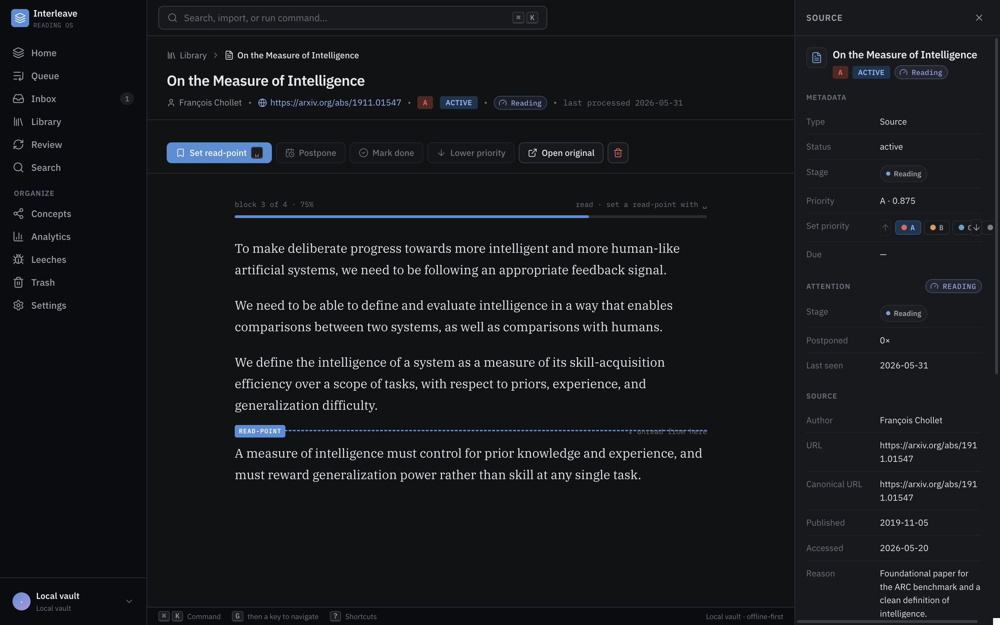
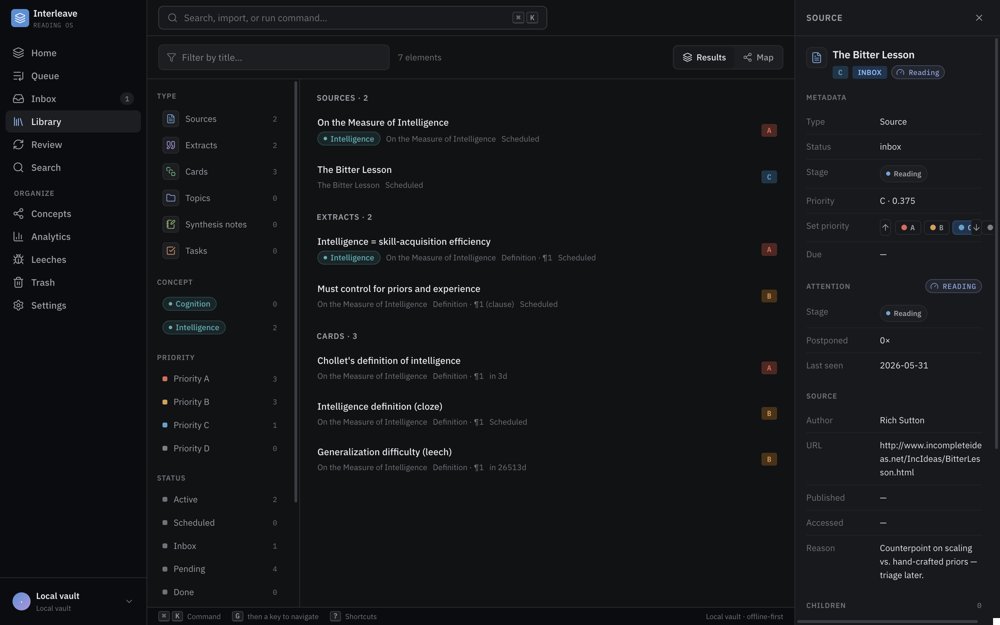
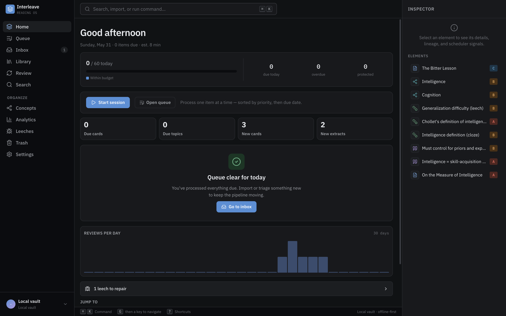
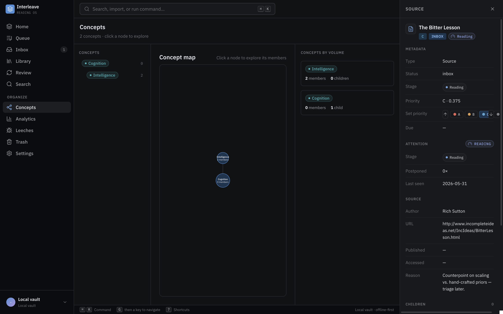

<p align="center">
  
</p>

# Interleave

A desktop-first, **local-first incremental reading** application. Import sources, read them
gradually, lift out the fragments that matter, distill those into clean notes, and turn the
most valuable ideas into spaced-repetition flashcards — while every card stays traceable all
the way back to the sentence it came from.

```txt
Source → Topic → Extract → Clean extract → Atomic statement → Card → Review → Mature knowledge
```

It is **not** a read-it-later app, **not** a generic note app, and **not** only a flashcard
app. It is a long-term knowledge-processing system for people who import more than they can
read and want to retain the small subset that truly matters.

> **Download:** grab the macOS build (Apple Silicon / arm64) from the
> [latest release](https://github.com/antoinefink/incremental-reading/releases).
> The `.dmg` is **ad-hoc signed but not notarized**, so after dragging Interleave to
> `/Applications`, clear the download quarantine once (right-click → Open does **not**
> work for this):
> ```sh
> xattr -dr com.apple.quarantine /Applications/Interleave.app
> ```
> Then open it normally. (A fully signed + notarized build is a later release task.)

---

## Screenshots

**The incremental reading workspace** — read a source, drop a read-point, and lift passages
into independent *scheduled* extracts; the scheduler-aware inspector (priority, stage, last-seen,
source provenance) sits on the right.



**The library** — browse every element (sources, extracts, cards) with faceted filters by type,
concept, priority, and status; everything traces back to its source.



**The Home command center** (your daily landing dashboard) and **the Concepts knowledge map**:




---

## What it does

A single, coherent loop — the whole pipeline above, implemented end to end:

- **Capture & inbox** — import sources by hand (title/URL/author/date/body), triage them, set priorities.
- **Read** — a Tiptap reader with **read-points** (resume where you left off) and stable block IDs.
- **Extract with lineage** — lift a passage into an independent, *scheduled* extract that
  remembers its parent, source, exact block + offsets, and a verbatim snapshot. Sub-extracts
  preserve the chain `source → extract → sub-extract`. **Lineage is never broken.**
- **Distill** — move an extract `raw → clean → atomic` in a focused review mode.
- **Cards** — turn extracts into Q&A or cloze cards, with minimum-information **quality warnings**.
- **Two schedulers, on purpose** — **FSRS** (`ts-fsrs`) schedules *cards* ("can I recall this?");
  a separate **attention scheduler** schedules *sources/extracts* ("should I process this again,
  and when?"). They never bleed into each other.
- **Review** — grade Again/Hard/Good/Easy with interval previews, sibling burying, leech
  detection, and one-keystroke jump-back to the source.
- **Queue & process loop** — a priority-sorted due queue and a one-at-a-time processing mode.
- **Organize** — hierarchical concepts, flat tags, a dedicated library, and fast local **FTS5 search**.
- **Safety** — soft-delete + trash + command-level **undo**, basic analytics, and a
  restore-ready **backup** (SQLite + asset vault + hashed manifest, zipped).
- **Keyboard-first** — a command palette (⌘K), a `?` cheat sheet, and a mouse-free workflow.

Everything persists in a real database and **survives an app restart** — that's an explicit gate
on every feature, not an afterthought.

## Architecture

Interleave is a long-lived personal knowledge database — closer to Anki/Zotero/Obsidian than a
web app — so it favors durability over browser convenience:

- **React + TypeScript + Vite** renderer (UI only) inside an **Electron** desktop shell.
- **Native SQLite** via `better-sqlite3` + **Drizzle ORM** is the canonical local store; the
  **filesystem** is the canonical asset vault. Large files never live in the database.
- The **renderer never touches SQLite or the filesystem.** It calls a narrow, typed,
  Zod-validated `window.appApi` preload bridge; Electron's main process owns all trusted
  capabilities and runs the repositories/services.
- Every meaningful mutation is **transactional** and appended to an `operation_log` from day
  one (the foundation for undo, backup, and eventual sync).

```txt
React UI (renderer) → typed client wrapper → Electron preload (window.appApi)
  → Electron main / DB service → local-db repositories/services → SQLite + asset vault
```

**Stack:** Electron · React 19 · Vite · TanStack Router · Tailwind v4 · Tiptap/ProseMirror ·
better-sqlite3 + Drizzle (SQLite) · ts-fsrs · Vitest · Playwright · electron-builder.

```txt
apps/        desktop (Electron shell) · web (renderer) · api/worker (later, server phase)
packages/    core · db · local-db · scheduler · editor · ui · testing
docs/        concept · architecture · domain-model · scheduling · design-system · roadmap · task specs
design/      the design kit (tokens, icon map, reference screens)
```

## Run it

The canonical app runs **natively with pnpm** (a native module + a real window + the app-data
directory mean it can't live in a container):

```bash
pnpm install      # installs deps and rebuilds better-sqlite3 for the Electron ABI
pnpm dev          # launch the full Electron app (Vite + main/preload + Electron, hot reload)
pnpm dev:renderer # bare Vite renderer only (no window.appApi / live data) — isolated UI work

pnpm typecheck    # workspace typecheck
pnpm test         # Vitest unit/domain/repository tests
pnpm e2e          # Playwright E2E against the Electron app
pnpm seed         # load a demo collection into the dev SQLite DB
```

To package the desktop app: `pnpm --filter @interleave/desktop dist` → an installable `.dmg`
in `apps/desktop/release/`.

---

## How this was built

The interesting part: **Interleave was built almost entirely by AI agents (Claude), with a human
directing scope** — not hand-typed feature by feature, but orchestrated through **dynamic
multi-agent workflows** with a hard quality bar at every step.

**A documented control plane.** Before any code, the project laid down a control plane in
[`docs/`](./docs/): a 100-task [`roadmap`](./docs/roadmap.md) (each task with dependencies and a
*Done-when*), per-milestone build specs in [`docs/tasks/`](./docs/tasks/), and an engineering
charter ([`CLAUDE.md`](./CLAUDE.md)) holding the invariants. Agents derive each task from these,
so almost no context is rebuilt per task — and the plan stays coherent across dozens of steps.

**The build loop.** Work was done **one task at a time, in dependency order**, each by a fresh
workflow:

1. A **builder** agent implements the task against its spec.
2. A **fresh, independent reviewer** re-runs the *full* verification itself (typecheck, lint,
   Vitest, and Playwright/Electron E2E) and audits the diff against the spec, the design kit, and
   the architecture invariants.
3. A **correct-by-construction blocking gate** loops build → fix → review until the reviewer
   signs off with zero blocking findings — it cannot commit otherwise.
4. **One commit per task** on the main branch — so the history is bisectable and every commit is green.

Each milestone's detailed spec was generated *after* the previous milestone existed, so it could
cite real files and signatures instead of guesses.

**Beyond the MVP.** Once the 50-task MVP (Part I of the roadmap) was complete, the same machinery
ran two more passes:

- A **17-component hardening audit** — each component (domain core, schema, repositories,
  schedulers, editor, Electron/IPC, every feature surface, design fidelity, end-to-end integrity)
  independently re-audited with a fix-loop. It caught and fixed *real* cross-system bugs no
  single-task gate could see — e.g. cross-source editor save-bleed, soft-deleted cards leaking
  into search, an FSRS learning-step cursor that never persisted.
- A **UI-completeness pass** — hunting placeholder/unwired bits (the sidebar identity, the streak,
  live menu counters, an exclusive-highlight navigation fix) and finishing them with real data.

**Part II — the full system (v0.2.0).** The same machinery then built the entire gold-standard
roadmap (M12–M20, ~37 tasks) on top of the MVP, run as a **wave-based relay**: one milestone at a
time, generate its spec against the *real, evolved* codebase → coherence-review it → run the strict
per-task gate → repeat. A deliberate re-scope kept it **local-first**: the future server is an
encrypted-backup target only (no live multi-device sync), AI and semantic search run **on-device** (a
local model or your own API key, off by default; `sqlite-vec`, not a server vector DB), and the
browser extension reaches the desktop over a token-protected `127.0.0.1` loopback server. What
landed: URL import + the MV3 extension, PDF/EPUB/Markdown/Anki import + on-device OCR,
image-occlusion/formula/code/media cards, advanced scheduling & overload management, analytics +
card-quality tooling, on-device semantic search + **drafts-only** AI, alternative review modes, and a
100k-element scale-hardening pass. (The cloud backup server, a Tauri shell, and end-to-end-encrypted
sync were deliberately left out of scope.)

A human-in-the-loop **residual review** after each wave was the difference-maker. The strict gate
keeps each task green, but a second look at the "cosmetic" leftovers it waved through caught *real*
boundary bugs — a side-panel selection that paired one tab's text with another tab's source, a vault
garbage-collector that could delete an in-flight import, a failed PDF import that orphaned its source
row, a unit test that quietly streamed an 80 MB model over the network, an orphaned vector left after
a hard-delete — plus spec-level catches (a retention-target keying mismatch, a phantom OCR-worker
seam) fixed *before* any builder implemented them. A final UI audit then traced four reported visual
glitches to one shared CSS bug across seventeen buttons and fixed them in a single pass.

**Quality bars enforced throughout:** source lineage is sacred; the renderer never touches the
database; every mutation is transactional and operation-logged; AI output is always a draft and never
auto-schedules; **every feature must survive an app restart** (proven by a full restart-persistence E2E).

**Roughly where it stands today (v0.2.0):** ~150 commits · **2,256 unit/integration tests** · **275
Playwright/Electron E2E** across 71 specs · a packaged, installable macOS build
([`v0.2.0`](https://github.com/antoinefink/incremental-reading/releases/tag/v0.2.0)) · the full
local-first system from import → extract → distill → card → review, plus PDF/EPUB import, rich-media
cards, on-device semantic search + AI, and 100k-scale hardening. The cloud-sync layer remains
deliberately out of scope — Interleave is local-first by design.

---

*A personal project by [@antoinefink](https://github.com/antoinefink). See [`docs/`](./docs/)
and [`CLAUDE.md`](./CLAUDE.md) for the full design and build system.*

*The Interleave logo was created with **ChatGPT Images 2.0**. Source + exports live in
[`brand/`](./brand/).*
