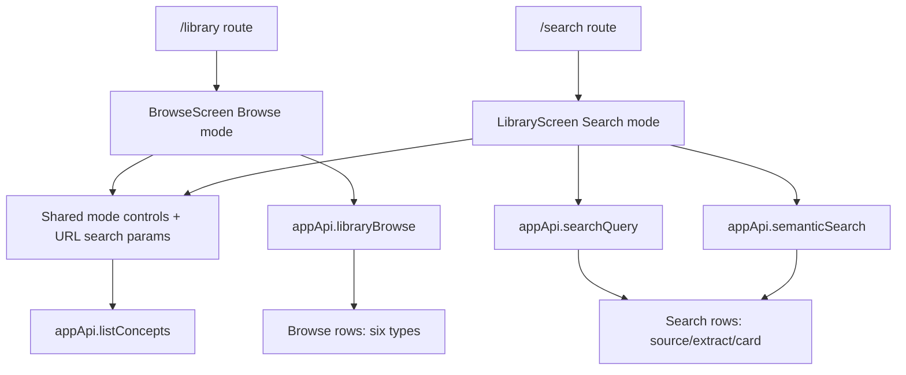

# Integrate Library And Search Into Collection Explorer

## Summary

The `/library` and `/search` routes should become two entry points into one Collection Explorer surface. Library opens the Browse mode, Search opens the Search mode, and the shared screen makes the mode distinction explicit while preserving the existing backend contracts.

This first pass is renderer/UI consolidation. It reuses `appApi.libraryBrowse`, `appApi.searchQuery`, `appApi.semanticSearch`, and `appApi.listConcepts`; it does not rename IPC commands, change SQLite schema, or broaden the search index.

---

## Problem Frame

The product now has two overlapping collection-discovery pages. `/library` is the correct browse-first inventory surface: it lists live elements with no query and supports all browsable element types plus status facets. `/search` is the correct retrieval-first surface: it searches indexed source, extract, and card content.

The current UI blurs that distinction. Search defaults to a Source filter and uses `libraryBrowse` to show empty-query rows, while Home labels a `/search` tile as Library. That behavior was recently documented as intentional in `docs/plans/2026-06-06-search-empty-facet-browse.md`, but the Collection Explorer requirements intentionally supersede that product decision.

---

## Requirements

**Shared Explorer**

- R1. `/library` and `/search` render the same Collection Explorer shell with explicit Browse and Search modes.
- R2. Route intent selects the initial mode: `/library` starts in Browse, `/search` starts in Search.
- R3. The sidebar, command palette, `g l`, and `/` shortcuts keep distinct route intent: Library appears in the sidebar and navigates to `/library`; Search is command/shortcut/direct-route access to `/search`.
- R4. Home must not label a Search route as Library.
- R5. Both modes retain the Results and Map tabs, and the Map remains a filtering aid rather than replacing `/concepts`.

**Browse Mode**

- R6. Browse mode lists live browsable elements without requiring a query.
- R7. Browse mode includes `source`, `extract`, `card`, `topic`, `synthesis_note`, and `task`.
- R8. Browse mode exposes Type, Concept, Priority, and Status facets.
- R9. Browse mode may keep a title-only filter, but it must read as local row filtering rather than full-text search.

**Search Mode**

- R10. Search mode exposes a prominent query input that searches indexed content when non-empty.
- R11. Search mode returns only `source`, `extract`, and `card` rows.
- R12. Empty Search mode shows a prompt, not browse rows, even when compatible filters are pending.
- R13. Pending Search filters are visible constraints that apply once the user types.
- R14. Search keeps snippets, query highlighting, semantic-search hints, related badges, and review buttons for matching or related cards.

**Mode Switching**

- R15. Typing in the shared main query while in Browse switches to Search mode and preserves compatible filters.
- R16. Switching Browse to Search preserves Concept and Priority filters and preserves Type only when it is searchable.
- R17. Switching Browse to Search drops browse-only Type filters and Status filters.
- R18. Switching Search to Browse preserves compatible filters and returns to browse-first rows.
- R19. The UI distinguishes active Browse filters from pending Search constraints.

**Rows, Details, And Opening**

- R20. Rows use shared language for type, title, priority, concept, scheduler/due state, and source reference.
- R21. Detail panels preserve source lineage and the FSRS-vs-attention scheduler split.
- R22. Opening a row routes to the existing object-specific surface: source reader, extract view, card detail, synthesis editor, task protected target, or the existing process fallback for topics/unlinked tasks.

---

## Key Technical Decisions

- **KTD1. Use shared Collection Explorer primitives while keeping route retrieval logic explicit.** `LibraryScreen` remains the Search-mode owner and `BrowseScreen` remains the Browse-mode owner, but both use shared mode controls, URL-state parsing, compatible-filter handoff, row/detail language, and CSS. This keeps the distinct backend contracts obvious while making the product surface read as one explorer.
- **KTD2. Use URL search params as the mode-switch state handoff.** Route-to-route mode switches may remount components, so compatible filters and the typed query should travel through validated search params rather than relying on local React state surviving navigation.
- **KTD3. Keep backend contracts separate.** Browse mode calls `library.browse`; non-empty Search calls `search.query` or `semantic.search`. No renderer SQL, no new IPC command, and no migration are needed.
- **KTD4. Empty Search is a prompt state.** Search mode may call `library.browse` only for searchable-type facet counts if needed, but it must not render empty-query rows. This supersedes the completed empty-query facet-browse plan and solution.
- **KTD5. Preserve semantic-search fallback behavior.** Semantic search currently supports `q`, `type`, and `limit`; when Concept or Priority filters are active, the existing FTS path remains the safer behavior.
- **KTD6. Keep concept-map volume distinct from result facet counts.** `ConceptNode.memberCount` is global map volume. Filterbar chips must display counts from the active result universe when available.
- **KTD7. Reuse existing open semantics for non-searchable Browse rows.** `openQueueItem` already handles sources, extracts, cards, linked tasks, unlinked tasks, and topic/process fallbacks. Synthesis notes keep their dedicated synthesis route.

---

## High-Level Technical Design

The shared primitives own mode switching and URL-state normalization. Each route screen keeps its retrieval effect explicit: Browse owns browse rows and browse-only facets, while Search owns keyword/semantic retrieval and pending constraints. The route markers (`route-library`, `route-search`) remain stable so smoke and Electron tests can continue to identify each route.

Mode transitions normalize state:

- Browse to Search: keep query, Concept, Priority, and searchable Type; drop Status and non-searchable Type.
- Search to Browse: keep Concept, Priority, and searchable Type; keep the query only if the UI treats it as a title filter after the transition, otherwise clear it and show browse rows.
- Typing in the shared query while in Browse: navigate or switch to Search and set the query param.

---

## Implementation Units

### U1. Shared Collection Explorer Shell Primitives

- **Goal:** Introduce shared explorer mode controls and URL-state helpers while keeping Search and Browse retrieval effects explicit in their current route screens.
- **Files:** `apps/web/src/library/CollectionExplorerModeSwitch.tsx`, `apps/web/src/library/collectionExplorerState.ts`, `apps/web/src/library/LibraryScreen.tsx`, `apps/web/src/library/BrowseScreen.tsx`, `apps/web/src/library/library.css`.
- **Patterns:** Reuse the current `LibraryScreen` and `BrowseScreen` markup classes, `ConceptGraph`, `TypeIcon`, `SchedulerChip`, `RefBlock`, `AutoVirtualList`, and `openQueueItem`.
- **Test Scenarios:** `/library` still exposes `route-library`; `/search` still exposes `route-search`; both routes render the same mode switcher, Results tab, Map tab, filterbar, result rows, and detail panel scaffolding.
- **Verification:** `apps/web/src/library/BrowseScreen.test.tsx`, `apps/web/src/library/LibraryScreen.test.tsx`.

### U2. Mode And Filter State

- **Goal:** Implement a single state model for mode, query, searchable Type, browsable Type, Concept, Priority, Status, and Browse title filtering.
- **Files:** `apps/web/src/library/collectionExplorerState.ts`, `apps/web/src/library/LibraryScreen.tsx`, `apps/web/src/library/BrowseScreen.tsx`, `apps/web/src/router.tsx` if route search-param validation is needed.
- **Patterns:** Keep renderer state as UI orchestration only. Facet counts and row universes still come from main-side reads.
- **Test Scenarios:** Browse to Search preserves Concept and Priority; Browse Type `card` preserves into Search; Browse Type `topic` is dropped when switching to Search; Status is dropped when switching to Search; Search to Browse preserves compatible filters and returns browse rows.
- **Verification:** Renderer tests for mode switching and request shapes.

### U3. Search Mode Retrieval And Empty State

- **Goal:** Make Search retrieval keyword-first and remove empty-query row browsing from Search mode.
- **Files:** `apps/web/src/library/LibraryScreen.tsx`, `apps/web/src/library/LibraryScreen.test.tsx`, `tests/electron/search.spec.ts`.
- **Patterns:** Preserve the existing debounced query effect, cancellation guard, semantic status/reindex affordance, FTS-vs-semantic decision, snippets, highlighting, related badges, and review buttons.
- **Test Scenarios:** Opening `/search` shows `library-prompt` and no result groups; selecting Type/Concept/Priority with no query keeps the prompt and shows pending-constraint copy; typing a query calls `searchQuery` or `semanticSearch`; active filters are included in non-empty search requests; Search never renders `topic`, `synthesis_note`, or `task`.
- **Verification:** `apps/web/src/library/LibraryScreen.test.tsx`, `tests/electron/search.spec.ts`.

### U4. Browse Mode Retrieval And Local Title Filtering

- **Goal:** Preserve Browse as the inventory-first mode over all live browsable elements.
- **Files:** `apps/web/src/library/BrowseScreen.tsx`, `apps/web/src/library/BrowseScreen.test.tsx`, `tests/electron/library.spec.ts`.
- **Patterns:** Follow the existing `BrowseScreen` request shape and stale-response guard. Keep title filtering client-side over already-fetched rows and keep backend counts tied to the facet universe.
- **Test Scenarios:** Opening `/library` calls `libraryBrowse({})`; all seeded groups render without a query; Type, Concept, Priority, and Status facets call `libraryBrowse` with the expected filters; title filtering does not call the bridge; title-empty and facet-empty states remain distinct.
- **Verification:** `apps/web/src/library/BrowseScreen.test.tsx`, `tests/electron/library.spec.ts`.

### U5. Shared Rows, Details, Map, And Open Actions

- **Goal:** Consolidate duplicated row/detail/map rendering while preserving lineage, scheduler chips, concept-map semantics, and per-type opening behavior.
- **Files:** `apps/web/src/library/LibraryScreen.tsx`, `apps/web/src/library/BrowseScreen.tsx`, `apps/web/src/library/library.css`, `apps/web/src/library/BrowseScreen.test.tsx`, `apps/web/src/library/LibraryScreen.test.tsx`.
- **Patterns:** Use normalized view rows for rendering but keep the original Browse/Search row universes separate. Use `openQueueItem` for browsable queue-like rows and direct route navigation for Search rows.
- **Test Scenarios:** Selecting a source shows attention scheduler and source ref; selecting a card shows FSRS scheduler and source ref; Search card opens `/card/$id`; Browse synthesis note opens `/synthesis/$id`; Browse linked task opens its protected target; Map node click applies the Concept filter and returns to Results in the current mode.
- **Verification:** Renderer tests plus existing Electron row-opening tests after expected URL assertions are corrected.

### U6. Navigation, Home, And Help Copy

- **Goal:** Align labels, route intent, and help text with the Collection Explorer model.
- **Files:** `apps/web/src/pages/home/HomeScreen.tsx`, `apps/web/src/pages/home/HomeScreen.test.tsx`, `apps/web/src/shell/nav.ts`, `apps/web/src/help/help-bodies.ts`, `docs/onboarding-and-help-center-brief.md`.
- **Patterns:** Keep Library and Search as separate navigation entries. Do not collapse `/concepts`.
- **Test Scenarios:** Home Library tile routes to `/library` or is relabeled as Search if it routes to `/search`; nav active-state exclusivity still holds; `g l` opens Browse; `/` opens Search with focused query.
- **Verification:** `apps/web/src/pages/home/HomeScreen.test.tsx`, `apps/web/src/shell/nav.test.ts`, existing shortcut/palette tests where affected.

### U7. Superseded-Learning Notes And Test Updates

- **Goal:** Update stale tests/docs that encode empty-query Search browse rows as the desired behavior.
- **Files:** `docs/solutions/ui-bugs/search-empty-query-facets-browse-rows.md`, `docs/plans/2026-06-06-search-empty-facet-browse.md`, `apps/web/src/library/LibraryScreen.test.tsx`, `tests/electron/search.spec.ts`.
- **Patterns:** Do not rewrite history; add a clear supersession note that Collection Explorer changed the product decision while preserving the count/staleness lessons.
- **Test Scenarios:** Former empty-query browse-row tests are replaced with prompt/pending-filter assertions; search count tests keep main-side count invariants; stale-response tests still prove old async responses cannot overwrite newer UI state.
- **Verification:** Targeted renderer and Electron tests pass.

---

## Acceptance Examples

- AE1. From Home, choosing the Library tile opens `/library`, highlights Library, and shows browse rows without typing.
- AE2. From `/`, the command palette, or direct `/search` navigation, Search opens `/search`, focuses the query input, shows no sidebar item as current, and shows a prompt until a query is typed.
- AE3. In Browse, selecting Concept `Intelligence` and Priority `A`, then typing `memory` switches to Search and searches within those compatible constraints.
- AE4. In Browse, selecting Type `topic`, then switching to Search drops the Type filter and explains only compatible constraints are pending.
- AE5. In Search, selecting Type `Card` with an empty query shows no card rows; typing a query shows only matching card rows with snippets and review affordances.

---

## Scope Boundaries

- Do not rename `LibraryScreen` route exports unless needed for wrappers; route paths remain `/library` and `/search`.
- Do not merge `/concepts` into Collection Explorer.
- Do not broaden full-text search to `topic`, `synthesis_note`, or `task`.
- Do not add database migrations, new IPC commands, or renderer-side SQL/filesystem access.
- Do not change FTS ranking, semantic embedding, card review scheduling, or library ordering.
- Do not introduce durable persistence for the last selected explorer mode beyond URL/search params in this pass.

---

## Risks And Dependencies

- The implementation intentionally reverses a completed Search behavior, so renderer and Electron tests must be updated in the same change.
- URL search-param validation can become noisy if overbuilt. Keep it limited to mode handoff fields needed by the explorer.
- Shared rendering can accidentally erase Search-only affordances or Browse-only facets. Tests should assert both modes explicitly.
- Async browse/search responses can race during mode switches. Keep cancellation guards and clear selection when the visible universe changes.
- Electron E2E may need expected URL updates where old tests still expect card opens to `/review`; current product docs and component tests prefer `/card/$id`.

---

## Sources

- `docs/brainstorms/2026-06-06-collection-explorer-requirements.md`
- `CONCEPTS.md`
- `docs/design-system.md`
- `docs/onboarding-and-help-center-brief.md`
- `docs/plans/2026-06-06-search-empty-facet-browse.md`
- `docs/solutions/ui-bugs/search-empty-query-facets-browse-rows.md`
- `docs/solutions/ui-bugs/search-filterbar-facet-counts-after-search.md`
- `docs/solutions/architecture-patterns/test-audit-driven-battle-testing.md`
- `apps/web/src/router.tsx`
- `apps/web/src/library/LibraryScreen.tsx`
- `apps/web/src/library/BrowseScreen.tsx`
- `apps/web/src/library/library.css`
- `apps/web/src/shell/nav.ts`
- `apps/web/src/pages/home/HomeScreen.tsx`
- `packages/local-db/src/search-repository.ts`
- `packages/local-db/src/library-query.ts`
- `tests/electron/search.spec.ts`
- `tests/electron/library.spec.ts`
