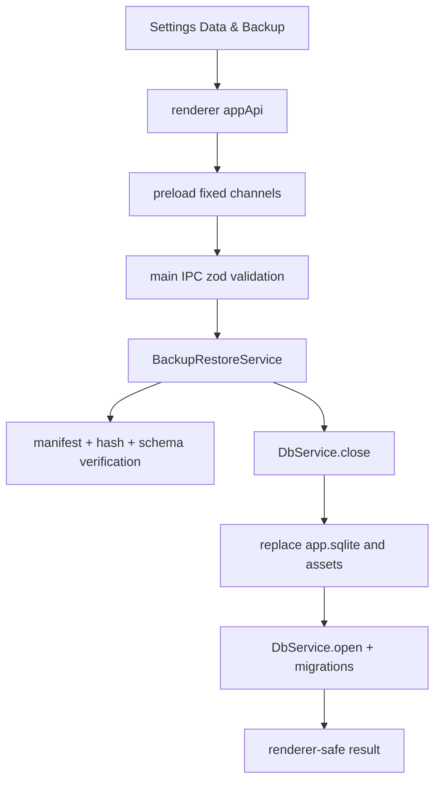

# Backup Restore And Fresh Start Reset

## Summary

Add an Electron-main restore path for app-managed local backups and a Settings “start from scratch” reset. Both operations stay behind narrow typed IPC, verify or confirm before mutation, and preserve the `backups/` directory so a reset does not destroy the user's escape hatch.

---

## Problem Frame

Interleave already creates restore-ready local backups, but the app has no way to restore them. A user can also soft-delete knowledge, but there is no explicit full reset for starting a new local vault. These are high-risk data-lifecycle operations because they replace or remove the canonical SQLite database and filesystem asset vault.

---

## Requirements

- R1. The Settings screen lists app-managed local backup artifacts under `backups/` and lets the user restore one with explicit confirmation.
- R2. Restore verifies the manifest format, schema version, required files, file sizes, and SHA-256 hashes before replacing current data.
- R3. Restore replaces `app.sqlite`, clears stale `app.sqlite-wal` and `app.sqlite-shm`, replaces `assets/`, opens the restored DB, and runs migrations forward before reporting success.
- R4. Restore rejects unsupported/newer backup formats or schema versions and corrupt/tampered backups without touching the current store.
- R5. The fresh-start reset removes the current knowledge store (`app.sqlite`, WAL/SHM, and `assets/`) and recreates an empty migrated DB + vault skeleton.
- R6. Reset preserves `backups/`, `exports/`, and `models/` unless a future feature separately adds deletion of those sibling directories.
- R7. Both restore and reset use confirmation-guarded typed IPC and expose no raw SQL, generic file reads, or arbitrary filesystem access to the renderer.
- R8. Tests cover service behavior, IPC validation, preload/wrapper drift, and Settings confirmation UX.

---

## Key Technical Decisions

- KTD1. Restore by backup timestamp, not arbitrary file path: The renderer should restore known artifacts returned by `backups.list()` from `backups/`, which avoids turning restore into a generic file-read primitive.
- KTD2. Use the existing unzipped backup directory as the restore source: `BackupService` already writes `backups/<timestamp>/` beside `<timestamp>.zip`; restoring that directory avoids adding a ZIP extraction dependency and still restores backups made by the app.
- KTD3. Serialize restore/reset with backup creation: Reuse `BackupService.runSerialized()` so manual backup, automatic backup, restore, and reset do not overlap.
- KTD4. Close and reopen the DB service around file replacement: `DbService.close()` clears the live better-sqlite3 handle and repository caches; after replacement, `DbService.open()` runs migrations and rebuilds services.
- KTD5. Preserve backup artifacts during reset: “Start from scratch” means knowledge DB + assets, not deleting the backups that may be needed if the user regrets the reset.

---

## Implementation Units

### U1. Backup Artifact Listing And Verification

- **Goal:** Add main-process helpers for listing app-managed backups, comparing schema-version tags, validating manifest shape, and verifying backup directory file integrity.
- **Files:** Modify `apps/desktop/src/main/backup-manifest.ts`, `apps/desktop/src/main/backup-service.ts`, `apps/desktop/src/main/backup-manifest.test.ts`, `apps/desktop/src/main/backup-service.test.ts`.
- **Patterns:** Follow `listBackupArtifacts()` in `apps/desktop/src/main/automatic-backup-service.ts` and existing hash assertions in `apps/desktop/src/main/backup-service.test.ts`.
- **Test scenarios:** Lists only backups with a matching directory and manifest; rejects missing `app.sqlite`; rejects hash and size mismatch; rejects unsafe manifest paths; rejects newer schema tags; accepts older/current schema tags.
- **Verification:** Unit tests prove corrupt backups fail before any restore install code runs.

### U2. Restore And Reset Main-Process Operations

- **Goal:** Implement install/reset operations that close SQLite, replace or remove the data files, recreate the vault skeleton, reopen/migrate the DB, and return renderer-safe metadata.
- **Files:** Create `apps/desktop/src/main/backup-restore-service.ts`; modify `apps/desktop/src/main/db-service.ts` only if a small lifecycle helper is needed; test in `apps/desktop/src/main/backup-restore-service.test.ts`.
- **Patterns:** Follow `DbService.open()/close()` in `apps/desktop/src/main/db-service.ts`, path layout in `apps/desktop/src/main/paths.ts`, and backup serialization in `apps/desktop/src/main/backup-service.ts`.
- **Test scenarios:** Restore swaps DB/assets and clears WAL/SHM; failed verification leaves current DB/assets unchanged; reset removes DB/WAL/SHM/assets but preserves backups/exports/models; reset reopens to an empty migrated DB.
- **Verification:** Service tests open the restored/reset DB and assert row counts and vault files.

### U3. Typed IPC, Preload, And Renderer API

- **Goal:** Add `backups.list`, `backups.restore`, and `backups.resetLocalData` through the shared contract, preload bridge, main IPC handlers, and renderer wrapper.
- **Files:** Modify `apps/desktop/src/shared/channels.ts`, `apps/desktop/src/shared/contract.ts`, `apps/desktop/src/shared/contract.test.ts`, `apps/desktop/src/preload/index.ts`, `apps/desktop/src/preload/index.test.ts`, `apps/desktop/src/main/ipc.ts`, `apps/desktop/src/main/ipc.test.ts`, `apps/web/src/lib/appApi.ts`, `apps/web/src/lib/appApi.test.ts`.
- **Patterns:** Follow the existing `backups.create()` channel and the `VaultCollectOrphansRequestSchema` `confirm: true` guard.
- **Test scenarios:** Schemas reject missing confirmations and malformed timestamps; preload invokes fixed channels; renderer wrapper forwards calls; IPC handlers reject bad payloads before calling services.
- **Verification:** Contract/preload/IPC/web wrapper tests pass with no `db:query` or raw filesystem surface.

### U4. Settings Data & Backup UI

- **Goal:** Extend the existing Settings “Data & backup” section with backup list/restore controls and a separate Danger/Fresh start row for reset.
- **Files:** Modify `apps/web/src/pages/Settings.tsx` and `apps/web/src/pages/Settings.test.tsx`.
- **Patterns:** Follow existing `runBackup()` state handling in `apps/web/src/pages/Settings.tsx` and confirmation gating from `apps/web/src/trash/TrashScreen.tsx`.
- **Test scenarios:** Backup list renders; restore requires exact typed confirmation; successful restore/reset shows a restart/reload note; errors are visible; reset cannot fire without the typed phrase.
- **Verification:** Settings component tests cover success and failure states without touching SQLite.

---

## Scope Boundaries

- Restore is limited to app-managed backups still present under `backups/<timestamp>/`; importing an arbitrary external ZIP can be added later.
- Reset does not delete `backups/`, `exports/`, or downloaded model caches.
- This is local backup restore only; it does not build the future encrypted off-device backup server.
- No new schema migration is expected.

---

## High-Level Technical Design

---

## Risks & Mitigations

- Replacing a live SQLite file can corrupt state. Mitigation: restore/reset close `DbService` first and remove WAL/SHM siblings before reopen.
- Restore spans DB and filesystem, not a DB transaction. Mitigation: verify in staging before touching current data; replace assets only after DB copy is ready; keep backups preserved.
- A stale renderer can hold old UI state after restore/reset. Mitigation: return a success result that instructs the UI to reload/restart, and keep follow-up reads going through the reopened DB service.
- Automatic backups could race restore/reset. Mitigation: route restore/reset through `BackupService.runSerialized()`.

---

## Sources / Research

- `apps/desktop/src/main/backup-service.ts` documents the intended restore contract and current backup directory layout.
- `apps/desktop/src/main/backup-manifest.ts` owns manifest format and schema-version resolution.
- `apps/desktop/src/main/db-service.ts` owns SQLite open/close/migration lifecycle.
- `apps/desktop/src/main/automatic-backup-service.ts` already lists backup artifacts and serializes/prunes automatic backups.
- `apps/web/src/pages/Settings.tsx` contains the existing “Data & backup” section.
- `docs/solutions/architecture-patterns/electron-main-rolling-backups-over-renderer-reminders.md` reinforces that durability workflows belong in Electron main.
