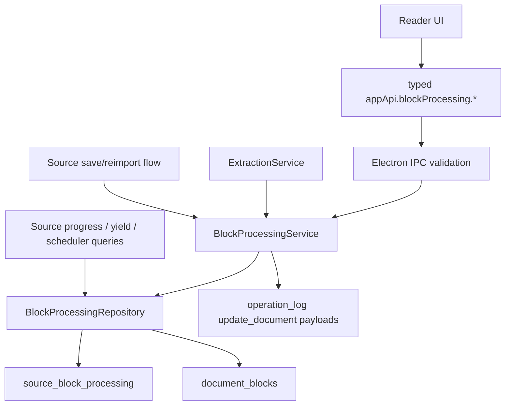

# Source Block Processing System

## Summary

Build a durable block-processing layer for source documents. Each stable source block gets an explicit outcome, reader actions mutate that outcome through typed IPC, extraction derives outcomes while preserving source-location precision, and progress/yield/scheduler signals read the durable state instead of cosmetic `processed_span` marks.

---

## Problem Frame

The reader currently treats "processed" as a reversible `document_marks` annotation. That is useful as a dimming affordance, but it cannot answer product questions such as which paragraphs are unresolved, whether a source can safely be marked done, how much high-priority text remains, or whether a source is repeatedly low-yield. Source processing needs to become a first-class domain model keyed to stable block IDs while keeping existing highlight and extracted-span marks as visual annotations.

---

## Requirements

- R1. Every source document block must have a durable processing outcome: `unread`, `read`, `extracted`, `ignored`, `processed_without_output`, `needs_later`, or `stale_after_edit`.
- R2. Block-processing rows must be keyed by `source_element_id + stable_block_id`, survive app restart, and never depend on renderer-side state.
- R3. Highlight marks remain cosmetic annotations, and `extracted_span` remains a visual lineage breadcrumb; neither becomes the processing source of truth.
- R4. `processed_span` must become a projection or legacy visual override, not the durable source of truth for processing progress.
- R5. Explicit reader actions must support ignore, process without output, needs later, and unread restoration through service APIs and typed IPC.
- R6. Extraction must derive block-processing outcomes for the spanned blocks while keeping source locations precise at block/range level.
- R7. Source document save/reimport must preserve matching stable block outcomes and mark missing or changed previously-processed blocks stale rather than silently treating them as finished.
- R8. The reader must offer modes for show all, hide processed, unresolved only, extracted only, and ignored hidden.
- R9. Source progress must report processed blocks over total blocks, unresolved blocks in high-priority sources, extracted yield, ignored ratio, and whether the source can be marked done without confirmation.
- R10. The attention scheduler must consume source-processing signals narrowly: unresolved blocks in high-priority sources return sooner, and terminal low-yield sources drift later or expose retirement-suggestion metadata.
- R11. Mark source done must be available only when all blocks are terminal (`extracted`, `ignored`, or `processed_without_output`) unless the user explicitly confirms the unresolved remainder.
- R12. Repository, service, editor/reader, IPC, analytics, scheduler, and Electron persistence tests must cover the full multi-session flow.

---

## Key Technical Decisions

- **Use a new `source_block_processing` table plus output links:** Store one row per top-level source document block with `source_element_id + stable_block_id`, `state`, timestamps, action metadata, and a block content hash. Store extract/card outputs in a separate link table so multiple extracts can originate from the same block.
- **Scope top-level source blocks first:** The durable block-processing layer applies to source document blocks. Sub-extract processing remains extract-stage work unless the selected document is the source itself; root-source rollups derive from source document rows and live descendant source locations.
- **Default unread is derived, not materialized:** A block with no processing row is `unread`. This avoids backfilling every existing source and keeps imports cheap while summaries can still count total blocks from `document_blocks`.
- **Terminal states are explicit:** `extracted`, `ignored`, and `processed_without_output` count as processed for source completion. `read` is derived from the read-point when no more specific row exists, and `needs_later` is non-terminal. `stale_after_edit` is non-terminal and protects users from silently burying changed text.
- **`processed_span` becomes a compatibility projection:** New reader actions write block-processing rows. The reader decoration layer dims terminal rows and may still read legacy `processed_span` marks as a fallback until rows exist, but new domain decisions ignore `processed_span`.
- **Extraction updates processing inside the extraction transaction:** `ExtractionService.createExtraction` should call a tx-composable block-processing service/repository seam after creating the extract and source location, linking each spanned block to the extract output id.
- **Source document save/reimport reconciles block state by stable id and content hash:** Existing rows for still-present unchanged blocks survive. Rows for missing or content-changed blocks that were terminal or `needs_later` become `stale_after_edit` with metadata rather than being dropped. The source save path computes normalized block text hashes from the ProseMirror document before replacing block rows; this reconciliation is called from source save/reimport flows, not from generic `DocumentRepository.upsert`.
- **Validate block ownership in main/local-db:** Mark, read-point, extraction, and block-processing mutations must prove stable block IDs belong to the target document and clamp or reject invalid ranges before writing.
- **Extracted state derives from live lineage:** Summary and reader state should treat live `source_locations` on non-deleted descendants as authoritative for `extracted`; `extracted_span` marks are visual breadcrumbs that can lag and should not keep a deleted extract looking productive.
- **Read is derived with explicit unread override:** Blocks before or at the read-point derive `read` only when they have no explicit row. `markBlockUnread` writes an explicit `unread` row that overrides a past read-point until the user changes it.
- **Legacy processed-span marks are backfilled non-destructively:** The migration or first write path should create `processed_without_output` rows from legacy `processed_span` marks when no explicit row exists, while leaving the visual marks in place. Row state wins over legacy marks after that.
- **Operation log uses document audit entries:** Block-processing mutations append `update_document` payloads with previous state in the same transaction as row changes. They do not invent a new op type and do not masquerade as element-field updates. Global undo support can remain limited; explicit unread/state commands are the user-facing restoration path.
- **Scheduling reads a compact summary:** `SchedulerService` and the pure attention scheduler should receive derived source-processing metrics, not raw per-block rows. Keep the first pass narrow: source interval bias and retirement-suggestion metadata only, with source-yield remaining read-only. Deterministic initial math: A/B sources with unresolved ratio above 25% halve the base source interval; sources with terminal ratio at least 90%, zero extracted yield, and ignored ratio at least 50% double the interval and expose a retirement suggestion, capped by existing scheduler ceilings.
- **Mark done is a domain command:** Source done gating belongs in `QueueActionService` or a source action service behind IPC, not in React button state. The `queue.act` mark-done action must accept an explicit confirmation flag for unresolved source blocks.

---

## High-Level Technical Design

The table is local SQLite state owned by Electron/main and `packages/local-db`. The renderer receives summaries and rows through the typed bridge only. Visual decorations in `@interleave/editor` remain projections from renderer-provided decoration inputs.

### Reader Interaction Model

The source reader should stay dense. Each paragraph keeps one primary margin button: clicking it marks the block `processed_without_output`; clicking an already-terminal block restores it to `unread`. Less common outcomes live in a compact adjacent menu with icon-only actions and tooltips: Ignore, Needs later, Restore unread. Keyboard and command-palette actions should target the currently focused block or selection anchor.

Reader filters use a segmented control for `All`, `Unresolved`, and `Extracted`, plus a separate `Hide ignored` toggle. Hidden blocks are collapsed, not deleted; collapsed runs render a compact count such as `4 processed blocks hidden`. Jump-to-source and read-point navigation must reveal the target block temporarily rather than landing on an invisible position.

Visual projection stays restrained: `extracted` keeps the existing extracted marker; `processed_without_output` uses neutral dimming; `ignored` uses stronger dimming and collapses when the ignored toggle is active; `needs_later` uses a subtle attention marker; `read` remains visually normal; `stale_after_edit` uses a warning marker and appears in unresolved filters.

Mark source done has three states. If all blocks are terminal, the primary button runs the domain command. If unresolved blocks remain, it opens a confirmation dialog showing unresolved counts, high-priority unresolved count, and stale-after-edit count, with actions `Review unresolved`, `Mark done anyway`, and `Cancel`. If the summary cannot be loaded, the button is disabled.

Progress placement should be conservative. The reader rail shows only `processed / total` and unresolved A/B counts. The right inspector gets a `Processing` section for extracted yield, ignored ratio, stale count, and mark-done eligibility. Analytics can show the richer source-yield row.

---

## Implementation Units

### U1. Domain types and SQLite model

- **Goal:** Add the durable block-processing table, core outcome types, migration, exports, and schema roundtrip coverage.
- **Files:** Modify `packages/core/src/source.ts`, `packages/core/src/index.ts`, `packages/db/src/schema/documents.ts`, `packages/db/src/schema/index.ts`, `packages/db/src/schema/documents.test.ts`, `packages/db/src/schema.roundtrip.test.ts`, and add a migration under `packages/db/drizzle/`.
- **Patterns:** Follow enum tuple exports in `packages/core/src/enums.ts`, schema check constraints in `packages/db/src/schema/sources.ts`, and migration tests such as `packages/db/src/migration-0027.test.ts`.
- **Test scenarios:** Processing table creates with a unique `source_element_id + stable_block_id` index; output-link table allows multiple extract/card outputs per block; invalid states fail the check constraint; foreign keys cascade with source deletion; legacy `processed_span` marks backfill to rows without deleting marks; schema exports include both tables.
- **Verification:** Targeted db/schema tests pass and generated migration is included.

### U2. Block-processing repository and service

- **Goal:** Implement durable APIs for marking block outcomes, deriving outcomes from extraction, reconciling document edits, summaries, and source-done gating.
- **Files:** Add `packages/local-db/src/block-processing-repository.ts`, `packages/local-db/src/block-processing-service.ts`, and tests; modify `packages/local-db/src/index.ts`, `packages/local-db/src/extraction-service.ts`, source document save/reimport callers such as `apps/desktop/src/main/db-service.ts` or import services, `packages/local-db/src/source-repository.ts` if creation helpers need defaults, and `packages/local-db/src/queue-action-service.ts`.
- **Patterns:** Follow tx-composable seams in `packages/local-db/src/extraction-service.ts`, operation-log usage in `packages/local-db/src/document-repository.ts`, and status mutation patterns in `packages/local-db/src/queue-action-service.ts`.
- **Test scenarios:** `markBlockIgnored`, `markBlockProcessed`, `markBlockNeedsLater`, and `markBlockUnread` are idempotent and transactional; explicit unread overrides a past read-point; `read` is derived from read-point position when no explicit outcome exists; mutations reject block IDs outside the source document; invalid offsets are rejected or normalized before writes; extraction marks source-document blocks `extracted` and appends output-link rows; multiple extracts from one block are retained; summaries count unread derived from absent rows; deleted extract descendants stop counting as extracted; content-hash changes move terminal rows to `stale_after_edit`; mark source done rejects unresolved blocks unless confirmation is set; block-processing ops append `update_document` audit payloads with previous state.
- **Verification:** Repository/service tests cover mutations, summaries, edit reconciliation, and operation-log rows.

### U3. IPC and renderer API contract

- **Goal:** Expose a narrow validated block-processing surface over Electron IPC and mirror it in the renderer client wrapper.
- **Files:** Modify `apps/desktop/src/shared/channels.ts`, `apps/desktop/src/shared/contract.ts`, `apps/desktop/src/main/ipc.ts`, `apps/desktop/src/main/db-service.ts`, `apps/desktop/src/preload/index.ts`, `apps/web/src/lib/appApi.ts`, and related contract/preload tests.
- **Patterns:** Follow `documents.marks.*`, `readPoints.*`, and `sourceYield.list` channel definitions and test structure.
- **Test scenarios:** Invalid state/action payloads are rejected; renderer wrapper exposes only typed block-processing methods; `QueueActRequestSchema` accepts `markDone` with explicit `confirmUnresolvedBlocks` and rejects unresolved sources without it; persistence survives `DbService` reopen in an Electron/main-level test.
- **Verification:** `apps/desktop/src/shared/contract.test.ts`, `apps/desktop/src/preload/index.test.ts`, `apps/desktop/src/main/ipc.test.ts`, and `apps/desktop/src/main/db-service.test.ts` cover the new surface.

### U4. Reader processing UX and editor projections

- **Goal:** Replace processed-span toggles with outcome actions, render reader filters, and project durable block state into decorations.
- **Files:** Modify `apps/web/src/pages/source/useProcessedSpans.ts` or replace it with `useBlockProcessing.ts`, `apps/web/src/pages/source/ProcessedSpanButtons.tsx`, `apps/web/src/pages/source/SourceReader.tsx`, `apps/web/src/pages/source/reader.css`, `packages/editor/src/reader-decorations.ts`, and tests under the same directories.
- **Patterns:** Follow existing overlay measurement in `ProcessedSpanButtons.tsx`, segmented controls from `apps/web/src/library/CollectionExplorerModeSwitch.tsx`, and decoration inputs in `packages/editor/src/reader-decorations.ts`.
- **Test scenarios:** Primary margin button persists `processed_without_output`; compact menu persists `ignored`, `needs_later`, and unread restoration; filters render `All`/`Unresolved`/`Extracted` plus `Hide ignored`; hidden blocks collapse into count rows without deleting content; unresolved mode shows `read`/`needs_later`/`stale_after_edit`; extracted mode shows extracted blocks; jump-to-source/read-point reveals hidden targets; legacy processed marks still dim when no row exists.
- **Verification:** Reader component tests and editor decoration tests cover mode filtering and state projection.

### U5. Progress, analytics, and scheduler signals

- **Goal:** Feed durable processing summaries into source progress, read-only source-yield analytics, and a narrow attention-scheduler interval bias.
- **Files:** Modify `packages/local-db/src/inspector-query.ts`, `packages/local-db/src/source-yield-query.ts`, `packages/local-db/src/scheduler-service.ts`, `packages/scheduler/src/attention-scheduler.ts`, `apps/desktop/src/shared/contract.ts`, `apps/web/src/analytics/SourceYield.tsx`, `apps/web/src/components/inspector/primitives.tsx`, and tests.
- **Patterns:** Follow source-yield aggregation in `packages/local-db/src/source-yield-query.ts` and the existing FSRS vs attention `SchedulerChip` split.
- **Test scenarios:** Source summary reports processed/total, unresolved blocks in A/B sources, extracted yield, ignored ratio, and can-mark-done; scheduler halves source intervals for A/B sources with unresolved ratio above 25%; scheduler doubles intervals and exposes retirement-suggestion metadata for sources with terminal ratio at least 90%, zero extracted yield, and ignored ratio at least 50%; source-yield remains read-only and displays the new ratios without mutating source state.
- **Verification:** Local-db query tests, scheduler unit tests, and analytics component tests cover the new metrics.

### U6. End-to-end persistence flow

- **Goal:** Prove a long source can be processed over multiple sessions, filtered, reopened after restart, and safely marked done.
- **Files:** Modify `tests/electron/processed-spans.spec.ts` or add `tests/electron/block-processing.spec.ts`; update fixtures in `packages/testing/src/factories.ts` if useful.
- **Patterns:** Follow restart/persistence checks in `tests/electron/mvp-flow.spec.ts`, source-reader flows in `tests/electron/source-reader.spec.ts`, and processed-span coverage in `tests/electron/processed-spans.spec.ts`.
- **Test scenarios:** Import a multi-paragraph source; mark one block ignored, one needs later, one processed without output, and extract two spans from one block; hide processed; restart app; verify states, output links, legacy processed-span projection, and progress persist; edit a processed block and verify stale-after-edit; mark done is blocked until unresolved blocks are resolved or confirmation is accepted.
- **Verification:** Targeted Electron test passes, plus workspace typecheck/test/lint.

---

## Scope Boundaries

- This plan does not introduce AI-generated block classification.
- This plan does not remove `document_marks.processed_span` rows or migrate historical data destructively.
- This plan does not change source-location precision or collapse extract lineage into block-level state.
- This plan does not add reading-time tracking; yield remains based on durable outputs and processing states.
- This plan does not expose raw SQLite, filesystem, or vault paths to the renderer.

---

## Acceptance Examples

- AE1. Given a source with five paragraph blocks, when the user extracts two spans from block 2, ignores block 3, marks block 4 processed without output, and marks block 5 needs later, then the source summary reports three terminal blocks, one unresolved needs-later block, one unread/read block, and two extracted output links for block 2.
- AE2. Given terminal block outcomes, when the user selects `hide processed`, then extracted, ignored, and processed-without-output blocks are hidden or collapsed while `read`, `needs_later`, and `stale_after_edit` blocks remain available in unresolved modes.
- AE3. Given a block processed before an edit, when the saved document changes that stable block's text hash, then the block becomes `stale_after_edit` and the source cannot be marked done without confirmation.
- AE4. Given all blocks are terminal, when the user clicks Mark source done, then the source status changes to `done` through the same command/operation-log pathway as other queue actions.
- AE5. Given unresolved blocks remain in an A/B source, when the source is rescheduled and its unresolved ratio is above 25%, then the attention scheduler halves its base interval; given a terminal low-yield source with ignored ratio at least 50% and no extract yield, the interval doubles and retirement-suggestion metadata is present.

---

## System-Wide Impact

This feature changes the meaning of source progress across the app. It touches SQLite, operation logging, extraction lineage, document save semantics, Electron IPC, reader state, source-yield analytics, queue action gating, and attention scheduling. The renderer must remain a consumer of typed commands and projections; all counting, gating, and scheduling decisions live in `packages/local-db` or `packages/scheduler`.

---

## Risks & Dependencies

- **Migration drift:** Adding a table and meta snapshots can drift from schema tests. Keep migration and schema roundtrip tests together.
- **Edit reconciliation false positives:** Hashing text content can mark blocks stale after formatting-only changes. Use normalized block text rather than raw ProseMirror JSON for the initial version.
- **UI overload:** Seven outcomes can clutter the reader. Default controls should expose the common process/ignore/needs-later path and keep advanced restoration available without turning every paragraph into a toolbar.
- **Scheduler overreach:** Processing summary should bias intervals, not become a hidden auto-delete or auto-retirement system.
- **Legacy compatibility:** Existing processed-span marks should still render visually, but new source progress must not count them as durable completion unless explicitly migrated or projected in the service.

---

## Sources / Research

- `packages/db/src/schema/documents.ts` defines `documents`, `document_blocks`, and `document_marks`; `processed_span` currently lives only as a mark.
- `packages/local-db/src/document-repository.ts` owns tx-composable document updates and mark mutation logging.
- `packages/local-db/src/extraction-service.ts` already creates extracts and `extracted_span` marks in one transaction.
- `apps/web/src/pages/source/useProcessedSpans.ts` confirms processed state is currently visual and mark-backed.
- `apps/web/src/pages/source/SourceReader.tsx` owns reader actions, decorations, and the disabled Mark done button.
- `packages/local-db/src/source-yield-query.ts` is the right main-side place for per-source yield analytics.
- `packages/scheduler/src/attention-scheduler.ts` and `packages/local-db/src/scheduler-service.ts` are the attention-scheduler inputs/persistence boundary.
