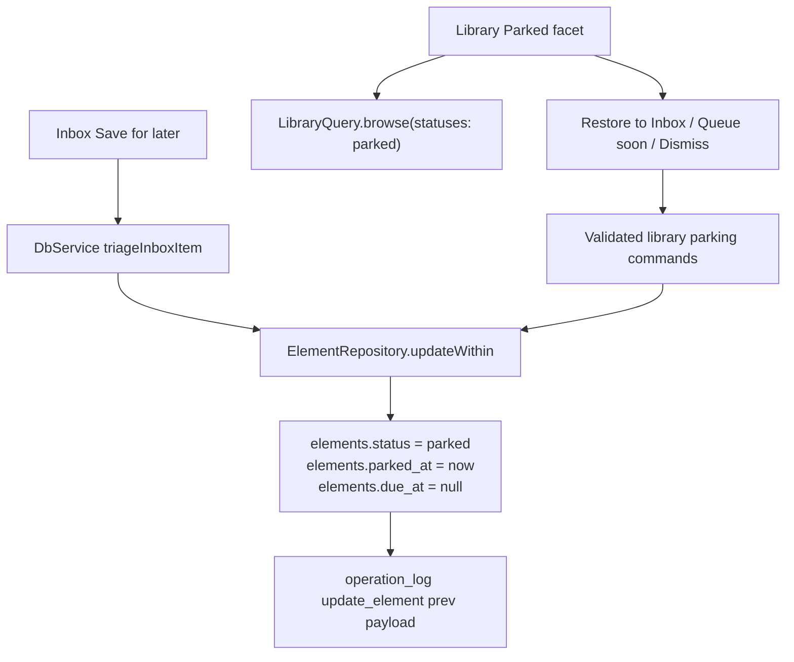

# T101 Park Save for later sources

## Summary

T101 turns Inbox "Save for later" into a recoverable parked state instead of writing
`dismissed`. The change adds a durable parked representation, exposes parked items in Library,
and adds main-owned unpark actions that restore the item to Inbox, schedule it into Queue, or
dismiss it with undo.

## Problem Frame

The current `keepForLater` triage branch writes `status: "dismissed"` in
`apps/desktop/src/main/db-service.ts`, conflating overloaded deferral with abandonment. That
breaks user trust because "later" becomes invisible, terminal, and indistinguishable from Abandon.
The task spec requires new saves to become queryable parked items while pre-existing dismissed
rows remain untouched because the historical intent cannot be recovered.

## Requirements

- R1. `Save for later` writes a distinct parked state and records `parked_at` for new saves.
- R2. Parked items stay out of Inbox, Queue, and daily-work routing while remaining browsable in
  Library under a `Parked` filter.
- R3. Parked rows are data-distinguishable from dismissed rows, and a query can count both.
- R4. Library rows display the parked date when present.
- R5. Parked sources can be moved back to Inbox, scheduled due now, or dismissed through typed
  main-process commands.
- R6. Every parked/unpark/dismiss transition is transactional, operation-logged, and undoable with
  preimages for status, `due_at`, and `parked_at`.
- R7. Pre-existing `dismissed` rows are not reclassified by the migration or runtime logic.
- R8. The renderer never receives raw SQL/filesystem capability and never derives queue
  eligibility on its own.

## Key Technical Decisions

- KTD1. Add `parked` to `ELEMENT_STATUSES` and add nullable `elements.parked_at`: this makes
  parked visible to every existing status-filtering and operation-log path while preserving the
  lifecycle-status model. `parked_at` lives on `elements` because parking is an element lifecycle
  transition, not source-only metadata.
- KTD2. Do not backfill old dismissed rows: the data cannot tell "Save for later" from Abandon,
  so the next Drizzle migration, `0030_*`, rebuilds `elements` to widen the status CHECK and
  leaves existing rows as `dismissed` with `parked_at = NULL`.
- KTD3. Use one `update_element` transition for parking and parked exits: the closed operation-log
  op set stays stable, and `ElementRepository.updateWithin` must be extended to record `parkedAt`
  preimages. Restore-to-inbox sets `status: "inbox"`, `dueAt: null`, and `parkedAt: null`.
  Queue-soon from parked sets `status: "scheduled"`, `dueAt: now`, and `parkedAt: null` in one
  `update_element` op with queue-soon audit extras, rather than a separate `reschedule_element`
  plus a separate clear.
- KTD4. Make the DB service the parking command owner: `keepForLater`, `library.parked*` actions,
  queue eligibility, and validation stay behind Electron main and validated IPC.
- KTD5. Expose parked through Library, not Inbox or Queue: Inbox remains undecided captures, Queue
  remains currently actionable work, and parked is an inventory state that the user can revisit.
- KTD6. Exclude parked by status from Queue eligibility: clearing `dueAt` on parking is cleanup,
  but the canonical guard is adding `parked` to the backend queue-excluded status set.

## High-Level Technical Design

## Scope Boundaries

- T101 does not build the T102 resurfacing sweep or any 90-day policy.
- T101 does not add a `resurfaceAfter` setting, resurfacing read model, Maintenance/weekly-session
  host, parked due badge/count, keep-parked reset action, bulk parked action, or single-batch
  resurfacing undo. Those belong to T102/T110.
- T101 does not reinterpret DoneIntentMenu "Return later" semantics; note any observed follow-up
  but keep this task focused on Inbox Save for later and parked Library actions.
- T101 does not recover historical `dismissed` intent.
- T101 does not add generic element mutation endpoints or renderer-side persistence logic.

## Implementation Units

### U1. Schema and domain vocabulary

- **Goal:** Add `parked` and `parked_at` to the persisted element model.
- **Files:** `packages/core/src/enums.ts`, `packages/core/src/enums.test.ts`,
  `packages/core/src/index.test.ts`, `packages/core/src/element.ts`, `docs/domain-model.md`,
  `packages/db/src/schema/elements.ts`, `packages/db/drizzle/0030_*.sql`,
  `packages/db/drizzle/meta/0030_snapshot.json`, `packages/db/drizzle/meta/_journal.json`,
  migration/schema tests under `packages/db`.
- **Patterns to follow:** `packages/db/src/schema/jobs.ts` for enum-derived checks;
  `packages/db/drizzle/0025_noisy_korath.sql` and `packages/db/drizzle/0023_secret_master_mold.sql`
  for SQLite CHECK table rebuild and trigger recreation patterns; 
  `docs/solutions/database-issues/drizzle-migrator-high-water-mark-skips-out-of-order-migrations.md`
  for journal ordering.
- **Approach:** Add `parked` to the core tuple and docs. Add nullable `parkedAt`/`parked_at` to
  element types/schema/mappers. Create `0030_*` with strictly increasing journal metadata, rebuild
  `elements` to widen `elements_status_check`, preserve self-FKs/indexes/FTS triggers, and include
  a migration note that dismissed rows are not reclassified.
- **Test scenarios:** Core enum tests include `parked`; schema/migration tests prove the new
  column exists, the status CHECK allows `parked`, and existing `dismissed` rows remain dismissed.
- **Verification:** `pnpm --filter @interleave/core test`, `pnpm --filter @interleave/db test`,
  plus workspace typecheck.

### U2. Local-db mutation and undo semantics

- **Goal:** Make the durable parked transitions command-shaped, logged, and reversible.
- **Files:** `packages/core/src/element.ts`, `packages/local-db/src/mappers.ts`,
  `packages/local-db/src/element-repository.ts`, `packages/local-db/src/undo-service.ts`,
  `packages/local-db/src/element-repository.test.ts`, `packages/local-db/src/undo-service.test.ts`.
- **Patterns to follow:** `queueSoon` in `apps/desktop/src/main/db-service.ts`; queue-exit
  preimage handling from `docs/solutions/logic-errors/queue-eligibility-inventory-scheduler-state.md`;
  trash restore typed API shape.
- **Approach:** Extend `Element` and `UpdateElementInput` with `parkedAt`; make
  `ElementRepository.createWithin` initialize it to `null`, `rowToElement` read it, and
  `updateWithin` capture/write it in the `prev` payload. Keep global undo generic by relying on
  the enriched `update_element` preimage. Do not alter QueueActionService dismiss semantics.
- **Test scenarios:** Parking a source writes one `update_element` op with the prior status and
  due/parked preimages; restore-to-inbox clears `parkedAt` and `dueAt`; queue-soon clears
  `parkedAt`, sets `scheduled`, and preserves undo in one operation; dismiss clears `parkedAt`
  and writes `dismissed`; global undo reverses each action including the original `parkedAt`.
- **Verification:** Targeted local-db Vitest suites.

### U3. Desktop IPC and parking commands

- **Goal:** Expose only validated main-process parking commands to the renderer.
- **Files:** `apps/desktop/src/main/db-service.ts`, `apps/desktop/src/main/db-service.test.ts`,
  `apps/desktop/src/shared/channels.ts`, `apps/desktop/src/shared/contract.ts`,
  `apps/desktop/src/shared/contract.test.ts`, `apps/desktop/src/preload/index.ts`,
  `apps/web/src/lib/appApi.ts`, `apps/web/src/lib/appApi.test.ts`.
- **Patterns to follow:** Inbox `queueSoon` validation, Trash restore IPC, `QueueActionService`
  undo preimage tests.
- **Approach:** Replace `keepForLater` with a transaction that validates a live inbox source and
  sets `{ status: "parked", dueAt: null, parkedAt: now }`. Add a typed parked action command for
  live parked sources with three actions: `restoreToInbox`, `queueSoon`, and `dismiss`. Each action
  validates current status, uses one `update_element` operation, and returns enough row data for
  the UI to refresh. Add an explicit grep/check for all `keepForLater` and "Save for later" entry
  points; convert in-scope paths and document any excluded DoneIntentMenu follow-up.
- **Test scenarios:** `keepForLater` stamps `parkedAt`, leaves Inbox, logs `action:
  "keepForLater"` or equivalent audit extras, and Undo returns it to `inbox`. `restoreToInbox`
  sets `status: "inbox"` and clears `dueAt`/`parkedAt`; `queueSoon` sets `status: "scheduled"`,
  `dueAt = now`, and clears `parkedAt`; `dismiss` sets `status: "dismissed"` and clears
  `parkedAt`; stale/non-source/non-parked ids are rejected.
- **Verification:** Desktop shared contract, preload, and DB service tests.

### U4. Library read model and renderer surface

- **Goal:** Make parked items visible and actionable in Library without leaking persistence logic
  into React.
- **Files:** `packages/local-db/src/library-query.ts`,
  `packages/local-db/src/library-query.test.ts`, `packages/local-db/src/library-query.property.test.ts`,
  `apps/desktop/src/shared/contract.ts`, `apps/desktop/src/main/db-service.ts`,
  `apps/web/src/library/BrowseScreen.tsx`, `apps/web/src/library/BrowseScreen.test.tsx`,
  `apps/web/src/library/collectionExplorerState.ts`, `apps/web/src/library/library.css`,
  `apps/web/src/components/inspector/primitives.tsx`, `apps/web/src/help/help-bodies.ts`,
  `/search` files only if parked search result display is intentionally extended.
- **Patterns to follow:** Existing Library status facets, queue scheduler labels from
  `queue-eligibility-inventory-scheduler-state.md`, Trash undo snackbar pattern in
  `apps/web/src/trash/TrashScreen.tsx`, `design/kit/app/screen-library.jsx`.
- **Approach:** Include `parked` in browsable status facets and return `parkedAt` on Library row
  summaries. Render a Parked facet as a URL-addressable `status=parked` browse filter with normal
  drill-down count semantics. Display `Status` support for `parked` plus `Parked Jun 11` date
  metadata; parked rows should not show action-colored due styling. Put parked-only actions in the
  selected detail panel, not inline row clutter: `Move to Inbox`, `Queue soon`, and `Dismiss`, with
  icon+text buttons using the icon map. Dismiss relies on immediate snackbar undo rather than a
  confirm. After every action, disable pending controls, show a snackbar (`Moved to Inbox`,
  `Queued soon`, `Dismissed`) with Undo, refresh the list, and restore focus to the detail panel or
  the restored row. Stale-row or command failures keep the row visible until a reload proves it
  moved and show an error.
- **Test scenarios:** Browse with `statuses: ["parked"]` returns parked items and counts them
  separately from `dismissed`; default Library can show parked items; parked rows show parked date;
  empty Parked filter copy does not imply data loss; action loading/error states render; each
  detail action calls the correct app API, refreshes, and supports keyboard activation plus
  screen-reader labels.
- **Verification:** Library query tests and renderer component tests.

### U5. Queue exclusion and end-to-end coverage

- **Goal:** Prove parked items are not actionable until explicitly unparked and that the flow
  survives restart.
- **Files:** `packages/local-db/src/queue-repository.ts`, `packages/local-db/src/workload-service.ts`,
  `packages/local-db/src/queue-query.test.ts`, `packages/local-db/src/daily-work-query.test.ts`,
  `tests/electron/inbox-parked.spec.ts`, possibly `tests/electron/launch.ts` fixtures.
- **Patterns to follow:** `tests/electron/trash-undo.spec.ts`, `tests/electron/queue.spec.ts`,
  `tests/electron/auto-postpone.spec.ts`.
- **Approach:** Add `parked` to the canonical queue-excluded status set and workload excluded
  statuses. Add focused unit coverage for Queue and daily-work exclusion, including a parked row
  with stale `dueAt` to prove status, not just null due date, blocks queue eligibility. Add an
  Electron e2e matrix that parks from Inbox, verifies Library Parked visibility, covers
  restore-to-inbox plus Undo, queue-soon plus Undo, dismiss plus Undo, and relaunches to prove
  persistence for the parked state and one unpark path.
- **Test scenarios:** Parked item is absent from Inbox, Queue, and daily-work; parked item appears
  in Library; moving back to Inbox makes it visible in Inbox and Undo returns it to parked;
  queueing makes it due in Queue and Undo returns it to parked; dismissing makes it dismissed and
  Undo returns it to parked; persistence survives app restart.
- **Verification:** Targeted e2e plus standard gates.

### U6. Roadmap and task documentation

- **Goal:** Record completion and downstream notes.
- **Files:** `docs/roadmap.md`, `docs/tasks/M21-honest-exits.md`.
- **Approach:** Check T101 as done after the final commit is known, add the commit reference, and
  note the no-backfill migration decision and any T102 follow-up.
- **Verification:** Docs mention only completed behavior and use the final commit hash.

## Acceptance Examples

- AE1. Given an inbox source, when the user clicks `Save for later`, then the row leaves Inbox,
  the DB row has `status = "parked"` and non-null `parked_at`, and Library's Parked filter shows
  it with a parked date.
- AE2. Given a parked source, when the user opens Queue or daily work, then it is absent because
  parked rows are not actionable.
- AE3. Given a parked source in Library, when the user moves it back to Inbox and presses Undo,
  then it returns to parked with the original `parked_at`.
- AE4. Given a parked source in Library, when the user schedules it, then it appears in Queue as
  normal attention work and Undo returns it to parked.
- AE5. Given a pre-migration `dismissed` row, when migrations run, then it remains `dismissed` and
  is not assigned `parked_at`.

## System-Wide Impact

This changes the lifecycle status vocabulary, so exhaustive status switches, status filters, zod
contracts, schema checks, mocks, seed helpers, and tests must all accept `parked`. Queue and
workload reads use negative exclusion lists today, so those lists must explicitly exclude `parked`
and tests must prove stale `dueAt` cannot make a parked row actionable.

## Risks & Dependencies

- Adding a status can break mock fixtures and exhaustive tests across packages; use typecheck as
  the map and avoid default-case swallowing.
- A new `parked_at` field must flow through row mappers and contracts or Library cannot display
  the date.
- The migration must rebuild the `elements` CHECK safely; an additive column-only migration would
  leave `status = "parked"` rejected by existing databases.
- Queue-soon from Library must preserve the attention-scheduler boundary, must not create an FSRS
  `review_state`, and must keep `parkedAt` undoable in the same op.
- Undo correctness depends on including `parkedAt` in `ElementRepository.updateWithin` preimages.
- `/library` and `/search` are separate surfaces; the Parked facet belongs to `BrowseScreen`.

## Sources / Research

- `docs/tasks/M21-honest-exits.md` T101 is the source spec.
- `docs/solutions/workflow-issues/inbox-triage-queue-soon-attention-scheduling.md` keeps Inbox,
  Queue, and parked semantics separate.
- `docs/solutions/logic-errors/queue-eligibility-inventory-scheduler-state.md` requires backend
  queue eligibility and symmetric undo preimages.
- `apps/desktop/src/main/db-service.ts` currently writes `dismissed` for `keepForLater`.
- `packages/local-db/src/library-query.ts` owns Library status facets and counts.
