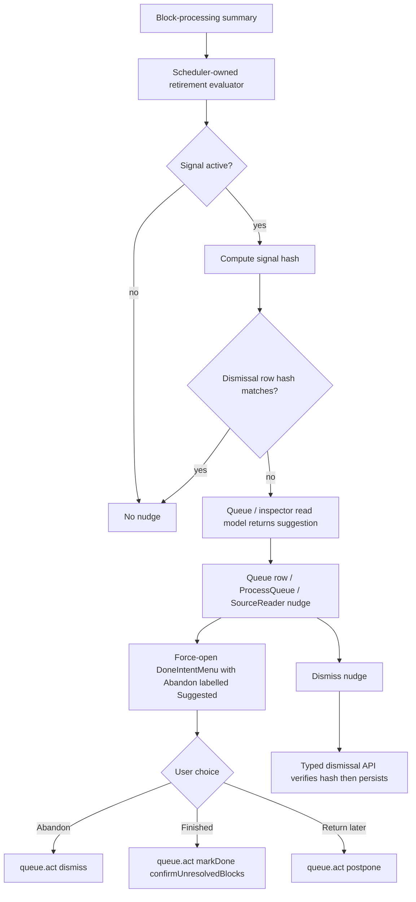

# T103 Proactive Done Retirement Suggestion

## Summary

Surface the scheduler's source `retirementSuggestion` as a calm, dismissible nudge in Queue and
Source Reader. The nudge opens the existing `DoneIntentMenu` with Abandon visibly suggested for
the current low-yield signal, while keeping the safe Return later choice as the keyboard default;
it never marks a source done or dismissed without an explicit user choice.

## Problem Frame

The attention scheduler already identifies a dead-looking source: mostly terminal blocks, no
extracted output, and a high ignored ratio. `SchedulerService` carries that flag in schedule
results, but the UI never sees it. T103 closes that loop by exposing a trusted read-model signal
and routing it into the existing Done intent surface instead of adding a second completion path.

## Requirements

- R1. The trusted side exposes a source-level proactive-done suggestion for live source rows when
  the scheduler's current retirement thresholds are met and no matching dismissal is active.
- R2. Queue rows and Source Reader render a quiet nudge for the suggestion and hide it for sources
  below threshold. Process Queue may get the same nudge only if it falls out cleanly from shared
  component wiring; it is not required for T103 completion.
- R3. Activating the nudge opens the existing `DoneIntentMenu` with the suggested intent labelled
  and described, but initial focus remains on Return later or the popover heading; it must not use
  the normal fast-path trigger that can auto-resolve `finished`.
- R4. Accepting a choice routes through the same existing `queue.act` mappings as manual Done:
  `finished` to `markDone` with the server gate override, `abandon` to `dismiss`, and `later` to
  `postpone`.
- R5. Dismissing the nudge is durable across restart and across surfaces, keyed by a source signal
  hash so the nudge reappears only after the underlying source-processing signal changes.
- R6. Renderer components do no scheduler threshold math, no SQL, no filesystem work, and no
  durable dismissal writes outside the typed app API.
- R7. Existing DoneIntentMenu fast-path behavior remains unchanged for the normal Done button and
  keyboard shortcut.
- R8. Dismissing the nudge appends an `update_element` operation-log marker in the same transaction
  as the dismissal row upsert.

## Key Technical Decisions

- **KTD1. Export one scheduler-owned evaluator.** Move the private low-yield threshold logic out
  of `adjustForSourceProcessing` into an exported pure helper in
  `packages/scheduler/src/attention-scheduler.ts`, then have both `nextDueAt` and local-db read
  models call it. This avoids copying the retirement thresholds into `packages/local-db` or React.

- **KTD2. Model the exposed signal as a source suggestion object, not a boolean.** Add a payload
  such as `{ kind: "abandon", reason, reasonLabel, signalHash }` to queue and inspector scheduler
  signals. The initial T103 signal maps to Abandon because the existing scheduler flag represents
  low-yield/deadness. A "looks finished" sibling stays out of scope unless implementation finds an
  already-equivalent domain signal; do not invent renderer heuristics for it.

- **KTD3. Use a schema-backed dismissal table.** Add a small table keyed by
  `source_element_id` with `signal_hash` and `dismissed_at`. A per-source table is more scalable
  and queryable than a growing JSON settings map, and more durable than renderer local state. The
  dismissal command appends an existing `update_element` operation-log marker such as
  `{ retirementSuggestionDismissed: { kind, signalHash } }` in the same transaction; it does not
  add a new operation type. Completion choices still use the existing queue action operations.

- **KTD4. Add a product-specific dismissal API.** Expose `sources.dismissRetirementSuggestion`
  or an equivalent narrow command through the typed bridge. The renderer sends source id and the
  signal hash it saw; the main side verifies the current signal still matches before upserting the
  dismissal.

- **KTD5. Extend `DoneIntentMenu` with a forced-open suggestion path.** The existing trigger path
  intentionally fast-paths zero-unresolved sources to `finished`. A proactive nudge must use a
  separate prop such as `reviewSignal` / `forceOpenSignal` that fetches the summary, opens the
  popover, labels the preferred choice, keeps initial focus safe, and never resolves an intent
  automatically.

- **KTD6. Keep surface ownership local.** Queue row nudges live inside each row's action zone,
  process-queue nudges live on the current source card, and reader nudges live in the existing
  `SourceHeader` action area. Queue rows get a compact icon-sized signal control plus dismiss
  affordance; Process Queue and Source Reader may use short text because their current-source
  surfaces have room. Do not add a stacked banner that fights existing reader chrome.

- **KTD7. Keep queue computation off the pre-limit hot path.** Queue suggestions are computed only
  for visible source rows after filter/sort/limit, likely in `decorateDisplay()` or a batched
  decorate-visible-source pass. Do not call `getSourceProcessingSummary()` for every due attention
  row before scoring.

## Scope Boundaries

- Do not change the scheduler thresholds beyond extracting the current logic into a reusable helper.
- Do not build T104 value-model states or any "honorable non-card fate" UI.
- Do not add a new Done/Abandon mutation path. The nudge only opens `DoneIntentMenu`.
- Do not use `localStorage` or renderer-only memory for dismissal.
- Do not make nudges modal, blocking, or automatic.
- Do not make Abandon the keyboard default even when it is the suggested outcome.

## High-Level Technical Design

## Implementation Units

### U1. Scheduler Evaluator And Signal Hash

- **Goal:** Make the current retirement threshold reusable by read models without duplicating
  threshold constants.
- **Files:** `packages/scheduler/src/attention-scheduler.ts`,
  `packages/scheduler/src/attention-scheduler.test.ts`.
- **Approach:** Export a pure helper that accepts source-processing ratios/counts and returns a
  structured low-yield suggestion plus deterministic hash inputs. Define `signalHash` as a
  versioned tuple over integer counts, not raw floats:
  `v1|sourceId|abandon|thresholds:terminal>=0.9,ignored>=0.5,output=0|totalBlocks|terminalBlocks|ignoredBlocks|unresolvedBlocks|extractedOutputCount`.
  Include source id, kind, version, and threshold signature so future finished-style signals or
  threshold revisions do not collide with old dismissals. Keep `nextDueAt` behavior unchanged by
  delegating to the helper from `adjustForSourceProcessing`.
- **Test Scenarios:** Current dead-source fixture still sets `retirementSuggestion`; below-threshold
  terminal/ignored/output fixtures produce no suggestion; hash changes when any integer tuple field
  changes; hash is stable for equivalent ratio-only floating precision changes.

### U2. Dismissal Persistence And Trusted Read Model

- **Goal:** Persist per-source dismissal memory and expose a dismissal-aware visible suggestion from
  local-db.
- **Files:** `packages/db/src/schema/system.ts`, `packages/db/src/schema/system.test.ts`,
  `packages/db/src/schema/index.ts`, `packages/db/drizzle/*`,
  `packages/db/drizzle/meta/_journal.json`,
  `packages/db/src/migration-0031-retirement-suggestion-dismissals.test.ts`,
  `packages/local-db/src/index.ts`, new
  `packages/local-db/src/retirement-suggestion-repository.ts`, and focused local-db tests.
- **Approach:** Add `retirement_suggestion_dismissals` with `source_element_id`, `signal_hash`,
  and `dismissed_at`. Add a local-db repository/read helper that computes the scheduler signal from
  `BlockProcessingService.getSourceProcessingSummary`, checks dismissal state, and returns a
  typed `SourceRetirementSuggestion | null`.
- **Test Scenarios:** Active signal returns when no dismissal exists; matching dismissal suppresses
  it; stale hash reappears; deleted/non-source ids return none; read helper appends no
  `operation_log` rows.

### U3. Queue And Inspector Contract Threading

- **Goal:** Carry the source suggestion through the existing typed read paths used by queue rows and
  Source Reader.
- **Files:** `packages/local-db/src/queue-query.ts`,
  `packages/local-db/src/queue-query.test.ts`, `packages/local-db/src/inspector-query.ts`,
  `packages/local-db/src/inspector-query.test.ts`, `apps/desktop/src/shared/contract.ts`,
  `apps/desktop/src/shared/contract.test.ts`, `apps/web/src/lib/appApi.ts`,
  `apps/web/src/lib/appApi.test.ts`.
- **Approach:** Add an optional `retirementSuggestion` field to queue `schedulerSignals` and
  inspector `scheduler` signals for source/attention rows. The shape crosses IPC as JSON and is
  `null` for cards, non-sources, below-threshold sources, and dismissed matching signals. On queue
  list reads, decorate only visible source rows after filter/sort/limit; `summaryFor` and inspector
  reads may compute for one source directly.
- **Test Scenarios:** Queue source row carries the suggestion when seeded block summary meets the
  scheduler thresholds; dismissed matching hash suppresses it; inspector payload for the same
  source agrees; cards/extracts remain `null`; a many-row queue fixture proves suggestion
  decoration is not invoked for every due attention row.

### U4. Typed Dismissal Command

- **Goal:** Let all three renderer surfaces dismiss the advisory nudge durably through a narrow API.
- **Files:** `apps/desktop/src/shared/channels.ts`, `apps/desktop/src/shared/contract.ts`,
  `apps/desktop/src/main/ipc.ts`, `apps/desktop/src/main/db-service.ts`,
  `apps/desktop/src/main/ipc.test.ts`, `apps/desktop/src/preload/index.ts`,
  `apps/desktop/src/preload/index.test.ts`, `apps/web/src/lib/appApi.ts`,
  `apps/web/src/lib/appApi.test.ts`.
- **Approach:** Add a request `{ sourceElementId, signalHash }`. Main-side handling recomputes the
  current signal, verifies the hash, upserts the dismissal row, appends an `update_element`
  operation-log marker for the source in the same transaction, and returns the current suggestion
  state. Mismatched hashes should not hide a changed signal.
- **Test Scenarios:** Valid dismissal persists; malformed ids/hash are rejected at schema
  validation; stale hash returns or throws a typed non-match without writing; the success path writes
  exactly one operation-log marker; preload exposes only the narrow command.

### U5. DoneIntentMenu Forced Review Mode

- **Goal:** Support proactive nudges without changing normal Done button semantics.
- **Files:** `apps/web/src/components/queue/DoneIntentMenu.tsx`,
  `apps/web/src/components/queue/DoneIntentMenu.test.tsx`,
  `apps/web/src/components/queue/done-intent-menu.css`.
- **Approach:** Add a forced-open signal and `suggestedIntent` prop. Forced-open fetches the summary
  and opens the popover even when `canMarkDoneWithoutConfirmation` is true; it visually and
  accessibly marks the suggested intent but keeps initial focus on Return later or the popover
  heading. The existing trigger click and `triggerSignal` preserve the zero-unresolved fast path.
- **Test Scenarios:** Normal trigger with zero unresolved still calls `finished` immediately; forced
  open with zero unresolved opens and calls no action; suggested Abandon is labelled but does not
  receive initial focus; double activation remains guarded by host busy settling.

### U6. Queue And Reader UI

- **Goal:** Render the nudge in all required surfaces and route actions through the existing Done
  menu and queue-action handlers.
- **Files:** `apps/web/src/pages/queue/QueueScreen.tsx`,
  `apps/web/src/pages/queue/QueueScreen.test.tsx`,
  `apps/web/src/pages/source/SourceReader.tsx`,
  `apps/web/src/pages/source/SourceReader.test.tsx`, related CSS under existing queue/reader files.
  If the shared `DoneIntentMenu` change makes Process Queue wiring trivial, also touch
  `apps/web/src/pages/queue/ProcessQueue.tsx` and
  `apps/web/src/pages/queue/ProcessQueue.test.tsx`; do not let Process Queue block T103.
- **Approach:** For a suggestion-bearing source, render reason-backed copy. Queue rows use a compact
  icon-sized "Low-yield source" signal control tied to the existing Done menu, with dismiss exposed
  as a tooltip-labelled icon affordance. Process Queue and Source Reader can show a short text line
  such as "Low-yield source — mostly ignored blocks, no extracts yet" in their current-source
  action area. Review invokes the forced-open DoneIntentMenu signal with Abandon labelled as the
  suggestion. Dismiss calls the typed dismissal command and refreshes the local read model. Queue
  rows key any transient open state by `item.id` so virtualization does not leak state across rows.
- **Test Scenarios:** Nudge renders only with the suggestion; Review opens the existing menu and
  does not call `actOnQueueItem` until a choice; Abandon and Finished use the current host action
  paths; Dismiss hides the nudge after the API resolves; failed dismissal leaves the nudge visible
  and surfaces an error; stale-signal dismissal responses refresh the read model and leave any new
  signal visible.

#### Nudge Interaction States

| State | Review behavior | Dismiss behavior | Focus/error rule |
| --- | --- | --- | --- |
| idle | enabled | enabled | compact reason is visible |
| opening | disabled until summary read settles | disabled | preserve current focus |
| open | DoneIntentMenu owns choice focus safely | disabled | Escape returns focus to Review |
| dismissing | disabled | disabled | keep nudge visible until API success |
| dismissed | nudge removed after refreshed read | nudge removed | focus returns to nearest stable action |
| stale signal | no mutation | read model refreshes | show updated nudge if one exists |
| API error | no mutation | no mutation | nudge remains and a short error is surfaced |

### U7. E2E Coverage And Documentation Updates

- **Goal:** Prove the T103 behavior in the Electron app and record the completed roadmap task.
- **Files:** `tests/electron/done-intent.spec.ts` or a focused new
  `tests/electron/retirement-suggestion.spec.ts`, `docs/tasks/M21-honest-exits.md`,
  `docs/roadmap.md`.
- **Approach:** Seed or create a source with real document blocks and durable block-processing rows
  whose summary meets the low-yield thresholds, confirm the queue nudge appears, open the review
  surface, choose Abandon, verify the row leaves via the normal queue action path, then undo or
  restart-check dismissal memory as appropriate.
- **Test Scenarios:** Dead-source fixture shows the nudge in queue and reader; below-threshold source
  does not; dismissed nudge stays hidden after restart; changed signal hash resurfaces. Add Process
  Queue coverage only if U6 wires that surface opportunistically.

## System-Wide Impact

The change adds one durable advisory-state table, widens queue and inspector scheduler signals, and
adds one narrow typed command. Dismissal writes are audited with an existing `update_element`
operation-log marker, but they do not change element lifecycle status, queue eligibility, source
completion semantics, block-processing state transitions, or FSRS card scheduling.

## Risks And Mitigations

- **Risk:** The nudge accidentally becomes an automatic Done path.
  **Mitigation:** Use a forced-open menu mode that never resolves an intent automatically and test
  that no action fires until the user chooses.
- **Risk:** Scheduler thresholds drift between scheduling and read models.
  **Mitigation:** Export and reuse the scheduler helper instead of copying constants.
- **Risk:** Dismissal hides changed signals forever.
  **Mitigation:** Store and compare a signal hash derived from the scheduler inputs.
- **Risk:** UI fixtures drift with widened IPC types.
  **Mitigation:** Update contract, appApi, and renderer fixture tests in the same implementation
  unit.

## Research Notes

- `docs/tasks/M21-honest-exits.md` defines T103 and requires the nudge to use
  `DoneIntentMenu`, stay advisory, and remember dismissals.
- `docs/solutions/design-patterns/non-modal-intent-menu-replacing-confirm-gate.md` requires the
  Done gate to remain server-authoritative and warns that the menu in-flight guard resets from host
  busy state.
- `docs/solutions/logic-errors/queue-eligibility-inventory-scheduler-state.md` requires queue
  membership and terminal lifecycle actions to remain backend-owned and undo-safe.
- `docs/solutions/architecture-patterns/durable-source-block-processing-state.md` defines the
  terminal block states and the durable block summary that the scheduler signal should consume.
- `apps/web/src/components/queue/DoneIntentMenu.tsx` currently supports only normal trigger and
  keyboard-trigger flows; a separate forced-open suggestion flow is needed.
- `packages/scheduler/src/attention-scheduler.ts` owns the current low-yield threshold, and
  `packages/local-db/src/queue-query.ts` / `packages/local-db/src/inspector-query.ts` are the read
  paths that must expose the signal to the renderer.

## Execution Result

- Status: completed.
- Review fixes applied: stale forced-open DoneIntentMenu reads are invalidated, SourceReader
  refreshes retirement suggestions after block-processing changes, queue stale-dismissal feedback
  survives refresh, and Electron coverage now proves dismissal persistence across restart.
- Verification: `pnpm lint`, `pnpm typecheck`, `pnpm test`, and
  `pnpm e2e tests/electron/done-intent.spec.ts`.
