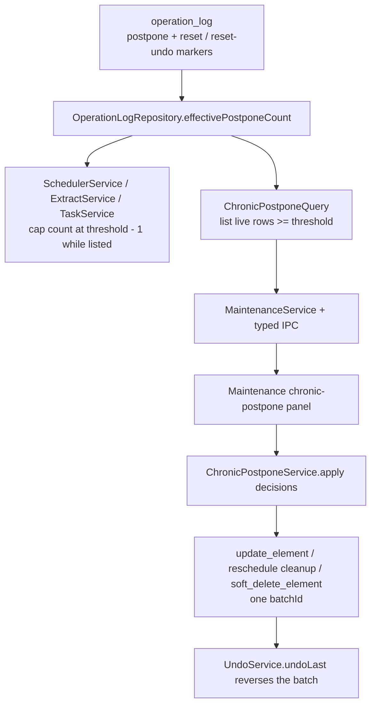

# T106 Chronic-postpone reckoning

## Summary

T106 adds a maintenance reckoning loop for items that have been postponed too many times. The
system will compute an effective postpone count from the append-only operation log, surface rows
at or above the configured threshold, pause further recession growth while they remain listed, and
let the user batch one explicit decision per item: keep, demote, done, or delete.

## Problem Frame

The attention scheduler already records postpone evidence in `operation_log` and grows future
postpone intervals toward a 180-day ceiling. That makes overload survivable, but repeated
postpones can become silent oblivion. T106 turns the chronic threshold into an accountable
decision surface without adding a shadow analytics table or moving scheduling logic into React.

## Requirements

- R1. Chronic detection is based on `postponeCount >= chronicPostponeThreshold`, defaulting to 5,
  and covers live sources, topics, extracts, synthesis notes, and deferred cards where the
  evidence is a `reschedule_element` op with `postpone: true`.
- R2. Effective postpone count is append-only and resettable: "keep" does not delete historical
  ops; it appends a durable reset marker that later counting, listing, scheduler inputs, and undo
  semantics understand.
- R3. While an item is reckoning-eligible, additional attention postpones use a capped count of
  `threshold - 1` so the item stays in the reckoning list without silently receding farther.
- R4. The Maintenance view exposes a chronic-postpone card and drill-down with per-row decisions:
  keep, demote, done, and delete.
- R5. Applying decisions revalidates each id in the main process, writes all accepted decisions
  under one `batchId`, skips stale/ineligible rows with explicit reasons, and supports a single
  undo.
- R6. Decision semantics preserve existing lifecycle rules: demote lowers one priority band,
  done clears active schedule state, delete soft-deletes, and card done clears FSRS due state with
  undo preimages.
- R7. Maintenance diagnostics distinguish incoherent chronic state from normal chronic receipts:
  a paused-but-not-listed row is drift; a recent keep reset is informational and finite.
- R8. The renderer receives only typed read/apply results through `window.appApi`; it never counts
  postpones, computes threshold eligibility, mutates storage, or derives queue eligibility.
- R9. Roadmap and task documentation record the completed behavior, final commit reference, and
  verification evidence.

## Key Technical Decisions

- KTD1. Use operation-log reset markers, not a new counter column. The existing model treats
  postpone count as an operation-log-derived receipt. A keep decision should append a marker-only
  `update_element` payload with `chronicPostponeResetId`. `UndoService` must special-case these
  markers as invertible even without a field `prev`: undo appends `chronicPostponeResetUndoFor`,
  and undoing that inverse appends a new active reset marker. Effective count is a deterministic
  fold over ordered op-log events, not a timestamp filter.
- KTD2. Keep threshold in typed app settings. Add `chronicPostponeThreshold` to `AppSettings`
  with default `5` and a bounded integer coercion path. Maintenance IPC reads the setting; request
  schemas do not accept threshold overrides. Local-db tests may call query helpers with an
  internal threshold option.
- KTD3. Centralize effective count in `OperationLogRepository`. Existing callers use
  `countPostpones`; T106 should add effective-count helpers and route scheduler inputs, queue
  scheduler signals, inspector scheduler signals, extract-stagnation signals, priority-integrity
  chronic projections, and chronic queries through them where the UI means "postpones since the
  last keep reset." Lifetime/windowed analytics should label their semantics explicitly.
- KTD4. Pause by capping scheduler input, not by blocking the Postpone action. The task says
  "surfaced and sticky, not modal-blocking"; postponing can still happen, but its recession growth
  uses `min(effectiveCount, threshold - 1)` for live reckoning-eligible rows, including rows whose
  next due date is already in the future. Terminal, parked, deleted, retired, and reset-below-
  threshold rows do not inherit the pause.
- KTD5. Add a dedicated local-db chronic service plus a transaction-composable queue-exit helper.
  Existing queue actions do not accept `batchId` for all verbs, and the batch must mix updates and
  soft deletes under one undoable id. Extract a helper such as `queueExitWithin(tx, element,
  status, options)` so normal queue actions and chronic done decisions share unresolved-block
  gating, card review-due clearing, and undo preimages.
- KTD6. Host the UI in Maintenance now. T110 can compose it into the weekly ledger later; T106
  should mirror the parked-resurfacing section rather than create a new dashboard route.
- KTD7. For source/topic/extract done decisions, reuse queue-exit semantics and require the same
  server-side done gate where applicable. If a source still has unresolved blocks, the chronic
  apply should skip it with a clear reason unless the future UI supplies an explicit override.

## High-Level Technical Design

## Scope Boundaries

- T106 does not build T107 fallow; the decision set is keep, demote, done, delete only.
- T106 does not build T110's weekly ritual. Maintenance is the host surface for this task.
- T106 does not introduce a parallel analytics table, a new operation type, or renderer-side
  persistence logic.
- T106 does not change FSRS scheduling heuristics for normal reviews. It only counts card defers
  as chronic evidence and clears card due state when a card is explicitly marked done.
- T106 does not change verification-task completion or postpone semantics. Task rows are excluded
  from the first chronic decision surface and from the chronic pause rule because
  `tasks.status` / `tasks.due_at` need task-specific undo mechanics.
- T106 does not force a blocking modal on queue postpone. The row remains visible in reckoning
  until the user makes an explicit decision.

## Implementation Units

### U1. Effective postpone count and settings

- **Goal:** Add a resettable, append-only effective count and the chronic threshold setting.
- **Files:** `packages/core/src/settings.ts`, `packages/core/src/settings.test.ts`,
  `packages/local-db/src/settings-repository.ts`, `packages/local-db/src/operation-log-repository.ts`,
  `packages/local-db/src/operation-log-repository.test.ts`,
  `packages/local-db/src/undo-service.ts`, `packages/local-db/src/undo-service.test.ts`,
  `packages/local-db/src/queue-query.ts`, `packages/local-db/src/queue-query.test.ts`,
  `packages/local-db/src/inspector-query.ts`, `packages/local-db/src/inspector-query.test.ts`,
  `packages/local-db/src/extract-stagnation-query.ts`,
  `packages/local-db/src/extract-stagnation-query.test.ts`,
  `packages/local-db/src/priority-integrity-query.ts`,
  `packages/local-db/src/priority-integrity-query.test.ts`, `packages/local-db/src/index.ts`.
- **Patterns to follow:** `parkedResurfaceAfterDays` in `packages/core/src/settings.ts`;
  `OperationLogRepository.countPostpones` in `packages/local-db/src/operation-log-repository.ts`;
  `docs/solutions/architecture-patterns/priority-integrity-read-model.md`.
- **Approach:** Add `chronicPostponeThreshold` with default `5` and bounds such as `1..50`.
  Add operation-log parsing for reset and reset-undo markers emitted by keep decisions and Undo.
  Extend `UndoService` with a marker-only inversion path for chronic reset payloads. Expose
  helpers for lifetime count, effective count as an ordered fold, latest active reset metadata,
  reset-canceled metadata, and capped scheduler count. Update queue, inspector,
  stagnation, and priority-integrity readers to use effective counts only where the UI or receipt
  means "since the last keep reset"; preserve windowed/lifetime wording where those are intended.
- **Test scenarios:** Defaults and coercion clamp invalid thresholds; effective count ignores
  pre-reset postpones, counts post-reset postpones, treats unrelated `update_element` ops as
  irrelevant, survives mixed card/attention postpone payloads, handles keep-only undo, handles
  undoing that undo, and keeps queue/inspector/stagnation displays aligned with reset semantics.
- **Verification:** `pnpm --filter @interleave/core test` and targeted local-db operation-log
  tests.

### U2. Scheduler pause rule

- **Goal:** Prevent chronic rows from silently receding farther while they await a decision.
- **Files:** `packages/local-db/src/scheduler-service.ts`,
  `packages/local-db/src/extract-service.ts`, `packages/local-db/src/auto-postpone-service.ts`,
  matching tests in `packages/local-db/src`,
  and `packages/scheduler/src/attention-scheduler.test.ts` only if pure-helper coverage needs
  expansion.
- **Patterns to follow:** `SchedulerService.previewPostpone` and
  `SchedulerService.rescheduleForAction` parity; `auto-postpone-service.test.ts` preview/apply
  matching.
- **Approach:** Read the validated threshold, effective count, and a shared backend
  `isChronicReckoningEligible` predicate at source/topic/extract/synthesis-note attention
  postpone call sites. When a row is live and reckoning-eligible, pass `threshold - 1` into
  `postponeIntervalForPriority` / `nextDueAt` while still logging the next raw/effective count in
  the `reschedule_element` payload. Keep auto-postpone preview and apply on the same helper path.
  Leave `TaskService.postponeTask` on the current path for T106.
- **Test scenarios:** A sixth attention postpone at threshold uses the same interval as the
  threshold-crossing postpone; preview and apply agree; a keep reset allows growth from the
  baseline again; excluded rows do not inherit pause semantics; extract direct postpone paths
  match `SchedulerService`.
- **Verification:** Targeted scheduler-service, extract-service, task-service, and
  auto-postpone-service tests.

### U3. Chronic-postpone read and apply services

- **Goal:** Add the trusted read model and one-batch decision service.
- **Files:** `packages/local-db/src/chronic-postpone-query.ts`,
  `packages/local-db/src/chronic-postpone-query.test.ts`,
  `packages/local-db/src/chronic-postpone-service.ts`,
  `packages/local-db/src/chronic-postpone-service.test.ts`, `packages/local-db/src/index.ts`,
  `packages/local-db/src/queue-action-service.ts`, `packages/local-db/src/queue-action-service.test.ts`,
  and `packages/local-db/src/priority-integrity-query.ts` if shared postpone aggregation helpers
  are extracted there or beside it.
- **Patterns to follow:** `packages/local-db/src/parked-resurfacing-query.ts`,
  `packages/local-db/src/parked-resurfacing-service.ts`,
  `packages/local-db/src/priority-integrity-query.ts`, `packages/local-db/src/bulk-action-service.ts`,
  `packages/local-db/src/queue-action-service.ts`.
- **Approach:** Extract/reuse T105's postpone-event parsing, debt calculation, and eligibility
  predicates where possible, then layer lifetime/effective reset semantics on top. Query live,
  non-deleted, queue-relevant rows with effective postpone count `>= threshold`, regardless of
  whether their next due date is in the future, sorted by count then debt/latest defer time. Apply
  decisions in one transaction with one `batchId`: keep updates a real reversible field and adds a
  reset marker; demote lowers priority one band or skips `D` rows as `already-lowest`; done uses
  the shared queue-exit helper and skips source rows needing unresolved-block confirmation; delete
  uses soft delete.
- **Test scenarios:** Read model is read-only; threshold boundary includes exactly `N`; deleted,
  parked, terminal, and retired rows are excluded; future-due chronic rows are still listed; all
  four decisions write the expected ops under one batch; undo restores priority/status/due/review
  due/delete state and cancels the effective reset; undoing that undo restores the reset; stale ids
  are skipped.
- **Verification:** Targeted local-db Vitest suites.

### U4. Maintenance report, IPC, preload, and renderer API

- **Goal:** Thread the new read/apply service through the existing typed maintenance boundary.
- **Files:** `apps/desktop/src/main/maintenance-service.ts`,
  `apps/desktop/src/main/db-service.ts`, `apps/desktop/src/main/ipc.ts`,
  `apps/desktop/src/shared/channels.ts`, `apps/desktop/src/shared/channels.test.ts`,
  `apps/desktop/src/shared/contract.ts`, `apps/desktop/src/shared/contract.test.ts`,
  `apps/desktop/src/preload/index.ts`, `apps/desktop/src/preload/index.test.ts`,
  `apps/web/src/lib/appApi.ts`, `apps/web/src/lib/appApi.test.ts`.
- **Patterns to follow:** `maintenance.parkedResurfacing`,
  `maintenance.parkedResurfacingApply`, and the T105 `analytics.priorityIntegrity` contract
  validation style.
- **Approach:** Add `chronicPostponeCount` to the maintenance report. Add list/apply request and
  result schemas with bounded `limit`, per-decision enum validation, and skipped reason strings.
  Threshold comes from typed settings inside the main process, not from renderer request payloads.
  Expose `maintenance.chronicPostpones` and
  `maintenance.chronicPostponesApply` through IPC, preload, and renderer wrapper.
- **Test scenarios:** Channel constants are stable; schemas reject empty ids, invalid decisions,
  and too many decisions; preload invokes the right channels; desktop wrapper exposes typed methods
  and non-desktop fallback returns empty rows.
- **Verification:** Desktop shared/preload/appApi tests.

### U5. Maintenance UI and e2e

- **Goal:** Render the reckoning surface and prove the user flow in Electron.
- **Files:** `apps/web/src/maintenance/MaintenanceScreen.tsx`,
  `apps/web/src/maintenance/MaintenanceScreen.test.tsx`,
  `apps/web/src/maintenance/maintenance.css`, `tests/electron/maintenance.spec.ts`,
  possibly `packages/testing/src` fixtures if a reusable chronic seed helps.
- **Patterns to follow:** `ParkedPanel` in `MaintenanceScreen.tsx`; `MaintenanceScreen.test.tsx`
  parked-resurfacing tests; `tests/electron/maintenance.spec.ts` T102 flow.
- **Approach:** Add a Chronic postpones metric card near Parked resurfacing. Rows show title,
  type, priority, effective postpone count, latest deferred date, and debt days. Rows start
  undecided; the apply button stays disabled until at least one explicit decision is selected and
  reads `Apply N decisions`. Labels are `Keep` (reset this reckoning count), `Demote`, `Mark done`,
  and `Move to Trash`; delete uses danger styling in the segment. Only one Maintenance card stays
  expanded at a time. Loading, load error, empty, applying, full success, partial success, all
  skipped, undo success, and undo failure states are explicit. Skipped rows remain visible with
  inline reason copy and their selected decision retained. Segments use `radiogroup`/radio
  semantics or the existing accessible segmented-control pattern, keyboard selection, per-row
  accessible names, focus retention after apply, and an `aria-live` status for apply/skipped/undo
  results.
- **Test scenarios:** Count card renders; expanding loads rows; rows expose list semantics with
  accessible per-row decision controls; no default decision is selected; apply sends only selected
  decisions; skipped rows retain inline reasons; delete has danger styling; undo calls
  `appApi.undoLast` and failures announce without clearing row state.
- **Verification:** Renderer unit tests and an Electron e2e fixture with four 6x-postponed rows
  covering keep, demote, done, delete, one batch apply, and undo.

### U6. Drift diagnostics and documentation

- **Goal:** Make chronic state visible in diagnostics and record completion.
- **Files:** `packages/local-db/src/scheduler-consistency-query.ts`,
  `packages/local-db/src/scheduler-consistency-query.test.ts`, `docs/scheduling-and-priority.md`,
  `docs/tasks/M22-receipts.md`, `docs/roadmap.md`.
- **Patterns to follow:** existing scheduler consistency reasons and roadmap completion entries.
- **Approach:** Add diagnostic/receipt rows that distinguish drift from normal chronic state:
  `chronic-paused-not-listed` is drift; a recently reset row is finite informational context and
  must not inflate scheduler consistency drift forever. Keep the diagnostics read-only. After
  final verification, update the T106 task spec and roadmap with the commit reference and
  downstream notes.
- **Test scenarios:** Diagnostic list includes paused-but-not-listed drift, includes finite recent
  reset info where surfaced, excludes normal listed chronic rows from drift counts, and remains
  read-only.
- **Verification:** Targeted diagnostic tests plus standard gates.

## Acceptance Examples

- AE1. Given a live B-priority source with five effective postpone markers, when Maintenance
  loads chronic postpones with threshold 5, then the source appears with count 5 and a keep,
  demote, done, delete decision control.
- AE2. Given a listed source, when it is postponed again before the user decides, then the new due
  date uses the capped threshold interval rather than growing again toward 180 days.
- AE3. Given a listed row, when the user chooses keep and applies the batch, then the row leaves
  the reckoning list because effective count resets, and Undo restores it.
- AE4. Given multiple listed rows, when the user applies mixed demote, done, and delete decisions,
  then all accepted mutations share one `batchId`, one Undo reverses the batch, and stale rows are
  reported as skipped.
- AE5. Given a chronic card marked done, when Undo runs, then both the element status and
  `review_states.due_at` return to their prior values.

## System-Wide Impact

T106 changes how postpone evidence is interpreted across the scheduler, inspector, queue,
maintenance, and analytics-adjacent diagnostics. The operation log remains append-only and the
closed operation type set remains unchanged, but `update_element` payload semantics gain a
chronic reset marker that every effective-count reader must respect.

## Risks & Dependencies

- Reset semantics are the main risk. A marker that is not reversible would make keep decisions
  impossible to undo honestly, so the implementation must prove Undo restores the prior effective
  count.
- Multiple direct postpone paths exist. Missing `ExtractService` would let extract actions keep
  receding after threshold; task postpones are explicitly deferred from this slice.
- Source done may be gated by unresolved blocks. The batch service must not bypass the server gate
  just because the Maintenance UI collected a "done" decision.
- Card done must clear FSRS due state and carry `prevReviewDueAt`, matching the queue-exit undo
  invariant.
- T105's `sacrificed` list is windowed; T106 must compute lifetime/effective counts rather than
  reusing that payload directly.

## Sources / Research

- `docs/tasks/M22-receipts.md` T106 is the source spec.
- `docs/solutions/architecture-patterns/priority-integrity-read-model.md` defines the durable
  read-model pattern over `operation_log` and `review_logs`.
- `docs/solutions/logic-errors/queue-eligibility-inventory-scheduler-state.md` defines queue
  eligibility and undo preimage invariants.
- `docs/solutions/workflow-issues/save-for-later-first-class-parked-state.md` documents the
  closest Maintenance batch-decision pattern.
- `packages/local-db/src/operation-log-repository.ts` owns canonical postpone counting.
- `packages/local-db/src/scheduler-service.ts`, `packages/local-db/src/extract-service.ts`, and
  `packages/local-db/src/task-service.ts` contain the known postpone recession paths.
- `packages/local-db/src/scheduler-consistency-query.ts` owns the current drift diagnostic.
