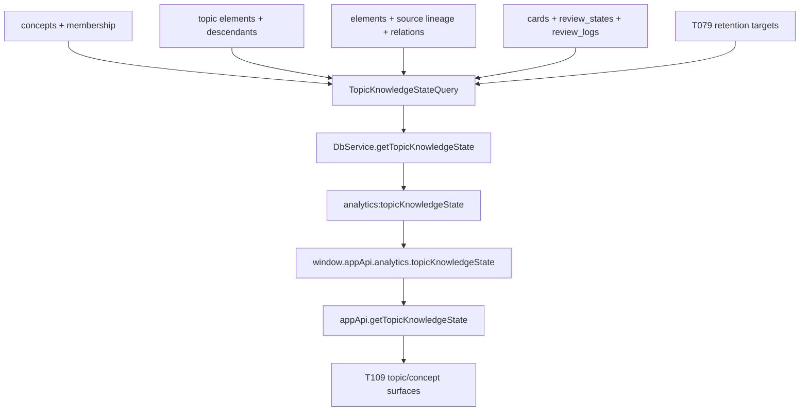

# T108 Topic knowledge-state read model

## Summary

T108 defines topic/concept maturity as a trusted read model. It computes stage-to-stage funnel
ratios, FSRS stability buckets, rolling measured retention versus T079 targets, staleness counts,
and computed graduation state from durable local data, then exposes the result through the typed
desktop bridge for T109 surfaces.

---

## Problem Frame

Interleave has mature-card, source-yield, retention-target, and stagnation facts, but no model
that answers whether a topic is becoming durable knowledge. Absolute completion percentages are
misleading because topics grow as sources are added. T108 therefore uses adjacent-stage ratios and
rolling review evidence so later UI can show maturity without inventing analytics in React or
storing parallel snapshots.

---

## Requirements

**Read-model semantics**

- R1. Add a read-only `TopicKnowledgeStateQuery` in `packages/local-db` that appends no
  `operation_log` rows and creates no analytics tables.
- R2. Aggregate by concept first, plus topic elements that are directly schedulable topics, with
  clear `subjectType` and `subjectId` fields so T109 can render either surface.
- R3. Return funnel counts and adjacent ratios for read, extracted, distilled, carded, and mature
  stages without using absolute percent-of-topic as the primary maturity measure. A read unit is a
  unique live source/topic in the subject with durable read evidence: a read point, terminal or
  needs-later block-processing state, or descendant output.
- R4. Count T104 honorable extract fates and live synthesis-note references as distilled
  productive output, not as failures to card.
- R5. Return card stability buckets as `young`, `maturing`, `mature`, and `retired`, reusing the
  existing `isCardMature` threshold and `cards.is_retired` flag.
- R6. Return measured rolling retention from `review_logs` as non-Again review share over a
  bounded default 90-day window, computed per period snapshots across the window, plus the
  strictest resolved T079 target among the subject's included active cards.
- R7. Return staleness and needs-reverify counts from current stale/verification task facts where
  available, keeping T123 propagation out of scope.
- R8. Compute current graduation state and deterministic graduation event candidates from the
  current read, not historical threshold crossings. Without stored snapshots, T108 does not claim
  to know that a threshold crossed since a previous day.

**Bridge and contract**

- R9. Expose the model through validated Electron IPC, preload, and `appApi` surfaces only; the
  renderer must receive one typed summary and must not read SQLite or group raw rows.
- R10. Support bounded request options for `asOf`, `windowDays`, `limit`, and optional subject
  filters by concept or topic.
- R11. Return stable empty summaries for empty collections, unknown subjects, and subjects with no
  cards or reviews.

**Verification and task record**

- R12. Add focused unit and contract coverage for ratios, buckets, retention trend, graduation
  edge cases, read-only behavior, and bridge validation.
- R13. Update `docs/tasks/M22-receipts.md` and `docs/roadmap.md` after implementation and
  verification.

---

## Key Technical Decisions

- KTD1. Aggregation subject shape: concept rollups are primary because T079 concept targets and
  T041 membership already define the knowledge grouping. Topic elements are included as secondary
  subjects using the live `parentId` subtree rooted at that topic; `sourceId` is provenance only
  for topic subjects so sibling chapter topics from one book cannot be counted into each other.
- KTD2. Adjacent ratios only: the API returns `extractedOfRead`, `distilledOfExtracted`,
  `cardedOfDistilled`, and `matureOfCarded`. A topic can grow without making existing progress
  look like failure, and each denominator stays falsifiable.
- KTD3. T104 value model participates in the funnel: extracts with `extractFate` and extracts
  referenced by live `synthesis_note` elements count as distilled. This follows the v2 value model
  and avoids treating synthesis-heavy reading as immature just because it produced fewer cards.
- KTD4. Retention is measured evidence, not FSRS prediction: rolling retention is the share of
  in-window review logs whose rating is not `again`. The target is the strictest
  `RetentionService.resolveForCard()` target across included active, non-retired cards; a concept's
  direct `desiredRetention` is returned separately as `directConceptTarget` for display context.
- KTD5. Graduation is current computed state, not history: a subject returns `insufficient_evidence`,
  `building`, `near_graduation`, `graduated`, or `needs_attention` from current counts and
  retention snapshots. The top-level `graduationEvents` array contains deterministic event
  candidates only for currently graduated subjects; T109/T110 own display and suppression.
- KTD6. Read-only bridge mirrors T105/T083: add a narrow `analytics.topicKnowledgeState` channel
  with Zod request validation, `DbService` defaults, preload forwarding, and renderer wrapper types.
  Do not add UI panels in T108.

---

## Graduation Contract

The query owns these constants so T109 can render without inventing product logic:

| Constant | Value | Purpose |
| --- | --- | --- |
| `KNOWLEDGE_STATE_WINDOW_DAYS` | `90` | Default rolling review-log window. |
| `KNOWLEDGE_STATE_SNAPSHOT_COUNT` | `3` | Three equal read-time retention buckets inside the window. |
| `KNOWLEDGE_YOUNG_STABILITY_MAX_DAYS` | `7` | Active non-retired card cutline below `maturing`. |
| `KNOWLEDGE_GRADUATION_MIN_CARDS` | `3` | Minimum active non-retired cards before graduation can be claimed. |
| `KNOWLEDGE_GRADUATION_MIN_REVIEWS` | `3` | Minimum in-window reviews before measured retention can qualify. |
| `KNOWLEDGE_GRADUATION_MATURE_RATIO` | `0.8` | `matureOfCarded` floor for `graduated`. |
| `KNOWLEDGE_GRADUATION_NEAR_RATIO` | `0.6` | `matureOfCarded` floor for `near_graduation`. |
| `KNOWLEDGE_RETENTION_TARGET_TOLERANCE` | `0.03` | Measured retention may trail target by at most three points. |

`young` means active non-retired cards with no review state, learning/relearning state, or
stability below `7` days. `maturing` means active non-retired cards not yet mature but at or above
that cutline. `mature` reuses `isCardMature`; `retired` is `cards.is_retired`.

`graduated` requires the minimum card/review floors, `matureOfCarded >= 0.8`,
`measuredRetention >= retentionTarget - 0.03`, and zero current stale or needs-reverify counts.
`near_graduation` requires the card floor and `matureOfCarded >= 0.6`, or retention within
tolerance but insufficient mature ratio. `needs_attention` applies when stale/reverify counts are
non-zero or measured retention trails target by more than `0.1`. Otherwise the state is `building`
or `insufficient_evidence`.

Graduation event candidates are JSON-safe objects with
`eventId = subjectType + ":" + subjectId + ":graduated:v1"`, `eventType = "current_graduated"`,
the subject id/type/title, `asOf`, and the threshold version. They are not proof of a historical
crossing; T109/T110 decide whether and when to show them.

---

## High-Level Technical Design

---

## Scope Boundaries

- T108 does not render topic panels, analytics retention views, daily-summary graduation lines, or
  subset-review CTAs. T109 owns those surfaces.
- T108 does not store graduation events, maturity snapshots, or trend history in new tables.
- T108 does not create or schedule `weekly_review`, weekly ledger/session surfaces, settings, or
  ritual decision flows. T110 owns those.
- T108 does not change FSRS scheduling, attention scheduling, retention targets, or card
  retirement semantics.
- T108 does not implement T123 stale propagation through the full lineage DAG. It only counts
  currently available stale or verification-task facts.
- T108 does not infer synthesis from document text or AI output; only explicit T104 fates and
  live `references` edges count.

---

## Implementation Units

### U1. TopicKnowledgeStateQuery read model

- **Goal:** Add the trusted local-db aggregation with exact funnel, bucket, retention, stale, and
  graduation semantics.
- **Requirements:** R1, R2, R3, R4, R5, R6, R7, R8, R11.
- **Dependencies:** None.
- **Files:** `packages/local-db/src/topic-knowledge-state-query.ts`,
  `packages/local-db/src/topic-knowledge-state-query.test.ts`, `packages/local-db/src/index.ts`.
- **Patterns to follow:** `packages/local-db/src/source-yield-query.ts`,
  `packages/local-db/src/priority-integrity-query.ts`,
  `packages/local-db/src/retention-service.ts`,
  `packages/local-db/src/concept-repository.ts`,
  `docs/solutions/architecture-patterns/priority-integrity-read-model.md`,
  `docs/solutions/architecture-patterns/extract-fates-value-model-v2-source-yield-stagnation.md`.
- **Approach:** Define `TopicKnowledgeStateSummary`, `TopicKnowledgeStateSubject`,
  `KnowledgeFunnel`, `KnowledgeStabilityBuckets`, `KnowledgeRetentionTrend`,
  `KnowledgeRetentionSnapshot`, `KnowledgeGraduationState`, and `KnowledgeGraduationEvent` in the
  query module first, then mirror them in the IPC contract in U2. Build concept subjects from live
  concepts and membership maps; build topic subjects from the live `parentId` subtree rooted at the
  topic. Use grouped reads over `elements`, `element_relations`, `cards`, `review_states`,
  `review_logs`, `concepts`, and available task/staleness columns. De-duplicate an element within
  each subject so multi-concept memberships do not double count inside one subject. Use
  `RetentionService.resolveForCard()` once per included active card and aggregate the strictest
  target for the subject.
- **Test scenarios:** Empty DB returns `subjects: []` and no graduation events; a concept with a
  source, extract, card, and mature card returns exact adjacent ratios; a topic subject aggregates
  only its `parentId` subtree while sibling topics sharing one `sourceId` are excluded; fated and
  synthesis-referenced extracts increase the distilled count once; retired cards move to the
  retired bucket and do not inflate mature active cards; young/maturing cutlines follow
  `KNOWLEDGE_YOUNG_STABILITY_MAX_DAYS`; review logs inside the 90-day window produce measured
  retention and three snapshots while out-of-window logs are excluded; strictest per-card resolved
  target wins; no-review subjects return `measuredRetention: null`; stale and verification-task
  facts count when seeded; current graduated subjects produce deterministic event candidates;
  non-graduated or insufficient-evidence subjects do not; running the query does not append
  `operation_log`.
- **Verification:** Focused Vitest for `packages/local-db/src/topic-knowledge-state-query.test.ts`.

### U2. Typed contract and desktop bridge

- **Goal:** Thread the read model through validated IPC without widening renderer privileges.
- **Requirements:** R9, R10, R11, R12.
- **Dependencies:** U1.
- **Files:** `apps/desktop/src/shared/channels.ts`,
  `apps/desktop/src/shared/channels.test.ts`,
  `apps/desktop/src/shared/contract.ts`,
  `apps/desktop/src/shared/contract.test.ts`,
  `apps/desktop/src/main/db-service.ts`,
  `apps/desktop/src/main/db-service.test.ts`,
  `apps/desktop/src/main/ipc.ts`,
  `apps/desktop/src/preload/index.ts`,
  `apps/desktop/src/preload/index.test.ts`,
  `apps/web/src/lib/appApi.ts`,
  `apps/web/src/lib/appApi.test.ts`.
- **Patterns to follow:** `analytics.priorityIntegrity`, `sourceYield.list`,
  `extractStagnation.list`, and `retention.resolveFor` bridge wiring.
- **Approach:** Add `TopicKnowledgeStateGetRequestSchema` with optional `asOf`, `windowDays`,
  `limit`, `subjectType`, and `subjectId`. Add `IPC_CHANNELS.analyticsTopicKnowledgeState` and
  `window.appApi.analytics.topicKnowledgeState(request)`. `DbService` owns defaults for `asOf`
  and `windowDays`, constructs the query once per open database, and returns JSON-safe data with
  top-level `subjects` and `graduationEvents`. The web wrapper exposes `getTopicKnowledgeState()`
  plus non-desktop fallback returning an empty summary.
- **Test scenarios:** Contract accepts omitted request, bounded options, and concept/topic subject
  filters; contract rejects malformed dates, excessive limits, and invalid subject filters;
  response schemas/types include retention snapshots and graduation events; channels are unique;
  IPC validates before calling `DbService`; preload forwards exactly; appApi wrapper calls the
  bridge and fallback returns the empty shape.
- **Verification:** Targeted desktop shared, main, preload, and appApi tests.

### U3. Integration fixtures and task records

- **Goal:** Prove T108 can be consumed through the real desktop bridge and record task completion.
- **Requirements:** R12, R13.
- **Dependencies:** U1, U2.
- **Files:** `tests/electron/analytics.spec.ts`, `docs/tasks/M22-receipts.md`,
  `docs/roadmap.md`.
- **Patterns to follow:** Existing Analytics bridge checks in `tests/electron/source-yield.spec.ts`
  and roadmap completion notes for T105-T107.
- **Approach:** Add the smallest Electron coverage that calls
  `window.appApi.analytics.topicKnowledgeState()` against seeded durable data and verifies a
  stable summary survives app restart. Update task records only after implementation and standard
  gates pass.
- **Test scenarios:** The bridge function exists with no raw SQL exposure; a seeded concept/topic
  returns non-empty funnel and retention fields; restart returns the same durable computed
  summary; unknown subject returns an empty subject list without throwing.
- **Verification:** Relevant Electron spec subset plus standard gates.

---

## Acceptance Examples

- AE1. Given a concept with one read source, two extracts, one fated reference extract, two cards,
  and one mature active card, the model reports adjacent ratios for extracted-of-read,
  distilled-of-extracted, carded-of-distilled, and mature-of-carded using those exact counts.
- AE2. Given one extract with both an explicit honorable fate and a live synthesis-note reference,
  the distilled count includes that extract once.
- AE3. Given review logs with Good, Hard, Easy, and Again ratings inside the 90-day window, measured
  retention is `3/4` and three period snapshots are returned; given no in-window reviews, measured
  retention is `null`.
- AE4. Given a subject whose included cards resolve to targets `0.9`, `0.95`, and `0.97`, the
  returned retention target is `0.97`; if the subject is a concept with `desiredRetention = 0.95`,
  that direct concept target is returned separately.
- AE5. Given a card whose stability crosses the existing maturity threshold and is in FSRS review
  state, it lands in the mature bucket; a retired card lands in the retired bucket instead.
- AE6. Given a subject meeting the graduation floors, mature ratio, target tolerance, and no
  stale/reverify counts, the computed state is `graduated` and the top-level
  `graduationEvents` contains a deterministic `current_graduated` candidate; a subject below those
  current thresholds returns no event candidate.
- AE7. Given an unknown subject filter, the API returns an empty summary instead of throwing.

---

## System-Wide Impact

T108 adds a cross-table read model and one typed bridge method, but no new durable mutation path.
Performance matters because concepts can cover large libraries; the query should use grouped reads
and bounded output rather than per-subject N+1 repository calls. The model becomes a dependency for
T109 and T110, so field names and ratio semantics should be stable and documented in the contract.

---

## Risks & Dependencies

- Concept membership is many-to-many; subjects must de-duplicate member elements or ratio math will
  overstate progress.
- Topic descendants can be represented by both parent and source lineage. The query should document
  its inclusion rule and prefer conservative under-counting over double counting.
- Rolling retention from review logs is a crude measured proxy. It is useful for accountability but
  must not be presented as FSRS predicted retrievability.
- Graduation thresholds are product-sensitive. Keep them named constants in the query and tested so
  T109 can render without re-deriving.
- Existing stale/verification facts may be sparse until T123/T124. Return counts when available and
  zero otherwise.

---

## Sources And Research

- Task spec: `docs/tasks/M22-receipts.md`.
- Scheduling and retention constraints: `docs/scheduling-and-priority.md`.
- Domain model: `docs/domain-model.md` and `CONCEPTS.md`.
- Read-model precedents: `packages/local-db/src/source-yield-query.ts`,
  `packages/local-db/src/priority-integrity-query.ts`,
  `packages/local-db/src/analytics-query.ts`.
- Bridge precedents: `apps/desktop/src/shared/contract.ts`,
  `apps/desktop/src/main/db-service.ts`, `apps/desktop/src/preload/index.ts`,
  `apps/web/src/lib/appApi.ts`.
- Prior learnings:
  `docs/solutions/architecture-patterns/priority-integrity-read-model.md`,
  `docs/solutions/architecture-patterns/extract-fates-value-model-v2-source-yield-stagnation.md`,
  `docs/solutions/architecture-patterns/review-activity-heatmap-read-model.md`.
