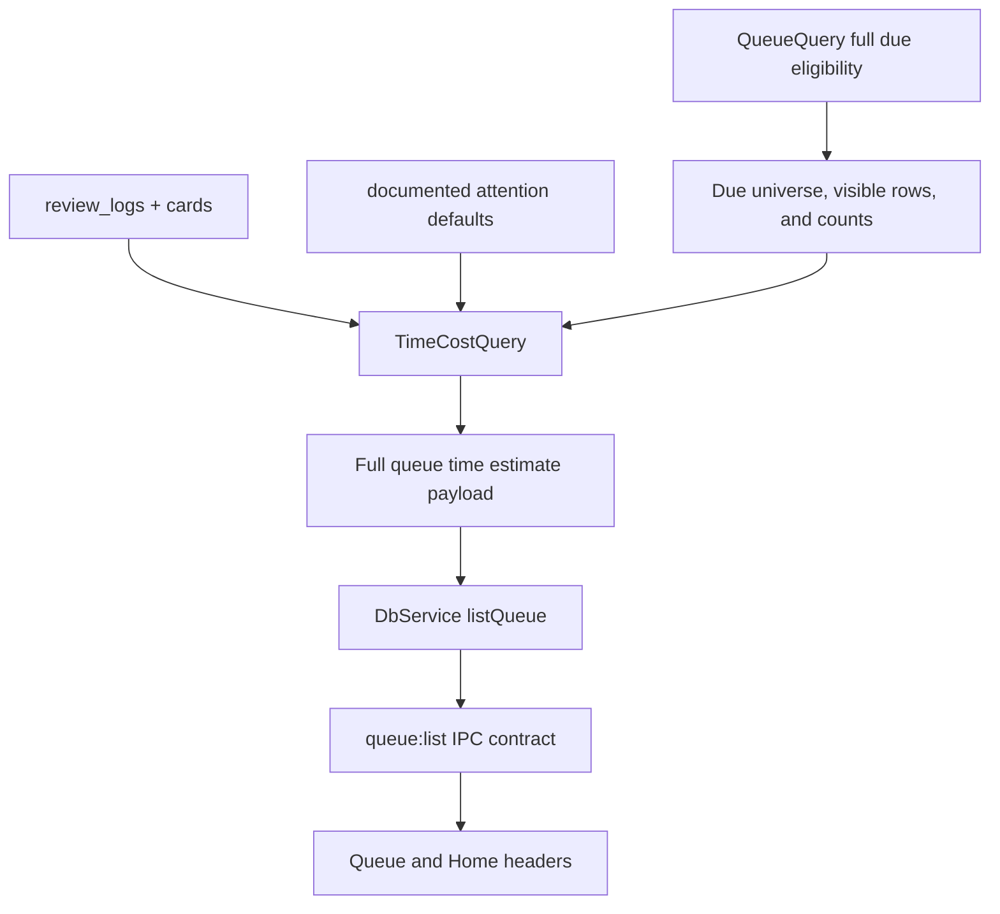

# feat: T115 per-item time-cost model

## Summary

Add a trusted-side `TimeCostQuery` that prices due queue work in minutes from durable review facts and documented attention-item defaults, flags default-priced estimates, and feeds the Queue/Home estimate labels through the existing typed bridge. The first slice keeps daily budget enforcement item-count based; T116 owns minute-denominated budgets and planner trimming.

---

## Problem Frame

T115 starts M24's overload work by replacing the Queue and Home "2 min/item" guess with a read model. The app already records card review timings in `review_logs`; source/extract processing time is not yet captured as durable telemetry, so this slice must label those rows as default-priced unless a concrete per-item signal is already persisted. The missing piece is a stable per-item estimate that downstream budget, gauge, and planner features can trust without React aggregating raw persistence facts.

---

## Requirements

**Read model**

- R1. Compute minutes for queue-actionable work only, using the same due queue eligibility that powers `QueueQuery`; the aggregate estimate must cover the full filtered due set, not only the capped list of returned rows.
- R2. Price cards from the median of the most recent 50 valid captured review timings per timing bucket, using `prompt_ms + response_ms` when prompt timing exists and `response_ms` otherwise.
- R3. Price attention items from documented coarse defaults in T115. They may only become learned if an existing persisted signal captures actual elapsed attention work for the same estimator; source progress, media duration, and source-yield review time are not sufficient.
- R4. Every estimate carries confidence at the component and aggregate level: `learned` when the component has at least 3 valid observations in its bucket, `default` otherwise. Aggregate confidence is `learned` only when all priced components are learned, otherwise `default`.

**Typed surface and UI**

- R5. Expose the estimates through a narrow validated desktop bridge; do not expose raw SQL, raw review logs, or filesystem paths to the renderer.
- R6. Rewire Queue and Home header estimates to this model and label the aggregate with `~` when any visible component is default-priced.
- R7. Preserve the existing item-count daily budget gauge and auto-postpone behavior until T116 changes the budget unit.

**Verification**

- R8. Cover medians, fallback defaults, queue aggregation, typed IPC/appApi wiring, and UI default-label rendering with focused tests.

---

## Key Technical Decisions

- **KTD1. Read model lives in `packages/local-db`:** `TimeCostQuery` should sit beside `QueueQuery`, `SourceYieldQuery`, and `PriorityIntegrityQuery` because pricing spans multiple durable tables and must remain read-only behind Electron IPC.
- **KTD2. Queue estimate composes from canonical queue eligibility:** The first consumer should price the same full filtered due universe that `QueueQuery.list` uses for counts, while optionally returning per-row estimates for the capped visible list. This avoids terminal/retired/suspended drift and prevents deep overload days from being under-priced.
- **KTD3. Median over mean for learned timings:** T115 explicitly calls out outlier discipline, and `review_logs` can include abandoned or distracted reviews. Median keeps one long session from poisoning a card type.
- **KTD4. Use defaults honestly, not invisibly:** Defaults are acceptable at cold start, but the payload must carry `default` confidence so UI can render approximate copy and T116 can distinguish known cost from guessed cost.
- **KTD5. Do not mutate settings or planners in T115:** The budget remains item-denominated and the overload planner remains count-based. T115 supplies the pricing primitive; T116 changes enforcement semantics.

---

## Estimator Constants

- **Timing buckets:** `qa`, `cloze`, `image_occlusion`, and `audio`. A card with `media_ref` uses the `audio` bucket regardless of base card kind; if the `audio` bucket lacks enough observations, it falls back to the base kind bucket, then the documented default for that base kind.
- **Valid card timings:** include rows with a positive total timing of at least 250 ms and at most 10 minutes. Total timing is `response_ms` plus `prompt_ms` when present; null `prompt_ms` means unknown prompt time, not captured zero.
- **Rolling window:** use the most recent 50 valid observations per timing bucket, sorted by review timestamp descending before taking the median.
- **Learned threshold:** a timing bucket is learned at 3 valid observations.
- **Card defaults:** Q&A 2 minutes, cloze 1 minute, image occlusion 2 minutes. Audio cards use learned audio timing when enough observations exist, then fall back to the underlying card kind default.
- **Attention defaults:** source 10 minutes, extract 6 minutes, atomic statement 4 minutes, topic 8 minutes, task 5 minutes, synthesis 10 minutes, media fragment 5 minutes, fallback attention row 6 minutes. All attention defaults remain `default` confidence in T115.

---

## High-Level Technical Design

The pricing path remains read-only. `QueueQuery` owns queue membership and ordering; `TimeCostQuery` owns pricing the full filtered due universe used for queue counts, plus visible-row estimates only where helpful for returned items.

---

## Implementation Units

### U1. Add `TimeCostQuery` read model

- **Goal:** Create a read-only local-db query that can estimate minutes for a supplied queue item set and expose reusable per-row and aggregate shapes.
- **Requirements:** R1, R2, R3, R4.
- **Dependencies:** none.
- **Files:**
  - Create `packages/local-db/src/time-cost-query.ts`
  - Modify `packages/local-db/src/index.ts`
  - Test `packages/local-db/src/time-cost-query.test.ts`
- **Approach:** Define a small output shape with `totalMinutes`, `pricedItemCount`, aggregate `confidence`, and optional per-visible-row `items` containing `estimatedMinutes`, `confidence`, and `basis`. Build card medians from grouped `review_logs` joined through `cards.kind` and `media_ref`; compute total review time as `prompt_ms + response_ms` when prompt timing exists and `response_ms` otherwise; filter invalid timings using the estimator constants. For attention rows, use the documented defaults by element type/stage and keep confidence `default` in T115. Do not create analytics tables or new telemetry writes.
- **Patterns to follow:** `packages/local-db/src/source-yield-query.ts`, `packages/local-db/src/priority-integrity-query.ts`, `docs/solutions/architecture-patterns/review-analytics-data-capture-in-review-logs.md`, `docs/solutions/architecture-patterns/priority-integrity-read-model.md`.
- **Test scenarios:**
  - Happy path: seeded Q&A, cloze, image occlusion, and audio cards with multiple `review_logs` produce bucket median estimates and an aggregate total.
  - Edge case: one extreme review time does not change the median beyond the sorted middle value.
  - Edge case: old rows with null `prompt_ms` still use `response_ms`; rows with null/invalid timing do not count as learned observations.
  - Default path: thin history returns documented defaults with `confidence: "default"` and full due-set `pricedItemCount`.
  - Integration: pricing a mixed queue only includes rows supplied by the queue read and appends no `operation_log` rows.
- **Verification:** The query returns deterministic estimates for a seeded mixed queue, flags thin history, and performs no mutation.

### U2. Thread estimates through Queue IPC and renderer API

- **Goal:** Add the full due-set time-cost aggregate to `queue.list` so the existing Queue/Home reads get estimate data without a new renderer data fetch.
- **Requirements:** R5, R7, R8.
- **Dependencies:** U1.
- **Files:**
  - Modify `packages/local-db/src/queue-query.ts`
  - Modify `apps/desktop/src/main/db-service.ts`
  - Modify `apps/desktop/src/shared/contract.ts`
  - Modify `apps/desktop/src/shared/contract.test.ts`
  - Modify `apps/desktop/src/main/db-service.test.ts`
  - Modify `apps/desktop/src/preload/index.test.ts`
  - Modify `apps/web/src/lib/appApi.ts`
  - Modify `apps/web/src/lib/appApi.test.ts`
- **Approach:** Extend `QueueListData` / `QueueListResult` with a `timeEstimate` object rather than adding another IPC channel. `DbService.listQueue` should compose `QueueQuery` and `TimeCostQuery` over the full due queue universe used by `counts.all`, while preserving optional per-visible-row estimates for returned rows if needed. Keep `budget` unchanged as `{ used, target }` items. Validate the new shape in TypeScript types and tests; the IPC request schema remains unchanged.
- **Patterns to follow:** The `analyticsPriorityIntegrity` bridge for typed read models and the existing `queue:list` contract.
- **Test scenarios:**
  - Happy path: `DbService.listQueue` returns existing items/counts/budget plus aggregate minutes.
  - Contract: `QueueListResult` accepts the new nested estimate shape and existing `QueueListRequestSchema` behavior remains unchanged.
  - Compatibility: preload still invokes `queue:list` with the same request payload.
  - App API: renderer wrapper types include `timeEstimate` without requiring callers to issue a second read.
- **Verification:** The bridge remains narrow and read-only, with no new generic query or filesystem capability.

### U3. Rewire Queue and Home estimate UI

- **Goal:** Replace heuristic `est. N min` copy with backend-derived minutes and approximate labeling.
- **Requirements:** R6, R7, R8.
- **Dependencies:** U2.
- **Files:**
  - Modify `apps/web/src/pages/queue/QueueScreen.tsx`
  - Modify `apps/web/src/pages/queue/QueueScreen.test.tsx`
  - Modify `apps/web/src/pages/home/HomeScreen.tsx`
  - Modify `apps/web/src/pages/home/HomeScreen.test.tsx`
  - Test `apps/web/src/components/queue/BudgetMeter.test.tsx` only if needed to prove the gauge remains item-count based
- **Approach:** Keep the BudgetMeter item-count bar intact for T116. Replace only the header/subtitle estimated-minutes text with `timeEstimate.totalMinutes`, prefixing `~` or equivalent compact approximation text when aggregate confidence is `default`. The visible text should have an accessible label such as “About 25 minutes; some estimates use defaults.” The label scope is the same full due queue represented by the subtitle count and `counts.all`; search/filter controls do not recompute the header estimate in T115. During loading, queue-read error, missing queue data, empty due queue, inbox-only, and resume-source states, do not fall back to the old `2 min/item` heuristic. Do not mix inbox-only fallback or resume-source routing into queue minutes.
- **Patterns to follow:** `apps/web/src/pages/home/HomeScreen.tsx` stale-response guarded queue read, `apps/web/src/pages/queue/QueueScreen.tsx` read-only queue orchestration, `docs/solutions/ui-bugs/daily-work-read-model-inbox-only-routing.md`.
- **Test scenarios:**
  - Happy path: Queue renders the backend total minutes instead of the old `2 * item` heuristic.
  - Default path: Queue/Home render approximate labeling and accessible text when any component is default-priced.
  - State path: loading/error/missing-data/empty/fallback states do not invent estimated minutes.
  - Regression: BudgetMeter still renders item `used / target today`.
  - Fallback routing: inbox-only and resume-source empty states do not invent queue minutes.
- **Verification:** Queue and Home present the same backend-derived estimate and retain existing item-count overload behavior.

### U4. Update task documentation and focused E2E coverage

- **Goal:** Record the completed roadmap/task status and add an end-to-end assertion for the user-visible estimate.
- **Requirements:** R8.
- **Dependencies:** U1, U2, U3.
- **Files:**
  - Modify `docs/roadmap.md`
  - Modify `docs/tasks/M24-ambient-overload.md`
  - Test `tests/electron/queue.spec.ts` or `tests/electron/scale-smoke.spec.ts`
- **Approach:** Add a narrow Electron assertion to an existing queue/home flow that proves a seeded queue displays minute estimates from the bridge and survives restart where the existing spec already owns persistence setup. Update docs only after verification, including the final commit reference.
- **Patterns to follow:** Recent roadmap completion notes for T111-T114 and `tests/AGENTS.md`.
- **Test scenarios:**
  - E2E: a seeded due queue displays an estimated minute label from `queue.list`.
  - Persistence: after restart, the estimate still derives from durable review logs/source facts rather than renderer state.
- **Verification:** The standard gates pass, plus the relevant Electron spec.

---

## Scope Boundaries

- T115 does not introduce `dailyBudgetMinutes`, settings migration, or minute-based auto-postpone; T116 owns those changes.
- T115 does not add new time-tracking mutation events. It consumes durable facts already captured by review logs and any existing per-item attention signals, and otherwise marks attention rows as default-priced.
- T115 does not price Inbox triage, parked resurfacing, or resume-source fallback states as due queue minutes.

---

## System-Wide Impact

This change adds a shared pricing primitive for M24 and later flow-control work. It affects Queue and Home display semantics immediately, but keeps scheduling and overload commands behaviorally unchanged until later tasks consume the estimate for enforcement.

---

## Risks & Dependencies

- **Sparse history:** New users and attention-heavy queues will see default-priced estimates. The UI must label this without making the app feel broken.
- **Historical timing semantics:** Old review rows may not have `prompt_ms`; the query must treat missing prompt time as unknown rather than captured zero.
- **Performance:** Queue reads already optimize large due sets. Pricing must reuse the surfaced queue rows and grouped timing reads rather than reintroducing N+1 work.
- **Copy drift:** Help text still describes item-count budgets. T116 will revise full budget language; T115 should only adjust visible estimate labels it directly changes.

---

## Sources & Research

- `docs/tasks/M24-ambient-overload.md` defines T115 and the M24 order.
- `packages/local-db/src/queue-query.ts` owns due queue membership, counts, and budget payloads.
- `packages/local-db/src/source-yield-query.ts` documents existing durable source progress and review-time rollups.
- `apps/web/src/pages/home/HomeScreen.tsx` currently computes the heuristic estimate.
- `docs/solutions/architecture-patterns/review-analytics-data-capture-in-review-logs.md` requires durable review timing facts to live on `review_logs`.
- `docs/solutions/architecture-patterns/priority-integrity-read-model.md` and `docs/solutions/architecture-patterns/review-activity-heatmap-read-model.md` establish the trusted read-model and typed IPC pattern.
- `docs/solutions/logic-errors/queue-eligibility-inventory-scheduler-state.md` requires queue actionability to remain backend-canonical.
