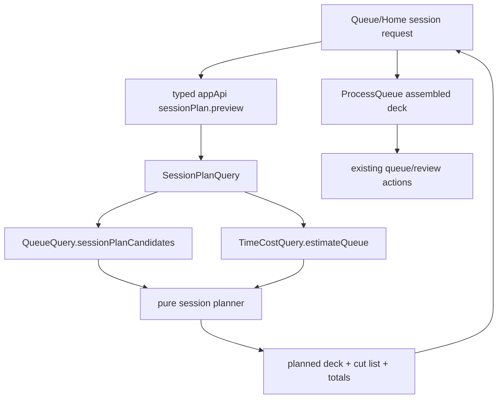

# feat: T118 session assembly

## Summary

Add a minutes-sized session assembly path that plans due work from the canonical queue, prices it with the T115 time-cost read model, previews what fits and what does not, then runs the accepted deck through the existing Process Queue loop. The feature is read-only until the user starts processing; excluded work is not postponed, rescheduled, or otherwise mutated.

---

## Problem Frame

T116 made daily overload minute-denominated, but the positive action is still coarse: "Start session" opens the full due deck. T118 lets the user say "I have 25 minutes" and receive a priced, priority-ordered due-work plan with an honest cut list. The plan must preserve the local-first trust boundary: queue membership, pricing, and protection semantics stay in trusted code behind typed IPC, while React previews and executes the returned plan.

---

## Requirements

**Session planning**

- R1. A caller can request a session plan for a finite integer target minute budget, optional queue filters, optional mode bias, and an optional read clock for read membership. A renderer-supplied historical read clock never drives trusted current-day standing materialization.
- R2. The plan fills from the canonical due queue in T076 score order and uses T115 per-item estimates to stop at the requested minute envelope without exceeding it when avoidable.
- R3. The response includes all planned items, bounded detailed cut items, total planned minutes, aggregate cut minutes/counts, estimate confidence, and plain cut reasons.
- R4. The plan is read-only: generating or rejecting a plan never writes `operation_log`, changes due dates, changes review state, or changes element status. Existing trusted current-day standing materialization may run before current-day queue/session reads exactly as it does for `queue.list`; that convergence write is not caused by session assembly and never uses renderer-supplied historical clocks.

**Protection and future quota compatibility**

- R5. Session assembly respects current protection rules by keeping protected or fragile work eligible for inclusion rather than using auto-postpone victim logic.
- R6. Before T119 exists, quota handling is an inert extension seam with explicit tests proving score-order behavior remains unchanged. No user-visible quota-reserved cut reason ships in T118.

**User flow**

- R8. Queue and Home expose a "Start a session" path with presets and free-minute entry, show a preview, and only start the Process Queue loop after confirmation.
- R9. The Process Queue route can load an accepted assembled plan instead of the full queue, keeps its existing one-item-at-a-time actions, locks or hides mode-changing controls that would re-query the queue, and shows an end summary comparing planned minutes with completed work count, completed estimated minutes, and route-local elapsed minutes.
- R10. The UI states what was left out and why, including approximate/default-estimate copy when pricing confidence is not fully learned, plus end-state actions to return to Queue/Home, adjust/start another session from remaining work, inspect left-out work, or close the flow.

**Contracts and verification**

- R11. The renderer reaches session assembly only through the typed desktop bridge; no renderer code reconstructs queue eligibility, pricing, or protection rules.
- R12. The feature has unit coverage for fill math and cut-list honesty, IPC/contract coverage for the new surface, renderer coverage for preview/start/summary, and Electron coverage for a 25-minute mixed fixture.

---

## Key Technical Decisions

- **Session assembly is a dedicated read model:** Add a session-plan API instead of overloading `queue.list`, because `queue.list` is display-oriented and may cap visible card summaries while session planning needs a full filtered due universe.
- **Planning extends queue and time-cost precedents:** Compose `QueueQuery.autoPostponeCandidates()` with `TimeCostQuery.estimateQueue()` so membership, filters, mode, and minute pricing match T116 without duplicating queue semantics.
- **Selection is positive-space composition, not victim selection:** Reuse T076 score order for what enters the session; do not use auto-postpone's low-value victim ordering, because session assembly chooses valuable work to do rather than work to sacrifice.
- **T119 is an inert seam, not a score change:** Keep quota handling as a future composition point layered over scored candidates. Before T119 ships, it must not reserve capacity, change score-order filling, or emit future quota cut reasons.
- **ProcessQueue owns execution:** Confirmation stores the exact accepted ordered deck in short-lived renderer memory and navigates to ProcessQueue assembled mode. ProcessQueue consumes that frozen deck and continues to use existing `queue.act`, `review.card`, and `review.grade` mutation paths. A refresh or direct assembled URL without accepted state returns to preview/Queue with a recoverable message instead of silently re-planning.

---

## High-Level Technical Design

The design keeps planning read-only. The only mutations occur later through the existing Process Queue action paths when the user processes an item.

---

## Scope Boundaries

- Session assembly selects only due queue-eligible work. It does not pull inbox-only sources, unscheduled active sources, or parked resurfacing work into `/process`.
- The plan does not implement T119 protected distillation quota behavior; it creates only an inert extension seam for that future policy.
- The plan does not persist actual elapsed attention-work telemetry. End summaries can compare planned estimates with completed estimated minutes, while future tuning owns real elapsed capture.
- The plan does not change auto-postpone, catch-up, vacation, or workload simulation semantics.
- The plan does not make weekly-review system tasks processable. Session-plan candidates use the backend-owned ProcessQueue-processable universe, which excludes `weekly_review` unless a later task explicitly supports it.

---

## Implementation Units

### U1. Pure session planner

- **Goal:** Add deterministic fill and cut-list logic independent of React, Electron, SQLite, and IPC.
- **Requirements:** R2, R3, R5, R6
- **Dependencies:** none
- **Files:**
  - Create `packages/scheduler/src/session-plan.ts`
  - Create `packages/scheduler/src/session-plan.test.ts`
  - Modify `packages/scheduler/src/index.ts`
- **Approach:** Accept already-scored candidates with estimated minutes and protection metadata, then fill in order until the next item would exceed the target. Include an oversized-first-item rule for positive targets so a small target can still produce one useful item with an honest over-target flag instead of an empty plan. Return only T118-owned cut reasons such as `did_not_fit`; the future T119 seam defaults to no reservation and emits no future-policy reason.
- **Patterns to follow:** `packages/scheduler/src/auto-postpone.ts`, `packages/scheduler/src/queue-score.ts`
- **Test scenarios:**
  - Happy path: a 25-minute target over candidates priced 10, 8, 6, and 4 minutes returns the first three items and cuts the 4-minute row with minutes.
  - Edge case: a 5-minute target with a first 10-minute protected item includes that item and marks the plan over target rather than returning an empty deck.
  - Edge case: zero target returns no planned items and cuts all candidates; negative and non-finite targets are rejected at the IPC boundary.
  - Error path: malformed, missing, zero, or negative item estimates are treated as non-fitting fallback values rather than producing `NaN` totals.
  - Future-compatibility: an omitted quota config behaves identically to raw score-order filling.
- **Verification:** Planner output is deterministic, never mutates inputs, and preserves candidate order in planned and cut lists.

### U2. Trusted session-plan read model

- **Goal:** Compose queue membership and time-cost pricing into a read-only session-plan query behind local-db.
- **Requirements:** R1, R2, R3, R4, R10, R11
- **Dependencies:** U1
- **Files:**
  - Create `packages/local-db/src/session-plan-query.ts`
  - Create `packages/local-db/src/session-plan-query.test.ts`
  - Modify `packages/local-db/src/index.ts`
  - Modify `packages/local-db/src/queue-query.ts` only if a small shared helper is needed
- **Approach:** Add a backend-owned `QueueQuery.sessionPlanCandidates({ asOf, filters, mode })` or equivalent helper that explicitly returns the full due, queue-eligible, ProcessQueue-processable universe in T076 score order. It may share internals with `autoPostponeCandidates`, but it must not inherit victim selection semantics and must exclude system-owned `weekly_review` tasks. Price candidate rows via `TimeCostQuery.estimateQueue()` or an equivalent T115 path, then pass enriched candidates into the pure planner. Return queue row summaries for all planned items, a capped detailed cut list, aggregate cut summaries, estimate confidence, and a flag when any plan item uses default pricing.
- **Patterns to follow:** `packages/local-db/src/time-cost-query.ts`, `packages/local-db/src/auto-postpone-service.ts`, `packages/local-db/src/queue-query.ts`
- **Test scenarios:**
  - Happy path: seeded mixed cards and attention items produce a plan ordered by the existing queue score and priced by T115 estimates.
  - Edge case: display `limit` does not affect session planning; the read model uses the full filtered due universe.
  - Edge case: type, status, concept, tag, mode, and `asOf` inputs produce the same membership as queue candidate reads.
  - Edge case: protected/fragile work remains eligible, while `weekly_review` system tasks are excluded as unprocessable.
  - Error path: default-priced attention rows propagate aggregate `default` confidence and per-item basis text.
  - Integration: calling the read model leaves `operation_log` row count and due/review state unchanged.
- **Verification:** The service returns stable JSON-serializable data and has no transaction or mutation path.

### U3. Desktop IPC and renderer API surface

- **Goal:** Expose session-plan preview through the existing typed desktop bridge.
- **Requirements:** R1, R3, R11, R12
- **Dependencies:** U2
- **Files:**
  - Modify `apps/desktop/src/shared/channels.ts`
  - Modify `apps/desktop/src/shared/contract.ts`
  - Modify `apps/desktop/src/main/db-service.ts`
  - Modify `apps/desktop/src/main/ipc.ts`
  - Modify `apps/desktop/src/preload/index.ts`
  - Modify `apps/desktop/src/preload/index.test.ts`
  - Modify `apps/desktop/src/shared/contract.test.ts`
  - Modify `apps/desktop/src/main/db-service.test.ts`
  - Modify `apps/web/src/lib/appApi.ts`
- **Approach:** Add `queue.sessionPlan` or an equivalent queue-scoped command with Zod validation for `targetMinutes`, filters, mode, and optional read-only `asOf`. Accept zero as an empty-plan request, reject negative, non-integer, non-finite, and out-of-range targets, and keep the command read-only. Let trusted current-day standing materialization run where existing queue reads already do so, but prove historical renderer `asOf` values do not create historical materialization markers. Mirror response types into `apps/web/src/lib/appApi.ts` without exposing local-db internals.
- **Patterns to follow:** `queue.list`, `queue.autoPostpone`, `dailyWork.summary`
- **Test scenarios:**
  - Contract: invalid targets, invalid mode values, and invalid filter values are rejected at the boundary; zero target is accepted and returns an empty plan.
  - Preload: renderer call invokes the new IPC channel with the request payload.
  - DbService: result includes planned and cut sections for a mixed fixture.
  - DbService: a historical `asOf` read can affect membership but never drives trusted current-day standing materialization.
  - Bridge parity: `apps/web/src/lib/appApi.ts` exports the same request and result shape as the desktop contract.
- **Verification:** No generic DB or filesystem channel is added, and the renderer can only request validated session plans.

### U4. Preview and ProcessQueue execution flow

- **Goal:** Add the user-facing "Start a session" flow and run accepted plans through the existing loop.
- **Requirements:** R8, R9, R10, R12
- **Dependencies:** U3
- **Files:**
  - Modify `apps/web/src/pages/queue/QueueScreen.tsx`
  - Modify `apps/web/src/pages/queue/QueueScreen.test.tsx`
  - Modify `apps/web/src/pages/home/HomeScreen.tsx`
  - Modify `apps/web/src/pages/home/HomeScreen.test.tsx`
  - Modify `apps/web/src/pages/queue/ProcessQueue.tsx`
  - Modify `apps/web/src/pages/queue/ProcessQueue.test.tsx`
  - Modify `apps/web/src/pages/queue/process-queue.css`
  - Modify `apps/web/src/lib/queueTimeEstimate.ts` if formatting helpers need reuse
- **Approach:** Add preset controls and free-minute entry near the existing Start Session affordance. The preview calls the session-plan API, shows planned/cut minutes and estimate confidence, and starts `/process` in assembled mode only after confirmation. ProcessQueue loads the plan for the chosen target and mode, freezes that returned deck, keeps current item actions unchanged, and shows a done-state summary with planned minutes, completed count, completed estimated minutes, and left-out count.
- **Preview state matrix:** Cover initial/editing target, loading, invalid/blank input, valid preview, no due work, no fitting work, positive-target oversized-first-item, approximate/default estimates, API error/retry, and confirmation in progress. Each state must define clear primary/secondary actions and whether navigation is allowed.
- **Accessibility:** Presets and free-minute input are keyboard reachable with visible focus states. Loading, error, and summary changes use appropriate status/live regions. The preview moves focus after load/error/start transitions, gives planned and cut lists semantic structure, and gives controls accessible names.
- **Plan transport:** Store exact accepted plan state in a small renderer module, including ordered planned items, target, mode, planned/cut totals, confidence, origin, and bounded cut summary. ProcessQueue assembled mode consumes that state; mode controls are disabled/hidden with an Adjust Session action returning to preview instead of re-querying.
- **End summary actions:** Done state shows planned minutes, completed estimated minutes, elapsed route-local minutes, completed item count, and left-out count, then offers return to origin, adjust/start another session from remaining work, inspect left-out work, or close.
- **Patterns to follow:** `apps/web/src/pages/queue/OverloadBanner.tsx`, `apps/web/src/components/queue/BudgetMeter.tsx`, `apps/web/src/pages/queue/ProcessQueue.tsx`, `docs/solutions/ui-bugs/process-queue-inline-session-controls.md`
- **Test scenarios:**
  - Happy path: Queue preview for 25 minutes shows planned and left-out work, then starts `/process` with the returned planned deck.
  - Happy path: Home start-session flow uses the same preview and honors the current due-work recommendation.
  - Edge case: zero-load or no-fitting-plan states route to existing no-work messaging without treating inbox-only work as processable.
  - Error path: a failed preview call shows a recoverable error and does not navigate.
  - Integration: ProcessQueue actions still call existing queue/review mutation APIs and advance through the frozen deck.
  - Integration: assembled mode does not allow mode controls to silently re-request the queue.
- **Verification:** Renderer tests prove no queue membership or pricing is recomputed in React; UI copy labels default estimates as approximate.

### U5. Electron coverage, docs, and roadmap updates

- **Goal:** Prove the end-to-end flow and record task completion in the control docs.
- **Requirements:** R12
- **Dependencies:** U4
- **Files:**
  - Modify or create `tests/electron/process-queue.spec.ts`
  - Modify `docs/tasks/M24-ambient-overload.md`
  - Modify `docs/roadmap.md`
  - Modify `docs/scheduling-and-priority.md` if the shipped behavior changes the documented session/budget compatibility note
- **Approach:** Add a deterministic mixed due fixture for a 25-minute session, drive the native app through preview, start, item processing, and done summary, then assert left-out work is still due after the session read. Include a bounded-payload/scale assertion for deep overload: detailed cut rows are capped while aggregate cut count/minutes remain honest. Update the task spec and roadmap only after the verified implementation lands.
- **Patterns to follow:** `tests/electron/process-queue.spec.ts`, `tests/electron/auto-postpone.spec.ts`, `docs/tasks/M24-ambient-overload.md`
- **Test scenarios:**
  - E2E: a 25-minute mixed fixture previews a subset, starts the Process Queue loop, processes the planned deck, and shows planned-vs-completed summary.
  - E2E: left-out items remain in queue after the assembled session because assembly itself did not reschedule them.
  - Documentation: roadmap and task spec name the verification commands and downstream note for T119.
- **Verification:** Root `pnpm lint`, `pnpm typecheck`, `pnpm test`, and relevant Electron E2E pass.

---

## System-Wide Impact

This change introduces a new trusted read surface but no new durable schema and no new mutation path. It touches scheduler planning, local-db read composition, IPC contracts, renderer session UI, and Electron workflow coverage. The main risk is semantic drift between `queue.list`, auto-postpone candidates, and session-plan candidates; U2 keeps those paths composed through the same queue query rather than copying predicates.

---

## Risks & Dependencies

- **Risk: session planning becomes a second scheduler.** Mitigation: consume only currently due queue candidates and keep excluded work unchanged.
- **Risk: full due-universe planning is expensive in deep overload.** Mitigation: mirror the auto-postpone full-candidate path and add focused performance assertions where existing scale fixtures make that practical.
- **Risk: plan transport encodes long item lists in route search.** Mitigation: store the accepted plan in short-lived renderer memory and recover to preview if that state is unavailable.
- **Risk: deep overload creates unbounded IPC payloads.** Mitigation: return all planned rows but cap detailed cut rows to a named limit, while preserving aggregate cut totals and counts.
- **Dependency: T119 quota is absent.** Mitigation: include an inert seam and tests, but leave quota behavior and quota-specific copy to T119.

---

## Acceptance Examples

- AE1. Given a due queue containing 10, 8, 6, and 4 minute rows in score order, when the user requests a 25-minute session, then the preview plans the 10, 8, and 6 minute rows and reports the 4 minute row as left out.
- AE2. Given a due queue where all estimates are defaults, when the user previews a session, then the preview and ProcessQueue summary use approximate minute language.
- AE3. Given an assembled session with left-out items, when the user processes every planned item, then the summary reports planned versus completed estimated minutes and the left-out items remain due.
- AE4. Given a current-day automatic overload policy, when a session plan is requested from a trusted current queue read, then standing materialization behavior remains consistent with existing queue reads and does not run from a renderer-supplied historical clock.

---

## Sources & Research

- `docs/tasks/M24-ambient-overload.md` defines T118 scope, dependencies, and done criteria.
- `docs/solutions/architecture-patterns/queue-time-cost-read-model.md` and `docs/solutions/architecture-patterns/minute-denominated-overload-budget.md` establish full due-universe minute pricing behind typed IPC.
- `docs/solutions/logic-errors/queue-eligibility-inventory-scheduler-state.md` establishes backend-owned queue eligibility and the danger of renderer-derived due state.
- `docs/solutions/architecture-patterns/standing-auto-postpone-trusted-current-day-materialization.md` governs current-day trusted materialization for queue-facing reads.
- `docs/solutions/ui-bugs/process-queue-inline-session-controls.md` gives UI placement guidance for ProcessQueue session controls.

---

## Completion Note

Implemented in this change. The shipped scope includes pure scheduler fill math, a full due-universe
`SessionPlanQuery`, typed `queue.sessionPlan` IPC/preload/app API wiring, Queue/Home preview UI,
short-lived accepted-plan handoff, assembled ProcessQueue mode with locked mode controls and end
summary, trusted `protectedOnly` filtering for the High priority queue view, and Electron coverage
for a 25-minute assembled session that previews, starts, runs, and summarizes. T119 quota behavior
remains downstream and emits no user-visible cut reason in T118.
