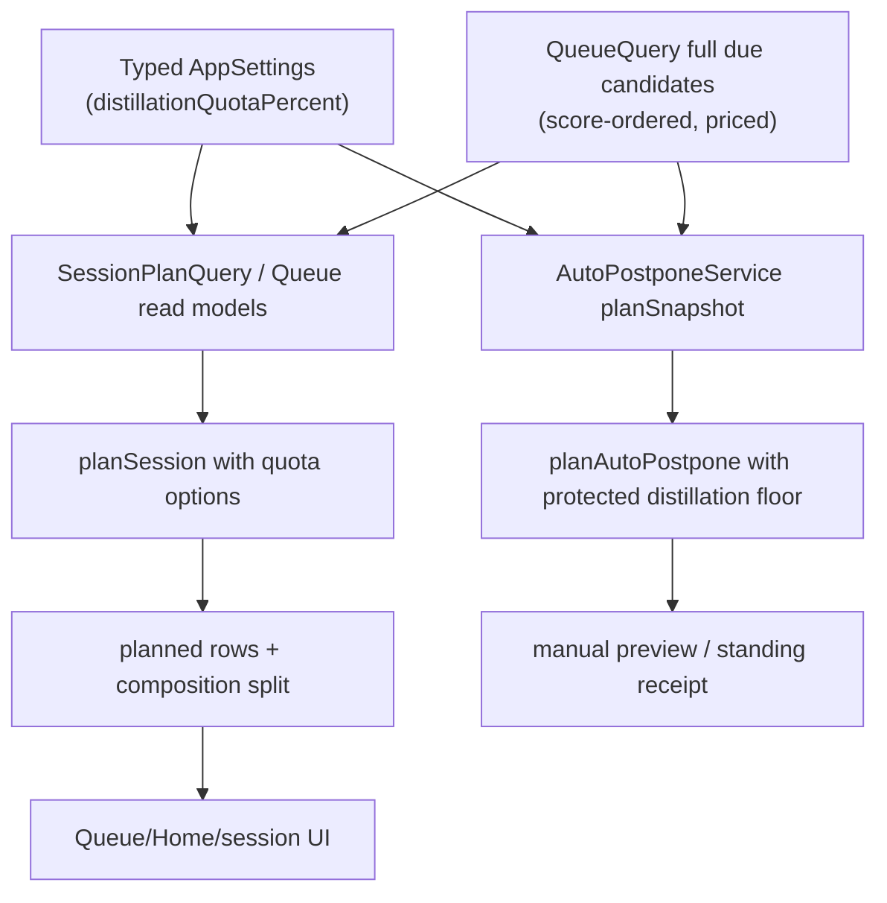

# feat: T119 protected distillation quota

## Summary

T119 adds a configurable, minute-denominated distillation floor so due extract work cannot disappear under card pressure. The quota composes over existing queue score order, stays backend-owned behind typed IPC, and protects enough due extract work from manual and standing auto-postpone trimming while giving unused quota back to cards.

---

## Problem Frame

M24 made overload honest in minutes and T118 added bounded session assembly, but the positive fill path still follows pure score order and the overload relief path still sacrifices low-priority attention work first. That means the extract pipeline can starve exactly when the user is busiest. The T119 scope from `docs/tasks/M25-flow-control.md` requires day/session composition to visibly reserve a small share for due extract/statement processing without changing due dates or queue scoring.

---

## Requirements

**Quota behavior**

- R1. The app exposes a typed distillation quota setting, defaulting to 15 percent of the active minute target and capped by that target.
- R2. Quota composition treats due extract rows at `raw_extract`, `clean_extract`, or `atomic_statement` stages as distillation work.
- R3. Explicit queue/session filters constrain the quota candidate universe; if filters exclude distillation work, the quota reports inactive instead of smuggling other rows into the plan.
- R4. Empty distillation backlog gives the reserved share back to the normal card/attention fill path.
- R5. Within the distillation share, candidates keep the existing T076 score order; the quota must not mutate `queueItemScore` weights.
- R6. A positive target may include one oversized first distillation item, matching existing session assembly behavior for useful oversized first work.

**Trim protection**

- R7. Manual auto-postpone and standing auto-postpone preserve due distillation rows up to the active quota floor before selecting low-priority attention victims.
- R8. Distillation rows above the protected floor remain eligible for normal auto-postpone victim rules when overload cannot otherwise be relieved.
- R9. Standing automatic policy remains once-per-trusted-local-day; same-day quota or budget changes affect future manual previews and future days, not a second automatic materialization.
- R9a. Auto-postpone satisfies the invariant `remainingDueDistillationMinutesAfter >= quotaFloorMinutes` whenever enough due distillation minutes exist; naturally ineligible distillation rows count toward that floor before additional eligible rows are shielded.

**Visibility and trust boundary**

- R10. Queue, Home, and session preview surfaces show backend-computed card-vs-distillation minute splits.
- R11. The renderer receives typed composition metadata and formats it; it does not compute queue eligibility, pricing, quota fills, or victim protection from visible rows.
- R12. The change preserves existing mutation shapes: auto-postpone still writes the same `reschedule_element`/card-defer operations with batch undo and receipt evidence.

---

## Key Technical Decisions

- **KTD1. Percent setting over fixed minutes:** Store `distillationQuotaPercent` as a bounded integer setting with default `15`. A hard 10-minute minimum would exceed valid tiny budgets; a percent derives cleanly from daily budgets and session targets.
- **KTD2. Quota is composition, not scoring:** Implement bucket fill in `packages/scheduler/src/session-plan.ts` over already-scored candidates. This keeps T076's score model pure and lets local-db decide which candidates belong in the trusted due universe.
- **KTD3. Backend owns composition metadata:** Add composition totals next to queue/session read results from local-db and contract types. Queue and Home labels must use the full filtered due universe, not capped visible rows.
- **KTD4. Auto-postpone protects only the floor:** Extend the pure auto-postpone planner to skip enough distillation candidates to satisfy the quota floor, then let excess low-priority distillation work remain eligible. This prevents graveyard starvation without making all extract work permanently unsacrificable.
- **KTD5. Filters win:** A card-only session or type-filtered queue should not be surprised by quota-injected extracts. The response can report quota inactive because no distillation candidates are present after filters.
- **KTD6. No same-day automatic rerun:** Standing auto-postpone's daily marker remains authoritative for the local day. Re-running automatic policy after a setting edit risks double trimming; manual preview/apply reflects the new setting immediately.

### Quota Floor Derivation

- Session previews derive the quota floor from the requested session target.
- Queue and Home day composition derive the quota floor from `dailyBudgetMinutes`.
- Manual and standing auto-postpone use the same daily-budget floor as Queue and Home, not the 90 percent reserve target used to decide how far overload should trim.
- The derived floor is `ceil(targetMinutes * distillationQuotaPercent / 100)`, capped by `targetMinutes`; `0` percent, `0` target minutes, or no eligible post-filter distillation candidates makes the quota inactive or returned rather than injecting work.

### Quota Status Contract

| Status | Meaning | User-facing copy |
| --- | --- | --- |
| `active` | Distillation candidates exist after filters and the floor reserves minutes. | `Distillation floor active: <N> min reserved.` |
| `returned_empty_backlog` | No due distillation candidates exist in the current backend candidate set. | `Distillation share returned: no due extracts.` |
| `inactive_filtered_out` | Active filters exclude distillation candidates, such as card-only mode. | `Card filter active: distillation quota inactive.` |
| `inactive_zero_target` | The target minutes or quota percent is zero. | `Distillation floor off.` |
| `unavailable_no_time_estimate` | The caller did not request or cannot compute time estimates. | Do not render split UI; keep the primary budget display unchanged. |

Typed responses should carry this as a discriminated status plus `quotaFloorMinutes`, `eligibleDistillationMinutes`, `selectedDistillationMinutes`, and returned/protected minutes where applicable.

---

## High-Level Technical Design

The same setting feeds positive composition and overload trimming. Session assembly plans what to do; auto-postpone plans what can safely recede. Both consume full backend-priced candidate sets and return typed metadata for renderer display.

---

## Implementation Units

### U1. Add Typed Quota Setting

- **Goal:** Add `distillationQuotaPercent` to the typed settings model, validation contract, preload/app API mirrors, and Settings UI.
- **Requirements:** R1
- **Dependencies:** None
- **Files:**
  - Modify `packages/core/src/settings.ts`
  - Modify `packages/core/src/settings.test.ts`
  - Modify `apps/desktop/src/shared/contract.ts`
  - Modify `apps/desktop/src/shared/contract.test.ts`
  - Modify `apps/desktop/src/preload/index.ts`
  - Modify `apps/desktop/src/preload/index.test.ts`
  - Modify `apps/web/src/lib/appApi.ts`
  - Modify `apps/web/src/lib/appApi.test.ts`
  - Modify `apps/web/src/pages/Settings.tsx`
  - Modify `apps/web/src/pages/Settings.test.tsx`
- **Approach:** Add a bounded integer percent setting, default `15`, and project it through `RendererSettings`. Place a `SettingRow` in Review & scheduling labeled `Distillation floor`, with hint text explaining that the share is reserved for due extracts and returned when no due extract work exists. Use a numeric/range input with `min=0`, `max=100`, `step=1`, visible percent value, `0%` copy as `Off`, existing pending/error rollback behavior, and an accessible label/description. Keep settings writes non-op-logged, matching existing settings behavior.
- **Patterns to follow:** `dailyBudgetMinutes` and `overloadPolicy` in `packages/core/src/settings.ts`, `SettingsPatchSchema`, and `Settings.tsx`.
- **Test scenarios:**
  - Happy path: unset stored settings project `distillationQuotaPercent: 15`.
  - Edge case: invalid, fractional, negative, and over-100 values are rejected or coerced according to the core settings pattern.
  - Integration: `settings.updateMany` accepts the quota field and preload/app API forwards it without exposing raw storage keys.
  - UI: changing the Settings control calls `updateAppSettings` with the quota field and updates the displayed value.
- **Verification:** Typed settings tests, contract tests, preload/app API tests, and Settings renderer tests pass.

### U2. Add Pure Quota-Aware Session Composition

- **Goal:** Extend session planning so due distillation work is selected up to the quota floor before normal fill, while preserving score order inside each bucket.
- **Requirements:** R2, R3, R4, R5, R6
- **Dependencies:** U1 for setting semantics, but pure planner can be built against explicit options first.
- **Files:**
  - Modify `packages/scheduler/src/session-plan.ts`
  - Modify `packages/scheduler/src/session-plan.test.ts`
  - Modify `packages/scheduler/src/index.ts` if new helper types are exported
- **Approach:** Add quota options to `planSession`: `distillationQuotaPercent` or a derived `distillationQuotaMinutes`, plus a distillation predicate based on candidate `type` and `stage`. The planner should fill distillation items first up to the floor, remove selected IDs from the remaining candidate stream, then run the existing fill logic over the remaining score-ordered items. Return composition totals for planned and cut work.
- **Technical design:** Directionally, the planner should derive `floor = ceil(targetMinutes * quotaPercent / 100)`, cap it to `targetMinutes`, select distillation candidates in input order until floor is satisfied or the first useful oversized item is included, then fill `max(0, targetMinutes - selectedDistillationMinutes)` with non-selected candidates in original order. `overTarget` should occur only when the first selected useful item exceeds the whole positive target.
- **Shared classifier:** Export one trusted helper, for example `isDistillationQuotaCandidate({ type, stage })`, implemented from `type === "extract"` plus the scheduler's canonical extract-stage guard. Both session composition and auto-postpone protection must consume this helper.
- **Patterns to follow:** Existing `priced` fallback and oversized-first handling in `packages/scheduler/src/session-plan.ts`.
- **Test scenarios:**
  - Happy path: high-scoring cards precede two atomic statements in input order, but a 25-minute target with a 15 percent quota includes at least one atomic statement before card-only fill.
  - Edge case: no due distillation candidates yields a normal card-only plan and marks quota `returned_empty_backlog`.
  - Edge case: type filters represented by the candidate set exclude extracts, so no quota injection occurs.
  - Edge case: a positive 5-minute target with one 6-minute extract includes that extract as the oversized first useful item.
  - Edge case: a 25-minute target, 15 percent quota, and a 6-minute extract leaves 19 minutes for normal fill, not 21.
  - Classification: cards, tasks, or sources with distillation-like stage strings are not quota candidates.
  - Ordering: distillation candidates keep input score order; remaining candidates keep input score order after selected IDs are removed.
- **Verification:** Scheduler unit tests prove quota behavior without DB, React, or IPC.

### U3. Thread Quota Through SessionPlanQuery and Typed Session Results

- **Goal:** Make `queue.sessionPlan` use backend-priced full due candidates, apply the quota setting, and return composition metadata to the renderer.
- **Requirements:** R2, R3, R4, R10, R11
- **Dependencies:** U1, U2
- **Files:**
  - Modify `packages/local-db/src/session-plan-query.ts`
  - Modify `packages/local-db/src/session-plan-query.test.ts`
  - Modify `apps/desktop/src/shared/contract.ts`
  - Modify `apps/desktop/src/shared/contract.test.ts`
  - Modify `apps/desktop/src/main/db-service.ts`
  - Modify `apps/desktop/src/main/db-service.test.ts`
  - Modify `apps/desktop/src/preload/index.ts`
  - Modify `apps/desktop/src/preload/index.test.ts`
  - Modify `apps/web/src/lib/appApi.ts`
  - Modify `apps/web/src/lib/appApi.test.ts`
  - Modify `apps/web/src/pages/queue/SessionAssemblyPreview.tsx`
  - Modify `apps/web/src/pages/queue/SessionAssemblyPreview.test.tsx`
- **Approach:** Read `distillationQuotaPercent` from `SettingsRepository.getAppSettings()`, pass the derived quota options to the pure planner, and expose a compact `composition` payload with planned card minutes, planned distillation minutes, quota floor, quota status, returned quota minutes, and cut counts/minutes by group. Keep `queue.sessionPlan` read-only.
- **Patterns to follow:** T118 `SessionPlanQuery` and contract wiring; `docs/solutions/architecture-patterns/session-assembly-read-model-accepted-deck-handoff.md`.
- **Test scenarios:**
  - Happy path: a mixed fixture returns a planned deck with distillation minutes even when cards score higher.
  - Edge case: `targetMinutes = 0` returns an empty plan with no active quota.
  - Integration: historical `asOf` remains read-only and does not trigger trusted current-day materialization.
  - Contract: Zod schemas parse the new composition fields and reject invalid shapes.
  - UI: session preview renders the split, explains quota-driven aggregate outcomes such as `Reserved 4 min for distillation`, `12 min cards left out`, or `Quota inactive: no due extracts`, and still starts the accepted deck unchanged.
- **Verification:** Local-db, contract, db-service, preload, app API, and renderer session-preview tests pass.

### U4. Add Queue/Home Day Composition Visibility

- **Goal:** Surface the daily card-vs-distillation split in Queue and Home using backend-computed full due-universe metadata.
- **Requirements:** R10, R11
- **Dependencies:** U1, U2
- **Files:**
  - Modify `packages/local-db/src/queue-query.ts`
  - Modify `packages/local-db/src/queue-query.test.ts`
  - Modify `packages/local-db/src/time-cost-query.ts`
  - Modify `packages/local-db/src/time-cost-query.test.ts`
  - Modify `apps/desktop/src/shared/contract.ts`
  - Modify `apps/desktop/src/shared/contract.test.ts`
  - Modify `apps/desktop/src/main/db-service.ts`
  - Modify `apps/web/src/components/queue/BudgetMeter.tsx`
  - Modify `apps/web/src/components/queue/BudgetMeter.test.tsx`
  - Modify `apps/web/src/pages/home/HomeScreen.tsx`
  - Modify `apps/web/src/pages/home/HomeScreen.test.tsx`
  - Modify `apps/web/src/pages/queue/QueueScreen.tsx`
  - Modify `apps/web/src/pages/queue/QueueScreen.test.tsx`
- **Approach:** Add a `dayComposition` payload to queue list results when time estimates are requested. It should represent quota allocation over the daily target, not only raw backlog totals: `quotaFloorMinutes`, `protectedDistillationMinutes`, `returnedQuotaMinutes`, `cardFillMinutes`, status, and optional `backlogByGroup` for card/distillation/other-attention due minutes. Extend `TimeCostQuery` with a reusable composition projection rather than duplicating pricing logic in `QueueQuery` or deriving splits from visible rows.
- **UI contract:** Add a `composition` prop to `BudgetMeter`. Keep the primary used/target meter unchanged, add one compact split row using existing design tokens for card vs distillation groups, hide zero-value groups except when explaining inactive quota, and provide an `aria-label` that includes total budget, overage, quota state, and split.
- **Patterns to follow:** `minuteBudget` and `timeCostSummary` flow from T115/T116; `BudgetMeter` display conventions.
- **Test scenarios:**
  - Happy path: full filtered due universe with cards and extracts reports separate minute totals.
  - Edge case: limited visible rows still report composition from the full due universe.
  - Edge case: mixed backlog, empty distillation backlog, and card-only filters produce distinct quota statuses.
  - UI: Home and Queue render the split when present and omit it cleanly when time estimates are absent.
- **Verification:** Queue read-model tests and renderer tests prove visibility without React-owned queue math.

### U5. Preserve Quota Through Auto-Postpone

- **Goal:** Prevent manual and standing auto-postpone from consuming the protected distillation floor.
- **Requirements:** R7, R8, R9, R12
- **Dependencies:** U1, U2
- **Files:**
  - Modify `packages/scheduler/src/auto-postpone.ts`
  - Modify `packages/scheduler/src/auto-postpone.test.ts`
  - Modify `packages/local-db/src/auto-postpone-service.ts`
  - Modify `packages/local-db/src/auto-postpone-service.test.ts`
  - Modify `packages/local-db/src/standing-auto-postpone-service.test.ts`
  - Modify `tests/electron/auto-postpone.spec.ts`
- **Approach:** Pass quota options into `planAutoPostpone`, using the daily-budget floor rather than the reserve target. Define the invariant as `remainingDueDistillationMinutesAfter >= quotaFloorMinutes` when sufficient due distillation minutes exist. First count all due distillation rows that are naturally ineligible victims under existing rules, such as high-priority/protected rows, toward the floor; then shield additional eligible distillation rows in queue score order until the floor is met. Leave excess low-priority distillation rows in the normal victim pool. `AutoPostponeService.planSnapshot` should read the setting and pass it through so manual and standing paths share behavior.
- **Patterns to follow:** Existing pure planner plus `AutoPostponeService.planSnapshot` and standing service tests; `docs/solutions/architecture-patterns/standing-auto-postpone-trusted-current-day-materialization.md`.
- **Test scenarios:**
  - Happy path: overloaded day with eligible low-priority extracts keeps floor extracts due and trims other low-priority attention or mature-card victims.
  - Edge case: high-priority or explicitly protected distillation rows count toward the floor before extra low-priority rows are shielded.
  - Edge case: distillation minutes exceed the floor; excess low-priority extracts can still be selected when needed.
  - Edge case: no distillation candidates preserves existing auto-postpone behavior.
  - Edge case: reserve-ratio trimming still uses the daily-budget quota floor, not the 90 percent reserve target.
  - Standing path: automatic materialization uses the same protected floor and remains idempotent for the local day.
  - E2E: an overloaded mixed fixture with automatic policy opens to a visible mixed day, persists across restart, and receipt undo restores postponed rows.
- **Verification:** Scheduler, local-db, standing service, and relevant Electron auto-postpone coverage pass.

### U6. Update Documentation and Roadmap Artifacts

- **Goal:** Record the completed T119 behavior and downstream notes.
- **Requirements:** R1-R12
- **Dependencies:** U1-U5
- **Files:**
  - Modify `docs/roadmap.md`
  - Modify `docs/tasks/M25-flow-control.md`
  - Modify `docs/scheduling-and-priority.md` if shipped behavior changes budget/session documentation
  - Create or update one focused `docs/solutions/` learning during `ce-compound` only if implementation discovers a reusable lesson worth preserving
- **Approach:** After verification, mark T119 complete with commit reference and validation commands. In the task spec, check delivered T119 deliverables and note any explicit downstream effects for T120/T121.
- **Patterns to follow:** Recent T117/T118 roadmap completion entries and task spec updates.
- **Test scenarios:**
  - Test expectation: none -- documentation update only, validated by review and final git diff.
- **Verification:** Roadmap and task doc clearly state T119 completion, verification, and downstream notes.

---

## Scope Boundaries

- T119 does not create batch conversion sessions; T120 owns the dedicated conversion surface and AI pre-drafting.
- T119 does not demote aging extracts to reference; T121 owns extract aging policy and sweep receipts.
- T119 does not change source/extract due dates during positive session planning.
- T119 does not alter `queueItemScore` weights or FSRS scheduling math.
- T119 does not rerun standing automatic auto-postpone for a day that was already evaluated before a same-day setting change.

### Deferred to Follow-Up Work

- Richer cut reasons such as `quota_reserved` can be added if the UI needs item-level explanations beyond aggregate composition; aggregate metadata is enough for T119 unless implementation reveals ambiguity.

---

## Acceptance Examples

- AE1. Given a 25-minute session target, many due cards, and two due atomic statements, when the user previews a session, then at least one atomic statement appears in the planned deck and the preview shows distillation minutes.
- AE2. Given a 25-minute session target and no due distillation candidates, when the user previews a session, then the full target is available to cards and the response marks quota `returned_empty_backlog`.
- AE3. Given a card-only filter, when the user previews a session, then no distillation item is injected and the quota split shows `inactive_filtered_out`.
- AE4. Given a 60-minute overloaded day with 10 minutes of due distillation work, when manual or standing auto-postpone runs, then those protected distillation rows remain due while other safe victims move.
- AE5. Given more due distillation work than the active floor, when auto-postpone needs additional victims, then low-priority excess distillation can still recede under existing victim rules.
- AE6. Given a current-day automatic policy already evaluated, when the user changes the quota setting later that day, then no second automatic batch is created; a manual preview reflects the new setting.
- AE7. Given capped Queue/Home visible rows where due extracts are hidden below the cap, when the budget split renders, then hidden due extracts still contribute to backend composition.
- AE8. Given an invalid `distillationQuotaPercent` update or a request containing renderer-supplied composition/protection metadata, when the contract parses the request, then validation rejects it.
- AE9. Given a restart after same-day quota edit and prior standing automatic evaluation, when Home or Queue opens again, then automatic policy remains idempotent and manual preview uses the new quota.

---

## System-Wide Impact

The change touches shared settings, pure scheduler composition, queue/session read models, typed IPC contracts, renderer budget/session surfaces, and auto-postpone victim selection. It should not introduce migrations, new operation types, or new renderer persistence access. Auto-postpone mutation shape and undo should remain unchanged except for the protected victim set.

---

## Risks & Dependencies

- **Risk: implementing only session assembly would miss the roadmap requirement.** Mitigation: U5 explicitly threads quota into manual and standing auto-postpone.
- **Risk: visible queue caps undercount composition.** Mitigation: U4 computes split metadata from full backend due candidates, not rendered rows.
- **Risk: quota floor overpowers tiny budgets.** Mitigation: percent setting capped by target, with oversized-first behavior only for a useful positive target.
- **Risk: standing policy double-trims after setting edits.** Mitigation: preserve once-per-local-day marker semantics; manual preview is the immediate escape valve.
- **Dependency:** T115 minute pricing and T118 session assembly are already complete and provide the full due universe/pricing seams this plan composes.

---

## Sources & Research

- `docs/tasks/M25-flow-control.md` defines T119 scope and its non-negotiable interaction with T077/T117 trim paths.
- `packages/scheduler/src/session-plan.ts` currently owns pure score-order session fill and must grow quota composition without DB/React dependencies.
- `packages/local-db/src/session-plan-query.ts` is the trusted T118 read-model bridge from queue candidates and time-cost estimates to the pure planner.
- `packages/scheduler/src/auto-postpone.ts` currently selects low-priority attention victims first, so it must protect the quota floor.
- `packages/local-db/src/auto-postpone-service.ts` and `packages/local-db/src/standing-auto-postpone-service.ts` are the manual and automatic trim seams.
- `docs/solutions/architecture-patterns/session-assembly-read-model-accepted-deck-handoff.md`, `docs/solutions/architecture-patterns/queue-time-cost-read-model.md`, `docs/solutions/architecture-patterns/minute-denominated-overload-budget.md`, and `docs/solutions/architecture-patterns/standing-auto-postpone-trusted-current-day-materialization.md` provide prior implementation constraints.
