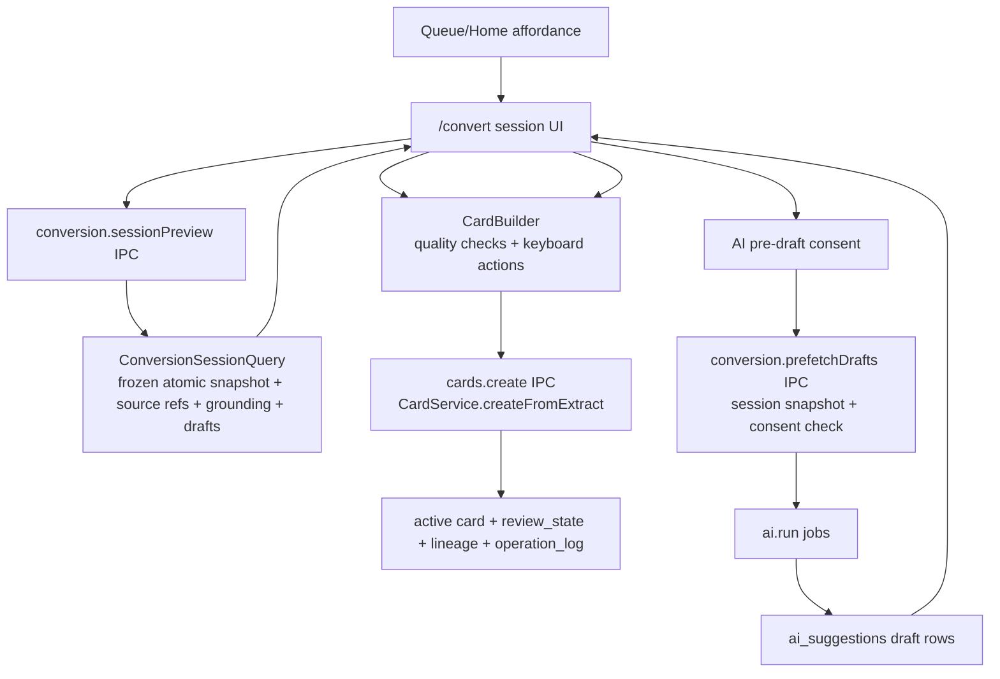

# feat: T120 batch conversion sessions

## Summary

T120 adds a keyboard-first batch conversion surface for due, card-ready atomic statements. The session is assembled by a trusted read model, card creation reuses the existing extract-to-card service path, and optional AI pre-drafting remains an explicit per-session advisory layer whose text can prefill the normal card builder but never schedules a card by itself.

---

## Problem Frame

T119 protects time for distillation, but a user still has to convert atomic statements one at a time. T120 drains that backlog in one sitting: gather eligible atomic statements across sources, show each statement with source context and quality checks, let the user create Q&A or cloze cards quickly, and optionally request AI drafts for the session's current items after explicit consent. The task must preserve the M18 drafts-only invariant and the M6/M7 lineage and scheduling contract for every produced card.

---

## Requirements

**Session assembly**

- R1. The desktop exposes a typed read model that gathers due, live extract elements at `atomic_statement` stage, preserving the existing queue score order and de-clumping used by queue/session work.
- R2. Session assembly excludes deleted, terminal-fate, synthesized/reference, non-atomic, already-carded, sourceless, and future-due statements unless a future explicit filter broadens scope.
- R3. The renderer receives enough statement, source-reference, AI-grounding, schedule, and live draft-content data to render the session without opening SQLite, inferring eligibility, or reconstructing lineage.
- R4. The session can be entered from Queue or Home without mutating due dates, operation log, or review state.

**Conversion actions**

- R5. Creating a Q&A or cloze card from a session item first passes a trusted conversion eligibility preflight, then uses the existing `CardService.createFromExtract` / `cards.create` command path so the card is active, first-scheduled, op-logged, sibling-grouped, tag-inherited, and source-lineage preserving.
- R6. Quality checks stay renderer-presentational over core `evaluateCardQuality` / `detectInterference` semantics; blocker checks prevent creation and warnings remain advisory.
- R7. Skip and honorable-fate actions use existing queue/extract command surfaces where possible, and any durable mutation remains transactional and op-logged.
- R8. After conversion or a durable action, the session advances without silently reintroducing a stale item; the read model can be refreshed and stale/missing items are skipped with visible copy.

**AI pre-drafting**

- R9. AI pre-drafting starts only after explicit per-session consent and only for a trusted, frozen session snapshot that has not expired.
- R10. AI output is stored as `ai_suggestions` drafts only; no unapproved AI draft creates an active card, a review state, a due date, or an operation-log card mutation.
- R11. Using an AI draft in the conversion surface copies the draft text into the normal card builder; after successful final card creation, the suggestion is durably removed from the live draft list so the same draft cannot silently create duplicate active cards.
- R12. Dismissing or ignoring AI drafts never changes the underlying statement schedule or lineage.

**Verification and documentation**

- R13. Unit, IPC, renderer, and Electron coverage prove session gathering, draft linkage, normal-card creation from draft-prefilled text, lineage preservation, restart safety, and the negative drafts-only invariant.
- R14. `docs/roadmap.md` and `docs/tasks/M25-flow-control.md` record T120 completion, verification, downstream notes, and the plan reference.

---

## Key Technical Decisions

- **KTD1. Conversion session is a new trusted read model, not a queue filter:** A dedicated read model can return only card-ready atomic statements plus source context, AI grounding, and live drafts, while leaving T118 session assembly and T119 quota behavior unchanged.
- **KTD2. Real card approval uses `cards.create`, not `ai.approveCard`:** The existing `ai.approveCard` seam intentionally mints parked `card_draft` cards. T120 needs authored conversion cards, so AI drafts prefill `CardBuilder` and the user still presses the normal create action.
- **KTD3. Draft consent is snapshot-scoped:** The renderer asks once per conversion session, then passes the trusted `conversionSessionId` plus consent time back to the desktop. The trusted side recomputes or validates that snapshot before enqueueing AI work, so renderer-supplied arbitrary IDs cannot broaden the consent boundary.
- **KTD4. Source context uses existing `SourceRef` machinery:** Session items should use the same source-reference and grounding shapes that inspector, review, and AI drafts already use, avoiding a parallel provenance model.
- **KTD5. Frozen session over live refresh:** `/convert` starts from a bounded snapshot and keeps item order stable. Refreshes mark snapshot items stale/consumed and update live draft status; they do not pull in new statements or reorder the consented set.
- **KTD6. Keep the first version narrow:** T120 includes due atomic statements and optional AI card drafts. Stagnant clean extracts, batch bulk-apply, shape classification, and automated draft acceptance remain out of scope.

---

## High-Level Technical Design

The preview path is read-only. The only card-producing path is the existing card command after conversion-specific eligibility preflight. AI contributes draft card text stored in `ai_suggestions`, but it never bypasses the user's final card-create action.

---

## Implementation Units

### U1. Add Conversion Session Read Model

- **Goal:** Return a bounded, frozen set of due, live atomic statements with source context, AI grounding, schedule metadata, and live draft content from `packages/local-db`.
- **Requirements:** R1, R2, R3, R4
- **Dependencies:** None
- **Files:**
  - Create `packages/local-db/src/conversion-session-query.ts`
  - Create `packages/local-db/src/conversion-session-query.test.ts`
  - Modify `packages/local-db/src/index.ts`
  - Modify `packages/local-db/src/queue-query.ts` to expose a shared scored due-candidate helper only if needed
  - Modify `packages/local-db/src/ai-suggestion-repository.ts`
  - Modify `packages/local-db/src/ai-suggestion-repository.test.ts`
- **Approach:** Derive candidates from `QueueQuery.sessionPlanCandidates` or a shared scored due-candidate helper, then filter to live extract rows with `stage === "atomic_statement"`, resolvable source location and selected text, no terminal T104 fate, no live synthesis reference, and no existing live child card unless the implementation explicitly supports sibling creation. Preserve queue score order and source/concept de-clumping; do not re-sort by raw priority/due date. Apply a default limit of 25 and a max of 100 before expensive decoration. Map only bounded survivors to a compact statement item with `id`, `title`, `priority`, `dueAt`, `schedulerSignals`, `sourceRef`, `aiGrounding` (`sourceElementId`, `blockIds`, offsets, `selectedText`, optional context), `plainText` excerpt from `DocumentRepository`, and live draft summaries/text from a batched `AiSuggestionRepository` helper rather than N per-row reads.
- **Patterns to follow:** `QueueQuery.sessionPlanCandidates`, `LineageQuery` and `AiSuggestionRepository.groundingFor` source-ref resolution, and `docs/solutions/architecture-patterns/session-assembly-read-model-accepted-deck-handoff.md`.
- **Test scenarios:**
  - Happy path: due atomic statements across multiple sources are returned in queue score order with source refs, excerpts, AI grounding, and live draft text.
  - Edge case: raw/clean extracts, deleted extracts, terminal-fate extracts, already-carded extracts, sourceless extracts, empty-selected-text extracts, and future-due atomic statements are excluded with explicit skip reasons where exposed.
  - Edge case: preview applies default/max limits before draft/source decoration.
  - Edge case: AI draft summaries include only live draft-status suggestions for bounded statement IDs, without N per-row reads.
  - Integration: a read preview writes no `operation_log` rows.
- **Verification:** Local-db read-model tests pass without IPC or React.

### U2. Expose Typed Desktop and Renderer APIs

- **Goal:** Add validated IPC and app API methods for previewing conversion sessions, preflighting conversion creates, marking used drafts, and requesting AI pre-drafts for a trusted session snapshot.
- **Requirements:** R1, R3, R4, R5, R7, R9, R10, R11, R12
- **Dependencies:** U1
- **Files:**
  - Modify `apps/desktop/src/shared/channels.ts`
  - Modify `apps/desktop/src/shared/contract.ts`
  - Modify `apps/desktop/src/shared/contract.test.ts`
  - Modify `apps/desktop/src/main/ipc.ts`
  - Modify `apps/desktop/src/main/ipc.test.ts`
  - Modify `apps/desktop/src/main/db-service.ts`
  - Modify `apps/desktop/src/main/db-service.test.ts`
  - Modify `apps/desktop/src/preload/index.ts`
  - Modify `apps/desktop/src/preload/index.test.ts`
  - Modify `apps/web/src/lib/appApi.ts`
  - Modify `apps/web/src/lib/appApi.test.ts`
- **Approach:** Add `conversion.sessionPreview({ limit? })` using the trusted current clock, returning a `conversionSessionId`, `expiresAt`, bounded item IDs, and the U1 item payload. Add `conversion.prefetchDrafts({ sessionId, action, consentedAt })`, capped to the snapshot's item set and rejected when expired or mismatched. The trusted side revalidates snapshot items, uses U1 `aiGrounding`, and enqueues existing AI jobs for `suggest_qa` or `suggest_cloze`; skip reasons include `expired_session`, `stale_item`, `missing_grounding`, `empty_selected_text`, `already_drafted`, and `ai_disabled`. Add `conversion.createCard({ sessionId, extractId, ...cardInput, suggestionId? })` as a thin preflight wrapper that revalidates conversion eligibility before delegating to the existing `cards.create` path; if `suggestionId` is supplied and creation succeeds, dismiss or otherwise remove that suggestion from the live draft list in the same user-visible outcome. Skip remains renderer-only cursor advance; honorable fates use the existing extract-fate IPC path rather than a new generic mutation.
- **Patterns to follow:** `queue.sessionPlan` contract wiring and `ai.run` IPC validation.
- **Test scenarios:**
  - Contract: valid preview, prefetch, and conversion-create payloads parse; malformed session IDs, invalid limits, unsupported actions, and stale IDs are rejected before unsafe mutation.
  - DB service: preview returns a bounded snapshot; prefetch accepts only current snapshot items and skips stale, missing-grounding, empty-selected-text, already-drafted, expired, or AI-disabled items.
  - Create preflight: item carded/deleted/fated after preview fails with a stale result before `CardService.createFromExtract`.
  - Draft invariant: prefetch creates or enqueues only AI draft work and does not append `create_card` operation-log entries.
  - Used draft: after a suggestion-backed create succeeds, that suggestion no longer appears in live draft lists and cannot silently create duplicate active cards.
  - Preload/app API: renderer wrappers forward exact payloads and expose no raw DB or runner handles.
- **Verification:** Contract, IPC, db-service, preload, and appApi tests pass.

### U3. Build the Batch Conversion UI

- **Goal:** Add a keyboard-first conversion session route that presents one atomic statement at a time with source context, draft status, CardBuilder, and conversion controls.
- **Requirements:** R3, R4, R5, R6, R7, R8, R11
- **Dependencies:** U1, U2
- **Files:**
  - Modify `apps/web/src/router.tsx`
  - Modify `apps/web/src/router.test.tsx`
  - Modify `apps/web/src/shell/shortcuts.ts` only if shortcut registry entries are required
  - Create `apps/web/src/pages/convert/ConversionSession.tsx`
  - Create `apps/web/src/pages/convert/ConversionSession.test.tsx`
  - Create `apps/web/src/pages/convert/conversion-session.css`
  - Modify `apps/web/src/reader/CardBuilder.tsx` only if a prefill/reset prop is needed
  - Modify `apps/web/src/reader/CardBuilder.test.tsx` if CardBuilder props change
  - Modify `apps/web/src/components/Icon.tsx` if an existing icon mapping is missing
- **Approach:** Register `/convert` as a route reached from Queue/Home entry points, then render a dense work surface modeled after `ProcessQueue`: progress, source ref, statement text, priority/schedule chips, and an embedded `CardBuilder`. The session consumes a frozen snapshot: after a successful create or fate action it marks the current item consumed, advances the cursor, and refreshes only stale/draft status for snapshot items.
- **Shortcut contract:** `Q` focuses/creates Q&A when valid, `C` focuses/creates cloze when valid, `N` or ArrowRight skips to next without mutation, ArrowLeft moves to previous, `D` opens the AI draft consent action, `F` opens the T104 fate menu, and `O` opens source context. Shortcuts are disabled in inputs, textareas, contenteditable editors, and while a mutation is pending.
- **State contract:** Support `loading`, `loaded`, `empty`, `refreshing`, `stale-current-item`, `preview-error`, and `non-desktop`. Loading and refreshing disable create/fate buttons; preview errors offer retry and back-to-Queue; stale current items offer skip/refresh; empty state links back to Queue.
- **Builder lifecycle:** Track per-item transient builder state as `clean`, `manual-dirty`, `draft-prefilled`, `draft-edited`, `creating`, `created`, `blocked`, or `stale`. Preserve per-item transient edits across next/previous within the session. Applying an AI draft over dirty text requires explicit replacement; skipping/exiting with dirty fields requires explicit discard or session-local preservation.
- **Design contract:** Compose from existing primitives such as `RefBlock`, `SchedulerChip`, `Stage`, `Prio`, `Kbd`, `Snackbar`, and the existing `CardBuilder` quality surface. Use `design/tokens.css` variables and existing `.qc`, `.split3`, and `.refblock` patterns instead of introducing a separate visual language.
- **Patterns to follow:** `ProcessQueue` for keyboard loop and session completion states; `ExtractView` for embedded `CardBuilder`; `compact-card-quality-check-disclosure.md` for quality display density.
- **Test scenarios:**
  - Happy path: preview items render, progress advances after creating a Q&A card, and `createCardFromExtract` receives the statement ID.
  - Navigation: `/convert` is registered in the router and reachable from Queue/Home entry points.
  - Edge case: empty preview renders a done/empty state with a link back to queue.
  - Draft path: selecting an AI draft pre-fills builder text, but no card is created until the create action fires.
  - Dirty path: applying a draft over edited text and skipping/exiting with edited text require explicit user action.
  - Fate path: visible fate control and `F` shortcut call the same existing extract-fate handler and refresh/advance on success.
  - Stale path: if creation fails because the statement became ineligible, the UI shows a stale-item message and refreshes rather than retrying blindly.
  - Keyboard: primary shortcuts trigger the same handlers as visible buttons.
- **Verification:** Renderer tests cover desktop and non-desktop states.

### U4. Add Entry Points and Draft Batch Feedback

- **Goal:** Make the conversion session discoverable from existing daily-work surfaces and expose session-scoped AI consent without making AI automatic.
- **Requirements:** R4, R9, R10, R11, R12
- **Dependencies:** U2, U3
- **Files:**
  - Modify `apps/web/src/pages/queue/QueueScreen.tsx`
  - Modify `apps/web/src/pages/queue/QueueScreen.test.tsx`
  - Modify `apps/web/src/pages/home/HomeScreen.tsx`
  - Modify `apps/web/src/pages/home/HomeScreen.test.tsx`
  - Modify `apps/web/src/reader/AiAssist.tsx` only if draft card rendering can be shared safely
  - Modify `apps/web/src/reader/AiAssist.test.tsx` if shared draft rendering changes
- **Approach:** Queue shows `Convert statements` beside the distillation/session composition controls with atomic-statement count and oldest due metadata. Home shows it only in the daily work/pipeline module when the backend preview reports at least one atomic statement. The conversion route owns AI consent: a visible `Draft with AI` action shows the existing provider/proxy disclosure copy and explains that drafts will be generated only for the current snapshot, then calls `conversion.prefetchDrafts`. Show queued/skipped counts and a `N drafts awaiting review` status as suggestions arrive.
- **Patterns to follow:** Queue/Home session-plan entry points and `AiAssist` draft-list affordances.
- **Test scenarios:**
  - Queue/Home: entry point appears with an atomic-statement backlog, count, and oldest due metadata, and navigates to `/convert`.
  - Consent: AI pre-draft call is not made until the user activates the session action and confirms provider/proxy disclosure.
  - Feedback: queued/skipped result counts are rendered and draft counts refresh.
- **Verification:** Renderer tests prove discoverability and consent gating.

### U5. Add End-to-End Persistence and Lineage Coverage

- **Goal:** Prove the full T120 workflow against Electron with restart persistence.
- **Requirements:** R5, R7, R9, R10, R11, R13
- **Dependencies:** U1-U4
- **Files:**
  - Create `tests/electron/batch-conversion.spec.ts`
  - Modify `packages/testing` fixtures only if an atomic-statement backlog fixture is missing
- **Approach:** Seed or create at least two due atomic statements with source locations. Open conversion session, author one Q&A card manually, request AI drafts for the session, use an arrived draft to prefill a second card, create it through the conversion-create path, apply one honorable fate action, restart the app, and verify both cards persist with parent extract/source lineage and review states. Also assert an unapproved draft remains an `ai_suggestions` row only and does not produce a scheduled card.
- **Patterns to follow:** `tests/electron/mvp-flow.spec.ts`, `tests/electron/process-queue.spec.ts`, and `docs/solutions/test-failures/electron-e2e-stale-build-lock-and-lineage-contract.md`.
- **Test scenarios:**
  - Happy path: manual and draft-prefilled card creation both preserve `card -> extract -> source` lineage.
  - Negative path: unapproved AI draft has no card element or due review-state side effect.
  - Negative path: a sourceless or already-carded atomic statement is excluded or blocked before active card creation.
  - Durable action: `reference` or `done_without_card` fate is op-logged, clears due attention, and survives restart.
  - Persistence: cards, source locations, sibling grouping, and operation-log entries survive restart.
- **Verification:** Focused Electron test plus standard gates pass.

### U6. Update Roadmap, Task Spec, and Learning

- **Goal:** Record T120 completion and capture any reusable implementation lesson if one exists.
- **Requirements:** R14
- **Dependencies:** U1-U5
- **Files:**
  - Modify `docs/roadmap.md`
  - Modify `docs/tasks/M25-flow-control.md`
  - Create or update one focused `docs/solutions/` note via `ce-compound` after implementation only if the implementation yields a reusable lesson
- **Approach:** Mark T120 complete with commit reference, verification commands, and downstream notes for T121/T122. In the task spec, check delivered T120 deliverables and document intentional scope decisions such as treating AI drafts as builder prefill rather than using `ai.approveCard`.
- **Test scenarios:** Documentation-only; verify by diff review.
- **Verification:** Roadmap and task spec point to this plan and final verification.

---

## Scope Boundaries

- T120 does not create new card kinds, change FSRS scheduling, or alter `CardService.createFromExtract` semantics except through narrow reuse.
- T120 does not auto-approve AI drafts or use `ai.approveCard` to create the final active conversion card.
- T120 does not implement T121 extract aging policy or T122 shape-aware birth-stage classification.
- T120 does not include stagnant clean extracts; the first version is due `atomic_statement` items only.
- T120 does not change T119 quota math, T118 accepted session assembly, or queue score weights.
- T120 does not send content to a managed AI proxy without the existing M18 user-key/proxy disclosure rules and explicit session consent.

---

## Risks & Dependencies

- **AI draft semantics drift:** The existing AI approval path mints parked card drafts, so using it directly would miss T120's active conversion behavior. Mitigation: drafts prefill `CardBuilder`; normal card creation remains the final approval.
- **Eligibility drift between preview and action:** Statements may be converted, deleted, or fated after preview. Mitigation: trusted side re-reads before draft enqueue and conversion-create preflight blocks stale items before card creation.
- **Renderer complexity:** `ProcessQueue` is already large. Mitigation: keep the new conversion surface separate and reuse only small UI primitives/patterns rather than extending `ProcessQueue`.
- **E2E AI determinism:** Real model calls are unsuitable for tests. Mitigation: use the existing fake AI provider/job seam or seed `ai_suggestions` directly when the test is focused on draft-prefill conversion.

---

## Acceptance Examples

- AE1. Given three due atomic statements and many due cards, when the user opens the conversion session, then the session shows atomic statements in the trusted queue score order rather than by renderer filtering or raw priority/due sorting.
- AE2. Given a visible statement with a source location, when the user creates a Q&A card, then the card is active, due now, op-logged, and linked back to the statement and original source.
- AE3. Given AI pre-drafting has not been requested, when the session renders, then no AI jobs are queued and no content leaves the selected trusted AI path.
- AE4. Given the user requests AI drafts, when a draft arrives, then it appears as editable draft text and does not create a card until the user presses Create.
- AE5. Given an AI draft remains unapproved, when the app restarts, then the draft is still a draft row and no scheduled card exists for it.

---

## Sources / Research

- `docs/tasks/M25-flow-control.md` defines T120 scope, invariants, and deliverables.
- `packages/local-db/src/card-service.ts` defines the active-card conversion path and parked AI-draft path.
- `packages/local-db/src/ai-suggestion-repository.ts` defines `ai_suggestions` as inert draft rows with separate grounding.
- `apps/desktop/src/main/ai-service.ts` owns `ai.run`, suggestion persistence, dismissal, and parked draft-card approval behavior.
- `packages/local-db/src/session-plan-query.ts` and `apps/web/src/pages/queue/ProcessQueue.tsx` provide session/read-model and keyboard-loop patterns.
- `docs/solutions/architecture-patterns/session-assembly-read-model-accepted-deck-handoff.md` and `docs/solutions/architecture-patterns/extract-card-ipc-invariant-test-hardening.md` set the trusted read-model and lineage-test expectations.
