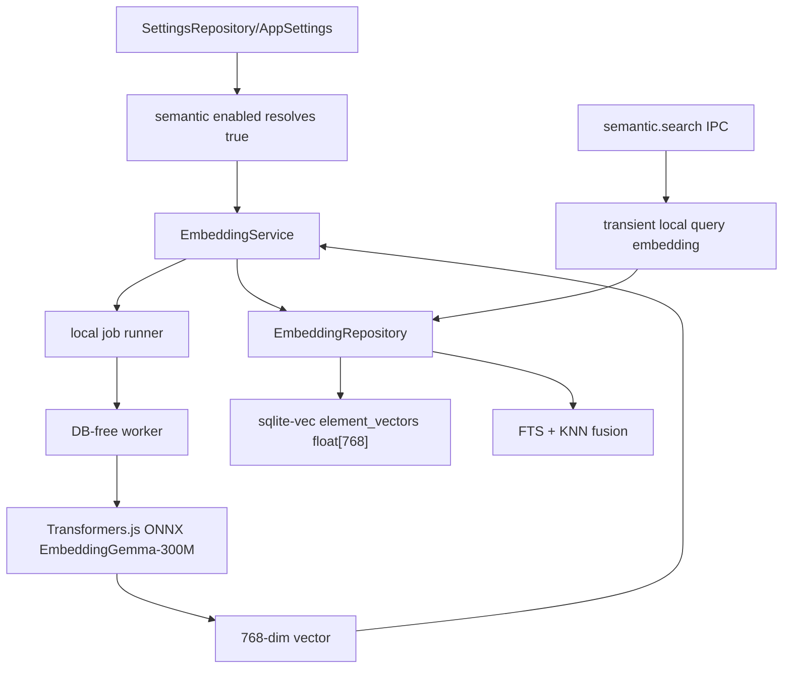

# fix: Make semantic search local-only and always on

## Summary

Make semantic search a built-in local capability instead of a settings-controlled optional provider. The implementation moves embeddings to a local Transformers.js ONNX EmbeddingGemma-300M model, migrates sqlite-vec storage to the model's 768-dimensional vector shape, removes remote embedding provider behavior, and deletes the user-facing semantic-search settings section while preserving FTS fallback when sqlite-vec is unavailable.

---

## Problem Frame

The current T087 implementation still treats semantic search as optional and provider-configurable: settings can disable it, the worker can call an embedding API, and the Settings page exposes a semantic-search panel. It also uses MiniLM/fastembed with a 384-dim sqlite-vec table. The requested product direction is stricter: embeddings must be local-only, on-device semantic search must always be true, and the model runtime should be embedded ONNX Transformers.js with EmbeddingGemma-300M.

---

## Requirements

- R1. Semantic search is enabled by default and cannot be disabled through user settings.
- R2. Embedding jobs and query embeddings run only through a local Transformers.js ONNX EmbeddingGemma-300M path; no remote embedding provider branch, endpoint, or embedding API key is used.
- R3. sqlite-vec stores and searches vectors with the same dimension as the active EmbeddingGemma model output.
- R4. Existing vaults that already applied the old no-op vec migration can create the corrected `element_vectors` table when sqlite-vec is functional, without corrupting existing base tables or source lineage.
- R5. When sqlite-vec is unavailable, the app degrades to keyword search and honest unavailable/index-state copy, not to a settings prompt.
- R6. The Settings screen no longer shows the semantic-search/provider/API-key section.
- R7. No raw vectors, generic SQL, generic filesystem access, or embedding secrets cross into the renderer.

---

## Key Technical Decisions

- KTD1. Use 768 dimensions for EmbeddingGemma. EmbeddingGemma-300M's default sentence embedding is 768-dimensional; matching that output avoids hidden truncation policy and makes sqlite-vec row shape explicit in `EMBEDDING_DIM`.
- KTD2. Treat `semanticSearchEnabled` as a compatibility read, not a product switch. The setting key may remain readable for existing vaults and IPC contracts, but coercion/defaults should resolve to `true` and services should not expose an off state.
- KTD3. Remove the remote embedding provider at the worker boundary. Leaving the `"api"` branch in worker code would preserve a network path that contradicts the request; old stored provider/API-key values should be ignored or coerced to local.
- KTD4. Keep sqlite-vec main-owned and functionally gated. `vecFunctional()` remains the availability source of truth; migrations and repositories should never attempt vec0 DDL or KNN when the extension is absent.
- KTD5. Recreate incompatible `element_vectors` shape under the guarded vec migration. Because `vec0` does not support normal `ALTER COLUMN`, the guarded migration must detect an existing wrong-dimension table and rebuild the derived vector table/bookkeeping safely.
- KTD6. Keep embeddings a derived index. Rebuilding vectors writes no `operation_log` entries and never mutates source, extract, card, lineage, or review state.

---

## High-Level Technical Design

The renderer continues to call typed semantic IPC. The main process decides whether vec is functional and whether vectors exist; the worker computes only local embeddings and never opens SQLite.

---

## Implementation Units

### U1. Pin local-only EmbeddingGemma settings semantics

- **Goal:** Make semantic search resolve on and coerce embedding provider/model settings to local EmbeddingGemma-compatible values.
- **Requirements:** R1, R2, R7.
- **Dependencies:** None.
- **Files:** `packages/core/src/settings.ts`, `packages/core/src/settings.test.ts`, `packages/core/src/embedding.ts`, `packages/core/src/embedding.test.ts`, `apps/desktop/src/shared/contract.ts`, `apps/web/src/lib/appApi.ts`.
- **Approach:** Set `DEFAULT_APP_SETTINGS.semanticSearchEnabled` to `true`, set `DEFAULT_EMBEDDING_MODEL_ID` to the EmbeddingGemma ONNX model id, narrow `EmbeddingProvider` to `"local"` or coerce every legacy value to `"local"`, and keep renderer projections secret-free. If contract schemas still need legacy keys for backup/settings compatibility, they should accept them only as local-only values.
- **Patterns to follow:** `packages/core/src/settings.ts` setting coercion choke points; `packages/core/src/settings.test.ts` renderer projection tests.
- **Test scenarios:** Fresh defaults resolve semantic search enabled; stored `semantic.enabled=false` resolves enabled; stored `semantic.provider="api"` resolves local; embedding API keys are not required for any local embedding behavior; renderer settings still do not return plaintext AI keys.
- **Verification:** Core settings tests pass and no code path depends on an embedding API key for semantic search.

### U2. Replace fastembed/API worker path with Transformers.js ONNX

- **Goal:** Compute element and query embeddings through a local Transformers.js EmbeddingGemma worker path.
- **Requirements:** R2, R7.
- **Dependencies:** U1.
- **Files:** `apps/desktop/package.json`, `pnpm-lock.yaml`, `apps/desktop/build.mjs`, `apps/desktop/src/worker/embedding-model.ts`, `apps/desktop/src/worker/embedding-model.test.ts`, `apps/desktop/src/worker/job-worker.ts`, `apps/desktop/src/main/embedding-service.ts`, `apps/desktop/src/main/embedding-service.test.ts`, `apps/desktop/src/main/index.ts`, `apps/desktop/src/main/index.test.ts`.
- **Approach:** Add `@huggingface/transformers`, stage its runtime dependencies for packaged worker use, vendor the `onnx-community/embeddinggemma-300m-ONNX` model into `dist/resources/transformers/models` for dist builds, load the model from packaged/app-data paths with `allowRemoteModels=false` at runtime, and normalize returned sentence embeddings. Delete `runApiEmbedding`, `embedJobSecrets`, API endpoint/model payload fields, and any job secret injection for `embed` jobs.
- **Patterns to follow:** Existing `stageTesseract` packaging pattern in `apps/desktop/build.mjs`; DB-free worker comments and tests in `apps/desktop/src/worker/embedding-model.ts`.
- **Test scenarios:** Local embedding returns a 768-length vector labeled with the EmbeddingGemma model id; Vitest does not perform a network download; API provider payloads are rejected or ignored; embed job payloads contain no API key/endpoint fields.
- **Verification:** Worker and main embedding tests pass without network access.

### U3. Rebuild sqlite-vec vector shape for 768 dimensions

- **Goal:** Make sqlite-vec storage match the EmbeddingGemma vector dimension and repair existing wrong-shape derived tables.
- **Requirements:** R3, R4, R5, R6.
- **Dependencies:** U1.
- **Files:** `packages/db/src/migrator.ts`, `packages/db/src/migrator.test.ts`, `packages/db/src/vec.ts`, `packages/db/src/vec.test.ts`, `packages/db/drizzle/0022_semantic_vec0.sql`, `packages/local-db/src/embedding-repository.ts`, `packages/local-db/src/embedding-repository.test.ts`, `packages/local-db/src/semantic-search-repository.test.ts`, `packages/testing/src/large-seed.ts`.
- **Approach:** Change `EMBEDDING_DIM` to 768 and update guarded vec DDL. Add a table-shape check in `applyVecMigration`: if `element_vectors` exists with an incompatible dimension, drop the derived vector table and clear `embeddings` bookkeeping so the app can reindex. Keep this under `vecAvailable` only.
- **Patterns to follow:** Existing guarded migration comments in `packages/db/src/migrator.ts`; sqlite table-rebuild caution from `docs/solutions/database-issues/sqlite-table-rebuild-with-foreign-keys-on-fires-on-delete-actions.md`.
- **Test scenarios:** Fresh vec-functional migration creates `float[768]`; legacy `float[384]` vector table plus embeddings is rebuilt/cleared; vec-unavailable migration does not create the table; `foreign_key_check` stays clean; KNN rejects wrong-length query vectors and accepts 768-length vectors.
- **Verification:** DB and local-db vec/embedding tests pass on a vec-functional host and skip cleanly otherwise.

### U4. Make semantic services always-on with honest fallback

- **Goal:** Remove service gating on a user switch while preserving sqlite-vec/model fallback behavior.
- **Requirements:** R1, R5, R7.
- **Dependencies:** U1, U2, U3.
- **Files:** `apps/desktop/src/main/db-service.ts`, `apps/desktop/src/main/contradiction-service.ts`, `packages/local-db/src/related-service.ts`, `packages/local-db/src/review-mode-service.ts`, `apps/desktop/src/main/embedding-job.test.ts`, `tests/electron/semantic-search.spec.ts`, `tests/electron/related-items.spec.ts`, `tests/electron/contradiction.spec.ts`.
- **Approach:** Treat semantic availability as `vecAvailable` plus available vectors/model, not `settings.semanticSearchEnabled`. Keep mode reporting meaningful: `semantic` when KNN ran, `fts` when embedding timed out/index missing, and `disabled` only for vec-unavailable compatibility if the contract still needs it.
- **Patterns to follow:** Existing `semanticSearch()` enrichment and count folding in `apps/desktop/src/main/db-service.ts`; learnings from `docs/solutions/ui-bugs/search-filterbar-facet-counts-after-search.md`.
- **Test scenarios:** Search attempts semantic path by default; disabling legacy setting no longer disables semantic search; vec-unavailable status returns keyword-only mode; related/contradiction reads do not suggest enabling Settings.
- **Verification:** Main service tests and semantic Electron smoke tests reflect always-on behavior.

### U5. Remove semantic settings UI and stale copy

- **Goal:** Delete the Settings section and replace settings-prompt copy with availability/index state.
- **Requirements:** R1, R5, R6.
- **Dependencies:** U1, U4.
- **Files:** `apps/web/src/pages/Settings.tsx`, `apps/web/src/pages/Settings.test.tsx`, `apps/web/src/library/LibraryScreen.tsx`, `apps/web/src/library/LibraryScreen.test.tsx`, `apps/web/src/components/inspector/Inspector.tsx`, `apps/web/src/components/inspector/RelatedSection.test.tsx`, `apps/web/src/help/help-bodies.ts`, `tests/electron/settings.spec.ts`, `tests/electron/search.spec.ts`.
- **Approach:** Remove `SemanticSearchPanel` and its key/provider state. Keep index-build affordances where search/library status already surfaces incomplete embeddings, but rewrite disabled copy to say semantic indexing is unavailable or not built yet rather than asking the user to enable it in Settings.
- **Patterns to follow:** Existing Settings `SectionPanel`/`SettingRow` layout; renderer-only boundary in `apps/web/AGENTS.md`.
- **Test scenarios:** Settings no longer renders semantic toggle/provider/API key controls; library search no longer shows “enable semantic search in Settings”; inspector related fallback copy names unavailable/not indexed state; settings IPC write-only embedding-key test is removed or narrowed to AI keys.
- **Verification:** Renderer tests pass and Settings e2e no longer expects semantic controls.

### U6. Update documentation and verification

- **Goal:** Keep local-first documentation and task notes aligned with the new always-on local semantic architecture.
- **Requirements:** R1, R2, R5, R6.
- **Dependencies:** U1-U5.
- **Files:** `docs/architecture.md`, `docs/roadmap.md`, `docs/tasks/M18-semantic.md`, `docs/plans/2026-06-13-003-fix-local-semantic-search-plan.md`.
- **Approach:** Update stale statements that say semantic search is off by default or API-provider capable. Do not reopen completed roadmap tasks unless a short note is enough to record the follow-up correction.
- **Patterns to follow:** `docs/AGENTS.md` documentation hygiene and roadmap note style.
- **Test scenarios:** Documentation-only; no dedicated test beyond review.
- **Verification:** `pnpm lint`, `pnpm typecheck`, `pnpm test`, and relevant Electron semantic/settings/search e2e pass or have a documented environment blocker.

---

## System-Wide Impact

This change affects the persistent derived embedding index, Electron worker packaging, main-process IPC semantics, renderer settings, and semantic-search user flows. It must preserve the core invariant that source lineage and user data are untouched while derived vectors can be dropped and rebuilt.

---

## Risks & Dependencies

- Transformers.js model resolution may need packaged cache/staging work to avoid network use in normal app startup.
- Moving from 384 to 768 dimensions increases vector storage and KNN payload size; sqlite-vec benchmark coverage should catch unacceptable regressions.
- Existing settings rows with `semantic.enabled=false` or `semantic.provider="api"` must not disable search or reintroduce network behavior.
- The current dependency install is workspace-local; adding `@huggingface/transformers@4.2.0` requires updating `pnpm-lock.yaml`.

---

## Sources & Research

- `packages/core/src/settings.ts` owns settings defaults, coercion, and renderer projection.
- `apps/desktop/src/worker/embedding-model.ts` owns the local Transformers.js worker implementation.
- `packages/db/src/migrator.ts` and `packages/db/src/vec.ts` own sqlite-vec guarded migration and functional availability checks.
- `apps/web/src/pages/Settings.tsx` no longer owns semantic provider/toggle settings; it should keep semantic controls absent.
- `docs/solutions/ui-bugs/search-filterbar-facet-counts-after-search.md` documents why semantic result counts must stay main-side with results.
- `docs/solutions/database-issues/sqlite-table-rebuild-with-foreign-keys-on-fires-on-delete-actions.md` documents why schema repair must avoid table-rebuild side effects on base lineage tables.
