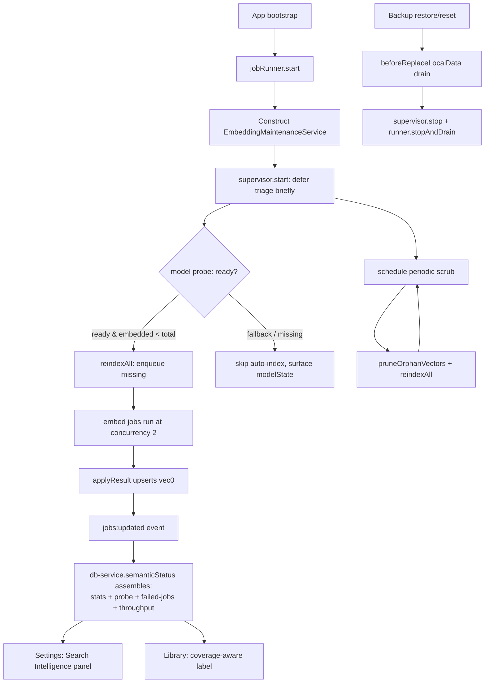
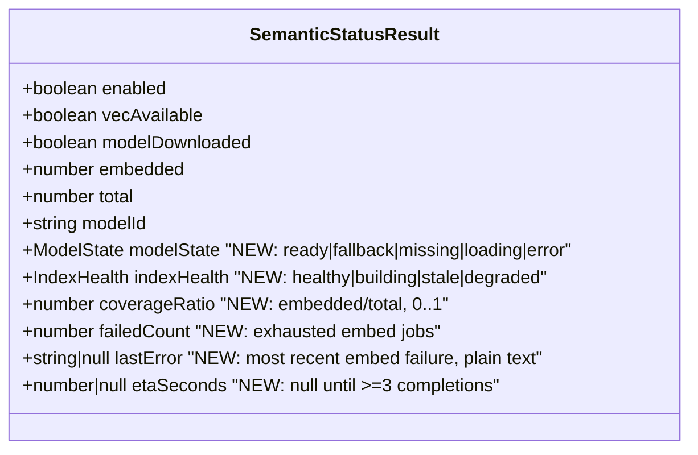

# feat: Self-Healing Embedding Lifecycle — Supervisor, Honest Status, Health Panel, Visible Failures

**Type:** feat
**Depth:** Deep
**Created:** 2026-06-13
**Origin:** `docs/ideation/2026-06-13-embedding-lifecycle-ideation.html` (ideas 1–4)

---

## Summary

Today Interleave's embedding system works in tests but is inert in the real app: nothing starts indexing after install, so a pre-existing corpus sits at "0 of N embedded" forever; the "model downloaded" flag is set by a throwaway warm-up rather than an honest check; embed-job failures are captured but never shown; and there is no status surface in Settings. This plan makes the lifecycle **self-healing and honest**: a main-process supervisor auto-indexes on launch and scrubs on a schedule (idea 1); the model-ready state is probed truthfully and the status contract is expanded (idea 2); a "Search Intelligence" panel in Settings surfaces model state, coverage, ETA, errors, and actions (idea 3); and embed-job failures become visible and retryable (idea 4).

These four ideas are planned together because they all read or write the same `SemanticStatusResult` contract, `EmbeddingService`, and Settings surface — splitting them into separate PRs would force the same files to be edited four times with merge contention. Ideas 5 (quality canary), 6 (model-upgrade re-embed campaign), and 7 (power throttle + priority ordering) are explicitly **out of scope** here and deferred.

**Verified premise (do not re-litigate):** release builds already bundle the model — `apps/desktop/src/worker/embedding-model.ts:95` checks `PACKAGED_MODEL_DIR` first, so a shipped app has a working model even though `<userData>/models` is empty. The real cause of "0 of N" is the missing auto-index trigger, not a missing model. This plan therefore invests in auto-indexing + honest status, not a download manager.

---

## Problem Frame

- **Inert index.** `JobRunner.start()` (`apps/desktop/src/main/job-runner.ts:273`) calls only `recoverRunning()` — it re-queues crashed jobs but never sweeps for unembedded elements. `reindexAll()` exists but is reachable only via the manual "Build index" button on the Library screen. Elements that predate the embedding feature never fire the per-mutation `enqueueElement()` auto-embed, so they stay unembedded indefinitely. Search silently degrades to keyword-only with no signal.
- **Dishonest model state.** `EmbeddingService.downloadModel()` (`apps/desktop/src/main/embedding-service.ts:326`) runs a transient warm-up embed and flips `embeddingModelDownloaded` only if the result's model id matches the real model. The build-time `.interleave-model-ready.json` marker is never read at runtime. There is no first-class signal that the worker has silently fallen back to the meaningless FNV-1a hash embedder (`FALLBACK_MODEL_ID`, `embedding-model.ts:28`).
- **Invisible failures.** The `jobs` table has an `error` column (`packages/db/src/schema/jobs.ts`) and `JobSummary.error` is plumbed to the renderer (`apps/web/src/lib/appApi.ts:1668`), but nothing displays it. Indexing can be permanently stuck at "23 of 25" with no explanation or recovery path.
- **No status surface.** `apps/web/src/pages/Settings.tsx` has no semantic panel; the only indicator is the Library screen's "Build index (N of M)" hint, which disappears once the user types a search query (`LibraryScreen.tsx:178`).

---

## Requirements

| ID | Requirement | Origin |
| --- | --- | --- |
| R1 | On launch, after the job runner is live, automatically enqueue embeds for live elements that are unembedded — but only when the real model is ready (never auto-build the index with the fallback embedder). | idea 1 |
| R2 | A periodic background scrub prunes orphaned vectors and re-embeds drifted / model-mismatched elements, isolated so a failed tick never crashes the app. | idea 1 |
| R3 | The supervisor registers in the backup restore/reset drain path and in app shutdown so it never writes to a store about to be swapped or closed. | idea 1, learnings |
| R4 | Model-ready state is derived from an honest probe (bundled/cache presence + marker + real-vs-fallback load result), not a warm-up; `embeddingModelDownloaded` reflects truth. | idea 2 |
| R5 | `SemanticStatusResult` is expanded to carry model state, index health/coverage, failed count, last error, and ETA inputs — assembled in `db-service.semanticStatus()`. | ideas 2, 3, 4 |
| R6 | A "Search Intelligence" panel in Settings shows model state, indexed/total with progress + ETA, a readiness checklist, coverage-with-threshold honest labeling, failures, and actions (reindex, retry failed, re-acquire model). | idea 3 |
| R7 | Embed-job failures surface as a count + human-readable reason, with a "retry failed" action that re-queues exhausted embed jobs; transient (auto-retried) vs permanent (exhausted) are distinguished. | idea 4 |
| R8 | The Library search surface honestly labels "partial coverage — keyword-weighted" when embedded coverage is below a reliability threshold. | idea 3 |
| R9 | No `elements`-table schema migration is introduced; new status fields are computed or stored in the existing key/value `settings` table. | learnings (migration-0030 hazard) |
| R10 | Fallback-model vectors are never persisted to the index — the INDEX path of `applyResult()` rejects/skips any vector tagged `FALLBACK_MODEL_ID`, so the no-poison guarantee holds regardless of which path enqueued the embed (not only the launch gate). | idea 2, adversarial review |
| R11 | The supervisor's reindex covers corpora larger than `REINDEX_BATCH_LIMIT` — it paginates across ticks until `embedded === total` and never reports a false "complete" or terminal "stale" state caused by the 5000-row batch cap. | idea 1, adversarial review |

---

## Key Technical Decisions

**KTD1 — A dedicated `EmbeddingMaintenanceService` owns the lifecycle, modeled on `AutomaticBackupService`.** The existing `apps/desktop/src/main/maintenance-service.ts` is report/action-only with no timer or lifecycle methods. Rather than overload it, add a new service with `start()` / `stop()` that follows the `AutomaticBackupService` pattern already wired in `index.ts` (`bootstrap()` lines 387–395, will-quit lines 470–481): constructed after `jobRunner.start()`, env-guarded for dev/E2E, failure-isolated ticks. Rationale: the existing maintenance service has a different shape (synchronous reports for the maintenance hub UI); mixing a periodic writer into it muddies both. This is the learnings-documented "background maintenance lives in Electron main, started after runner init, registered in the drain path" pattern (`docs/solutions/architecture-patterns/electron-main-rolling-backups-over-renderer-reminders.md`).

**KTD2 — The scrub reuses existing idempotent primitives; no new drift query.** A scrub tick = `repositories.embeddings.pruneOrphanVectors()` + a (paginated) reindex. `reindexAll()` calls `enqueueElement()` per live element, which already computes the content hash and calls `needsEmbedding()` — so missing, content-drifted, and model-mismatched rows are all re-enqueued, and unchanged rows are skipped. This avoids a bespoke drift-detection query in the first pass. (`embedding-service.ts:165, 196`; `embedding-repository.ts:pruneOrphanVectors`.) Three mechanical constraints follow from how the existing primitives actually behave:

- **Batch-cap pagination (R11).** `reindexAll()` selects with `LIMIT REINDEX_BATCH_LIMIT` (5000) and no ordering, so one call cannot finish a corpus larger than 5000 — and `stats().total` counts *all* live elements. Left naive, `embedded < total` stays true forever on a large vault, the supervisor re-runs an arbitrary 5000-row subset every tick (non-deterministic churn), and `indexHealth` pins to `stale`. The supervisor must therefore loop reindex across successive ticks until `embedded === total`, and treat "unembedded rows remain after a pass" as *in progress*, never as the terminal `stale` state.
- **Opportunistic model-mismatch re-embed is in scope (clarifies the idea-6 boundary).** Because `needsEmbedding()` returns true on a `model_id` mismatch, the scrub naturally re-embeds rows left on an old model. That is intended and in-scope — do **not** add a guard to suppress it. Idea 6 defers only the *first-class generation-swap campaign* (coverage-gated promotion + old-row sweep), not this baseline opportunistic re-embed.
- **Single-flight guard (prevents double-queue).** Triage, the scheduled scrub, and the manual "Build index" button can all reindex concurrently right after launch; `needsEmbedding()` checks only the persisted embeddings row, not already-queued jobs, so overlapping callers re-enqueue the same element. Serialize the supervisor's reindex passes (one in-flight at a time) and skip a pass while a manual reindex or a prior pass is still draining.

**KTD3 — Auto-index is gated on `modelState === "ready"`, AND fallback vectors are rejected at the persistence boundary.** If only the fallback embedder is available, building the index produces semantically meaningless vectors under `FALLBACK_MODEL_ID`. The launch gate (supervisor indexes only when the real model loaded) is the join between idea 2 (honest probe) and idea 1 (auto-index) — but it is *necessary, not sufficient*. The worker decides real-vs-fallback **per embed job** at execution time, and `runLocalEmbedding()` returns `FALLBACK_MODEL_ID` (it never throws) if the model fails to load mid-session; `applyResult()` today upserts whatever `modelId` comes back. So a probe that passes at launch does not stop a later mid-session fallback (OOM, evicted cache, ABI hiccup) from poisoning the index via already-queued jobs. The INDEX path of `EmbeddingService.applyResult()` (`persist !== false`) must therefore **reject/skip persisting any vector whose `result.modelId === FALLBACK_MODEL_ID`** (R10) — leave the element unembedded so a later pass retries once the real model is back. The launch gate avoids needless fallback work; this structural guard makes poisoning impossible regardless of which path enqueued the job. (Serving quality of fallback vectors that already exist is idea 5's concern and out of scope.)

**KTD4 — Status stays assembled in `db-service.semanticStatus()`; throughput/ETA is in-memory.** The expanded `SemanticStatusResult` is composed from `embeddings.stats()` (embedded/total/modelId), a new failed-embed query on the jobs repo, the model probe (KTD5), and an in-memory throughput tracker owned by the supervisor (rolling average of recent embed completions). ETA = `remaining / concurrency × avg_embed_ms`, shown only after ≥3 completions; otherwise "estimating…". Throughput is not persisted (it resets each launch) — acceptable because it only feeds a live progress display.

**KTD5 — `downloadModel()` becomes an honest probe + repair, not a warm-up.** Derive `modelState ∈ {ready, loading, fallback, missing, error}` from two *independent* signals so the states cannot collapse into one another:

- **(a) Filesystem presence** — `existsSync(PACKAGED_MODEL_DIR)` / `MODEL_DIR` + the `.interleave-model-ready.json` marker. This alone separates `missing` (no model files) from `present-but-not-yet-loaded`.
- **(b) Load result** — the `modelId` from a probe embed (`REAL_MODEL_ID` vs `FALLBACK_MODEL_ID`), cached for the session so it isn't re-run every launch.

The probe embed must **not** inherit the 800 ms `QUERY_EMBED_TIMEOUT_MS` used for search queries: a cold EmbeddingGemma load takes seconds, so the racing query path would time out, return `null`, drop the late real-model result into `abandonedQueries`, and falsely report `fallback`/`missing` on a healthy build. Give the probe its own generous timeout, or — preferably — have the worker post a dedicated probe / model-ready message so main learns the resolved model id once the load completes. While files are present but the load is still in flight, report the transient `loading` state; never conflate "still loading" (a `null` from a timeout) with "missing" (no files). Set `embeddingModelDownloaded` from `modelState === "ready"`.

The IPC stays `semantic:downloadModel`, meaning "ensure/repair the model is present and loadable." A full resumable downloader is **not** built (release builds bundle the model — see premise). Because runtime fetching is disabled (`allowRemoteModels = false`), a shipped build has **no acquisition source**, so the user-facing "Re-acquire model" action must degrade honestly: it re-probes, and if the model still cannot load it surfaces a concrete "reinstall the app to repair the search model" message rather than silently no-op'ing or showing a perpetual spinner. Never present an action that cannot succeed (see U5).

**KTD6 — No `elements`-table migration.** All new status fields are computed (model state, coverage, ETA) or read from the `jobs` table (failed count, last error). If the scrub needs to persist a "last scrub at" timestamp, use the existing key/value `settings` table via `SettingsRepository.set()` — never an `elements` schema change. This is a hard constraint given the still-pending migration-0030 lineage repair in the real vault (`docs/solutions/database-issues/sqlite-table-rebuild-with-foreign-keys-on-fires-on-delete-actions.md`).

**KTD7 — Supervisor runs at the existing concurrency; throttling is deferred.** The runner's `DEFAULT_CONCURRENCY = 2` is acceptable at the current corpus size. Power/battery/idle throttling and priority ordering are idea 7 (separate plan) and explicitly not built here. The supervisor defers its first triage until shortly after the main window is shown to avoid competing with launch-critical work.

---

## High-Level Technical Design

Lifecycle of the supervisor and how the four ideas connect:

Expanded status contract (the shared spine ideas 2/3/4 hang on):

> Directional guidance, not a literal type definition — exact field names and optionality are resolved during implementation against the Zod schema conventions in `contract.ts`.

---

## Implementation Units

### U1. Honest model-ready probe

**Goal:** Replace the warm-up heuristic with a truthful model-state probe so `modelDownloaded`/`modelState` reflect reality, gate auto-indexing on it, and make fallback-poison structurally impossible by rejecting fallback vectors at the persistence boundary (KTD3, KTD5).
**Requirements:** R4, R10
**Dependencies:** none
**Files:**
- `apps/desktop/src/worker/embedding-model.ts` — export a helper that reports the resolved model source and whether a real (non-fallback) load succeeds; consider a dedicated probe / model-ready message so main learns the resolved `modelId` without the query-timeout race.
- `apps/desktop/src/main/embedding-service.ts` — add `probeModelState()` returning `{ modelState, modelId }`; rework `downloadModel()` to "ensure/repair + probe" semantics (no behavioral warm-up flip when fallback); add the **fallback-rejection guard** in the INDEX branch of `applyResult()` (skip upsert when `result.modelId === FALLBACK_MODEL_ID`, leave the element unembedded for a later pass — R10).
- `apps/desktop/src/main/embedding-service.test.ts` — probe, gating, and fallback-guard tests.

**Approach:** Derive `modelState` from two independent signals (KTD5): **(a)** `existsSync(PACKAGED_MODEL_DIR)`/`MODEL_DIR` + the `.interleave-model-ready.json` marker, which alone distinguishes `missing` (no files) from `present-but-loading`; and **(b)** the `modelId` from a probe embed (`REAL_MODEL_ID` vs `FALLBACK_MODEL_ID`), cached for the session. State map: `missing` = no model files; `loading` = files present, load in flight (probe not yet resolved); `ready` = real model loaded; `fallback` = files absent/unloadable and hash embedder used; `error` = load threw. The probe must use its own timeout (or a dedicated worker message), **not** the 800 ms `QUERY_EMBED_TIMEOUT_MS`, so a multi-second cold load is not misread as `missing`/`fallback`. Set `embeddingModelDownloaded = (modelState === "ready")` via `repositories.settings.updateAppSettings`. Separately, the `applyResult()` INDEX guard (R10) makes the no-poison guarantee hold even if the model degrades after the launch gate passed.
**Patterns to follow:** existing `downloadModel()` flow and the `result?.modelId === DEFAULT_EMBEDDING_MODEL_ID` check (`embedding-service.ts:326`); model resolution order in `embedding-model.ts:95`; the existing dim-validation reject in `applyResult()` (`embedding-service.ts:243-247`) as the precedent for refusing to upsert a bad vector.
**Test scenarios:**
- Probe returns `ready` when a real-model embed yields `REAL_MODEL_ID`.
- Probe returns `fallback` when the embed yields `FALLBACK_MODEL_ID` (simulate via mocked worker result, mirroring the `embedding-service.test.ts` mock pattern).
- Probe returns `loading` (not `missing`) when model files are present but the probe embed has not resolved; a slow load past 800 ms is not misclassified.
- Probe result is cached: a second call within the session does not trigger a second embed.
- `embeddingModelDownloaded` is set true only on `ready`, false on `loading`/`fallback`/`missing`/`error`.
- `downloadModel()` no longer reports `downloaded: true` when the result is the fallback model.
- **Fallback guard (R10):** `applyResult()` INDEX path with `result.modelId === FALLBACK_MODEL_ID` does **not** upsert a vector and leaves the element unembedded (so a later pass retries); a real-model result upserts normally.
**Verification:** Calling the probe on a build with the real model returns `ready`; on a dev build without the vendored model it returns `fallback` and `modelDownloaded` stays false; a forced mid-session fallback never writes a `FALLBACK_MODEL_ID` row to the index.

---

### U2. Expand the semantic status contract & assembly

**Goal:** Add the fields ideas 2/3/4 need to `SemanticStatusResult` and assemble them in one place (KTD4).
**Requirements:** R5
**Dependencies:** U1
**Files:**
- `apps/desktop/src/shared/contract.ts` — extend `SemanticStatusResult` (lines 5421–5431) with `modelState`, `indexHealth`, `coverageRatio`, `failedCount`, `lastError`, `etaSeconds`; add the supporting enums.
- `apps/desktop/src/main/db-service.ts` — expand `semanticStatus()` (line 2974) to compose from `repos.embeddings.stats()`, the U1 probe, the U5 failed-embed query, and the supervisor's throughput tracker (U3).
- `packages/local-db/src/embedding-repository.ts` — if needed, a helper for coverage; reuse `stats()` (lines 309–329).
- `apps/web/src/lib/appApi.ts` — update the `semanticStatus` browser-fallback stub (line 5887) to include the new fields with safe defaults.
- relevant `.test.ts` for db-service status assembly.

**Approach:** Keep all new fields computed/derived — no persistence beyond the existing `settings` table (KTD6 / R9). `indexHealth`: `building` when embed jobs are in flight, `stale` when `coverageRatio < threshold` and idle, `degraded` when `modelState === "fallback"`, else `healthy`. `etaSeconds` is `null` until the supervisor has ≥3 completion samples.
**Patterns to follow:** existing `SemanticStatusResult` Zod shape and `db-service.semanticStatus()` assembly; the browser-fallback stub convention in `appApi.ts`.
**Test scenarios:**
- `semanticStatus()` returns `coverageRatio = embedded/total` (and `0` when `total === 0`, not `NaN`).
- `indexHealth = degraded` when probe is `fallback`; `building` when embed jobs are running; `healthy` when full and real-model.
- `failedCount`/`lastError` reflect the jobs repo (covered with U5).
- Browser fallback stub returns the full expanded shape with defaults (no undefined fields).
**Verification:** A renderer reading `appApi.semanticStatus()` receives every new field both in-app and in the browser-fallback path; type-check passes across `contract.ts` consumers.

---

### U3. Self-healing index supervisor (startup triage + scheduled scrub)

**Goal:** Auto-index unembedded elements on launch and keep the index correct on a loop, safely — including across corpora larger than the 5000-row batch cap and without racing shutdown or restore (R1–R3, R11).
**Requirements:** R1, R2, R3, R11
**Dependencies:** U1, U2
**Files:**
- `apps/desktop/src/main/embedding-maintenance-service.ts` — **new** service: `start()` (deferred first triage + periodic scrub timer), `stop()`, in-memory throughput tracker, failure-isolated ticks, single-flight reindex guard.
- `apps/desktop/src/main/embedding-maintenance-service.test.ts` — **new** unit test.
- `apps/desktop/src/main/index.ts` — construct after `jobRunner.start()` (line 372), `.start()` it (env-guarded like `AutomaticBackupService`), and `.stop()` it in the will-quit handler (lines 470–481) **before** `jobRunner.stop()` and `dbService.close()` so no tick enqueues into a stopping runner / closing DB.
- `apps/desktop/src/main/ipc.ts` — extend `IpcHandlerContext` (lines ~221–242) with the supervisor field (mirroring `runner`), and stop it in the `beforeReplaceLocalData` callback (lines 1548–1551) **before** `runner.stopAndDrain()`.
- `apps/desktop/src/main/embedding-service.ts` — expose a `scrub()` helper (`pruneOrphanVectors()` + paginated reindex) or let the service compose the existing methods; expose throughput hooks.

**Approach:** On `start()`, defer the first triage briefly (after window-shown) then, if `available && modelState === "ready" && embedded < total`, run a reindex pass (KTD3). Because `reindexAll()` is capped at 5000 rows with no ordering, the supervisor **loops passes across ticks until `embedded === total`** (R11) rather than treating one pass as "done"; a remaining backlog is reported as `building`/in-progress, never terminal `stale`. A **single-flight guard** ensures only one supervisor reindex is in flight and a pass is skipped while a manual "Build index" or prior pass is still draining (KTD2). Schedule a periodic low-priority scrub (KTD2). Each tick is wrapped so a thrown error logs and the next tick still runs (mirror `AutomaticBackupService` failure isolation). The service subscribes to the runner's `job:update` (`JobRunner.observe()`) to feed the throughput tracker for ETA.
**Drain & shutdown ordering (R3):** the supervisor instance must be reachable at both teardown sites. Thread it into `IpcHandlerContext` from `index.ts` so `beforeReplaceLocalData` can stop it before `runner.stopAndDrain()`; in will-quit, stop it before `jobRunner.stop()`/`dbService.close()`. Before any durable write in a tick (prune, settings "last scrub at"), consult the existing replacement-window signal `dbService.localDataRestartRequired` / `localDataReplacementMessage` (`db-service.ts:804–826`) and skip the tick when a replacement is in progress.
**Execution note:** Add a test asserting a failed scrub tick does not throw out of the timer (failure isolation) before wiring the timer.
**Patterns to follow:** `AutomaticBackupService` construction/start/stop in `index.ts:387–395, 470–481`; the drain callback shape in `ipc.ts:1549`; `IpcHandlerContext` field threading for `runner`; `JobRunner.observe()` (`job-runner.ts:310`) for job events; `MaintenanceService.orphanMediaCleanup()` which already calls `pruneOrphanVectors()` (`maintenance-service.ts:301`).
**Test scenarios:**
- `start()` with `embedded < total` and `modelState === "ready"` enqueues a reindex (assert `reindexAll` called).
- `start()` with `modelState === "fallback"` does **not** auto-index (KTD3).
- `start()` with `embedded === total` does nothing.
- **Large corpus (R11):** with `total > 5000`, successive ticks keep making progress until `embedded === total`; the supervisor never reports terminal `stale` while a backlog remains, and does not re-enqueue already-embedded rows.
- **Single-flight:** a second triage/scrub while a pass is in flight is skipped, not double-queued.
- A scrub tick calls `pruneOrphanVectors()` then a reindex pass; a thrown error in one tick is caught and the next tick still fires.
- `stop()` clears the timer; no tick fires after stop.
- Edge: `vecAvailable === false` → `start()` no-ops gracefully.
- Edge: a tick during an active DB replacement window (per `localDataRestartRequired`) is skipped; no write occurs.
**Verification:** Launching against a vault with unembedded elements (real model present) auto-fills the index — including a >5000 corpus reaching 100% over several ticks — without user action; restore/reset stops the supervisor before the store swap; quitting mid-scrub does not error.

---

### U4. Surface & route embed-job failures (main side)

**Goal:** Make exhausted embed jobs queryable, retryable, and reflected in status (R7).
**Requirements:** R7
**Dependencies:** U2
**Files:**
- `packages/local-db/src/jobs-repository.ts` (or the jobs repo location) — add a query for failed `embed` jobs: count + most-recent error text.
- `apps/desktop/src/main/db-service.ts` — add `semanticRetryFailed()` that requeues failed embed jobs via the runner; wire failed count/last error into `semanticStatus()` (U2).
- `apps/desktop/src/shared/channels.ts` — add `semantic:retryFailed` channel (after line 196).
- `apps/desktop/src/shared/contract.ts` — `SemanticRetryFailedRequest`/`Result` schemas.
- `apps/desktop/src/main/ipc.ts` — register the handler (near lines 1364–1388).
- `apps/desktop/src/preload/index.ts` — add to the `semantic` block (lines 477–490).
- `apps/web/src/lib/appApi.ts` — expose `semanticRetryFailed` + browser fallback.
- jobs-repository test + db-service test.

**Approach:** "Failed" = `status === "failed"` (retries exhausted, per `handleFailure` at `job-runner.ts:552`) and `type === "embed"`. Transient failures are already auto-retried by the runner and are not surfaced; only exhausted ones appear. **Retry mechanics (commit to one path):** a failed embed already has `attempts === maxAttempts`, and `requeue()` does *not* reset `attempts` (`jobs-repository.ts:213–226`) — so naively re-queueing the failed row gets zero fresh attempts and immediately re-fails. `semanticRetryFailed()` must instead **re-enqueue a fresh embed job per affected element and mark the old failed rows cancelled/cleared**, so the retry gets a full attempt budget *and* `failedCount` reflects reality after the retry (stale `failed` rows don't linger and inflate the count). **Permanent vs transient:** a deterministic failure (oversized element text, a dim-mismatch that throws in `applyResult` at `embedding-service.ts:243-247`) will just re-fail; classify these (e.g. by error code) so the panel can label them "can't be indexed: <reason>" and not offer an endless retry that never clears. `lastError` is the `error` column verbatim (`"${code}: ${message}"`), surfaced in plain language by the renderer (see U5).
**Patterns to follow:** existing jobs repo queries and `recoverRunning()`; the `error` column in `packages/db/src/schema/jobs.ts`; the existing job `cancelled` status (`JOB_STATUSES`) for clearing old failed rows; existing semantic IPC handler registration/preload/appApi wiring.
**Test scenarios:**
- Failed-embed query returns the count and the most-recent error string; ignores non-embed failures and non-failed jobs.
- `semanticRetryFailed()` re-enqueues affected elements with a full attempt budget and clears the old failed rows; returns the requeued count.
- After retry, `failedCount` reflects only still-failing work (does not double-count the old failed rows and the new queued rows).
- A deterministic-failure job (e.g. dim mismatch) is classified permanent and is not offered for blind retry / does not loop forever.
- `semanticStatus().failedCount`/`lastError` reflect the repo.
- Browser fallback returns `{ retried: 0 }`.
**Verification:** With a deliberately failed embed job, status reports `failedCount: 1` + the reason; invoking retry re-queues it with a fresh budget, the old failed row is cleared, and the count reflects the true remaining failures.

---

### U5. "Search Intelligence" Settings panel

**Goal:** The user-facing observability surface — one place for model state, coverage, ETA, failures, and actions (R6).
**Requirements:** R6
**Dependencies:** U2, U4
**Files:**
- `apps/web/src/pages/Settings.tsx` — new `SearchIntelligencePanel` component (mirror `AiAssistancePanel`, lines 324–491) and render it as a `<SectionPanel>` near the AI panel (line 1441).
- `apps/web/src/pages/Settings.test.tsx` — panel tests using the established mock-extension pattern.

**Approach:** Mirror `AiAssistancePanel`: read `appApi.semanticStatus()` on mount; subscribe to `appApi.subscribeJobs()` and refresh on `job.type === "embed"` (the LibraryScreen pattern at `LibraryScreen.tsx:272–285`). The panel's **headline state is driven by `indexHealth`** (`healthy` / `building` / `stale` / `degraded`) — this is the field's sole renderer consumer, so the panel must actually render it (don't add `indexHealth` to the contract and then re-derive the rollup inline). All states use human-readable copy, never raw enum tokens. Below the headline: indexed/total with a `.budget__bar`/`.pbar` progress fill + ETA text; a readiness checklist; failures with a retry; and actions.

**Display-state spec (resolve every state — do not leave the implementer to invent copy):**
- **`modelState` → copy + chip:** `ready` → "Model ready" (`OkChip`); `loading` → "Loading model…" (neutral chip + spinner); `building`-adjacent handled via indexHealth; `fallback` → "Using basic keyword fallback — search quality reduced" (warn chip, `bg-warn-soft/text-warn`); `missing` → "Search model unavailable" (danger chip); `error` → "Search model failed to load" (danger chip). No state renders the bare enum value.
- **`indexHealth` color treatment:** `healthy` → ok; `building` → neutral/info with progress; `stale` → warn (`bg-warn-soft/text-warn`); `degraded` → warn/danger. Resolves the previously-unspecified `stale` treatment.
- **Readiness checklist:** each item (vector engine · model · dimensions) renders an explicit pass (✓ ok) or fail (✗ warn/danger) row with a one-line reason on fail — not just an absent row. The "dimensions match" item derives from `modelState`/`vecAvailable` (there is no dedicated dimension field in the contract; do not invent one).
- **`lastError` plain-language mapping:** translate the raw `"${code}: ${message}"` into the categories named in idea 4 — model load failed / item too large / worker crashed / timed out — with a generic "couldn't index (<short reason>)" fallback for unrecognized codes. Never surface the raw code string to the user.
- **Loading (pre-first-status) state:** before the first `semanticStatus()` resolves, render a skeleton/placeholder row, not a flash of `0 / 0` with an empty bar.
- **Zero-corpus (`total === 0`):** render a neutral "Nothing to index yet" state — **no** progress bar at 0/0, **no** "partial coverage" / "stale" framing (coverageRatio is 0 by definition here, which must not read as a problem).
- **`vecAvailable === false`:** collapse the panel to a single "Semantic search isn't available on this install" message; hide the progress/checklist/actions that cannot function.

**Actions:** "Retry failed" (calls `semanticRetryFailed`) shown only when `failedCount > 0`; "Reindex" (calls `semanticReindex({ onlyMissing: false })`). **"Re-acquire model" is gated** (KTD5): show it only when it can plausibly succeed; in `missing`/`error` on a local-only build where it cannot, replace it with the honest "Reinstall the app to repair the search model" guidance rather than a button that no-ops. All actions optimistic + reconcile, like the AI panel's `patch()`.
**Patterns to follow:** `AiAssistancePanel`, `SectionPanel`, `SettingRow`, `OkChip`, `Token`, `Toggle` in `Settings.tsx`; status colors `bg-ok-soft/text-ok`, `bg-warn-soft/text-warn`, `bg-danger-soft/text-danger` from `design/tokens.css`; progress classes `.budget__bar`/`.budget__used` and `.pbar__fill` in `design/kit/styles/app.css`; the `subscribeJobs` refresh loop in `LibraryScreen.tsx`; `AiAssistancePanel`'s `useState<… | null>(null)` pre-load convention for the loading state.
**Test scenarios:**
- Renders indexed/total and progress from a mocked `semanticStatus` (use the `vi.hoisted` + `vi.mock("../lib/appApi")` pattern from `Settings.test.tsx`).
- Headline reflects `indexHealth`: `degraded` on `fallback`, `building` while jobs run, `healthy` when full.
- Each `modelState` renders its human-readable copy (no raw enum token leaks); `loading` shows the loading affordance, not "missing".
- Readiness checklist shows pass/fail rows with reasons on fail.
- `lastError` is rendered as a plain-language category, never the raw `"${code}: ${message}"`.
- Pre-first-status renders a skeleton, not `0 / 0`.
- Zero-corpus (`total === 0`) renders "Nothing to index yet" — no progress bar, no partial/stale framing.
- `vecAvailable === false` collapses to the unavailable message; "Re-acquire model" / "Reindex" are not shown.
- "Re-acquire model" is hidden (replaced by reinstall guidance) when `modelState` is `missing`/`error`; "Retry failed" shown only when `failedCount > 0` and clicking calls `semanticRetryFailed`.
- Refreshes status when a subscribed `embed` job event fires.
- ETA shows "estimating…" when `etaSeconds` is null, a time when present.
- Light + dark render (token-based colors) — no hard-coded hex.
**Verification:** Settings shows a live, always-accessible panel whose headline matches `indexHealth`; every model/index/error state renders human copy; building the index updates it in real time; a failure shows a plain-language reason and a working retry; an empty vault and a vec-unavailable build both render sensible non-alarming states.

---

### U6. Honest coverage labeling on the Library search surface

**Goal:** Tell the truth at the point of search when coverage is partial (R8).
**Requirements:** R8
**Dependencies:** U2
**Files:**
- `apps/web/src/library/LibraryScreen.tsx` — add a "partial coverage — keyword-weighted" state below the reliability threshold (near the semantic-on/off hints at lines 630–638 and the build-index affordance at 662–674).
- `apps/web/src/library/LibraryScreen.test.tsx` — coverage-label tests.

**Approach:** Using `coverageRatio` + `indexHealth` from the expanded status (U2), render honest states beyond the current "semantic on"/"off" — and crucially distinguish **actively building** from **stale and idle**, so a user who is watching the index self-heal isn't told search is broken:
- `indexHealth === "building"` (jobs in flight, below threshold) → "Indexing… N of M" — a progress/working signal, not a warning.
- `vecAvailable && coverageRatio < threshold && not building` (stale, idle) → "Partial coverage — keyword-weighted" — the honest partial-search label.
- `total === 0` (empty vault) → no partial-coverage label at all (coverageRatio is 0 by definition; it must not read as a problem).
- at/above threshold → existing "semantic on" behavior.
Keep the existing "Build index" button; this is additive labeling. When both the existing `showSemanticBuildIndex` affordance and a partial/building label would render, the building/partial label is the status line and the button remains the action — they coexist (the label informs, the button acts). Threshold is a single named constant (start ~0.8) **co-located with the U2 `indexHealth = stale` logic** so the renderer and status assembly cannot drift; do not duplicate the literal in two places.
**Patterns to follow:** existing `data-testid="library-semantic-on"/"library-semantic-off"` hint divs (`LibraryScreen.tsx:630–638`), `showSemanticBuildIndex` derivation (line 178), and whether the existing hints render only with an active query — match that behavior for the new label.
**Test scenarios:**
- `indexHealth === "building"` below threshold → "Indexing… N of M" working label (new `data-testid`), not the partial-coverage warning.
- Stale + idle below threshold with `vecAvailable` → partial-coverage label rendered.
- At/above threshold → existing "semantic on" label, no partial warning.
- `total === 0` → neither partial-coverage nor a misleading state is shown.
- `vecAvailable === false` → existing "off" behavior unchanged.
**Verification:** Searching while the index is actively building shows a reassuring "Indexing…" signal; searching against a stale, idle, half-built index shows the honest partial-coverage label; an empty vault shows neither.

---

## Scope Boundaries

**In scope:** ideas 1–4 — the supervisor (auto-index + scrub + drain), honest model probe + expanded status contract, the Settings "Search Intelligence" panel, visible/retryable failures, and honest Library coverage labeling.

### Deferred for later (origin ideation, separate plans)
- **Idea 5 — Quality canary + fallback quarantine.** Smoke-pair similarity tests (≥0.75 / ≤0.30), norm-distribution drift, and refusing to *serve* fallback vectors as "related by meaning." This plan surfaces `modelState: fallback` honestly and avoids *auto-building* with the fallback (KTD3), but does not add the canary or change KNN serving behavior.
- **Idea 6 — Model-upgrade re-embed *campaign*.** The first-class, tracked, resumable generation-swap on `embeddingModelId` change — coverage-gated promotion of the new generation plus old-row sweep — is deferred. Note the boundary precisely: the scrub's *opportunistic* re-embed of model-mismatched rows (a free consequence of `needsEmbedding()` comparing `model_id`) **is in scope here and must not be suppressed**; only the campaign ceremony is deferred (see KTD2). An implementer should not add a guard to stop the scrub from re-embedding stale-model rows.
- **Idea 7 — Power-aware throttle + priority ordering.** `powerMonitor` battery/idle gating and attention-priority reindex ordering. The supervisor runs at the existing `concurrency = 2` (KTD7).

### Outside scope
- A full resumable/chunked model downloader with SHA verification (release builds bundle the model; only a minimal repair path is acknowledged — KTD5).
- Any `elements`-table schema migration (R9 / KTD6).
- Binary quantization, index-in-backup serialization (deferred ideas, large-corpus concerns).

---

## Risks & Dependencies

| Risk | Mitigation |
| --- | --- |
| Startup auto-reindex competes with launch-critical CPU / drains battery during reading. | Defer first triage until after the main window is shown; run at existing concurrency. As a minimal courtesy before idea 7's full throttle, skip/defer the first triage when `powerMonitor.onBatteryPower` is true — a cheap check, not the full power policy (U3). |
| Index poisoned by fallback vectors — at launch OR mid-session (model degrades after the gate passed). | Two layers: gate auto-index on `modelState === "ready"` (KTD3), AND reject `FALLBACK_MODEL_ID` vectors at the `applyResult()` persistence boundary so poisoning is structurally impossible regardless of which path enqueued (R10, U1). |
| Probe misreads a slow cold model load as missing/fallback. | Probe uses its own timeout (or a dedicated worker model-ready message), not the 800 ms query timeout; reports transient `loading` while files are present but the load is in flight (KTD5, U1). |
| Large corpus (>5000) never completes; supervisor reports false `stale` and churns a random subset each tick. | Supervisor paginates reindex across ticks until `embedded === total`; treats remaining backlog as `building`, never terminal `stale` (R11, KTD2, U3). |
| Concurrent triage / scrub / manual reindex double-queue the same element. | Single-flight reindex guard; skip a pass while another is draining (KTD2, U3). |
| "Retry failed" re-fails immediately or inflates `failedCount`. | Re-enqueue fresh jobs with a full attempt budget and clear the old failed rows; classify deterministic-permanent failures so they aren't offered endless retry (U4). |
| "Re-acquire model" promises a repair with no acquisition source on a local-only build. | Gate the action: show reinstall guidance instead of a no-op button in `missing`/`error` states (KTD5, U5). |
| Supervisor writes to a store mid-restore/reset or during shutdown. | Thread the supervisor into `IpcHandlerContext`; stop it before `runner.stopAndDrain()` in `beforeReplaceLocalData` and before `jobRunner.stop()`/`dbService.close()` in will-quit; gate tick writes on `dbService.localDataRestartRequired` (U3, R3). |
| A new `elements` migration re-triggers the migration-0030 FK lineage wipe (repair still pending in the real vault). | Hard constraint: no `elements` migration; computed fields + `settings` key/value only (R9, KTD6). |
| ETA is noisy early. | Null until ≥3 completion samples; show "estimating…" (KTD4). |
| `vec0` unavailable (ABI mismatch) makes the whole feature inert. | Every unit no-ops gracefully on `vecAvailable === false`; the panel collapses to an unavailable message; existing `vecFunctional()` smoke test already guards. |

**Dependency order:** U1 → U2 → (U3, U4) → U5 → U6. U1 (probe) and U2 (contract) are foundational; U3 (supervisor) consumes the probe; U4 (failures) consumes the contract; U5 (panel) consumes U2 + U4; U6 (library label) consumes U2.

**Suggested phasing (optional, if landing incrementally).** The silent self-heal — the core user win — is delivered by **U1 + U2 + U3 + U6**: the index fills itself on launch and the Library tells the truth, with no Settings panel needed. **U4 + U5** (visible failures + the Search Intelligence panel) are the observability layer and can land as a fast-follow once auto-heal is validated to remove the "0 of N" complaint. Shipping all six together is fine (they share files), but if sequencing is preferred, this split delivers most of the user value first and lets the panel's depth be tuned against real auto-heal behavior.

---

## Verification Strategy

- **Unit:** `embedding-service.test.ts` (probe + gating + fallback-rejection guard + `loading` classification), new `embedding-maintenance-service.test.ts` (triage gating + large-corpus pagination + single-flight + scrub failure isolation + stop ordering), jobs-repo + db-service status assembly (incl. retry attempt-budget + permanent-failure classification), `Settings.test.tsx` (panel display states), `LibraryScreen.test.tsx` (building-vs-stale-vs-empty coverage label) — all using the established `vi.hoisted` + `vi.mock("../lib/appApi")` mock-extension pattern.
- **Repository:** extend `packages/local-db/src/embedding-repository.test.ts` (already `describe.skipIf(!VEC_OK)`) for any new coverage/failed helpers, using `embedTextLocal` as the deterministic fake embedder.
- **E2E:** extend `tests/electron/semantic-search.spec.ts` — add a test that launches against a vault with unembedded elements and asserts the supervisor auto-fills the index *without* calling `reindex` (mirrors the existing restart-persistence test at line 192, and reuses `waitForIndex` at line 66); assert the Settings panel renders status; assert a failed job surfaces and retry clears it.
- **Definition of Done (per `CLAUDE.md`):** `pnpm lint`, `pnpm typecheck`, `pnpm test`, relevant `pnpm e2e`; prove the index survives restart, the supervisor drains on restore/reset, foreign keys are enforced (no new `elements` migration), and embed `applyResult` remains transactional (derived state, no `operation_log` — unchanged).

---

## Sources & Research

- Origin ideation: `docs/ideation/2026-06-13-embedding-lifecycle-ideation.html` (ideas 1–4, with the verified premise that release builds bundle the model).
- Learnings: `docs/solutions/architecture-patterns/electron-main-rolling-backups-over-renderer-reminders.md` (background-maintenance-in-main + drain pattern); `docs/solutions/architecture-patterns/electron-sqlite-backup-restore-reset-coordination.md` (drain-before-swap); `docs/solutions/database-issues/sqlite-table-rebuild-with-foreign-keys-on-fires-on-delete-actions.md` (migration-0030 hazard — no `elements` migration); `docs/solutions/architecture-patterns/local-only-semantic-search-sqlite-vec-model-isolation.md` (model/dim/fallback-id contract).
- External: transformers.js `progress_callback` / model resolution; `powerMonitor` (idea 7, deferred); embedding smoke-test thresholds (idea 5, deferred). Not load-bearing for ideas 1–4 — the plan is grounded in verified local code, not external claims.
