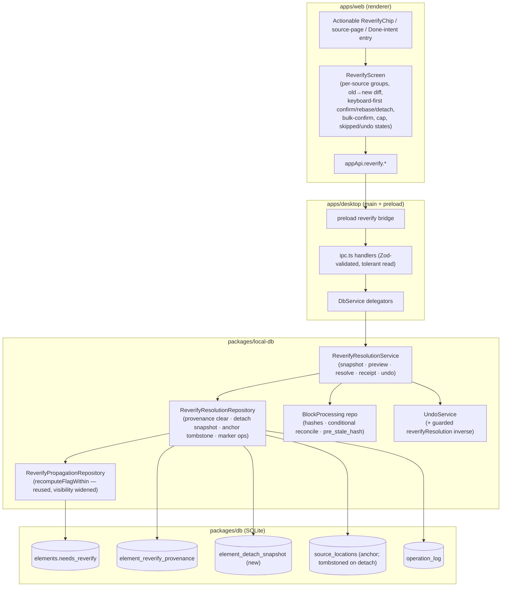

# feat: T124 — Re-verify workflow

## Summary

T123 built **downward dirty-bit propagation**: editing a source block flags the live downstream
lineage outputs with a `needs_reverify` flag, recorded in `element_reverify_provenance`. The
flaggable types are exactly **`extract`, `card`, `media_fragment`** (an "atomic statement" is an
`extract` at the `atomic_statement` distillation **stage** — *not* a separate type). The flag is a
**self-healing projection** (`needs_reverify = EXISTS(provenance row)`), never a directly flipped
bit. Today that flag is an inert, non-dismissible fact — the chip even says "available in a future
update". This plan is that future update.

T124 builds the human-in-the-loop **drain**: a per-source, session-capped surface where each
flagged output resolves as one of three verbs — **confirm** (drift immaterial, one keystroke),
**rebase** (re-anchor to the corrected source text; for raw/clean extracts, re-derive the body
main-side), or **detach** (freeze a provenance snapshot, tombstone the live anchor, keep the output
standalone). Every resolution is command-shaped, transactional, op-logged with a preimage,
batch-undoable, and clears the flag everywhere it shows. Derived knowledge converges back to
consistency with its sources.

---

## Problem Frame

A source correction leaves derived artifacts silently circulating against text that no longer
matches their evidence. T123 made that staleness *visible* but left it *unresolvable*: the flag can
only be cleared today by editing the source block back to its exact prior content (the
`pre_stale_hash` content-restore auto-clear). The common case — the source was corrected and should
*stay* corrected — has no exit. Flags accumulate, become noise, and users learn to ignore them.

T124's job is a cheap, honest drain. The hard constraints, all surfaced by research and review:

- **The flag is a projection.** Resolutions must mutate the *provenance rows*, not the boolean, or
  multi-block self-healing breaks (if two blocks staled one extract, resolving one must leave the
  flag set).
- **Provenance-delete is not an element-column edit.** The existing `update_element` op + undo path
  preimage only a fixed element column set — they cannot capture/restore provenance rows. T124 needs
  a dedicated op shape with an explicit inverse (see KTD2). This is the single most load-bearing
  mechanism in the feature.
- **T123's propagation ops are deliberately non-invertible by ⌘Z** (the `propagation: true` marker).
  T124's resolutions are a different family — they *must* be undoable. A distinct marker is mandatory.
- **Lineage is sacred.** Detach must never null a child FK or silently sever lineage — it freezes a
  snapshot and tombstones the *anchor* (recoverably), so a later edit can't silently re-flag a
  "standalone" output.
- **Cards keep their FSRS schedule.** T125's write barrier (which would re-stabilize a materially
  rewritten card) is unbuilt; until then a card resolution leaves `review_states` untouched.

---

## Requirements

Traced from `docs/tasks/M26-lineage-integrity.md` (T124) and `docs/roadmap.md` T124.

| ID | Requirement | Units |
| --- | --- | --- |
| R1 | A re-verify surface grouped **per source**, showing the old→new anchor-text diff once, with per-item confirm / rebase / detach and a bulk-confirm for a selection; one `batchId` per sitting. | U7 |
| R2 | **Confirm** clears the flag (delete provenance by `(source, block)` key, recompute projection). | U2, U4 |
| R3 | **Rebase** re-anchors to the current source text (hash-diff assisted) and, for raw/clean **extracts**, re-derives the body main-side (fail-closed), reconciles the source block out of `stale_after_edit` *only when it is the last flagged anchor on that block*, then clears. Cards and media_fragments rebase by clearing provenance against the now-current block (no body re-derivation). | U5 |
| R4 | **Detach** freezes a provenance snapshot (explicit marker + snapshot reference) **and tombstones the live `source_locations` anchor** (recoverably) so the output is genuinely standalone and a future edit cannot re-flag it; lineage never silently severed. | U1, U2, U4 |
| R5 | Every resolution is op-logged with a preimage and **batch-undoable** with symmetric restore (undo re-inserts provenance + recomputes the flag true + restores the anchor; redo re-clears). Undo is current-state-guarded on *both* the receipt path and global ⌘Z. | U2, U3, U4 |
| R6 | **Per-source batching + session caps** — never a wall of 400 confirmations; cap, and resume next sitting. | U4, U7 |
| R7 | Resolving a card's flag (via any verb) does **not** change its schedule — no resolution touches `review_states`. (A material body rewrite would route to T125's write barrier; T125 unbuilt → leave schedule untouched and note it. T124 never re-derives card bodies.) | U4, U5 |
| R8 | Resolving **clears the flag everywhere the T123 projection shows it** — the inspector advisory, source progress `needsReverifyOutputs`, the Done-intent breakdown, and the queue/home chip — because all read the one backend projection. (The topic/concept `KnowledgeStaleness.needsReverify` count is a *separate* T090-era open-task aggregate, not the projection — explicitly out of scope; see KTD8.) | U2, U6 |
| R9 | A flagged backlog drains in batched, capped sittings; each resolution is **restart-safe**; standard gates (`pnpm lint`/`typecheck`/`test`/`e2e`) pass. | U8 |

---

## Key Technical Decisions

**KTD1 — Resolve by mutating provenance, never the boolean.** All three verbs clear the flag by
deleting the relevant `element_reverify_provenance` rows by `(source_element_id, stable_block_id)`
across **live and soft-deleted** targets (FK cascade only fires on hard delete), then re-running
T123's projection so `needs_reverify = EXISTS(provenance)` settles correctly. This preserves
multi-block self-healing and makes the flag clear on every read surface for free. The flaggable
types are exactly `{ extract, card, media_fragment }` (the `REVERIFY_FLAGGABLE_TYPES` set / the
`elements_needs_reverify_check` CHECK). **Reuse note:** T123's `recomputeFlagWithin`,
`insertProvenanceWithin`, and `liveAnchorsByBlock` are currently `private` on
`ReverifyPropagationRepository` — U2 widens their visibility (or extracts a shared internal) rather
than re-implementing the projection (which KTD1 forbids).

**KTD2 — A dedicated, explicitly-invertible provenance-resolution op.** A provenance delete/insert
is **not** an element-column edit, so it cannot ride the existing `ElementRepository.updateWithin`
preimage path (which only captures status/stage/priority/title/dueAt/parkedAt/fallow*/extractFate).
Instead, each resolution appends a dedicated op via `OperationLogRepository.append` whose payload
carries `{ reverifyResolution: { kind, verb, sourceElementId, stableBlockId }, prevProvenance: [...],
prevDetachSnapshot?, prevAnchor? }` — the full preimage needed to reverse it. `UndoService` gets an
explicit `invertWithin` branch for the `reverifyResolution` marker that **re-inserts the captured
provenance rows, drops any detach snapshot, restores any tombstoned anchor, then re-runs the
projection recompute** so the flag settles back to true. (Re-inserting provenance alone leaves
`needs_reverify=false` until recompute runs — the recompute is part of the inverse.) The recompute's
own flag-write keeps `propagation: true` and stays non-invertible; the `reverifyResolution` op is the
undo unit. This marker is distinct from `propagation: true` (which global undo skips) — reusing it
would make ⌘Z refuse to reverse a resolve. The `invertWithin` branch applies the same current-state
guard as the receipt path (KTD6), so **both** global ⌘Z and receipt-scoped undo refuse to clobber a
target that changed after resolution.

**KTD3 — Detach freezes a snapshot AND tombstones the anchor.** Detach must make the output
genuinely standalone. It (a) writes a new `element_detach_snapshot` row (frozen `selectedText`,
`blockIds`, `preStaleHash`, source + anchor references, `batchId`) — the standalone element's evidence
root; (b) **tombstones the element's live `source_locations` anchor** (a recoverable marker, preimage
captured in the resolution op) so `propagateReverify`'s `liveAnchorsByBlock` walk can no longer
re-anchor and re-flag it on a future edit; (c) deletes the live provenance and recomputes. Undo
restores the anchor, drops the snapshot, re-inserts provenance. The new table is additive
(`CREATE TABLE` only); never let drizzle-kit rebuild `elements` (the migration-0030 lineage-wipe
vector). Its FKs cascade only on **hard** purge (soft delete never fires cascade), so the snapshot is
enrolled in T135's purge-guard / lineage-aware-deletion checklist.

**KTD4 — Rebase re-derives the body main-side (extract only, stage-gated); the anchor is immutable;
sibling blocks are protected.** Rebase dispatch keys on element **type/stage**, not a non-existent
"statement" type:
- **Raw/clean extract** (`extract` at `raw_extract`/`clean_extract` stage): re-run
  `richSelectionToProseMirrorDoc` from the **current** source `prosemirrorJson` + the anchor's
  `blockIds`/offsets (lift *only* the reconstruction call from `ExtractionService.createExtraction` —
  not the whole extraction transaction), upsert the extract body via the op-logged
  `DocumentRepository.upsert` (child body gets fresh block ids; the `source_locations` anchor row stays
  immutable). Fail-closed: reconstruction `null` → skip with `rebase-failed`, flag untouched.
- **Atomic-statement-stage extract, card, media_fragment**: clear provenance against the now-current
  block only — no body re-derivation. (Card schedule untouched, R7.)

**Block-reconciliation is conditional.** Rebase reconciles the source block out of `stale_after_edit`
(set `block_content_hash := current`, leave `pre_stale_hash` for the auto-clear path) **only when the
rebased element is the last live flagged anchor on that `(source, block)`**. If other outputs are
co-anchored to the same block, leave the block stale and `pre_stale_hash` intact (or the siblings lose
their content-restore auto-clear and become permanently stuck), clearing only the rebased element's
provenance. This reconciliation is done via a direct `BlockProcessingRepository` call that does **not**
emit an `unStaled` report, so T123's `propagateReverify` does not mass-clear sibling provenance.

**KTD5 — Frozen session snapshot + per-item fingerprint, revalidated at the service boundary.** The
preview returns a short-lived main-process snapshot: ordered `itemIds` + per-item fingerprint covering
the source-block content/anchor, the provenance state, **and the target element's `updatedAt` +
`deletedAt`** (so a concurrent body edit or a soft-delete/restore round-trip is caught, not silently
overwritten), `asOf`, `expiresAt`, session cap. Every resolve revalidates each id in-transaction
(`requireCurrent…`): a re-edited (re-staled) block fails confirm, a moved/edited target fails rebase;
stale ids return explicit skip reasons (`not-flagged`, `block-re-edited`, `target-changed`, `deleted`,
`rebase-failed`) rather than failing the whole batch (T120 pattern).

**KTD6 — Receipt-scoped undo with a four-part current-state guard.** One per-source resolution receipt
keyed by `batchId`, persisted in settings JSON by local day (T117/T121 pattern). Undo validates:
receipt still actionable; every op is the expected type; every op carries the `reverifyResolution`
marker; every target is still live AND still at the system-written resolution (not re-staled/re-edited
since). On any mismatch it **refuses** (`{ undone: false, reason }`) rather than clobbering; the
renderer surfaces the reason. Per-item undo is supported so a partially-drifted batch still reverses
the still-matching items rather than refusing the whole receipt. Restore rows are marked
non-global-undoable so ⌘Z can't partially reverse an already-undone receipt.

**KTD7 — Card schedule deferral to T125.** No resolution touches `review_states`. T124 does not
re-derive card bodies at all. Where a material card rewrite would warrant re-stabilization, leave the
schedule and add a code comment + plan note pointing at T125.

**KTD8 — Tolerant reads, strict writes; scoped "everywhere".** The read-only `reverify.sessionPreview`
IPC adapter returns a stable empty payload (full contract shape, zero items) for a
stale/missing/deleted source id (the renderer can hold a stale id across a navigation race); the
mutation path stays strict. "Clears everywhere" (R8) scopes to the four surfaces that read the T123
projection (`elements.needs_reverify`); the topic/concept `KnowledgeStaleness.needsReverify` is a
distinct open-task aggregate (the Inspector's own code comment flags the two as different meanings) and
is **not** in scope for T124 — the e2e asserts the four projection surfaces only.

---

## High-Level Technical Design

### Component & data flow



### Resolution state machine (one flagged output)

```mermaid
stateDiagram-v2
  [*] --> Flagged: T123 propagation (needs_reverify = EXISTS provenance)
  Flagged --> Confirmed: confirm — delete provenance(source,block), recompute
  Flagged --> Rebased: rebase — (extract) re-derive body + conditional block reconcile; delete provenance; recompute
  Flagged --> Detached: detach — freeze snapshot + tombstone anchor; delete live provenance; recompute
  Confirmed --> Flagged: undo (guarded) — re-insert provenance + recompute
  Rebased --> Flagged: undo (guarded) — restore body + block hash + provenance + recompute
  Detached --> Flagged: undo (guarded) — restore anchor + provenance, drop snapshot, recompute
  note right of Flagged
    needs_reverify is never flipped directly; it is
    recomputed from EXISTS(live provenance). Undo must
    re-insert provenance AND recompute. Multi-block:
    clearing one block leaves the flag set while another
    block still flags the element.
  end note
```



### Rebase sequence (raw/clean extract, last anchor on its block)

```mermaid
sequenceDiagram
  participant U as User
  participant R as ReverifyScreen
  participant S as ReverifyResolutionService
  participant Rec as BlockProcessing
  participant Doc as DocumentRepository
  participant P as Provenance/Undo
  U->>R: Rebase item (in session snapshot)
  R->>S: reverify.resolve({batchId, [{id, verb:'rebase', fingerprint}]})
  S->>S: revalidate id + fingerprint (skip if re-staled / target-changed / deleted)
  S->>Doc: re-derive body via richSelectionToProseMirrorDoc(current source, anchor) — fail-closed
  alt reconstruction null
    S-->>R: skip reason 'rebase-failed' (flag untouched)
  else ok
    S->>Doc: upsert extract body (update_document + preimage)
    S->>S: is this the last live flagged anchor on (source, block)?
    alt last anchor
      S->>Rec: reconcile block_content_hash (exit stale_after_edit; keep pre_stale_hash)
    else siblings remain
      S->>S: leave block stale + pre_stale_hash intact
    end
    S->>P: append reverifyResolution op (prevProvenance), delete provenance live+soft-deleted, recompute
    S->>P: append/update receipt (batchId)
    S-->>R: { applied:1, skipped:[] }
  end
```

---

## Output Structure

New files (additive; existing files extended in place):

```text
packages/db/src/schema/documents.ts          # + element_detach_snapshot table
packages/db/drizzle/0038_*.sql               # additive CREATE TABLE migration (hand-checked)
packages/db/src/migration-0038-detach-snapshot.test.ts
packages/local-db/src/reverify-resolution-repository.ts
packages/local-db/src/reverify-resolution-repository.test.ts
packages/local-db/src/reverify-resolution-service.ts
packages/local-db/src/reverify-resolution-service.test.ts
apps/web/src/maintenance/ReverifyScreen.tsx
apps/web/src/maintenance/ReverifyScreen.test.tsx
apps/web/src/maintenance/reverifyDiff.ts                 # old→new text diff helper (pure)
apps/web/src/maintenance/reverifyDiff.test.ts
tests/electron/reverify-workflow.spec.ts
```

Existing files edited (not new): `packages/local-db/src/reverify-propagation-repository.ts`
(visibility widening), `packages/local-db/src/undo-service.ts`, the IPC layer (channels/contract/
preload/ipc/db-service/appApi), and the renderer entry points (router, MaintenanceScreen, queueRow,
DoneIntentMenu, source detail screen).

---

## Implementation Units

Grouped into three phases. Phase A is schema + domain (no UI yet); Phase B is the IPC + renderer
surface; Phase C is end-to-end verification.

### Phase A — Schema & domain

### U1. Detach-snapshot table + additive migration

**Goal:** A durable, additive store for the frozen provenance snapshot a detach produces, so lineage
is never silently severed and the standalone element keeps an evidence root.

**Requirements:** R4.

**Dependencies:** none.

**Files:**
- `packages/db/src/schema/documents.ts` (add `elementDetachSnapshot` table next to
  `elementReverifyProvenance`)
- `packages/db/drizzle/0038_<name>.sql` (additive `CREATE TABLE` only)
- `packages/db/drizzle/meta/_journal.json`, `packages/db/drizzle/meta/0038_snapshot.json`
- `packages/db/src/index.ts` (export table + row type)
- `packages/db/src/migration-0038-detach-snapshot.test.ts`

**Approach:** Columns: `id` (pk), `elementId` (FK → `elements.id` ON DELETE cascade),
`sourceElementId` (FK → `elements.id` cascade), `stableBlockId` (text), `selectedText` (text — the
frozen anchor text), `blockIds` (JSON), `startOffset`/`endOffset` (int, nullable), `preStaleHash`
(text, nullable), `batchId` (text), `createdAt`. Index on `(elementId)` and
`(sourceElementId, stableBlockId)`. Generate the migration with drizzle-kit, then **inspect it**: it
must be a single `CREATE TABLE` with no `elements` rebuild — if drizzle-kit proposes a 12-step
`__new_elements` rebuild, hand-edit to pure additive DDL (mirror the `0037_nosy_lady_vermin.sql`
header note). Detach is recoverable, so it does **not** hard-delete the provenance — undo re-inserts
it. Document (mirroring the provenance-table comment) that the FK cascade fires only on hard purge.

**Patterns to follow:** `element_reverify_provenance` table definition
(`packages/db/src/schema/documents.ts:192-222`); migration test
`packages/db/src/migration-0037-reverify-flag.test.ts`.

**Test scenarios:**
- Migration applies cleanly on a fresh DB; the new table exists with the expected columns/indexes.
- **Generated-SQL shape:** assert the `0038` `.sql` contains exactly one `CREATE TABLE` and zero
  `__new_elements` / `DROP TABLE` / `RENAME` statements (string-level guard against a folded-in
  `elements` rebuild).
- **Row-count invariance:** applying 0038 on a seeded DB leaves `elements`,
  `element_reverify_provenance`, and `source_locations` row counts unchanged (0030-wipe guard).
- **Lineage-value survival:** a seeded element's `parent_id`/`source_id` are byte-identical before and
  after the migration (values, not just counts).
- A detach snapshot row inserts and reads back with all anchor fields intact; cascade deletes when its
  `elementId` is hard-deleted.

**Verification:** `pnpm db:generate` produces an additive migration; `pnpm test` migration suite
passes; manual read of the `.sql` confirms no `elements` rebuild.

### U2. ReverifyResolutionRepository — provenance clear, detach snapshot, anchor tombstone, marker ops

**Goal:** The transactional primitives every verb shares: clear provenance by `(source, block)` key
(live + soft-deleted) and recompute the flag; write a detach snapshot + tombstone the anchor; capture
undo preimages on a dedicated `reverifyResolution` op.

**Requirements:** R2, R4, R5, R8.

**Dependencies:** U1.

**Files:**
- `packages/local-db/src/reverify-resolution-repository.ts`
- `packages/local-db/src/reverify-resolution-repository.test.ts`
- `packages/local-db/src/reverify-propagation-repository.ts` (**widen** `recomputeFlagWithin` and
  `insertProvenanceWithin` to non-private, or extract a shared internal helper, so the resolution repo
  composes the projection rather than duplicating it; keep the `propagation: true` marker on
  recompute's own op)
- `packages/local-db/src/index.ts` (export)

**Approach:** All methods are `…Within(tx, …)` to compose into a single transaction.
- `clearProvenanceWithin(tx, { elementId, sourceElementId, stableBlockId, batchId, verb, kind })` —
  reads the matching provenance rows first (the `prevProvenance` preimage), appends a dedicated
  `reverifyResolution` op via `OperationLogRepository.append` carrying that preimage (this op, **not**
  `ElementRepository.updateWithin`, is the undo unit — `updateWithin` cannot carry a provenance
  preimage), deletes the rows across live and soft-deleted targets, then re-runs
  `recomputeFlagWithin` to settle `needs_reverify`.
- `writeDetachSnapshotWithin(tx, snapshot, batchId)` + `tombstoneAnchorWithin(tx, elementId, …)` —
  insert the `element_detach_snapshot` row and mark the live `source_locations` anchor tombstoned
  (capturing its preimage in the resolution op); `recompute` follows.
- `restoreResolutionWithin(tx, op)` — the inverse used by undo: re-insert `prevProvenance`, drop the
  snapshot, restore the anchor, recompute.
- `listFlaggedBySourceWithin(tx, sourceElementId)` — joins provenance → elements (live, flaggable
  types) to produce the per-source flagged set with each row's blocks and anchor metadata (inverse of
  T123's `liveAnchorsByBlock`).

**Patterns to follow:** `ReverifyPropagationRepository`
(`packages/local-db/src/reverify-propagation-repository.ts`) for transaction shape and the block-key
clear; `OperationLogRepository.append` for the dedicated op; `extract-aging-policy-service.ts` for the
`extras` origin shape.

**Test scenarios:**
- Confirm-clear: one block flags one extract → clear by that block → provenance row gone,
  `needs_reverify` false, exactly one `reverifyResolution` op appended carrying the `prevProvenance`
  preimage.
- **Multi-block self-heal:** two source blocks flag one extract → clear one block → provenance for the
  other remains, `needs_reverify` stays **true** (projection, not flip).
- **Soft-deleted target:** a flagged element soft-deleted then restored — clear hits the soft-deleted
  provenance row so it does not resurrect still-flagged.
- Detach: snapshot row written, anchor tombstoned with preimage, live provenance deleted, flag false.
- `restoreResolutionWithin` round-trips: confirm → restore re-inserts identical provenance rows and
  recomputes flag true; detach → restore re-inserts provenance, restores the anchor, drops the snapshot.
- `listFlaggedBySourceWithin` returns only live flaggable elements with correct block grouping;
  excludes dead/non-flaggable rows.
- Transaction rollback: a thrown error mid-clear leaves provenance, flag, anchor, and op-log untouched.

**Verification:** repository unit suite passes; op-log preimage round-trips (delete → preimage →
re-insert yields identical provenance rows + flag recomputed true).

### U3. UndoService — guarded, explicit `reverifyResolution` inverse

**Goal:** Make T124's resolution ops undoable with a real inverse and symmetric redo, current-state
guarded, without disturbing T123's deliberately-skipped `propagation` ops.

**Requirements:** R5.

**Dependencies:** U2.

**Files:**
- `packages/local-db/src/undo-service.ts`
- `packages/local-db/src/undo-service.test.ts`

**Approach:** Add a `reverifyResolution` branch to `isInvertible()` and `invertWithin()`. The inverse
does **not** route through the generic `update_element` element-patch path (which would no-op); it
calls `ReverifyResolutionRepository.restoreResolutionWithin` (re-insert `prevProvenance`, drop
snapshot, restore anchor, recompute). Keep the gate ordering: the `propagation: true` short-circuit
still fires first and returns non-invertible (regression guard). Apply the **current-state guard**
inside the inverse so global ⌘Z, like the receipt path, refuses to clobber a target changed after
resolution (returns null/skip rather than overwriting). Undo-the-undo (redo) must re-clear: read the
current value into the inverse payload before restoring (two-store symmetry, per
`queue-eligibility-inventory-scheduler-state.md`).

**Patterns to follow:** `undo-service.ts:289-310` (`isInvertible` marker gating) and `:426-489`
(`invertWithin` marker reversal); the `propagation`-skip branches at `:305` and `:446`;
`chronicPostponeReset` marker handling for marker-shaped ops with no element-column `prev`.

**Test scenarios:**
- A `reverifyResolution` confirm op is invertible; inverting re-inserts provenance and recomputes the
  flag to true.
- A `propagation: true` op remains non-invertible (regression guard — T123 behavior unchanged).
- Symmetric round-trip: resolve → undo → flag true & provenance restored; undo → redo → flag false &
  provenance gone again.
- Detach undo restores the anchor, drops the snapshot, re-inserts provenance.
- **Clobber guard:** resolve, then a later edit re-stales the target, then global ⌘Z → the inverse
  refuses rather than overwriting the later state.

**Verification:** undo-service suite passes including the propagation regression and clobber guards.

### U4. ReverifyResolutionService — session, preview, confirm/detach, receipt, batch undo

**Goal:** The orchestrator: build a per-source, capped, fingerprinted session preview; apply confirm
and detach with in-transaction revalidation; persist a receipt; expose receipt-scoped (and per-item)
batch undo. (Rebase lands in U5, layered onto this service.)

**Requirements:** R2, R4, R5, R6, R7, R8.

**Dependencies:** U2, U3.

**Files:**
- `packages/local-db/src/reverify-resolution-service.ts`
- `packages/local-db/src/reverify-resolution-service.test.ts`
- `packages/local-db/src/index.ts` (export)

**Approach:**
- `sessionPreview({ sourceElementId, cap })` (read-only) → ordered items grouped by source, each
  carrying: element id/type/stage/title, the `(source, block)` it is flagged against, the **old** anchor
  text (`source_locations.selectedText`) and the **current** block text (re-hashed from the live source
  doc via `computeBlockContentHashes` / `nodeText`), a per-item fingerprint (block content hash +
  anchor + provenance state + target `updatedAt`/`deletedAt`), plus `asOf`, `expiresAt`, `cap`, and a
  `remaining` count for "cap and resume". Appends **zero** op-log rows. To compute `remaining` cheaply,
  count the flagged set with a `COUNT`, not a full materialization (the cap bounds what is hydrated).
- `resolve({ batchId, sourceElementId, decisions: [{ elementId, verb, fingerprint }] })`
  (transactional) → revalidate each id + fingerprint inside the tx; on drift return an explicit skip
  reason (`not-flagged`, `block-re-edited`, `target-changed`, `deleted`) without failing the batch;
  otherwise dispatch to the verb (confirm/detach here, rebase in U5) via U2 primitives. One `batchId`
  per sitting; bulk-confirm is `resolve` with all-confirm decisions over the **visible (capped)**
  selection. Cards: never touch `review_states` (R7/KTD7) — comment pointing at T125.
- Receipt persisted in settings JSON keyed by local day + `batchId` (`status`, per-verb counts,
  `skipped`, `createdAt`, `sourceElementId`); pruned at a retain window.
- `undoReceipt(batchId, { itemIds? })` → the four-part guard (KTD6), supporting per-item undo so a
  partially-drifted batch still reverses the matching items. Refuse (`{ undone:false, reason }`) on
  whole-receipt mismatch when no items match; mark restores non-global-undoable.

**Patterns to follow:** `ExtractAgingPolicyService` (preview/applyIds/undoReceipt + receipt-by-day) in
`packages/local-db/src/extract-aging-policy-service.ts`; `frozen-conversion-session-revalidation` for
snapshot + fingerprint + `requireCurrent…`; `AutoPostponeService` for the receipt/batch shape.

**Test scenarios:**
- Preview groups by source, respects `cap`, reports `remaining` when the flagged set exceeds the cap,
  and appends zero op-log rows (`expect(operationLog).toHaveLength(before)`).
- Confirm a selection → flags cleared, one receipt with the right counts, one `batchId`.
- **Fingerprint drift:** an item re-edited after preview is skipped with `block-re-edited`; a concurrent
  body edit on an extract is skipped with `target-changed`; the rest of the batch still applies.
- Detach a selection → snapshot rows written, anchors tombstoned, flags cleared, receipt records the
  `detached` count.
- Card confirm/detach leaves `review_states` untouched (assert due-at unchanged).
- `undoReceipt` happy path restores provenance/flags and marks the receipt undone.
- **Redo path:** resolve → undoReceipt → global ⌘Z re-clears the flag (redo); restores are
  non-global-undoable so ⌘Z does not partially reverse the already-undone receipt.
- `undoReceipt` refuses (no clobber) when a resolved item was re-staled afterward; returns a reason;
  **per-item undo** still reverses the unaffected items.
- Restart safety: a fresh service instance over the same DB rehydrates receipts.

**Verification:** service suite passes; receipts persist across a fresh service instance over the same
DB.

### U5. Rebase resolution — main-side body re-derivation + protected block reconciliation

**Goal:** The rebase verb: re-anchor a flagged extract to the corrected source text, re-derive its
body main-side (fail-closed), reconcile the source block out of `stale_after_edit` only when safe, then
clear.

**Requirements:** R3, R5, R7.

**Dependencies:** U4.

**Files:**
- `packages/local-db/src/reverify-resolution-service.ts` (add the `rebase` branch)
- `packages/local-db/src/reverify-resolution-service.test.ts` (rebase cases)

**Approach:** Dispatch on type/stage (KTD4). For a **raw/clean extract**: lift only the
`richSelectionToProseMirrorDoc` reconstruction call (from `ExtractionService.createExtraction:230-241`
— not the whole extraction transaction) against the **current** source `prosemirrorJson` + the anchor's
`blockIds`/offsets. Reconstruction `null` → **fail closed**: skip with `rebase-failed`, leave the flag
set, no write. On success upsert the re-derived body via `DocumentRepository.upsert` (child gets fresh
block ids; the `source_locations` anchor row stays immutable). Then, **only if the rebased element is
the last live flagged anchor on that `(source, block)`**, reconcile the block's `block_content_hash` to
current (exit `stale_after_edit`, keep `pre_stale_hash`) via a direct `BlockProcessingRepository` call
that emits no `unStaled` report; if siblings remain, leave the block stale. Clear provenance + recompute
via U2. For **atomic-statement-stage extract / card / media_fragment**: clear provenance against the
now-current block (no body re-derivation); card schedule untouched (R7).

**Patterns to follow:** `ExtractionService.createExtraction` rich-conversion block
(`packages/local-db/src/extraction-service.ts:230-241`); `ExtractService.rewrite` →
`DocumentRepository.upsert`; `BlockProcessingService`/repo for hash reconciliation; the fail-closed
rules in `docs/solutions/logic-errors/rich-extractions-preserve-paragraphs-and-images.md` and the
main-side reconstruction discipline in `shape-aware-extract-birth-stage-audit.md`.

**Execution note:** Start with a failing test for the fail-closed path (reconstruction `null` → flag
stays set, skip reason returned) before wiring the happy path — the fail-closed branch is the
data-integrity-critical one.

**Test scenarios:**
- Rebase a raw/clean extract whose source block was corrected → body re-derived from current text,
  anchor row unchanged, source block exits `stale_after_edit`, flag cleared, undoable.
- **Fail-closed:** reconstruction returns `null` → item skipped with `rebase-failed`, flag and body
  untouched, no partial write.
- **Sibling protection:** two extracts anchored to one block → rebase one → the other stays flagged
  AND the block stays stale with `pre_stale_hash` intact (so the sibling still auto-clears on content
  restore).
- Rebase undo restores the prior body, the block hash, and provenance symmetrically.
- Atomic-statement-stage extract / card / media_fragment rebase → provenance cleared against the
  current block, no body re-derivation; card `review_states` untouched.
- Multi-block extract: rebasing against one corrected block leaves the flag set if another block still
  flags it.

**Verification:** rebase suite passes including the fail-closed, sibling-protection, and undo-symmetry
cases.

### Phase B — IPC & renderer surface

### U6. IPC surface — channels, contract, preload, handler, client

**Goal:** Expose `reverify.sessionPreview` / `reverify.resolve` / `reverify.undoReceipt` end-to-end
through the typed bridge; tolerant reads, strict writes.

**Requirements:** R2, R3, R4, R5, R8.

**Dependencies:** U4, U5.

**Files:**
- `apps/desktop/src/shared/channels.ts` (add `reverify:*` channels)
- `apps/desktop/src/shared/contract.ts` (Zod request schemas, result types, `reverify` AppApi
  namespace)
- `apps/desktop/src/preload/index.ts` (`reverify` bridge object)
- `apps/desktop/src/main/ipc.ts` (validated handlers) + `apps/desktop/src/main/ipc.test.ts`
- `apps/desktop/src/main/db-service.ts` (delegators + lazily-constructed service)
- `apps/web/src/lib/appApi.ts` (`isDesktop()`-guarded client wrappers + the web/no-op fallback)

**Approach:** Mirror the `extractAging` and `extracts.updateStage` wiring exactly. Validate every
request payload with Zod (canonical UTC timestamps validated at both the schema and the service). The
read handler (`sessionPreview`) catches a stale/missing/deleted source id and returns a stable empty
payload (full shape, zero items) rather than throwing (KTD8). The mutation handlers stay strict.
`db-service.ts` lazily constructs `ReverifyResolutionService` (pattern: the `extractAging` getter).

**Patterns to follow:** `ExtractsUpdateStageRequestSchema` (contract.ts:3413),
`ExtractAgingUndoReceiptRequestSchema` (contract.ts:6507); preload `extracts`/`maintenance` blocks;
`ipc.ts` `extractsUpdateStage` / `extractAgingUndoReceipt` handlers; `appApi.ts` `extractAging` client
(`:6154-6195`); the tolerant-read rule in
`docs/solutions/runtime-errors/block-processing-stale-source-ids-zero-summary.md`.

**Test scenarios:**
- `ipc.test.ts`: each handler parses a valid payload and rejects a malformed one (negative + positive).
- `sessionPreview` with a deleted/missing source id returns the stable empty payload, throws nothing.
- `resolve` with an invalid verb / missing batchId is rejected at the Zod boundary.
- `appApi` web fallback (non-desktop) returns the documented inert shape.

**Verification:** desktop contract/IPC suites pass; typecheck clean across the bridge.

### U7. Maintenance re-verify surface + entry points (renderer)

**Goal:** The user-facing drain: a `/maintenance/reverify` screen grouped per source with the old→new
diff, keyboard-first per-item confirm/rebase/detach, bulk-confirm, session cap + resume, skipped-item
and receipt-undo states; plus the entry points that make today's inert chip and Done-intent segment
actionable.

**Requirements:** R1, R6, R8.

**Dependencies:** U6.

**Files:**
- `apps/web/src/maintenance/ReverifyScreen.tsx` + `ReverifyScreen.test.tsx`
- `apps/web/src/maintenance/reverifyDiff.ts` + `reverifyDiff.test.ts` (old→new text diff helper)
- `apps/web/src/router.tsx` (`/maintenance/reverify` sub-route)
- `apps/web/src/maintenance/MaintenanceScreen.tsx` (hub link + metric card showing remaining count)
- `apps/web/src/pages/queue/queueRow.tsx` (make `ReverifyChip` navigate to the surface; update its
  tooltip from "available in a future update" to "Source changed — click to re-verify"; chip becomes a
  button, `cursor: pointer`, keep the `--warn` advisory severity)
- `apps/web/src/pages/queue/DoneIntentMenu.tsx` (link the reverify segment to the surface)
- The source detail screen (identify the exact file at implementation) — entry link when the source
  has flagged outputs

**Approach:** Layout per source group: (1) a collapsible group header (source title + total flagged
count); (2) the old→new diff block per changed block, shown **once**, visually subdued
(`--surface-2`, smaller type), `max-height` constrained with `overflow:auto` + a "show full" expand —
deletions use a `--warn`-family token with strike-through, insertions use an `--ok`-family token (both
token-driven so light/dark work for free); (3) beneath it, each flagged item as a single flat row:
element type badge + title + a **non-modal intent control that fires immediately** (confirm / rebase /
detach) — **not** the ChronicPanel segmented-button-then-Apply model.

**Keyboard-first flow (the spec's hardest constraint — "enter-enter-enter"):** on mount, focus the
first item's **Confirm** action. Enter fires confirm and auto-advances focus to the next item's Confirm.
Tab/Shift-Tab moves between Confirm/Rebase/Detach within one item; Arrow Up/Down moves between items'
default action. The intent fires on Enter/click with no separate Apply step.

**Detach affordance:** distinct lucide icon (e.g. `unlink`) and a secondary label/tooltip "stands
alone — won't re-flag on future source edits"; the post-detach snackbar reads "Detached — now
standalone (Undo)". Detach does **not** auto-navigate; the item is removed from the list, remaining
items still resolve (guard the post-await body with a `mountedRef`).

**Interaction states:** loading (skeleton while `sessionPreview` resolves), error (inline retry),
empty/all-resolved (a "caught up" state with a link back to the hub), non-desktop (mirror
`MaintenanceScreen`'s Electron-app gate). **Skipped items** (applied/skipped from `resolve`): applied
rows remove optimistically; skipped rows remain with an inline badge ("Re-edited since preview" /
"Re-verify failed — manual edit needed"); snackbar copy reflects partial application ("Resolved N · 2
need attention"). **Refused undo:** when `undoReceipt` returns `{ undone:false, reason }`, the snackbar
shows the reason and a Dismiss (terminal "can no longer undo — source changed" rather than an
infinitely-retryable Retry); per-item undo is offered when only some items drifted.

**Session cap "resume later":** when `remaining > 0` show a "N more — resume later" affordance that
returns to the hub (or source page if entered there); the hub metric card surfaces the remaining count
(via a light count query, not a full `sessionPreview`); the chip remains the re-entry point. Reset the
in-flight guard on host `busy` settling, **not** on popover open→close (the fast-path deadlock gotcha).
Inherit the `AutoVirtualList` pattern for large per-source item lists.

**Patterns to follow:** `MaintenanceScreen.tsx` `ParkedPanel`/`ChronicPanel` (`runUndoable` + `Snackbar`
+ `UNDO_EVENT`, virtualization) — but **not** their segmented-Apply decision model; route registration
in `router.tsx`; the non-modal intent shape and the in-flight-guard/`mountedRef` gotchas in
`docs/solutions/design-patterns/non-modal-intent-menu-replacing-confirm-gate.md`; `design/tokens.css` +
`lucide-react`.

**Test scenarios:**
- Renders per-source groups with the old→new diff shown once per block.
- **Keyboard flow:** mount focuses the first Confirm; Enter confirms and advances focus to the next
  item.
- Confirm a single item → calls `appApi.reverify.resolve` with one confirm decision; row clears; undo
  snackbar appears.
- Bulk-confirm applies all visible items in one call (one `batchId`).
- Cap reached → "resume later" affordance shown with the right remaining count.
- **Skipped items:** a partial-batch response shows the inline badge on skipped rows and partial
  snackbar copy.
- **Refused undo:** `undoReceipt` returns `{ undone:false }` → snackbar shows the reason + Dismiss;
  receipt status unchanged; no counts update dispatched.
- Loading / error / empty / non-desktop states render.
- `reverifyDiff`: identical text → no change segments; insertion/deletion/replacement → correct segment
  classes; empty old or new handled.
- Chip / Done-intent / source-page entry navigate to the surface.

**Verification:** renderer suites pass; visual check in light + dark against the kit; diff helper unit
suite passes.

### Phase C — Verification

### U8. End-to-end + cross-surface verification

**Goal:** Prove the full drain works against the real bridge and survives restart, and that a resolved
flag clears on every projection surface.

**Requirements:** R8, R9.

**Dependencies:** U7.

**Files:**
- `tests/electron/reverify-workflow.spec.ts`

**Approach:** Extend the `reverify-propagation.spec.ts` harness: seed a source → extract → atomic →
card chain, edit a source block to stale the chain, open the re-verify surface, then in separate flows
walk **confirm**, **rebase**, and **detach**; after each, assert the flag cleared on the inspector
advisory, source-progress `needsReverifyOutputs`, the Done-intent breakdown, and the queue/home chip
(the four projection surfaces — not the topic-knowledge open-task count, KTD8). **Restart the app
against the same data dir** and assert persistence; then undo through the receipt and assert the
flag/anchor/body return; then redo (global ⌘Z) and assert it re-clears. Assert a card's `due_at` is
unchanged across a card resolution (R7). Assert detach makes the element standalone: after detach,
edit the same source block again and assert the detached element does **not** re-flag.

**Patterns to follow:** `tests/electron/reverify-propagation.spec.ts` (the `withEditedIntro` /
`saveSourceDoc` / `inspectNeedsReverify` / `reverifyOutputCount` helpers); `extract-aging-policy.spec.ts`
for the receipt-undo-after-restart shape.

**Test scenarios:**
- Confirm path: edit → flag → confirm → cleared on all four surfaces → restart → still cleared.
- Rebase path: edit → flag → rebase → extract body reflects corrected text, block out of
  `stale_after_edit`, flag cleared → restart-safe.
- Detach path: edit → flag → detach → snapshot frozen, anchor tombstoned, flag cleared → re-edit the
  same block → element does **not** re-flag → restart-safe.
- Receipt undo after a sitting restores the flag; redo (⌘Z) re-clears; card `due_at` unchanged
  throughout.

**Verification:** `pnpm e2e tests/electron/reverify-workflow.spec.ts reverify-propagation.spec.ts`
green; full `pnpm lint`/`typecheck`/`test` green.

---

## Risks & Dependencies

| Risk | Mitigation |
| --- | --- |
| **Migration rebuilds `elements`** (0030 lineage-wipe vector) when adding the detach table. | U1 inspects the generated `.sql`; hand-edit to additive DDL; migration test asserts exactly one `CREATE TABLE`, row-count invariance, AND lineage-value survival. |
| **Provenance-delete has no existing undo inverse** — `update_element` can't preimage provenance rows. | KTD2/U2/U3: a dedicated `reverifyResolution` op via `OperationLogRepository.append` carrying the full preimage, with an explicit `invertWithin` branch that re-inserts provenance + drops snapshot + restores anchor + recomputes. |
| **Reusing `propagation: true` would make resolutions non-undoable.** | KTD2/U3: distinct `reverifyResolution` marker, explicit invertibility, regression guard that `propagation` stays skipped. |
| **Flipping the boolean directly breaks multi-block self-healing.** | KTD1: always delete provenance + recompute; explicit multi-block test (U2, U5). |
| **Detach doesn't make the output standalone** — leaving the live anchor lets a future edit re-flag it. | KTD3/U2: tombstone the `source_locations` anchor (recoverably) so `liveAnchorsByBlock` can't re-anchor it; e2e re-edits the block and asserts no re-flag. |
| **Rebase orphans co-anchored siblings** by nulling `pre_stale_hash`. | KTD4/U5: reconcile the block out of `stale_after_edit` only when the rebased element is the last flagged anchor; otherwise leave the block stale with `pre_stale_hash` intact. |
| **Rebase fresh block ids orphan the extract's own descendants' anchors.** | Open question O4 — verify at implementation whether sub-extract/statement/card anchors reference source lineage (immune) or the extract body block ids (would need preservation); add a test. |
| **Rebase partial write corrupts an extract** if reconstruction fails mid-way. | KTD4/U5 fail-closed: reconstruction `null` → skip with reason, no write; transactional. |
| **Undo clobbers a later manual edit** (receipt path or global ⌘Z). | KTD6/U3 four-part current-state guard on both paths; refuse + reason, never overwrite; per-item undo; restores non-global-undoable. |
| **"Statement" mistaken for a type** → wrong rebase dispatch / ignored `media_fragment`. | KTD4: dispatch on element type/stage; `media_fragment` handled explicitly (clear-only). |
| **Stale source id across a navigation race throws.** | KTD8 tolerant read adapter returns a stable empty payload. |
| **`staleSince` not byte-restored on undo** (recompute stamps a new time). | Accept (the flag/provenance restore exactly); e2e asserts the flag returns true, not the exact `staleSince`. Note in U2 tests. |
| **Detach snapshot cascade is a future elements-rebuild casualty vector.** | KTD3: document cascade fires only on hard purge; enroll the snapshot in T135's purge-guard checklist. |

**Dependency note (T125 unbuilt):** R7 — a material card-body rewrite would route through T125's write
barrier to re-stabilize the schedule. T125 is not built. T124 therefore does **not** re-derive card
bodies and never touches `review_states`; the deferral is noted in code and here.

---

## Open Questions (deferred to implementation)

- **O1 — Session cap value.** Pick a sensible default (e.g. 25–50 items per sitting) during U4; tune
  against the e2e seed. Whether it becomes a settings value or a constant is a small follow-up — start
  as a constant.
- **O2 — Detach snapshot exact column set.** U1 lists the needed fields; the final nullable/JSON shapes
  firm up when the reconstruction path is wired in U5.
- **O3 — Diff granularity.** `reverifyDiff` starts word/line-level (legible "what changed", not a full
  Myers diff); refine in U7 if the e2e shows it's too coarse. May be co-located in `ReverifyScreen`
  rather than a separate module if it stays small.
- **O4 — Rebase and the extract's own descendants.** Re-deriving an extract body mints fresh block ids
  (KTD4). Verify whether the extract's sub-extracts/statements/cards anchor to source lineage (immune)
  or to the extract's body block ids (would orphan on rebase) — add a preservation step + test if the
  latter.
- **O5 — Receipt pruning vs. midnight boundary.** Receipts prune by local day + retain window; confirm
  the window covers a sitting that crosses midnight, or op-log-level recovery is intentionally out of
  scope.
- **O6 — Source-page entry file.** Identify the exact source detail screen component for the entry
  link during U7.

---

## Verification (Definition of Done)

- `pnpm lint`, `pnpm typecheck`, `pnpm test`, and
  `pnpm e2e tests/electron/reverify-workflow.spec.ts tests/electron/reverify-propagation.spec.ts`
  all green.
- Persistence proof: resolutions survive app restart; multi-table mutations are transactional; FKs
  enforced; lineage preserved (anchor immutable on rebase, anchor tombstoned recoverably on detach,
  detach snapshot frozen); `operation_log` entries written for every resolution and none for reads.
- Roadmap T124 marked `[x]` with the commit ref; `docs/tasks/M26-lineage-integrity.md` T124 status
  updated; a `docs/solutions/` learning captured for the re-verify drain pattern.
