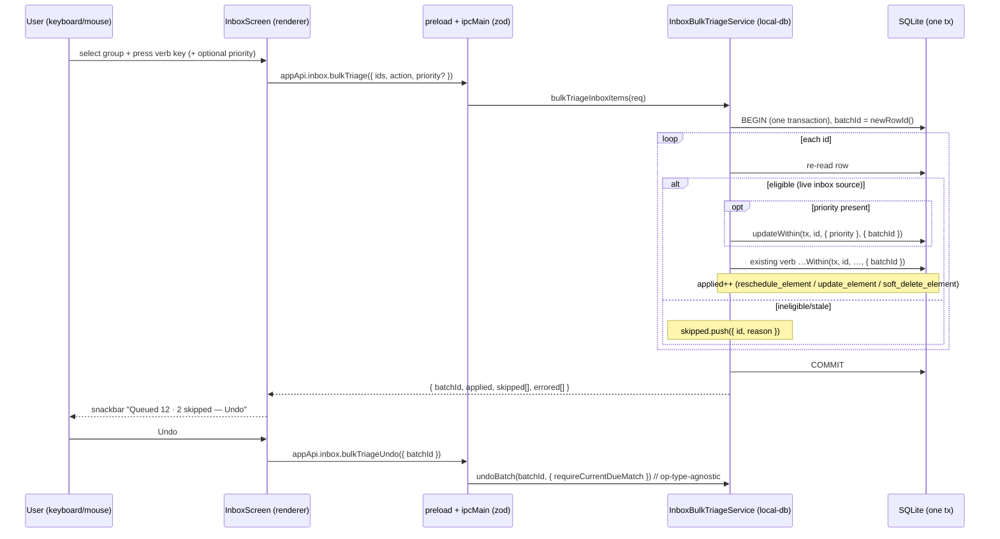
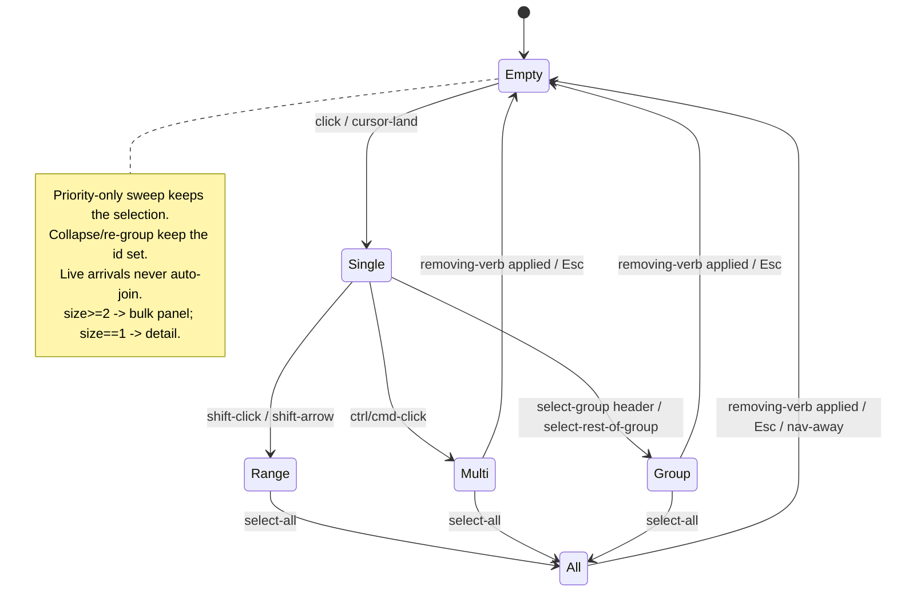

# feat: T126 — Bulk inbox triage

## Summary

The inbox gains **multi-select + group-by (origin / domain / type)** and a **bulk action panel** so a
50-item morning is dispatchable in a few keyboard sweeps. Each sweep applies one triage verb
(Read now / Queue soon / Save for later=park / Delete) — optionally **combined with one priority band
in the same sweep** — to the whole selection as **one transactional, op-logged batch with a single
undo**. Bulk wraps the existing per-item triage commands inside one wrapping transaction sharing one
`batchId` and the existing preimages — it invents **no new mutation shape, no new op type, no new
status**. The one true prerequisite is data: capture origin (`captured_via`) is not queryable today
(extension and URL captures are indistinguishable in storage), so group-by-origin requires a small
additive schema column written at each import seam.

This plan was hardened by a parallel-persona document review (feasibility, adversarial, design,
scope, product, coherence). The review corrected three load-bearing errors in the first draft: the
undo guard was incompatible with 3 of the 5 verbs, the migration backfill keyed on a string no
import path writes, and the combined verb+priority gesture the spec asks for had been split into two
sweeps. All three are resolved below.

---

## Problem Frame

Capture throughput exceeds triage throughput by an order of magnitude — three high-volume feeders
(extension capture, URL import, T069 highlight import), plus manual notes and file imports, can land
dozens of inbox items at once — but the four triage verbs are strictly per-item: no multi-select
exists anywhere in `apps/web/src/pages/inbox/`. T099's bulk ops are maintenance-side sweeps over
*old* material, not the inbox. This closes the gap: group the morning's arrivals by where they came
from, sweep a selection with one verb (and optionally one priority), undo the whole sweep if it was
wrong.

**Scope boundary:** T126 is bulk *mechanics* only. Suggested priority/placement (T127) is the next
task and is explicitly out of scope here — nothing in T126 auto-applies a verb or priority; every
sweep is an explicit user command.

---

## Requirements

Traced from `docs/tasks/M27-triage-at-scale.md` (T126) and the two required solution docs.

- **R1** — Inbox multi-select: click / shift-range / ctrl-toggle / keyboard, plus select-group and
  select-all affordances. Selection is renderer state only.
- **R2** — Group-by header rows for **origin** (extension / URL / highlight-import / manual / file /
  other), **domain** (URL host), and **type** (source type). Counts per group; recomputed after each
  sweep.
- **R3** — Bulk action panel: the four triage verbs + priority chips applied to the selection as ONE
  transactional, op-logged batch; a verb and a priority can be applied **together in one sweep**;
  single undo restores all preimages.
- **R4** — Bulk wraps the SAME per-item commands in one transaction with one `batchId` and the
  existing preimages — never a new mutation shape; the batch boundary is main-side.
- **R5** — Partial-success surfaced honestly: ineligible/stale items in a selection are skipped with
  reasons and counted without aborting the rest; a genuine write error aborts the batch atomically
  and is reported distinctly (a dedicated `errored` channel) — never a silent half-apply. (See KTD-2
  for why real errors are all-or-nothing by design.)
- **R6** — Keyboard path: select-down/up, range-extend, select-rest-of-group, group-jump, verb keys,
  priority keys — a 50-item morning triageable without the mouse; routed through the registered
  `triage` scope so overlapping global shortcuts (`+`/`-`/`o`) defer.
- **R7** — Save for later (code action `keepForLater`) uses T101 parked semantics
  (`status:"parked"`, `dueAt:null`, `parkedAt:now`), not dismiss; priority is preserved across a park.
- **R8** — Persistence survives restart; mutations are transactional + op-logged; single-batch undo;
  source lineage preserved; no `db.query`/generic FS exposure; no unrelated refactors.
- **R9** — Capture origin is a queryable, persisted field (`captured_via`) for new captures from all
  feeders (precondition for R2 origin grouping; the spec's "Notes / risks" makes this in-scope).

**Invariants carried from the required solution docs** (`inbox-triage-queue-soon-attention-scheduling.md`,
`daily-work-read-model-inbox-only-routing.md`):

- "Queue soon" means **eligible now, never force-to-top** — bulk priority/queue must not bypass
  normal queue scoring.
- Queue soon writes `status:"scheduled"`, `dueAt:now`, one `reschedule_element` op; it **must not**
  create a `review_states` row (sources are attention-scheduled, not FSRS).
- Nothing auto-schedules or auto-applies — bulk is an explicit command; fresh imports stay inbox
  work until the user acts.
- Read now assigns an attention `due_at` in the same transaction while keeping lifecycle `active`.

---

## Key Technical Decisions

### KTD-1 — One wrapping transaction, AutoPostpone shape (not the T099 per-item-transaction shape)

The cited precedent `BulkActionService` (T099) runs **one transaction per item** sharing a `batchId`
— atomic only at the undo level. T126's spec says "one batched, op-logged operation," and the
atomicity acceptance test demands true all-or-nothing. So T126 follows the
`AutoPostponeService.applySnapshotWithin` shape instead: **one outer `db.transaction`** (verified at
`packages/local-db/src/auto-postpone-service.ts:339`), mint one `batchId = newRowId()`, loop the ids
calling the existing `…Within(tx, …)` verb helpers, append each op (carrying its preimage +
`batchId`) within that single transaction. `extract-aging-policy-service.ts:293` proves the exact
in-transaction skip-loop shape against this codebase.

### KTD-2 — "Partial success" = in-transaction eligibility skip; real write errors are atomic (owned tradeoff)

Inside the single wrapping transaction, each id is **re-read and re-validated** (live,
`type:"source"`, `status:"inbox"`). The per-item `triageInboxItem` guard (`db-service.ts:3429`) uses
the *same eligibility predicate* but **throws** `"Inbox item is no longer available."`; the bulk path
instead **skips-and-classifies** (it must not throw) — this skip-with-reason logic is net-new, not
mechanical reuse, and carries its own tests. Skip reasons: `not_inbox` / `deleted` / `wrong_type` /
`already_acted`.

A genuine *unexpected* write error on an eligible row aborts the whole transaction (better-sqlite3
rolls back the `.transaction()` callback on throw) with zero partial application. This is a
**deliberate, owned tradeoff**, not a redefinition of the spec: for these simple status/priority
writes the realistic partial-failure mode is staleness (handled by skip-and-count), and true
all-or-nothing is safer than a half-applied 50-item batch. To stay honest, the result shape carries a
**distinct `errored` channel** so a real write error is reported separately from a stale skip rather
than masked: `{ batchId, applied: count, skipped: Array<{ id, reason }>, errored: Array<{ id, error }> }`.
(`errored` should be empty in practice; it exists so the model can *represent* the failure the spec's
"report failures without aborting" wording cares about, while the transaction semantics stay atomic.)

### KTD-3 — One sweep = one action, optionally combined with one priority; reuse `InboxTriageRequest`

A bulk sweep applies one `InboxTriageRequest` verb (`accept` / `queueSoon` / `keepForLater` /
`delete`) to N ids, **optionally with a priority band applied in the same batch**. The bulk request
is `{ ids, action, priority? }`. When `priority` is present alongside a verb, each item gets a
priority `updateWithin` **and** the verb's write within the one transaction under one `batchId` — so
"queue this group at priority B" is **one batch, one undo, one snackbar**, satisfying the spec's
"one verb + one priority … as one batched operation" literally (the origin Done-when phrases the
canonical morning gesture as combined, and imports already land at the default priority, so the
common reason to multi-select a group is to *override* that default). A priority-only sweep
(`action:"setPriority"`, no verb) keeps items in the inbox and preserves the selection so the user
can chain. This replaces the first draft's two-separate-sweeps design, which the product + coherence
reviewers flagged as taxing the common gesture.

### KTD-4 — Bulk "Read now" activates with a return date but opens no reader

Per-item Read now navigates into the reader; you cannot open N readers. Bulk `accept` applies the
same `activateSourceWithReturnWithin` scheduling (status `active` + return `dueAt`) to every selected
item with **no navigation**. This keeps the verb semantics identical at the data layer while making
it sensible at bulk scale.

### KTD-5 — Additive `captured_via` column on `sources`; nullable, honest backfill

Add `sources.captured_via TEXT` CHECK-constrained against a new core tuple
`{ manual, url, extension, highlight_import, file }`, set at every create seam. The `sources` schema
already uses this exact additive-nullable + `inList` CHECK pattern (`packages/db/src/schema/sources.ts`
for `sourceType`/`reliabilityTier`), and a `null` value passes the CHECK (so legacy rows are safe).
Extension vs URL (both flow through `UrlImportService.importFromHtml`) is distinguished by
**threading a `capturedVia` argument from the two distinct call sites**:
`apps/desktop/src/main/capture-handler.ts` (extension loopback) → `extension`;
`apps/desktop/src/main/job-apply-handlers.ts` (URL background runner) → `url`. Other seams:
`importManualSource` → `manual`; `highlight-import-service.ts` → `highlight_import`; the file
importers (epub/markdown/html/anki/pdf/media) → `file`.

**Backfill (honest, not heuristic-precise).** The first draft keyed legacy highlight rows on
`reasonAdded = 'Imported highlights'` — a string **no import path actually writes** (verified by
grep: zero non-test matches; `highlight-import-service.ts` sets no `reasonAdded`). The corrected
backfill: `url IS NOT NULL → url`; rows with no URL → `manual`; any row with **no reliable
discriminator** stays **null → "Other"** rather than guessing. Legacy highlight-import sources are
only reclassified if a *real, stable* discriminator exists in the data (verify at implementation —
e.g., highlight-specific lineage / extract children); if none exists, they backfill honestly to
`url`/`manual`/`Other` rather than to a fabricated `highlight_import`. New captures always carry
exact origin from the seam; the "provenance is sacred" invariant means honest-unknown beats
confident-wrong. R-1 records the day-one consequence.

### KTD-6 — Undo via `undoBatch` with an op-type-agnostic movement guard (not the update-only origin guard)

The first draft bound the snackbar undo to `undoBatch(batchId, { requireUpdateOriginKind:
"bulkInboxTriage" })`. That is **wrong for 3 of the 5 verbs**: `isOwnedUpdateBatch`
(`undo-service.ts:645`) requires *every* op be `update_element` and reads origin from
`payload.extractAgingOrigin` — but bulk `queueSoon`/`accept` emit `reschedule_element` and `delete`
emits `soft_delete_element`, so the guard would refuse the undo for those sweeps. Corrected design:
the snackbar undo uses the **op-type-agnostic movement guards already in `UndoBatchOptions`** —
`requireCurrentDueMatch` / `requireCurrentReferenceFateMatch` (`undo-service.ts:78-79, 226-232`) —
which check "has the victim moved since the batch wrote it" (KTD-6's actual intent: refuse cleanly on
conflict, never clobber a later edit) regardless of op type. This also sidesteps stamping a custom
`originKind` into the scheduler's reschedule ops, whose helpers hard-code their op extras and accept
no caller extras (threading one in would be a "new mutation shape" KTD-1 disclaims).

The batch is durably recorded in `operation_log` (one `batchId`, per-op preimages); restart-safety of
the *data* comes free from op-log durability. Mark restore ops non-global-undoable so generic ⌘Z
can't partially reverse a restored batch. **This is not "free reuse":** it requires a new
renderer-reachable IPC channel (`inbox:bulkTriageUndo`) because the only existing undo surfaces are
global `undo:last` (⌘Z) and domain-specific receipt channels — `undoBatch` is never exposed
generically (see U4). Post-restart, the snackbar is gone; global ⌘Z (`undoLast`) reaches the batch
only while it is still the newest op — an accepted limitation (no persisted visible receipt; the
Done-when needs durable data + a working in-session undo, both delivered).

### KTD-7 — Roving cursor distinct from the selected set; bulk panel replaces the preview pane

Multi-select introduces three distinct renderer concepts: the **selected set** (`Set<string>`), the
**cursor/focused row** (roving tabindex, anchor for shift-range), and the **shell inspector**
(single-id preview). Mode threshold: **`selectedSet.size >= 2` enters multi-select mode** — the right
preview pane is replaced by the **bulk action panel** (a count headline "N selected · M skipped", the
secondary group breakdown, the four verb buttons, and the A/B/C/D priority chips); at `size == 1` the
detail pane shows that item; at `size == 0` the pane reverts to the last cursor row's detail (one
fetch). During a keyboard sweep the inspector detail fetch is **suppressed** while `size >= 2` so a
50-item sweep does not fire 50 detail IPC calls. This single decision resolves both "where does the
bulk bar live" and "what does the right pane show in multi-select" — the bulk panel *is* the right
pane in multi-select mode, avoiding a floating bottom bar that would clash with the desktop two-pane
layout.

### KTD-8 — Selection size cap to protect the synchronous main process

better-sqlite3 is synchronous; one wrapping transaction looping re-reads + writes over a pathological
select-all (the system is built for overflow; inbox size is uncapped) would block the main process.
The contract caps `ids` at **`.max(1000)`** (min 1). Select-all beyond the cap selects the first 1000
with an honest "showing first 1000" affordance rather than silently truncating or stalling; the user
sweeps in capped batches (each independently undoable, which dovetails with the per-batch undo model).

---

## High-Level Technical Design

### Bulk command data flow (renderer intent → main-side batch boundary)

### Selection state machine (renderer-only)

---

## Implementation Units

### U1. Persisted capture origin (`captured_via`)

- **Goal:** Make capture origin a queryable, persisted field for new captures so group-by-origin has
  a deterministic data source (R9, precondition for R2).
- **Requirements:** R9, R2 (origin axis).
- **Dependencies:** none (lands first; blocks U2 origin grouping).
- **Files:**
  - `packages/core/src/capture-origin.ts` (new) — `CapturedVia` tuple + type + label helper.
  - `packages/core/src/index.ts` — export.
  - `packages/core/src/capture-origin.test.ts` (new).
  - `packages/db/src/schema/sources.ts` — add `capturedVia` column (TEXT + `inList` CHECK).
  - `packages/db/migrations/00XX_*.sql` (+ snapshot/journal) — additive column + honest backfill.
  - `packages/local-db/src/source-repository.ts` — `CreateSourceInput.capturedVia`; write in
    `createWithDocument` / `createWithDocumentWithin`.
  - `apps/desktop/src/main/db-service.ts` — `importManualSource` → `manual`.
  - `apps/desktop/src/main/url-import-service.ts` — thread `capturedVia` through
    `importFromHtml` / `importSelection` / `importFromUrl`.
  - `apps/desktop/src/main/capture-handler.ts` — pass `extension` (loopback capture call site).
  - `apps/desktop/src/main/job-apply-handlers.ts` — pass `url` (URL background-runner call site).
  - `apps/desktop/src/main/highlight-import-service.ts` — `importGroup` → `highlight_import`.
  - File import services (epub/markdown/html/anki/pdf/media) → `file`.
  - `packages/local-db/src/source-repository.test.ts`, `packages/db` migration test.
- **Approach:** Additive nullable column, no FK changes, no lineage impact. Distinguish
  extension-vs-URL by call-site argument at the **two distinct `importFromHtml`/`importSelection`
  callers** (capture-handler → extension; job-apply-handlers → url), since both share
  `UrlImportService` (KTD-5). Migration backfills legacy rows honestly (`url`→`url`, else `manual`,
  no-reliable-signal→null/"Other"); does NOT key on the non-existent `reasonAdded='Imported
  highlights'` string.
- **Patterns to follow:** Existing additive migrations in `packages/db/migrations/`; the
  `sourceType`/`reliabilityTier` nullable-`inList`-CHECK columns in `sources.ts`; `CreateSourceInput`
  shape; the `inboxSourceTypeLabel` derivation lives alongside the new origin label.
- **Test scenarios:**
  - `CapturedVia` tuple + label helper map every value to a human label; unknown/null → "Other".
  - `createWithDocument` persists the passed `capturedVia`; round-trips through the repository.
  - Each seam writes the correct origin: manual note → `manual`; URL import driven through the job
    runner → `url`; capture-server loopback → `extension`; highlight import → `highlight_import`;
    file import → `file`.
  - Migration backfill: a legacy row with a `url` → `url`; a bare manual row → `manual`; a row with
    no reliable origin signal stays null (renders "Other"). (No `reasonAdded` sentinel branch.)
  - FK/lineage unaffected: existing source lineage queries still pass.
- **Verification:** `pnpm db:generate`/`db:migrate` apply cleanly; new column visible; each feeder
  test asserts its origin; no existing source/lineage test regresses.

### U2. Inbox read model exposes origin + domain

- **Goal:** Surface `origin` and `domain` on inbox rows so the renderer can group by origin/domain/
  type from backend-derived fields (R2).
- **Requirements:** R2.
- **Dependencies:** U1.
- **Files:**
  - `packages/local-db/src/inbox-query.ts` — `InboxItemSummary` gains
    `origin: CapturedVia | null` (the persisted `captured_via`) and `domain: string | null` (host
    parsed from `canonicalUrl ?? url`); `type` grouping reads the existing source type.
  - `packages/local-db/src/inbox-query.test.ts`.
- **Approach:** Pure read-model addition — `list()` joins the new column and computes `domain` via a
  host-parse helper (null when no URL). No new IPC; `inbox:list` result shape grows two fields
  (additive — existing consumers unaffected).
- **Patterns to follow:** Existing `inboxSourceTypeLabel` derivation; keep the list contract light
  (no bodies), per the url-import inbox-processing learning.
- **Test scenarios:**
  - `list()` returns `origin` from the column and `domain` from the host; a row with no URL →
    `domain: null`; a legacy null-origin row → `origin: null`.
  - Domain parse normalizes consistently (decide and assert one rule, e.g., strip leading `www.`).
  - Sorting/filtering unchanged (newest-first inbox sources only).
- **Verification:** `inbox-query` tests assert the two new fields across manual/url/highlight/null
  fixtures.

### U3. `InboxBulkTriageService` (main-side batch boundary)

- **Goal:** Apply one triage action (optionally + a priority) to N ids as one transactional,
  op-logged batch reusing the existing per-item verb writes (R3, R4, R5; KTD-1/2/3/4).
- **Requirements:** R3, R4, R5, R7; invariants (queue-soon eligible-now, no `review_states`).
- **Dependencies:** none for the service itself (consumed by U4); independent of U1/U2.
- **Files:**
  - `packages/local-db/src/inbox-bulk-triage-service.ts` (new) — `class InboxBulkTriageService`
    with `apply(ids, action, priority, now): InboxBulkTriageResult`.
  - `packages/local-db/src/inbox-bulk-triage-service.test.ts` (new).
  - `apps/desktop/src/main/db-service.ts` — `bulkTriageInboxItems(req)` + `bulkTriageUndo(req)` wire
    the service + `UndoService.undoBatch` with the same injected deps `triageInboxItem` uses.
- **Approach:** One outer `this.db.transaction((tx) => …)`; `batchId = newRowId()`; loop ids,
  re-read each, skip-and-classify ineligible (KTD-2; the per-item predicate but skip-not-throw), else:
  if `priority` present, `updateWithin(tx, id, { priority }, { batchId })`; then dispatch by
  `action.kind` to the SAME `…Within` helpers the per-item path calls: `accept` →
  `activateSourceWithReturnWithin` (KTD-4, no nav); `queueSoon` → `queueSourceSoonWithin`;
  `keepForLater` → `updateWithin(…parked…)`; `delete` → `softDeleteWithin`; `setPriority` →
  `updateWithin(…priority…)`. All under one `batchId`. No new op type, no new status — assert this in
  a test. Undo path: `bulkTriageUndo` calls `undoBatch(batchId, { requireCurrentDueMatch:true })`
  (op-type-agnostic movement guard, KTD-6) and refuses cleanly when a victim moved.
- **Patterns to follow:** `AutoPostponeService.applySnapshotWithin` (single tx + shared batchId);
  `extract-aging-policy-service.ts` in-transaction skip-loop; `triageInboxItem`'s per-verb branches
  and live-source guard; chronic-postpone skip-reason taxonomy; `undo-service.ts` movement guards.
- **Test scenarios:**
  - Atomicity: a 3-id bulk emits ops all sharing one `batchId`; the whole set commits together.
  - Reuse-not-reinvent: bulk `queueSoon` emits `reschedule_element` (not a new op type); bulk park
    emits `update_element` with `status:"parked"` and preserves prior priority; bulk delete emits
    `soft_delete_element`. Assert NO `review_states` row is created for queueSoon.
  - Combined verb+priority: a `queueSoon` with `priority:"B"` emits, per item, a priority
    `update_element` AND a `reschedule_element`, all one `batchId`; undo restores both.
  - Skip-and-count with all four distinct reasons: a selection with a deleted id (`deleted`), a
    parked id (`not_inbox`), a non-source element (`wrong_type`), and an already-acted id
    (`already_acted`) → each returned with its distinct reason; live items applied; no throw.
  - Errored channel: a forced write error on an eligible row aborts the whole tx (zero applied) and
    the error is representable distinctly from a skip.
  - Undo symmetry: after a combined queue+B bulk, `bulkTriageUndo` restores every row to its
    preimage (status/dueAt/priority); a *moved* victim makes the undo refuse cleanly (no clobber);
    undo-the-undo re-applies coherently.
  - T127 forward-compat: the bulk `setPriority` op payload carries both prior and new priority (via
    the existing preimage) so a later accept-vs-override measurement needs no history migration.
  - Read now (bulk `accept`): each item becomes `active` with a return `dueAt`; no navigation
    side-effect at the data layer.
  - Empty/duplicate ids handled (dedupe; empty → `applied:0`).
- **Verification:** service tests prove single-tx batch, verb reuse, combined priority, four skip
  reasons, errored reporting, and op-type-agnostic undo symmetry incl. refuse-on-conflict.

### U4. IPC channels + contract + preload + appApi wrapper

- **Goal:** Expose the bulk apply **and** the bulk undo across the typed IPC boundary (R4 main-side
  boundary, R8, KTD-6, KTD-8).
- **Requirements:** R4, R8.
- **Dependencies:** U3.
- **Files:**
  - `apps/desktop/src/shared/channels.ts` — `inboxBulkTriage: "inbox:bulkTriage"` AND
    `inboxBulkTriageUndo: "inbox:bulkTriageUndo"`.
  - `apps/desktop/src/shared/contract.ts` — `InboxBulkTriageRequestSchema`
    (`{ ids: z.array(ElementIdSchema).min(1).max(1000), action: <existing InboxTriageRequest action
    union>, priority: PriorityLabelSchema.optional() }`), `InboxBulkTriageUndoRequestSchema`
    (`{ batchId }`), + `InboxBulkTriageResult` type (`{ batchId, applied, skipped[], errored[] }`);
    declare `bulkTriage` and `bulkTriageUndo` on the `appApi.inbox` interface.
  - `apps/desktop/src/preload/index.ts` — `bulkTriage` + `bulkTriageUndo` invokes in the `inbox:`
    object.
  - `apps/web/src/lib/appApi.ts` — `bulkTriageInbox(request)` + `bulkTriageInboxUndo(request)`
    wrappers.
  - `apps/desktop/src/main/ipc.ts` — two `ipcMain.handle` entries parsing each request and
    dispatching to `dbService.bulkTriageInboxItems` / `dbService.bulkTriageUndo`.
  - Drift tests: `apps/desktop/src/shared/contract.test.ts`, `apps/desktop/src/main/ipc.test.ts`,
    `apps/desktop/src/preload/index.test.ts`.
- **Approach:** Mirror the T099 `maintenance:bulkTrash` 6-step plumbing for the apply channel and the
  `extractAging:receipt:undo` precedent for the undo channel. Reuse the existing `InboxTriageRequest`
  action union so bulk and per-item stay in lockstep. zod validation at the handler boundary; `ids`
  min-1, **max-1000** (KTD-8).
- **Patterns to follow:** `maintenanceBulkTrash` channel/contract/handler chain; the domain-specific
  receipt-undo channels (`extractAging:receipt:undo`) for the undo channel; `inbox:triage` contract
  for the action union.
- **Test scenarios:**
  - Contract drift: both new channels exist across channels/contract/preload/handler; request schema
    rejects empty `ids`, `ids` over 1000, and invalid action kinds; `priority` is optional.
  - Apply handler dispatches a parsed request to `bulkTriageInboxItems` and returns the result shape;
    undo handler dispatches `{batchId}` to `bulkTriageUndo`.
  - `appApi.bulkTriageInbox` / `bulkTriageInboxUndo` call the bridge with the request unchanged.
- **Verification:** drift tests green; typecheck proves the `appApi.inbox` interface matches preload +
  wrappers for both channels.

### U5. Inbox multi-select + group-by + bulk action panel (renderer)

- **Goal:** Selection state, group-by view, the bulk action panel, snackbar undo, selection-clearing
  rules, and the pinned visual/interaction design (R1, R2, R3, R5; KTD-7).
- **Requirements:** R1, R2, R3, R5.
- **Dependencies:** U2 (origin/domain fields), U4 (bulk IPC).
- **Files:**
  - `apps/web/src/pages/inbox/InboxScreen.tsx` — `useState<Set<string>>` selection + anchor/cursor
    refs; group-by selector; group header rows + counts + select-group; the bulk action panel
    (replaces the right preview pane at `size>=2`); `aria-live="polite"` announcements; snackbar Undo
    bound to `batchId`; selection-clearing rules; suppress inspector fetch while `size>=2`.
  - `apps/web/src/pages/inbox/InboxScreen.test.tsx` — extend.
  - Optional small extractions (`InboxGroupedList.tsx`, `BulkActionPanel.tsx`) if `InboxScreen` grows
    unwieldy — keep only if it clarifies.
- **Pinned design decisions (from the design-lens review; use `design/tokens.css`, cite
  `design/kit/app/screen-inbox.jsx` as the baseline; no hard-coded colors/spacing):**
  - **Selection vs cursor:** selected rows get the existing active-row accent fill
    (`--accent-soft` / `--accent-soft-bd`); the roving cursor row gets a distinct outline/focus ring
    (`--border-strong`), so "in the set" and "cursor here" are visually separable. No persistent
    checkbox column — selection is keyboard/click-driven with the accent fill as the indicator.
  - **Bulk action panel = the right pane in multi-select** (`size>=2`): a count headline
    ("12 selected · 2 skipped"), a secondary group breakdown ("URL · manual · Other"), the four verb
    buttons, and A/B/C/D priority chips (reusing the existing `PreviewPane` chip styling). At `size==1`
    the detail pane returns; at `size==0` revert to the last cursor row's detail.
  - **Group header rows:** a divider row with the group label in `text-text-3 text-xs uppercase`, a
    count badge (`badge--soft`), and a "Select group" control (`btn--ghost btn--sm`). Collapsibility
    is **deferred** (out of scope; stated so the "collapse keeps the id set" note is aspirational, not
    required this task).
  - **Group-by selector:** a three-option segmented chip control ("Origin" / "Domain" / "Type") above
    the left list (below the import strip), using `chip` / `chip--active`; switching is an instant
    pure-renderer transform (no fetch) that preserves the selected id set.
  - **aria-live strings + focus:** announce "N items selected" on selection change and "Verb applied
    to N items. M skipped." on sweep complete (matching the snackbar); after a removing sweep, focus
    moves to the next remaining row (or first if none).
  - **Inbox-zero:** when a sweep takes `items.length` to 0, reuse the existing inbox-zero empty
    state unchanged; when only one group empties, just drop its header and recompute the top count.
- **Approach:** Selection is a `Set<string>`; grouping is a pure renderer transform over the list
  (keyed by `origin` / `domain` / `type`), with a stable "Other" bucket for null. The panel fires one
  `appApi.bulkTriageInbox({ ids:[...selection], action, priority? })` per sweep and surfaces
  `{ applied, skipped, errored }` honestly. Reuse the Maintenance `runUndoable(fn, label)` + Snackbar
  pattern, but the snackbar Undo calls `appApi.bulkTriageInboxUndo({ batchId })` (not `undoLast`).
  Eligibility/counts come from the backend list. Live arrivals never auto-join the selection;
  `inbox:list` is re-fetched only on user action (import/verb/undo), not on a timer.
- **Patterns to follow:** `apps/web/src/maintenance/MaintenanceScreen.tsx` `runUndoable` + Snackbar +
  `UNDO_EVENT`; existing `InboxRow` active-row treatment + `PreviewPane` chips; the `DoneIntentMenu`
  in-flight-guard rule (reset guard on `busy` settling, not popover open/close).
- **Test scenarios:**
  - Selection: click selects single; shift-click selects a range; ctrl/cmd-click toggles; select-
    group selects the group; select-all; Esc clears.
  - Grouping: rows bucket by origin/domain/type; a null-origin row lands in "Other"; a single-item
    domain group renders; switching group-by keeps the selected id set.
  - Mode threshold: at `size>=2` the right pane shows the bulk panel and detail fetch is suppressed;
    at `size==1` the detail pane shows; at `size==0` it reverts to the cursor row's detail.
  - Bulk dispatch: a verb fires exactly one `bulkTriageInbox` IPC call with the selected ids + chosen
    action (+ optional priority); a combined queue+B fires one call; the result `{applied, skipped}`
    renders honestly ("Queued 12 · 2 skipped").
  - Empty selection: bulk panel not shown; pressing a verb is a no-op.
  - Clearing rules: removing-verb clears selection; priority-only keeps it; nav-away clears.
  - After a sweep removes a whole group, its header disappears and the top-level count recomputes;
    a sweep to zero shows inbox-zero.
  - `aria-live` region announces selection count and batch result.
- **Verification:** renderer tests cover selection transitions, grouping (incl. "Other"), the mode
  threshold, single-IPC-call dispatch (incl. combined priority), partial-success rendering, undo via
  the new channel, and clearing rules.

### U6. Keyboard scope + keymap (reuse the existing `triage` scope)

- **Goal:** A registered keyboard scope and full keymap so a 50-item morning is mouse-free and
  overlapping global shortcuts defer (R6).
- **Requirements:** R6.
- **Dependencies:** U5.
- **Files:**
  - `apps/web/src/shell/shortcuts.ts` — register entries under the **existing `"triage"`
    `ShortcutScope`** (currently declared but unused): select-down/up, range-extend,
    select-rest-of-group, select-all, group-jump, the four verb keys (migrate the inline `1/2/3/6`),
    priority keys, Esc-clear. Each entry: id, label, keys, group, `scope:"triage"`.
  - `apps/web/src/shell/activeScope.ts` — add `"triage"` to the **separate** `ActiveScope` union so
    overlapping global keys (`+`/`-`/`o`) defer while the triage scope is active. (Note: these are two
    distinct unions; ⌘Z is NOT scope-gated — it fires before the scope gate — so global undo always
    works.)
  - `apps/web/src/pages/inbox/InboxScreen.tsx` — `useActiveScope("triage", enabled)`; wire keys to the
    selection set (verbs operate on the set when non-empty, falling back to the cursor row when the
    set is empty, preserving today's single-item behavior); roving cursor.
  - `apps/web/src/shell/shortcuts.test.ts` — extend the drift test's scope list and assert every new
    `triage` entry is bound.
  - `apps/web/src/pages/inbox/InboxScreen.test.tsx` — keyboard sweep coverage.
- **Approach:** Replace the inline `window.addEventListener` `1/2/3/6` handler with registry-driven
  shortcuts under the `"triage"` scope (the cheat sheet + ⌘K palette then derive automatically).
  Enumerate the concrete keys up front so the drift test and cheat sheet can be written: select-down
  (`J`/`ArrowDown`), select-up (`K`/`ArrowUp`), range-extend (`Shift+J`/`Shift+K`), select-rest-of-
  group (`G`), select-all (`A`), Esc-clear, verb keys (migrated `1`/`2`/`3`/`6`), priority keys
  (band chips). Check each against existing global bindings (`+`/`-`/`o`/`u`/⌘Z) for collisions.
- **Patterns to follow:** T048 scope machinery (`useShellShortcuts` `hasActiveScope()` deferral gates
  `+`/`-`/`o`/`u`); the `triggerSignal` shortcut→click bridge from `DoneIntentMenu`; the existing
  `shortcuts.test.ts` drift assertion.
- **Test scenarios:**
  - Drift: every new `"triage"` scope entry in `SHORTCUTS` is bound; the drift test's scope array
    includes `"triage"`.
  - Deferral: while the triage scope is active, `+`/`-`/`o` defer to it (do not double-fire); ⌘Z is
    NOT bound by the scope and always reaches global undo (it fires before the scope gate).
  - Keyboard sweep: select-rest-of-group + a verb key (+ optional priority key) dispatches one bulk
    command over the group; a 30-item group is selectable without 30 keypresses.
  - Single-item fallback: with an empty selection, a verb key acts on exactly the cursor row, not the
    whole visible list (no silent widening).
  - Roving cursor moves independently of the selected set; inspector fetch suppressed at `size>=2`.
- **Verification:** drift + deferral + sweep + single-item-fallback tests green; cheat sheet/palette
  include the triage shortcuts automatically.

### U7. Electron E2E — restart + batch undo

- **Goal:** Prove the whole feature end-to-end against the real Electron app (R8 Definition of Done).
- **Requirements:** R3, R4, R5, R7, R8, R2.
- **Dependencies:** U1–U6.
- **Files:**
  - `tests/electron/inbox-bulk-triage.spec.ts` (new).
- **Approach:** Seed ~30 mixed-origin inbox items via `window.appApi` (manual / url / extension /
  highlight-import / file, plus one null-origin legacy-style and one single-item domain), group by
  origin, bulk-queue one group at priority B (one combined sweep), bulk-park another, single undo
  restores the last batch, restart and re-verify durability. Assert no `db.query`/generic FS, op-log
  carries one `batchId` per sweep, and source lineage is preserved.
- **Patterns to follow:** `tests/electron/inbox.spec.ts` (create→triage→restart),
  `auto-postpone.spec.ts` (snackbar Undo → batch undo → survives restart), `maintenance.spec.ts`
  (bulk + undo); `tests/electron/launch.ts` helpers (isolated data dir, serial).
- **Test scenarios:**
  - Covers AE: group 30 mixed-origin items; bulk-queue group A at priority B in one sweep → all
    become scheduled with band B; bulk-park group B → all parked (priority preserved); single undo
    restores the last batch's preimages.
  - Restart persistence: the queued/parked states survive an app restart; op-log shows the batches.
  - Partial-success: a selection including a concurrently-moved item skips-and-counts it.
  - Null-origin item renders under "Other"; single-item domain group renders.
  - No per-item triage regression (a single-item triage still works).
- **Verification:** `pnpm e2e tests/electron/inbox-bulk-triage.spec.ts` passes incl. the restart leg;
  existing `inbox.spec.ts` still green.

---

## Scope Boundaries

**In scope:** multi-select + group-by (origin/domain/type), the bulk action panel (4 verbs +
optional combined priority) as a single op-logged batch with single undo, keyboard sweep path, the
`captured_via` origin column + seam writes + honest backfill, and full test coverage (service /
renderer / e2e).

**Out of scope (this product's roadmap, separate tasks):**
- T127 suggested priority & placement (the suggestion chip / justification) — next task.
- AI-refined origin/priority inference.

### Deferred to Follow-Up Work

- Group header collapse/expand (the "collapse keeps the id set" note is aspirational; not required).
- Backfilling a precise extension-vs-URL split for *legacy* rows (impossible from storage; legacy
  url-bearing rows backfill as `url`, new captures are exact).
- A persisted, re-surfaceable undo receipt that survives restart *as a visible affordance* (op-log
  durability covers the data; the visible snackbar is in-session only; post-restart global ⌘Z reaches
  the batch only while it is newest).

---

## System-Wide Impact

- **Schema:** one additive nullable column on `sources` (+ migration). No FK or lineage changes.
- **IPC surface:** two new channels (`inbox:bulkTriage`, `inbox:bulkTriageUndo`) + two
  `appApi.inbox` methods; drift tests updated.
- **Read model:** `InboxItemSummary` grows `origin` + `domain`; `inbox:list` consumers unaffected
  (additive).
- **Keyboard:** the previously-unused `"triage"` `ShortcutScope` gains entries; `"triage"` added to
  `ActiveScope`; cheat sheet + ⌘K palette gain inbox entries automatically; the inline `1/2/3/6`
  handler is removed in favor of the registry.
- **No new op type, no new status, no new mutation shape** — bulk reuses the four existing triage
  verb writes; undo uses the existing `undoBatch` movement guard.

---

## Risks & Dependencies

- **R-1 (origin backfill imperfect):** legacy extension captures backfill as `url` (indistinguishable
  in storage); legacy highlight imports without a reliable signal backfill to `url`/`manual`/`Other`,
  not a fabricated `highlight_import`. *Mitigation:* honest-unknown over confident-wrong; new captures
  are exact; the "Other" bucket absorbs nulls. Day-one group-by-origin over *legacy* rows is
  approximate and the plan does not fake precision; morning triage (the feature's purpose) is over
  fresh, exact-origin arrivals.
- **R-2 (atomic abort on a real write error):** an unexpected error mid-batch aborts the whole tx
  (KTD-2). *Mitigation:* the only writes are simple status/priority updates with pre-read guards;
  ineligibility is skip-not-throw, so genuine errors are near-impossible; the `errored` channel
  reports them honestly if they occur; all-or-nothing is the safe outcome.
- **R-3 (main-process stall on huge select-all):** better-sqlite3 is synchronous. *Mitigation:* the
  contract caps `ids` at 1000 (KTD-8); the UI sweeps in capped batches.
- **R-4 (undo guard / IPC):** the snackbar undo needs an op-type-agnostic guard and a dedicated IPC
  channel — NOT the update-only origin guard. *Mitigation:* KTD-6 uses `requireCurrentDueMatch` and
  U4 adds `inbox:bulkTriageUndo`.
- **R-5 (keyboard collisions):** new keys may shadow global `+`/`-`/`o`. *Mitigation:* the `"triage"`
  `ActiveScope` deferral + an explicit collision/deferral test (U6); ⌘Z stays global by design.
- **Dependencies:** T012 (inbox), T069 (highlight import), T099 (bulk-op plumbing precedent), T101
  (parked semantics), T048 (keyboard scopes) — all complete.

---

## Acceptance Examples

- **AE-1:** A 30-item mixed-origin inbox grouped by origin shows extension / URL / highlight-import /
  manual / file / Other header rows with correct counts.
- **AE-2:** Selecting the URL group and applying Queue-soon + B in one sweep issues one
  `inbox:bulkTriage` batch; all items become `status:"scheduled"`, `dueAt:now`, band B; the snackbar
  offers a single Undo (via `inbox:bulkTriageUndo`) that restores every preimage (status, dueAt,
  priority).
- **AE-3:** Selecting another group and bulk-parking it sets `status:"parked"`, `dueAt:null`,
  `parkedAt:now`, priority unchanged; a single undo restores the prior inbox state.
- **AE-4:** A selection containing a concurrently-deleted item applies to the rest and reports
  "N applied · 1 skipped (deleted)" without aborting; a forced real write error reports via the
  `errored` channel with zero partial application.
- **AE-5:** After bulk sweeps, an app restart preserves the queued/parked states; the op-log shows
  one `batchId` per sweep; source lineage is intact.
- **AE-6:** The full flow is achievable with the keyboard alone (select-rest-of-group → verb key →
  priority key), with global `+`/`-`/`o` deferring to the active `triage` scope and ⌘Z still reaching
  global undo.

---

## Verification (Definition of Done)

1. `pnpm lint`
2. `pnpm typecheck`
3. `pnpm test`
4. `pnpm e2e tests/electron/inbox-bulk-triage.spec.ts` (+ existing `inbox.spec.ts`)

Persistence: states survive restart; multi-id mutation is one transaction; FKs enforced; source
lineage preserved; `operation_log` entries written with one `batchId` per sweep; single-batch undo
restores all preimages. Then update `docs/roadmap.md` (mark T126 `[x]` + commit ref) and the
`docs/tasks/M27-triage-at-scale.md` T126 status.
