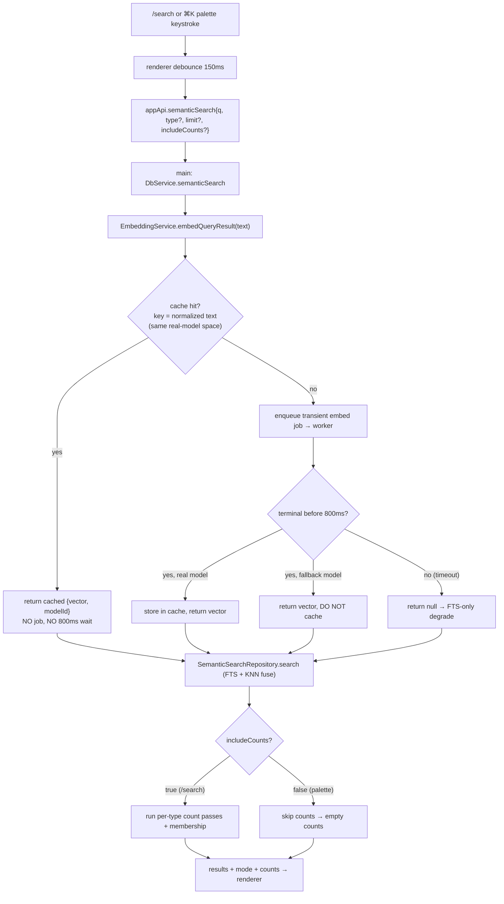

# fix: Search typing stutter, query-embedding cache, and palette semantic search

## Summary

Three related improvements to local search:

1. **Stop the `/search` typing stutter.** Verified root cause is **renderer re-render cost**, not synchronous embedding. The query already embeds in a DB-free `utilityProcess` worker over async IPC and is debounced 150 ms, so no embedding work happens while typing. The stutter comes from the controlled `<input value={rawQuery}>` living inside the large `LibraryScreen`, so every keystroke synchronously re-renders the full results list (with per-row `highlight()` tokenization) and the concept-heavy filterbar — none of whose data changed. Fix: isolate the fast-updating input state so typing no longer re-renders the heavy subtree.
2. **Add a query-embedding cache.** Every semantic query enqueues a fresh transient worker `embed` job today; there is no query-text→vector cache. Add a bounded in-memory, **model-id-keyed** cache in `EmbeddingService` so repeat queries (backspace/retype, re-runs, the palette's tight loop) return instantly and stop churning the worker.
3. **Make the command palette use embeddings.** The ⌘K command palette (the "comment palette" in the request) searches sources via the FTS-only `search.query` path, creating two inconsistent search experiences. Route it through the same `semantic.search` the main search uses, behind a new lightweight `includeCounts:false` path so the palette stays off the heavy facet-count work.

This is desktop renderer + main-process work plus one IPC-contract extension. **No SQLite migrations and no `operation_log` entries** — embeddings and query caches are derived index data, explicitly exempt from the operation-log invariant.

---

## Problem Frame

The user reports: (a) typing in `/search` "stutters" and characters lag behind keystrokes — suspected to be synchronous embedding generation freezing the UI; (b) no query caching despite everything being local; (c) the command palette's search doesn't use embeddings, so the app has two different searches.

What the research established (and corrected):

- **There is no synchronous embedding or synchronous IPC anywhere in the typing path.** Model inference runs only in the `utilityProcess` worker (`apps/desktop/src/worker/embedding-model.ts`), reached via async `ipcRenderer.invoke`; there is no `sendSync` in the codebase. The query is debounced 150 ms before any bridge call, so fast typing fires zero embeds. The user's "synchronous embedding freeze" hypothesis is therefore **not** the mechanism — this must be stated honestly.
- **The real stutter** is the standard React controlled-input cost: `rawQuery` is `LibraryScreen` state (`apps/web/src/library/LibraryScreen.tsx:152`, input at `:518-527`). Each keystroke calls `setRawQuery` → synchronous re-render of `LibraryScreen` → re-render of the results list (`renderResult` builds a `<button>` per row, each calling `highlight()` which lowercases + scans + constructs nodes, `LibraryScreen.tsx:437-479`) and the filterbar that maps over every concept chip (`:557-611`). None of that data changes on a keystroke — only the input value does.
- **Query embeds are uncached.** `EmbeddingService.embedQueryResult` enqueues a `persist:false` job and recovers the vector from a per-jobId `pendingQueryVectors` map that is deleted immediately after read (`apps/desktop/src/main/embedding-service.ts:118,349-378`). There is no keyed text→vector cache.
- **`semanticSearch` is count-heavy.** It runs the fusion four times per call (one main pass + one per type for `byType` counts) plus a concept-membership lookup (`apps/desktop/src/main/db-service.ts:3032-3046`). The palette needs eight source rows and no facet counts, so it must opt out of that work — mirroring the existing `includeCounts:false` lever on the FTS `search.query` path (`apps/desktop/src/shared/contract.ts:5415-5419`).

---

## Scope Boundaries

**In scope**

- Renderer: isolate `/search` input state so typing does not re-render the results/filterbar subtree.
- Main: bounded, model-id-keyed in-memory query-embedding cache in `EmbeddingService`, shared by all query-embed consumers.
- Contract + main: add optional `includeCounts` to `SemanticSearchRequestSchema`; skip the per-type count passes when `false`.
- Renderer: route the command palette's source search through `semantic.search`.
- Tests for each unit; preserve existing search/palette tests.

**Out of scope / non-goals**

- Changing the embedding model, dimension, fusion algorithm (RRF), or the `vec0` store.
- Persisting query embeddings to SQLite (in-memory is sufficient and avoids schema/migration surface — see Open Questions).
- Reworking the index-build/maintenance supervisor or status surfaces.
- Adding semantic search to other surfaces (Browse box redirect, review-mode deck) beyond the shared cache benefit they get for free.

### Deferred to Follow-Up Work

- Sharing the isolated search-input component with `BrowseScreen`'s redirect box (`apps/web/src/library/BrowseScreen.tsx:316`).
- A persistent (SQLite) query-embedding cache if memory-only proves insufficient across restarts.
- `/ce-compound` capture of the "where the stutter actually was" + cache-keying-by-model-id learnings (handled by the ce-compound step of this task, not an Implementation Unit).

---

## Key Technical Decisions

**KTD1 — Fix the stutter by isolating fast input state, not by moving embeddings off-thread.** Embeddings are already off-thread and debounced; the freeze is renderer reconciliation. The decision is to **extract a self-contained `LibrarySearchField`** that owns the raw text and its 150 ms debounce and emits only the debounced value upward. Because `rawQuery` then no longer lives in `LibraryScreen`, a keystroke re-renders only the tiny field, never the results/filterbar tree (which is driven by `debouncedQuery` and other state that changes at most every 150 ms). _Alternative considered:_ keep state central and wrap the results list + filterbar in `React.memo`. Rejected as primary because memo correctness depends on every downstream prop staying referentially stable — easy to regress silently. Field isolation is structurally guaranteed. (The memo approach remains a valid fallback if field extraction proves disruptive to route-sync/focus behavior.)

**KTD2 — In-memory, model-id-keyed query-embedding cache, not persistent.** Key by normalized query text within a single active real-model space; store only real-model vectors (never `FALLBACK_EMBEDDING_MODEL_ID`), and drop the whole cache if the active model id changes so a cached vector can never be served against a different model space (per `CONCEPTS.md`: an embedding belongs to the model that produced it; equal length is not comparability). In-memory keeps it derived/transient, adds no schema/migration/`operation_log` surface, and a cache hit enqueues **no** job — which also sidesteps the "query embed in flight reads as index building" trap fixed in commit `49fe02e4`. Persistent caching is deferred.

**KTD3 — Cache hit returns before timeout; cache lives in `EmbeddingService`.** The cache is checked at the top of `embedQueryResult`, before enqueueing, so warm queries skip the worker round-trip and the 800 ms `QUERY_EMBED_TIMEOUT_MS` entirely. Placing it in `EmbeddingService` (the single query-embed seam) means global `/search`, the palette, and review-mode semantic decks all benefit without per-caller changes.

**KTD4 — Extend the existing semantic command with `includeCounts`; do not add a palette-only IPC endpoint.** Mirrors the FTS `search.query` lightweight contract and the documented precedent (prefer extending a typed command with an explicit lightweight option over a parallel endpoint). The palette calls `semanticSearch({ q, type: "source", limit: 8, includeCounts: false })`; `semanticSearch` already degrades to FTS when `vec0`/model is unavailable, so this also unifies the palette's fallback behavior for free.

---

## High-Level Technical Design

Query-embedding flow after the cache (U2/U3), and where the palette joins (U4):

The renderer stutter fix (U1) is orthogonal to this flow — it changes only *where* `rawQuery` state lives so that the keystroke→re-render path no longer touches the heavy subtree. It is directional guidance, not a spec.

---

## Implementation Units

### U1. Isolate the `/search` input so typing stops re-rendering the heavy subtree

**Goal:** Eliminate the typing stutter by ensuring a keystroke in the `/search` box re-renders only the input, not the results list or filterbar.

**Requirements:** Bug (a) — fluid typing in `/search`.

**Dependencies:** none.

**Files:**
- `apps/web/src/library/LibrarySearchField.tsx` (new) — self-contained, memoized search input that owns raw text + the 150 ms debounce and emits the debounced value.
- `apps/web/src/library/LibraryScreen.tsx` (modify) — replace the inline `<input value={rawQuery}>` + the `rawQuery`/debounce machinery (`:152,238-246,518-527`) with `<LibrarySearchField>`; keep `debouncedQuery` as the search/highlight driver; preserve route-sync reset (`:228-236`) and focus behavior.
- `apps/web/src/library/LibrarySearchField.test.tsx` (new).
- `apps/web/src/library/LibraryScreen.test.tsx` (modify if assertions reference the moved input/debounce internals).

**Approach:** `LibrarySearchField` holds its own `value` state, runs the existing 150 ms debounce, and calls `onDebouncedChange(value)`. It accepts an `initialQuery` / external sync signal so that when the route's `q` changes from outside (e.g., navigation from Browse), the field's text updates and it refocuses. Keep `data-testid="library-search-input"`, `type="search"`, the search icon, the placeholder string verbatim, and the autofocus-as-primary-action behavior. `LibraryScreen` no longer holds `rawQuery`; it holds only `debouncedQuery` (initialized from `routeQuery`) which drives the search effect (`:304-394`) and `highlight()` (`:454,471`). Net effect: a keystroke updates field-local state at 60 fps; the parent re-renders at most every 150 ms.

**Patterns to follow:** the existing debounce shape (`LibraryScreen.tsx:238-246`); the palette's open/close reset + min-length discipline (`CommandPalette.tsx:138-168`) as a reference for clean field-local state.

**Test scenarios:**
- Typing rapidly into the field updates the visible input value on every keystroke (no dropped characters); the field is controlled and reflects each change.
- The debounced value is emitted only after 150 ms of quiet (fake timers): N fast keystrokes emit one debounced value, not N.
- Typing into the field does **not** re-render the results list / filterbar: assert via a render-counting spy on a memoized results/filterbar child (or assert the heavy child receives identical props across keystrokes and is `React.memo`-wrapped). This is the regression guard for the stutter.
- Route-`q` change from outside resets the field text to the new value and refocuses (covers the `:228-236` behavior).
- Existing `/search` behavior intact: debounced search still fires with the trimmed query; empty query path still calls `libraryBrowse`; focus lands on the input on mount.
- `Test expectation:` includes a perf-regression assertion (heavy subtree not re-rendered on keystroke) — the load-bearing test for this unit.

**Verification:** In the running app, typing in `/search` is fluid with a populated result list; React Profiler shows keystrokes committing only the field, not the results/filterbar.

---

### U2. Query-embedding cache in `EmbeddingService`

**Goal:** Make repeat query embeds instant and stop per-keystroke worker churn by caching query text→vector in memory, scoped to the active real-model space.

**Requirements:** Improvement (b) — cache the query; also reduces worker load behind both `/search` and the palette.

**Dependencies:** none (independent of U1).

**Files:**
- `apps/desktop/src/main/embedding-service.ts` (modify) — add a bounded LRU/`Map` cache; check it at the top of `embedQueryResult` (`:349`); populate after a successful real-model recover (`:377`); skip fallback; reset on model-id change.
- `apps/desktop/src/main/embedding-service.test.ts` (modify) — cache hit/miss/eviction/model-id-reset/fallback-exclusion coverage.

**Approach:** Add `queryVectorCache: Map<string, QueryEmbeddingResult>` plus a `cacheModelId: string | null`. Normalize the key (trim + lowercase + collapse internal whitespace). In `embedQueryResult(text)`: compute the key; if present, return the cached `{vector, modelId}` immediately (no enqueue, no timeout). On miss, run the existing enqueue→recover path; when a terminal real-model vector is recovered: if `result.modelId === FALLBACK_EMBEDDING_MODEL_ID`, return it but do **not** cache; else, if `result.modelId !== cacheModelId`, clear the cache and set `cacheModelId = result.modelId` (model-space change), then insert (evicting oldest beyond a small cap, e.g. 256). Timeout/`null` results are not cached. Because the cache only ever holds vectors from the single current real-model space and is dropped on a model-id change, a hit is always safe to return directly.

**Patterns to follow:** `PENDING_QUERY_MAX`-style bounded map cap (`embedding-service.ts:67`); the model-isolation rule from `docs/solutions/architecture-patterns/local-only-semantic-search-sqlite-vec-model-isolation.md` and the fallback-never-persisted rule from `docs/solutions/architecture-patterns/self-healing-derived-index-supervisor.md`.

**Test scenarios:**
- Miss then hit: first `embedQueryResult("foo")` enqueues a job; a second identical call returns the cached vector without enqueueing (assert the runner/enqueue is not called the second time).
- Normalization: `"  Foo  "` and `"foo"` resolve to the same cache entry.
- Fallback exclusion: when the recovered result is `FALLBACK_EMBEDDING_MODEL_ID`, the value is returned but a subsequent identical call still enqueues (not cached).
- Model-id change clears the cache: a cached real-model vector under model A is dropped when a later result reports model B; the next call for the same text re-embeds under B.
- Bounded size: inserting beyond the cap evicts the oldest; cache never grows unbounded.
- Timeout result (`null`) is not cached: a timed-out query does not poison the cache; a later call retries.
- A cache hit does not enqueue an `embed` job, so it cannot affect `embedJobStats()` / index-health (regression tie to commit `49fe02e4`).

**Verification:** Re-running the same `/search` query (or retyping after backspace) returns results with no new `embed` job; `db-service.test.ts` semantic tests still pass.

---

### U3. Add `includeCounts` to the semantic search contract; skip count passes when false

**Goal:** Let compact callers (the palette) run one fused pass for N rows without the four-pass facet-count work.

**Requirements:** Enables bug (c) without regressing `/search` latency.

**Dependencies:** none (independent), but **required by U4**.

**Files:**
- `apps/desktop/src/shared/contract.ts` (modify) — add `includeCounts: z.boolean().optional()` to `SemanticSearchRequestSchema` (`:5468-5472`) with a doc comment mirroring the FTS one (default `true` preserves `/search`).
- `apps/desktop/src/main/db-service.ts` (modify) — in `semanticSearch` (`:2997-3054`), when `includeCounts === false`, run the single fused pass for `results` and return `counts: EMPTY_SEARCH_COUNTS` (or zeroed), skipping the per-type `runFused` passes (`:3044-3046`) and the `liveMembershipMap`/`foldSearchFacetCounts` work.
- `apps/web/src/lib/appApi.ts` (verify/modify) — ensure `semanticSearch` forwards `limit` + `includeCounts` through to the bridge (it forwards the request object; confirm typing picks up the new field).
- `apps/desktop/src/main/db-service.test.ts` (modify) — assert counts are computed when omitted/true and skipped when false; results/mode unchanged.

**Approach:** Additive, backward-compatible schema field. The default (`undefined`/`true`) keeps `/search` semantics byte-for-byte. `includeCounts:false` returns the same `results` and `mode` with empty counts and avoids the extra fusion passes + concept-membership query.

**Patterns to follow:** the exact `includeCounts` lever already on `SearchQueryRequestSchema` (`contract.ts:5415-5419`) and how `search()`/FTS honors it.

**Test scenarios:**
- Omitted `includeCounts` → counts computed exactly as today (no behavior change for `/search`); existing semantic count tests pass.
- `includeCounts:false` → `results` and `mode` identical to the `true` run for the same query, but `counts` is empty/zeroed and the per-type passes are not executed (assert via spy on the fusion repo or membership call count).
- `limit` + `includeCounts:false` together cap results and skip counts.
- `includeCounts:true` explicit behaves like omitted.

**Verification:** `/search` filterbar counts unchanged; a `includeCounts:false` call returns rows with no facet-count cost.

---

### U4. Route the command palette source search through semantic search

**Goal:** Make the ⌘K command palette ("comment palette") surface meaning-related sources like the main search, instead of FTS-only.

**Requirements:** Bug (c) — one consistent embedding-based search.

**Dependencies:** U3 (needs `includeCounts` on the semantic request); benefits from U2 (cache keeps the tight per-keystroke loop cheap).

**Files:**
- `apps/web/src/shell/CommandPalette.tsx` (modify) — replace the `appApi.searchQuery({ q, type: "source", limit: 8, includeCounts: false })` call (`:206-212`) with `appApi.semanticSearch({ q, type: "source", limit: SOURCE_SEARCH_LIMIT, includeCounts: false })`; map `res.results` through the existing `isSourceResult` filter (`:53-55,213-216`).
- `apps/web/src/shell/CommandPalette.test.tsx` (modify) — semantic call + mapping, fallback, stale-guard coverage.

**Approach:** `SemanticSearchResultRow extends SearchResult`, so `isSourceResult`, `source.title`, and `source.snippet` all read identically — only the call and its result field (`res.results`) change. Preserve the existing request-id guard (`sourceRequestRef`), 150 ms debounce, `SOURCE_SEARCH_MIN_LENGTH`, the close/open state reset, and `type: "source"` scoping. `semanticSearch` degrades to FTS internally when `vec0`/model is unavailable, so the palette transparently keeps working (now sharing one search path). Accept the latency trade-off: the first uncached query for a term waits for the worker embed (≤800 ms, then FTS degrade), which the existing "Searching sources…" loading state and request-id guard already cover; cached repeats (U2) are instant.

**Patterns to follow:** the palette's existing async discipline (`CommandPalette.tsx:171-227`) and the documented command-palette source-search learning (`docs/solutions/ui-bugs/command-palette-source-lookup-search-query.md`) — keep `includeCounts:false`, min-length and reset behavior intact.

**Test scenarios:**
- Typing ≥2 chars calls `appApi.semanticSearch` (not `searchQuery`) with `type:"source"`, `limit:8`, `includeCounts:false`.
- Semantic ("related") source rows that lack a keyword match are surfaced in the palette and are runnable (open `/source/$id`).
- Result mapping: `res.results.filter(isSourceResult)` renders title + snippet identically to before.
- Graceful degrade: when `semanticSearch` returns `mode:"fts"`/`"disabled"`, the palette still lists keyword source hits (no error state).
- Stale-response guard holds: a slow earlier query (now slower due to the embed) cannot overwrite a newer query's results (request-id guard); close/reopen resets results, status, and request id.
- `<2` chars shows "too-short" and crosses no bridge; closing the palette cancels in-flight work.
- Covers the cross-surface parity goal: palette and `/search` use the same retrieval seam.

**Verification:** ⌘K, type a concept-only term, and a related source appears (same as `/search`); with semantic unavailable the palette still returns keyword source hits.

---

## System-Wide Impact

- **Shared seam:** U2 and U3 change the single `EmbeddingService.embedQueryResult` / `DbService.semanticSearch` path used by `/search`, the palette, and review-mode semantic decks (`packages/local-db/src/review-mode-service.ts`). The cache must stay correct across all three; tests should cover that a cache hit is model-space-correct.
- **Index-health invariant:** cache hits enqueue no job, preserving commit `49fe02e4`'s guarantee that query embeds never read as "index building."
- **No persistence/log surface:** derived data only — no migration, no `operation_log`, no lineage change. Honors the local-db invariants without touching them.
- **Contract additivity:** `includeCounts` is optional with a back-compat default; no existing caller changes behavior.

---

## Risks & Mitigations

- **Memo/field-isolation regresses route-sync or focus (U1).** Mitigation: explicit tests for route-`q` reset + focus; keep the `library-search-input` testid and placeholder so existing E2E/selectors hold.
- **Cache serves a wrong-model vector (U2).** Mitigation: store only real-model vectors, key within one model space, drop the cache on model-id change; unit tests for fallback exclusion and model-id reset.
- **Palette feels slower on first keystrokes (U4).** Mitigation: U2 cache + existing debounce/min-length/loading state; semantic degrades to FTS at the 800 ms ceiling, so worst case equals today's behavior.
- **Skipping counts diverges results from `/search` (U3).** Mitigation: assert `results`/`mode` identical between `includeCounts` true/false for the same query.

---

## Definition of Done

1. `pnpm lint`
2. `pnpm typecheck`
3. `pnpm test`
4. Relevant Electron `pnpm e2e` for `/search` typing fluidity and palette semantic results (extend `tests/electron/semantic-search.spec.ts` / `tests/e2e/smoke.spec.ts` / `tests/electron/keyboard.spec.ts` as fits).

Plus: confirm `/search` filterbar counts unchanged, the palette returns related (semantic) sources and still degrades to keyword when semantic is off, and no new `embed` job is enqueued on a cached repeat query.
