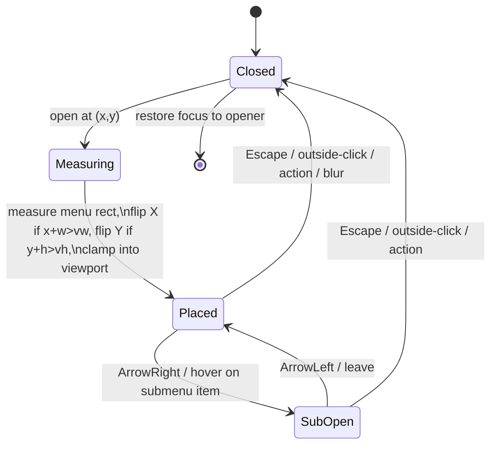

# feat: Right-click context menu for lineage tree nodes

## Summary

Add an in-app (React, **not** Electron-native) right-click context menu to lineage tree
nodes in the Inspector. The menu is built on a newly-extracted, reusable `ContextMenu`
primitive that generalizes the popover mechanics currently hand-rolled inside
`LineageDeleteMenu` (outside-click close, Escape + focus restore, arrow-key nav, role/aria,
token-only CSS) and adds a positioning mode the codebase has never had: cursor-anchored
`position: fixed` at `clientX/clientY` with viewport-edge flipping, plus one level of
submenu (for "Set priority").

The menu offers a type-aware action catalog keyed on `node.type`
(`source`/`topic`/`extract`/`card`) and `node.deleted` (tombstone). Every action dispatches
an existing `window.appApi.*` command, the renderer router, or the clipboard — except two
gaps the research surfaced (see Key Technical Decisions): **Rename** (no backing command
today) and **Copy reference / deep-link** (no convention today). Delete is routed through
the **same** `useLineageDelete` flow as `LineageDeleteMenu` (count-descendants pre-flight +
soft-delete + Undo), never a second delete path. The always-visible inline Restore control
on tombstones (a11y contract T135 / U2) is preserved unchanged; the menu *adds* permanent
purge and ancestor-chain restore on top of it.

This is a follow-up on T135 (lineage-aware deletion); it does not have its own roadmap task
number.

---

## Problem Frame

`LineageTree` (`apps/web/src/components/inspector/LineageTree.tsx`) renders the flattened,
depth-tagged element hierarchy in the Inspector. Today the only per-node affordances are
left-click (navigate/select) and, on tombstones, an inline Restore button. Power actions
that already exist as `appApi` commands — set priority, advance an extract's stage, suspend
a card, delete a subtree, purge a tombstone — are scattered across other surfaces (reader,
queue, trash) and are not reachable from the tree where the user is actually looking at the
lineage. A right-click context menu brings those actions to the node under the cursor,
type-aware, without leaving the Inspector.

The work must respect the project's non-negotiables: the renderer never touches SQLite/FS;
mutations are command-shaped via the typed IPC bridge; soft-delete/undo is preferred over
irreversible loss; UI uses `design/tokens.css` tokens (light + dark) and `lucide-react`
icons via `design/icon-map.md`; and the T135/U2 inline-Restore a11y contract is preserved.

---

## Requirements

- **R1 — Reusable primitive.** Extract a `ContextMenu` primitive that reuses the
  `LineageDeleteMenu` popover mechanics (outside-click close, Escape + focus restore,
  arrow-key nav over `[data-menu-action]`, role/aria, token CSS) and renders at a supplied
  cursor position with viewport-edge flipping. `LineageDeleteMenu`'s observable behavior is
  unchanged (it may consume the primitive, but is not required to for this PR — see KTD2).
- **R2 — Open on right-click.** `onContextMenu` on the tree-node button calls
  `e.preventDefault()` and opens the menu at `e.clientX/e.clientY`. Native browser context
  menu is suppressed only on the node.
- **R3 — Type-aware catalog.** Build the action list from `node.type` and `node.deleted`:
  - All live nodes: Open, Copy reference, Copy text, Set priority (submenu A/B/C/D),
    Rename…, Delete.
  - Extract adds: Advance stage, Create card, Postpone, Mark done.
  - Card adds: Suspend, Flag leech, Retire.
  - Tombstone (`node.deleted`): Restore, Restore ancestor chain, separator, Delete
    permanently… (destructive, confirm step).
- **R4 — Single delete path.** "Delete" routes through the existing `useLineageDelete`
  controller (`appApi.countDescendants` pre-flight → `appApi.softDeleteSubtree` / honorable
  intents + Undo). No second soft-delete call site.
- **R5 — Preserve inline Restore.** The always-visible, keyboard-reachable inline Restore
  button on tombstones (T135/U2) stays exactly as-is. The menu is additive.
- **R6 — Command-shaped dispatch.** Every mutating action is an existing typed `appApi`
  command (or, for Rename, the existing element-update/`operation_log` path — KTD1). No
  renderer-side persistence, no new generic IPC.
- **R7 — Theming + a11y.** Light + dark via tokens; `role="menu"`/`menuitem`; full keyboard
  operability (open via keyboard context-menu key is a nice-to-have, not required);
  focus returns to the previously-focused element on close.
- **R8 — Definition of Done.** `pnpm lint`, `pnpm typecheck`, `pnpm test`, and Electron
  Playwright e2e for the right-click → IPC paths, including restart-persistence for any
  persistence-affecting action.

---

## Key Technical Decisions

### KTD1 — Rename rides the existing element-update / `operation_log` path (no new op type, no migration)

Research found **no** `rename`/`updateTitle`/`setTitle` command in the bridge. Rather than
invent a new op type (risky for op-log replay/undo — see the heterogeneous-batch-undo
learning) or a migration (the repo has a recent migration-induced lineage-wipe scar), Rename
reuses the **same element-update machinery `setElementPriority` already rides** to update the
universal `elements.title` column inside one transaction that appends to `operation_log`.

- **Verify-first in U3:** confirm `elements.title` is a mutable column reachable by an
  existing update path, and that priority's op type (or a generic `update_element`) can carry
  a title field. If a clean reuse is not available, **fall back**: omit "Rename…" for the
  unsupported type(s) and record it under Deferred — do **not** add a new op type or a
  migration in this PR.
- Rename UI is an inline text field inside the menu (commit on Enter, cancel on Escape),
  not a separate modal.

### KTD2 — Ship the primitive; refactor `LineageDeleteMenu` to consume it is optional this PR

The safest scope is to extract `ContextMenu` and build the new lineage menu on it, leaving
`LineageDeleteMenu`'s internals untouched so its T135 tests/e2e stay green by construction.
Refactoring `LineageDeleteMenu` onto the primitive is desirable but is **deferred to
follow-up** unless it falls out cleanly with no behavior change. This avoids regressing a
3-day-old, three-reviewer-hardened surface.

### KTD3 — `LineageTree` stays pure; the host owns the menu

`LineageTree` must not call `appApi` (layering rule: "ONLY renders + navigates"). It gains a
single new optional prop `onNodeContextMenu(node, { x, y })`. A new container
`LineageContextMenu` (mounted by `Inspector`) owns menu state, builds the catalog, and
dispatches via `appApi` / the router / `useLineageDelete` / the clipboard. This mirrors how
`onPick`/`onRestore` already delegate from tree → Inspector.

### KTD4 — "Copy reference" defines a deep-link string convention; no OS protocol handler this PR

There is no deep-link infra. "Copy reference" copies a canonical, stable string
`interleave://element/<id>` (a pure, unit-tested helper) to the clipboard with a toast.
Registering an OS `interleave://` protocol handler is **desktop-main** work out of scope for
a renderer context menu and is deferred. "Copy text" copies `node.title` via
`navigator.clipboard.writeText` + toast, mirroring `ExtractView`/`SourceReader`.

### KTD5 — "Create card" and "Advance stage" map to real commands; "Create card" navigates

`appApi.updateExtractStage({ id })` (omit `stage` → advance one step), `postponeExtract`,
`markExtractDone`, `suspendCard`, `markLeechCard`, `retireCard` are dispatched directly.
"Create card" needs a multi-field CardBuilder, so it **navigates** to the extract surface
(`/extract/$id`) rather than firing `createCard` with empty fields. Cards have **no**
"Postpone" (FSRS-scheduled, by design) — it is not offered on cards.

### KTD6 — In-flight guard resets on `busy`, not on `open→close`

Carry forward the documented `LineageDeleteMenu` pitfall: a fast-path action that resolves
without the menu staying open must not deadlock. Any submit guard resets when the host's
busy state settles, not on a menu open→close transition.

---

## High-Level Technical Design

Layering and dispatch (keeps `LineageTree` pure; host owns IPC):

```mermaid
flowchart TD
  subgraph render [Renderer — presentational]
    LT["LineageTree button\nonContextMenu → preventDefault\n→ onNodeContextMenu(node, {x,y})"]
  end
  subgraph host [Inspector / LineageContextMenu container]
    ST["menu state {node, x, y, open}"]
    CAT["buildLineageNodeMenu(node, handlers)\n→ ContextMenuItem[]"]
    CM["<ContextMenu open position items onClose>"]
    ULD["useLineageDelete (delete intents + Undo)"]
  end
  subgraph bridge [window.appApi (typed IPC)]
    API["setElementPriority · updateExtractStage ·\npostpone/markDone · suspend/markLeech/retire ·\ncountDescendants/softDeleteSubtree ·\nrestoreAncestorChain · purgeFromTrash · (rename)"]
  end
  LT -->|node + cursor| ST --> CAT --> CM
  CM -->|Open| RT["router.navigate(/source|extract|card/$id)"]
  CM -->|Copy ref / text| CLIP["navigator.clipboard + toast"]
  CM -->|Delete| ULD --> API
  CM -->|priority/stage/card/restore/purge/rename| API
  API -->|refresh| ST
```

`ContextMenu` positioning state machine (the net-new behavior):



---

## Implementation Units

### U1. Extract the reusable `ContextMenu` primitive

**Goal:** A controlled, token-styled, keyboard-navigable menu that renders at a supplied
cursor position with viewport-edge flipping and one level of submenu, generalizing the
`LineageDeleteMenu` popover mechanics.

**Requirements:** R1, R7.

**Dependencies:** none.

**Files:**
- `apps/web/src/components/menu/ContextMenu.tsx` (new)
- `apps/web/src/components/menu/context-menu.css` (new; class names namespaced under a
  `.ctxmenu` root to avoid global CSS leakage in this Vite renderer)
- `apps/web/src/components/menu/ContextMenu.test.tsx` (new)
- `apps/web/src/components/menu/types.ts` (new; `ContextMenuItem` discriminated union)

**Approach:**
- Controlled API: `<ContextMenu open position={{x,y}} items onClose />`. Parent owns open +
  position. `items` is a typed array: `{ kind: "action" | "submenu" | "separator", ... }`
  with `label`, `icon?`, `danger?`, `disabled?`, `onSelect?`, and `items?` for submenus.
- Reuse verbatim from `LineageDeleteMenu` (lines 157–188): outside-click `mousedown` close,
  Escape close + focus restore, ArrowDown/ArrowUp cycling over `[data-menu-action]` with
  wraparound, default-focus first item on open.
- New positioning: render `position: fixed` at `{x,y}`; after mount, measure the menu rect
  and flip left when `x + width > innerWidth`, flip up when `y + height > innerHeight`, and
  clamp to a small viewport margin (anchor to the *visible* viewport — see the
  selection-toolbar learning). Recompute on open only; no resize listener needed for v1.
- Submenu: ArrowRight / hover opens the child to the side of the parent item (flip side near
  the right edge); ArrowLeft / Escape closes back to the parent; selecting a child fires its
  `onSelect` and closes the whole menu.
- `role="menu"` on the container, `role="menuitem"` (+ `aria-haspopup="menu"`,
  `aria-expanded` for submenu parents) on items; `aria-orientation="vertical"`. Restore focus
  to `document.activeElement` captured at open time on close.
- Guard reset keyed on a `busy` prop, never on open→close (KTD6).

**Patterns to follow:** `LineageDeleteMenu.tsx` keyboard/outside-click block; `ScheduleMenu`
`role="menu"`/`menuitem`; `lineage-delete-menu.css` token-only styling; `Icon`/`IconName`.

**Test scenarios (`ContextMenu.test.tsx`):**
- Renders nothing when `open={false}`; renders `role="menu"` with one `menuitem` per action
  item when open.
- Positions at the supplied `{x,y}` (assert inline `left/top` style).
- Edge flip: with a position near the right/bottom edge (mock `innerWidth/innerHeight` and
  `getBoundingClientRect`), the menu flips left/up rather than overflowing.
- ArrowDown/ArrowUp cycle focus across items with wraparound; first item is focused on open.
- Escape closes and calls `onClose`; focus returns to the opener element.
- Outside `mousedown` closes; inside click on an item fires its `onSelect` and closes.
- Submenu: ArrowRight opens the child, ArrowLeft closes it, selecting a child fires its
  `onSelect`; `aria-haspopup`/`aria-expanded` reflect submenu state.
- `disabled` item is not selectable and is skipped by arrow nav; `separator` renders a
  non-focusable divider.

**Verification:** Unit tests green; primitive imported by U5 with no behavior change to
`LineageDeleteMenu`.

---

### U2. Deep-link + clipboard helpers

**Goal:** Pure, testable helpers for "Copy reference" and "Copy text".

**Requirements:** R3 (Copy reference, Copy text), R6.

**Dependencies:** none.

**Files:**
- `apps/web/src/lib/deep-link.ts` (new) — `elementDeepLink(id: string): string` →
  `interleave://element/<id>`; optionally `elementRoutePath(type, id)` reusing the existing
  route shape (`/source|extract|card/$id`).
- `apps/web/src/lib/deep-link.test.ts` (new)
- (clipboard + toast is invoked inline in U5 using the existing `navigator.clipboard` + toast
  pattern; no new wrapper unless one already exists.)

**Approach:** Keep the reference-string convention in one place so a future protocol handler
can reuse it. No IPC.

**Test scenarios:** `elementDeepLink("abc")` → `"interleave://element/abc"`; route path maps
each type to its route; unknown/empty id handled (throws or returns a safe value — pick one
and assert it).

**Verification:** Unit tests green.

---

### U3. Rename via existing element-update / `operation_log` path

**Goal:** Persist a title rename through the existing command/op-log machinery — no new op
type, no migration (KTD1).

**Requirements:** R3 (Rename…), R6.

**Dependencies:** none (independent of U1).

**Execution note:** Verify-first. Before wiring UI, confirm in `packages/local-db` /
`apps/desktop/src/shared/contract.ts` that `elements.title` is updatable through the path
`setElementPriority` uses (or a generic element-update). If no clean reuse exists, take the
KTD1 fallback (omit Rename for unsupported types; record under Deferred) rather than adding a
new op type or migration.

**Files (only those the verified reuse requires):**
- `apps/desktop/src/shared/contract.ts` — extend the existing element-update request/result
  schema to carry an optional `title`, or add a thin `elements:rename` request that reuses
  the same op.
- `apps/desktop/src/shared/channels.ts` — channel constant if a dedicated channel is used.
- `apps/desktop/src/main/ipc.ts` — handler delegating to the repository update.
- `packages/local-db/...` (the elements repository that owns the priority/update mutation) —
  title update inside the **same transaction** that appends to `operation_log`.
- `apps/web/src/lib/appApi.ts` — preload typedef + renderer wrapper `renameElement({ id, title })`.
- Tests: repository unit test + IPC validation test (below).

**Approach:** Smallest possible reuse of the proven element-update path. Trim/validate the
title (non-empty after trim; reject control chars). Server-authoritative result returns the
updated element so the Inspector can refresh.

**Test scenarios:**
- Repository: rename updates `elements.title`, writes one `operation_log` row in the same
  transaction, and the change survives a fresh read (and, in e2e, restart).
- Empty/whitespace-only title is rejected (no write, no op-log row).
- IPC: malformed payload (missing `id`, non-string `title`) is rejected before the DB
  service is invoked (mirror the extract→card IPC-invariant hardening learning).
- Foreign keys / lineage untouched (no parent/source nulling — explicit assertion, given the
  migration-0030 scar).

**Verification:** `pnpm test` green for the new repo/IPC tests; manual rename round-trips in
`pnpm dev`.

---

### U4. Type-aware action-catalog builder

**Goal:** A pure function that maps a node + handler bag to `ContextMenuItem[]`.

**Requirements:** R3, R5.

**Dependencies:** U1 (item types).

**Files:**
- `apps/web/src/components/inspector/lineageNodeActions.ts` (new) —
  `buildLineageNodeMenu(node, handlers): ContextMenuItem[]`.
- `apps/web/src/components/inspector/lineageNodeActions.test.ts` (new)

**Approach:** No IPC, no React — just catalog assembly. Handlers (open, copyReference,
copyText, setPriority, rename, delete, advanceStage, createCard, postpone, markDone, suspend,
flagLeech, retire, restore, restoreAncestorChain, purge) are injected so the builder is
trivially unit-testable. Priority is a submenu item with four children (A/B/C/D), each
calling `setPriority(node, letter)`. Tombstone branch returns Restore, Restore ancestor
chain, separator, Delete permanently… (danger). Card branch omits Postpone (KTD5). Use the
icon-map names: `external`/`eye` (open), `link` (copy ref), `copy` (copy text), priority tag,
`edit` (rename), `trash` (delete), `target`/`sparkle` (advance stage), `plus` (create card),
`pause` (postpone), `checkCircle` (mark done), `pause2` (suspend), `leech` (flag leech),
`restore` (restore/retire as appropriate).

**Test scenarios:**
- `source`/`topic` node → exactly the six "All" items in order, with a 4-child priority
  submenu; no extract/card-only items.
- `extract` node → All items **plus** Advance stage, Create card, Postpone, Mark done.
- `card` node → All items **plus** Suspend, Flag leech, Retire; **no** Postpone.
- Tombstone (`deleted: true`) of any type → Restore, Restore ancestor chain, separator,
  Delete permanently… (danger) — and none of the live-node actions.
- If Rename is unsupported for a type (KTD1 fallback), it is absent (guard via a capability
  flag passed into the builder).
- Each item's `onSelect` calls the matching handler with the node (and priority letter for
  submenu children).

**Verification:** Unit tests green; builder has zero React/appApi imports.

---

### U5. `LineageContextMenu` container + `LineageTree` wiring

**Goal:** Open the menu on right-click and dispatch every action through the right channel.

**Requirements:** R2, R3, R4, R6, R7.

**Dependencies:** U1, U2, U3, U4.

**Files:**
- `apps/web/src/components/inspector/LineageTree.tsx` — add optional
  `onNodeContextMenu?(node, { x, y })`; on the tree-node button add
  `onContextMenu={(e) => { if (onNodeContextMenu) { e.preventDefault(); onNodeContextMenu(n, { x: e.clientX, y: e.clientY }); } }}`.
  No other change; inline Restore button untouched (R5).
- `apps/web/src/components/inspector/LineageContextMenu.tsx` (new) — owns
  `{ node, position, open }` state, builds the catalog via `buildLineageNodeMenu`, renders
  `<ContextMenu>`, and wires handlers:
  - Open → `useNavigate()` to `/source|extract|card/$id` (reuse Inspector's existing routing).
  - Copy reference → `navigator.clipboard.writeText(elementDeepLink(node.id))` + toast.
  - Copy text → `navigator.clipboard.writeText(node.title)` + toast.
  - Set priority → `appApi.setElementPriority({ id, action: { kind: "set", priority } })`.
  - Rename… → inline field → `appApi.renameElement({ id, title })` (or capability-gated off).
  - Delete → `useLineageDelete` controller (R4) — **the same** instance/flow
    `LineageDeleteMenu` uses; no direct `softDeleteSubtree`.
  - Advance stage/Create card/Postpone/Mark done/Suspend/Flag leech/Retire → the matching
    `appApi` commands (KTD5).
  - Restore / Restore ancestor chain → `appApi.restoreAncestorChain({ id })` (chain only, up
    to the first live root — per the lineage-deletion learning); plain Restore reuses the
    existing tombstone-restore handler.
  - Delete permanently… → confirm step in the menu → `appApi.purgeFromTrash(...)` (purge is
    refused server-side if it would orphan live descendants; surface that result).
  - After any mutation, call `requestInspectorRefresh()` and honor the stale-lineage guard.
- `apps/web/src/components/inspector/LineageContextMenu.test.tsx` (new)

**Approach:** Thin container; all domain logic is the injected `appApi`/router calls.
Instantiate `useLineageDelete` here so Delete shares the Undo snackbar + op-log semantics.
Reset submit guard on `busy` settle (KTD6).

**Test scenarios (`LineageContextMenu.test.tsx`, mocking `appApi` per the repo's
`vi.hoisted` + partial `vi.mock("../../lib/appApi")` pattern):**
- Right-click the node → menu opens at the cursor position; native context menu suppressed
  (`preventDefault` called).
- Set priority → B dispatches `setElementPriority({ id, action: { kind: "set", priority: "B" } })`.
- Advance stage on an extract → `updateExtractStage({ id })` (no `stage`).
- Suspend on a card → `suspendCard({ cardId: id })`; Flag leech → `markLeechCard`; Retire →
  `retireCard`.
- Delete → goes through `useLineageDelete` (assert `countDescendants` is called; assert
  `softDeleteSubtree` is **not** called directly from the menu).
- Copy reference → clipboard receives `interleave://element/<id>`; Copy text → receives the
  title; both toast.
- Tombstone node → Restore ancestor chain dispatches `restoreAncestorChain({ id })`; Delete
  permanently… requires the confirm step before `purgeFromTrash`.
- Rename commit dispatches `renameElement` (or item absent when capability-gated).
- Escape/outside-click closes; mutation triggers `requestInspectorRefresh`.

**Verification:** Unit tests green; `LineageDeleteMenu` tests still green (untouched).

---

### U6. Inspector integration

**Goal:** Mount `LineageContextMenu` and pass `onNodeContextMenu` to `LineageTree`, without
regressing tombstone gating, the show/hide-deleted toggle, or stale-lineage guards.

**Requirements:** R2, R5, R8.

**Dependencies:** U5.

**Files:**
- `apps/web/src/components/inspector/Inspector.tsx` — render `<LineageContextMenu>` (single
  instance), thread its `onNodeContextMenu` into the existing `<LineageTree>` usage alongside
  `onPick`/`onRestore`/`restoringId`. Keep `visibleLineageNodes`/`deletedAncestorCount`
  depth-normalization and the `selectedIdRef`/`lineage.elementId === element.id` guards
  intact; refresh after menu mutations via the existing `requestInspectorRefresh()`.

**Approach:** Minimal surface change; reuse existing navigation + refresh plumbing.

**Test scenarios:** Covered by U5 unit tests + U7 e2e. `Test expectation: integration wiring
— behavior asserted in U5 (unit) and U7 (e2e).`

**Verification:** `pnpm dev` shows the menu on right-click in the Inspector; toggle + inline
Restore unchanged.

---

### U7. Electron Playwright e2e

**Goal:** Prove the real right-click → IPC paths and restart-persistence.

**Requirements:** R8.

**Dependencies:** U6.

**Files:**
- `tests/electron/lineage-context-menu.spec.ts` (new) — or extend
  `tests/electron/lineage.spec.ts` / `tests/electron/lineage-deletion.spec.ts`.

**Approach:** Use `ensureBuilt()`/`launchApp()`/`makeDataDir()` with an isolated data dir;
drive a real right-click (`button.click({ button: "right" })` or dispatch `contextmenu`),
assert the menu opens (`data-testid` on the menu + items), invoke actions, and assert
effects through the typed bridge / DOM. Add a restart assertion for at least one
persistence-affecting action.

**Test scenarios:**
- Right-click a live extract node → menu opens at cursor; "Advance stage" advances the stage
  (assert the node's stage/meta updates) and **persists across app restart**.
- Right-click → Set priority → A reflects in the node/inspector and persists.
- Right-click → Delete routes through the lineage-delete flow (leaf → quiet soft-delete +
  Undo; subtree → intent menu), and the deleted node is recoverable — i.e. behaves
  identically to the existing Delete path (reuse assertions from `lineage-deletion.spec.ts`).
- Tombstone node → right-click → Restore ancestor chain restores the chain; → Delete
  permanently… (after confirm) purges, and a purge that would orphan live descendants is
  blocked (surface the blocked result).
- The inline Restore button still works and is keyboard-reachable (T135/U2 unchanged).

**Verification:** `pnpm e2e` (the lineage specs) green, including restart persistence.

---

## Scope Boundaries

**In scope:** the `ContextMenu` primitive (cursor positioning + flip + one submenu level),
the type-aware lineage catalog, wiring all listed actions to existing commands / router /
clipboard, the minimal Rename reuse (KTD1), the deep-link string convention (KTD4), tests +
e2e, light/dark token styling.

### Deferred to Follow-Up Work
- Refactoring `LineageDeleteMenu` internals onto the new primitive (KTD2) unless it falls out
  cleanly with zero behavior change.
- Registering an OS `interleave://` protocol handler so "Copy reference" links actually open
  the app (KTD4) — desktop-main work.
- A dedicated `rename_element` op type / migration, if KTD1's reuse path proves unavailable
  (then Rename is capability-gated off for unsupported types this PR).
- Keyboard "context-menu key" / long-press to open the menu without a mouse (nice-to-have).
- `/ce-compound` capture of the new copy-reference/deep-link convention (no prior learning
  exists for it).

**Out of scope:** any second delete path; renderer-side SQLite/FS; multi-select context menu;
drag-and-drop reordering.

---

## Risks & Dependencies

- **Rename backend (U3) is the highest-risk unit.** Mitigated by verify-first + the KTD1
  fallback (no new op type, no migration). Reviewer must confirm no FK/lineage side effects
  (migration-0030 scar) and that `operation_log` is written in-transaction.
- **CSS global leakage** (Vite `import` is app-wide): namespace all new selectors under
  `.ctxmenu`; watch Biome `noDescendingSpecificity`.
- **Regressing T135 surfaces:** keep `LineageDeleteMenu` untouched (KTD2); route Delete
  through `useLineageDelete` so Undo/op-log semantics are identical (R4).
- **Restore-all footgun:** ancestor-chain restore must restore only up to the first live
  root, never every deleted node in the tree.
- **Positioning correctness near viewport edges:** anchor to the visible viewport, measure
  after mount, flip + clamp (selection-toolbar learning).

---

## Sources & Research

- `apps/web/src/components/inspector/LineageTree.tsx`, `LineageDeleteMenu.tsx` +
  `useLineageDelete.ts` + `lineage-delete-menu.css` (mechanics to extract).
- `apps/web/src/lib/appApi.ts` (action-catalog command surface; `LineageNode` shape).
- `docs/solutions/architecture-patterns/lineage-aware-deletion-tombstone-purge-guard.md`,
  `docs/solutions/ui-bugs/inspector-deleted-lineage-visibility.md`,
  `docs/solutions/design-patterns/non-modal-intent-menu-replacing-confirm-gate.md`,
  `docs/solutions/architecture-patterns/bulk-command-heterogeneous-batch-undo-guard.md`,
  `docs/solutions/design-patterns/scope-ported-design-kit-css-under-page-root.md`,
  `docs/solutions/architecture-patterns/extract-card-ipc-invariant-test-hardening.md`,
  `docs/solutions/ui-bugs/large-selection-toolbar-visible-viewport-anchoring.md`.
- `design/icon-map.md`, `design/tokens.css`; `apps/web/AGENTS.md`, `design/AGENTS.md`,
  root `CLAUDE.md` invariants.
