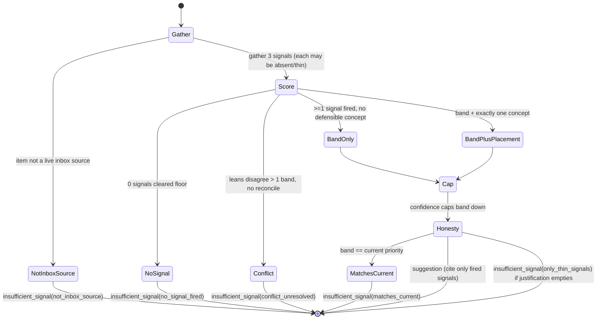
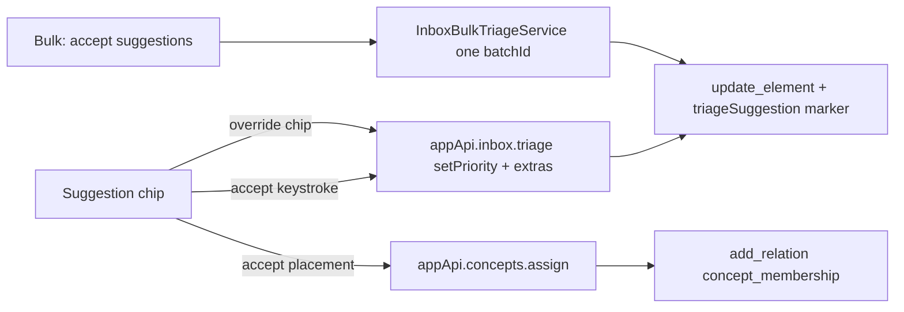

# feat: T127 — Suggested priority & placement

## Summary

Each inbox item arrives with a **suggested priority band** (A/B/C/D), an optional
**concept-placement chip**, and a one-line **justification** computed from three deterministic
signals already in the system — semantic neighbors (T087/T088), per-source yield aggregated by
author/site (T083), and source-reliability metadata (T091). The suggestion is **advisory only**:
the user accepts it with one keystroke (which writes priority through the *existing* triage
command) or overrides by picking another chip. When the signals are thin the engine returns
`insufficient_signal` and the UI shows nothing — never a confident-looking guess.

---

## Problem Frame

Priority is the least-informed decision in the product: set cold, per item, at the moment the user
knows the material least, while embeddings (T087/T088), per-source yield (T083), and reliability
metadata (T091) sit unwired at the intake boundary. Every fresh import defaults to band **C** —
a placeholder, not a judgment — yet priority is the input every downstream protection rule
(auto-sort, auto-postpone victim order, retention bands, M24 time-budgeting) keys off. Better entry
priorities make those rules optimize something real. T127 turns those dormant signals into a
grounded, honest, accept-or-override suggestion. The failure mode to engineer against is automation
bias: "if the numbers wouldn't convince you, suppress the suggestion" (origin: `docs/tasks/M27-triage-at-scale.md`).

---

## Requirements

### Suggestion computation

R1. A deterministic engine computes, per inbox item, either a `suggestion` (band + optional concept
placement + structured justification) or an `insufficient_signal` result with a retained reason.
Identical inputs always yield identical output.

R2. The band is derived from three signals — semantic neighbors, author/site yield, reliability —
combined by one pinned rule (reliability **caps**, most-conservative-on-conflict). Each signal must
clear a per-signal floor before it contributes.

R3. Thin signals suppress rather than guess. Each signal fails its floor independently: the semantic
signal fails on no neighbors, only-fallback-vector neighbors, or neighbors with no non-default
priority; the yield signal fails when neither author nor domain clears its own floor (each needs a
present key plus enough worked, non-`neutral` prior sources); reliability fails when its trust fields
are null. When no signal clears a floor — or the cleared signals can't be reconciled into one
defensible band — the result is `insufficient_signal` and the UI renders nothing.

R4. The justification is a structured payload (`{ signalKind, values }[]`) citing **only** signals
that fired; the renderer formats it and never invents prose. If honesty-filtering empties the
justification, the band is not defensible — suppress.

R5. Optional concept placement suggests at most one concept derived from the **semantic neighbors'**
shared concept memberships (not the seed's own, which a fresh inbox source lacks), chosen
deterministically; ties or no candidate → band-only suggestion (no placement).

### Accept / override / provenance

R6. Accept writes priority through the **existing** `triageInboxItem` `setPriority` command — no new
op type, no new mutation shape. Placement accept writes through the existing
`ConceptRepository.assignConcept` command.

R7. Accepted and overridden suggestions are logged distinguishably via an op-log `extras` marker
(`accepted` vs `overridden`, suggested vs final band, fired signal kinds, signal hash) so future
tuning can measure acceptance-vs-override rates without a schema migration.

R8. The provenance marker is for measurement only and never becomes a signal input. There is no
**direct** yield feedback loop — priority is not a `SourceYieldInputs` field, so an accepted band can't
inflate yield. Two slow **indirect** loops exist and are accepted as self-correcting: (a) an elevated
source gets surfaced more, reviewed more, earning real yield that lifts its author/site aggregate
(the rollup's `neutral` exclusion keeps an un-worked suggestion-elevated source out until it actually
produces output); and (b) the semantic signal reads neighbor priority, so an accepted non-default band
makes that source count as a non-default-priority neighbor for siblings. Loop (b) is bounded by the
same conservatism that guards a cold guess — the dispersion suppression (a single elevated neighbor
among a concentrated set barely moves the average; a lone elevated neighbor in an otherwise-default
cluster fails the ≥2-neighbor floor) — and is accepted rather than mitigated with per-neighbor
provenance tracking (out of scope).

R9. Bulk-accept applies **each selected item's own** suggested band as one batched, op-logged
transaction with a single undo, composing with T126; items with no suggestion are skipped and
counted (`no_suggestion`), and a suggestion gone stale mid-batch is refused per the existing
movement guard.

### Surfaces

R10. The suggestion chip + one-line justification render on inbox rows and in the single-item
preview pane, with accept = one keystroke and override = pick another priority chip.

R11. Import modals (file / URL / highlight) show a metadata-only suggestion (yield + reliability;
semantic is structurally thin at intake because the source is not embedded yet) next to the priority
picker, defaulting the picker to the suggested band but never auto-submitting.

R12. Nothing is ever auto-applied; the suggestion never moves a source by itself and never bypasses
priority ordering.

---

## Key Technical Decisions

KTD1. **Pure scorer in `packages/core`, gathering in `packages/local-db`.** The band/placement
decision is a pure deterministic function (`packages/core/src/triage-suggestion.ts`,
mirroring `scoreSourceYield`); `TriageSuggestionQuery` (`packages/local-db`) gathers DB-keyed signals
and calls it. Keeps band math persistence-agnostic and unit-testable, and keeps domain logic out of
the renderer (per `apps/web/AGENTS.md`).

KTD2. **`TriageSuggestionQuery` is a read-only read-model**, constructed `(db, repos)` like
`ConversionSessionQuery`, returning a flat discriminated DTO. It writes nothing — pinned by a test
asserting `operation_log` row count is unchanged after compute (precedent:
`docs/solutions/architecture-patterns/priority-integrity-read-model.md`).

KTD3. **Combination rule — a total function, no implicit gaps.** Semantic and yield each propose a
band lean only from a cleared floor. The combined band is `min(band)` over the fired leans on the
`A > B > C > D` order (most-conservative — a wrong-low suggestion costs less than a wrong-high one).
Reliability then **caps** the result *down*, never up, and the cap is driven by `confidence`
(`high`/`medium`/`low`, an ordinal trust level) — **not** by `reliabilityTier`, which is a
scholarship-*kind* axis (primary/secondary/tertiary), not a trust ordinal, so it never moves the band.
Conflict rule: if the fired leans are more than one band apart the result is
`insufficient_signal(conflict_unresolved)` — nothing "reconciles" a >1-band gap, there is no
reconciliation step. Exactly-one-band-apart resolves to the lower band; a same-band tie keeps that
band. All thresholds and the cap mapping are named constants in core, in one tunable place; the
function is total over `(semanticLean?, yieldLean?, confidenceCap)`.

KTD4. **Author/site yield aggregation is net-new** (it does not exist; `SourceYieldQuery` is
per-source and `SourceYieldRow` doesn't carry author). Build a rollup that joins the existing durable,
fate-aware per-source yield to a fresh `sources` read for `author` and `canonicalUrl` (the yield rows
alone lack both), groups by `sources.author` and by `inboxSourceDomain(sourceRow)` (real signature
takes the `Source` row, not a URL string — it reads `canonicalUrl ?? url` and strips `www.`),
**excludes `neutral` (un-started) rows** from both the count and the score, and requires a minimum
worked-source count (N=2) before the signal fires. **Collapse rule:** re-run `scoreSourceYield` on the
*summed* tallies across the key's worked sources and take the band of that aggregate score — one named
rule shared by U1/U2, not a per-row average or majority vote. Domain is denser than exact-string
author, so prefer the author aggregate when both fire and fall back to domain
(`docs/solutions/architecture-patterns/extract-fates-value-model-v2-source-yield-stagnation.md`).

KTD5. **Semantic neighbors come from `embeddings.knn` over the seed vector — not `RelatedService.related`.**
`RelatedService.related`'s `similar` bucket is hard-filtered to `type === "extract"`, and its
`prerequisiteConcepts` / `siblingSources` both early-return `[]` when the seed has no concept
memberships — which a fresh inbox source always lacks — so it cannot supply source neighbors or
placement for T127's target. Instead the query reads `getVectorRecord(id)` for the seed; if it's
`null` (not embedded) or `modelId === FALLBACK_EMBEDDING_MODEL_ID`, the semantic signal is thin (no
band, no placement). Otherwise it runs `embeddings.knn(seedVector, { type: "source", modelId,
excludeElementId: id })`, hydrates each neighbor **source's** own priority via `elements.findById`, and
drops default-C neighbors. This honors the model-isolation rule
(`docs/solutions/architecture-patterns/local-only-semantic-search-sqlite-vec-model-isolation.md`).

KTD6. **Placement concept = the neighbors' shared membership, accepted via the existing `assignConcept`.**
There is no "place source under topic" command (`parentId` is immutable; topics are document-bearing,
not containers). The candidate concept is derived from the semantic-neighbor **sources** (KTD5): call
`concepts.conceptsForElement(neighborId)` for each neighbor, take the concept shared by the most
neighbors (deterministic tie-break `level desc, name asc`, suppress on an exact tie), **not** the
seed's own `prerequisiteConcepts` (empty for a fresh source). Accepting it calls
`ConceptRepository.assignConcept`, which adds an idempotent, op-logged `add_relation` edge; re-assigning
an existing membership is a no-op.

KTD7. **Provenance rides the existing op via `OpContext.extras`** — no new op type, no marker table.
Accept passes `extras: { triageSuggestion: { decision: "accepted"|"overridden", suggestedBand,
finalBand, signalKinds, signalHash } }` through the existing `setPriority` path; a plain manual
setPriority carries no marker. Note `updateWithin` spreads `extras` into the **payload root**, so the
marker lands at `payload.triageSuggestion`, not `payload.extras.triageSuggestion` (the existing
`keepForLater` extra lands at `payload.action` the same way). The signal hash is a versioned,
deterministic signature (evaluator version + suggestion kind + integer signal counters) so the same
evidence hashes identically (`docs/solutions/design-patterns/signal-hash-advisory-nudges.md`).

KTD8. **Bulk-accept applies the band only and composes with T126.** The existing `apply()` takes one
uniform priority for all ids, so bulk-accept is a **genuinely new method** (not a new verb on
`apply()`): it resolves each id's suggested band server-side via the read-model and loops the existing
per-item `setPriority` write with differing priorities under one minted `batchId`; `no_suggestion`
joins the existing skip taxonomy and the existing movement guard refuses stale victims. Bulk
*placement* is deferred (single-item placement satisfies the spec; adding `add_relation` ops to the
heterogeneous batch is unnecessary scope now).

---

## High-Level Technical Design

### Suggestion computation — state machine

### Signal floors (each evaluated independently)

| Signal | Fires when | Thin (does not contribute) |
| --- | --- | --- |
| Semantic | seed embedded with the real model **and** ≥2 KNN **source** neighbors carry a non-default priority | not embedded / `null` record / `modelId == FALLBACK` / 0 source neighbors / all neighbors at default C |
| Author yield | author present **and** ≥ N (=2) non-`neutral` worked prior sources by that author | author null / < N worked sources / all prior `neutral` |
| Domain yield | domain present **and** ≥ N non-`neutral` worked prior sources on that host | domain null / < N / all `neutral` (author preferred over domain when both fire) |
| Reliability (cap only) | `confidence` set (`low`/`medium` caps the band down; `high` doesn't cap) | `confidence` null; `reliabilityTier` and `reliabilityNotes` never move a band |

### Accept data flow

---

## Implementation Units

### U1. Deterministic suggestion scorer in `packages/core`

**Goal:** A pure function that turns gathered signal inputs into a band + placement decision +
structured justification, or `insufficient_signal`.

**Requirements:** R1, R2, R3, R4, R5; KTD1, KTD3.

**Dependencies:** none.

**Files:**
- `packages/core/src/triage-suggestion.ts` (new)
- `packages/core/src/triage-suggestion.test.ts` (new)
- `packages/core/src/index.ts` (export the new symbols)

**Approach:** Define `TriageSignalInputs` (semantic lean band + source-neighbor count + whether
real-model; author/domain yield band + worked-source count + integer values for the justification;
reliability `confidence` only) and a discriminated `TriageSuggestionVerdict =
{ kind: "suggestion", band, placement?: { conceptId, conceptName }, justification: TriageJustification }
| { kind: "insufficient_signal", reason }`. `justification` is `{ signals: TriageJustificationSignal[] }`
where each entry is a `{ kind, ...values }` discriminated record (semantic / authorYield / domainYield).
Implement `scoreTriageSuggestion(inputs): TriageSuggestionVerdict` as a **total function** per KTD3:
evaluate each floor; if 0 leans fire → `insufficient_signal(no_signal_fired)`; if fired leans are >1
band apart → `insufficient_signal(conflict_unresolved)`; else combined band = `min(band)` over fired
leans on `A>B>C>D`, then cap down by `confidence`; filter the justification to fired signals and, if it
empties, return `insufficient_signal(only_thin_signals)`. All thresholds and the confidence→cap map are
named constants. The placement concept is passed in already-selected (selection is deterministic in
U3); core only keeps it when a band survives. Export `computeTriageSignalHash(inputs, band)` returning
a stable string from the evaluator version, fired signal kinds, and integer counters (no
floats-alone, no timestamps). Also export an `authorDomainYieldBand(summedTallies)` helper so U2 and U1
share the one collapse rule (re-run `scoreSourceYield` on summed tallies).

**Patterns to follow:** `packages/core/src/source-yield.ts` (`scoreSourceYield` — single tunable
place, named constants, band tuple), `packages/core/src/priority.ts` (`PriorityLabel`, band
converters).

**Test scenarios:**
- Semantic-only: ≥2 real-model neighbors averaging band B → suggestion band B, justification has one
  semantic clause, no reliability clause.
- Author-yield-only: 3 non-neutral high-yield prior sources → suggestion leaning A; justification
  states the real count ("3 sources").
- Reliability caps: high-yield author + `confidence: low` → band capped one step down vs the
  uncapped lean; `reliabilityTier: tertiary` with no `confidence` set → no cap (tier never moves the
  band).
- Conflict: high-yield neighbors but low-yield author more than one band apart →
  `insufficient_signal(conflict_unresolved)`.
- Exactly-one-band-apart (semantic B, author A) → resolves to the lower band (B); same-band tie keeps
  the band.
- All floors fail (fresh vault: 0 neighbors, no author/domain history, reliability null) →
  `insufficient_signal(no_signal_fired)`.
- Honesty filter empties: a marginal internal nudge from an unfired signal must not appear; if it was
  the only thing → `insufficient_signal(only_thin_signals)`.
- n=1 author wording vs n=3: justification text reflects the true count; n=1 below floor → no author
  clause.
- Determinism: same inputs twice → byte-identical verdict and identical signal hash.
- Placement kept vs dropped: a passed-in concept is retained for a band-bearing suggestion; with no
  band (insufficient) placement is never emitted.

---

### U2. Author/site yield aggregation in `packages/local-db`

**Goal:** Roll up the existing durable per-source yield into per-author and per-domain aggregates
usable as a suggestion signal.

**Requirements:** R2, R3, R8; KTD4.

**Dependencies:** none (reads existing yield).

**Files:**
- `packages/local-db/src/source-yield-query.ts` (extend)
- `packages/local-db/src/source-yield-query.test.ts` (extend)

**Approach:** Add `aggregateYieldByAuthorAndDomain(asOf, options?)` returning maps keyed by author and
by normalized domain, each entry carrying `{ workedSourceCount, yieldBand, totalCards,
totalMatureCards }`. The existing per-source yield rows carry neither `author` nor `canonicalUrl`, so
add a fresh `sources` read for `author` + `canonicalUrl` and join it to the per-source rollup; group by
`sources.author` and by `inboxSourceDomain(sourceRow)` — the real signature takes a `Source` row, not a
URL string (it reads `canonicalUrl ?? url` and strips `www.`). **Exclude `neutral` rows** from both the
count and the tallies so un-started imports never read as evidence (R8). **Collapse rule:** sum the
worked sources' tallies for a key and run `scoreSourceYield` once on the summed tallies — `yieldBand`
is that aggregate's band (the shared `authorDomainYieldBand` helper from U1). Author match is
exact-string; domain buckets subdomains separately — document both as known limitations. Provide a
helper to look up a single author's / domain's aggregate cheaply for the per-item path.

**Patterns to follow:** `listSourceYield` six-pass no-N+1 assembly; `inboxSourceDomain`
(`packages/local-db/src/inbox-query.ts`); `scoreSourceYield` on the summed tallies.

**Test scenarios:**
- Author with 3 worked sources (2 high, 1 medium) → aggregate band = `scoreSourceYield(summed
  tallies)`; count = 3.
- Author with only `neutral` prior sources → excluded → aggregate absent (below floor).
- Domain aggregation: two sources on `blog.example.com` and one on `example.com` bucket separately.
- Null author and null domain → no aggregate entry, no throw.
- R8 guard (documentation fixture): a suggestion-elevated but still-un-worked source is `neutral` and
  is excluded from the aggregate; once it produces real output it contributes through worked tallies
  only (priority is not a yield input).
- Determinism: stable ordering and identical aggregates across back-to-back calls.

---

### U3. `TriageSuggestionQuery` read-model in `packages/local-db`

**Goal:** Gather the three signals for an inbox item (or a batch) and return the scorer's verdict as a
flat DTO; pick the placement concept deterministically.

**Requirements:** R1–R5, R12; KTD2, KTD5, KTD6.

**Dependencies:** U1, U2.

**Files:**
- `packages/local-db/src/triage-suggestion-query.ts` (new)
- `packages/local-db/src/triage-suggestion-query.test.ts` (new)
- `packages/local-db/src/index.ts` (wire the query)

**Approach:** `class TriageSuggestionQuery { constructor(db, repos) }`. The query needs `repos`
widened to reach the embeddings repository (`getVectorRecord`, `knn`) and `concepts`
(`conceptsForElement`) — wire that here, read-only. Methods:
- `suggestForInboxItem(id, asOf)` / `suggestForInboxItems(ids, asOf): Map<id, …>` — confirm a live
  inbox source (else `insufficient_signal(not_inbox_source)`). **Semantic (KTD5):** `getVectorRecord(id)`;
  if null or `modelId == FALLBACK_EMBEDDING_MODEL_ID` the semantic signal is thin; otherwise
  `embeddings.knn(seedVector, { type: "source", modelId, excludeElementId: id })`, hydrate each neighbor
  **source's** priority via `elements.findById`, drop default-C neighbors, and compute the semantic lean
  from the surviving neighbor priorities. **Placement (KTD6):** `concepts.conceptsForElement(neighborId)`
  per neighbor, take the most-shared concept (tie-break `level desc, name asc`, suppress exact ties).
  **Yield:** look up the author then domain aggregate from U2. **Reliability:** read `confidence` from
  the source row. Assemble `TriageSignalInputs`, call `scoreTriageSuggestion`, attach the signal hash.
  **Suppress-when-equal:** if the resulting band equals the item's current priority band, downgrade to
  `insufficient_signal(matches_current)` so the row shows no chip for a no-op suggestion (anti-slop).
- `suggestForMetadata(input, asOf)` — a metadata-keyed path for import modals (U7): takes
  `{ author?, url?, confidence? }` (no element id, no semantic — the source isn't embedded at intake),
  returns the same verdict shape from yield + reliability only.
Read-only: no transaction, no op-log.

**Patterns to follow:** `packages/local-db/src/conversion-session-query.ts` (constructor, batch +
single methods, frozen DTO), `priority-integrity-read-model.md` (read-only discipline),
`embedding-repository.ts` (`knn`, `getVectorRecord`).

**Test scenarios:**
- High-yield cluster: inbox source whose KNN source neighbors are 2 band-A sources → band lean A with a
  semantic justification clause; placement = the concept those neighbors share.
- Not embedded (intake): `getVectorRecord` null → semantic absent; suggestion (if any) is
  yield/reliability-only; no placement.
- Fallback model: `modelId == FALLBACK` → semantic thin; no placement from fallback space.
- Neighbors all at default C → semantic does not fire.
- Placement: seed has no memberships but 2 neighbors share one concept → that concept is placed; an
  exact tie between two concepts → band-only, no placement.
- Suppress-when-equal: computed band == current priority → `insufficient_signal(matches_current)`.
- Deleted/parked item id → `insufficient_signal(not_inbox_source)`.
- `suggestForMetadata`: author matching a high-yield cluster → yield-driven band, no semantic clause.
- **Read-only guard:** `operation_log` row count unchanged after `suggestForInboxItem`.
- Batch: `suggestForInboxItems` returns one entry per id, mixed suggestion / insufficient.
- Determinism: identical results across back-to-back calls.

---

### U4. Typed read-only IPC channel `triage:suggest`

**Goal:** Expose the read-model to the renderer end-to-end behind one zod-validated channel.

**Requirements:** R1, R12; KTD2.

**Dependencies:** U3.

**Files:**
- `apps/desktop/src/shared/contract.ts` (request schema, result interface, `AppApi` method)
- `apps/desktop/src/shared/channels.ts` (channel constant)
- `apps/desktop/src/main/ipc.ts` (handler, `.parse()`)
- `apps/desktop/src/main/db-service.ts` (method + lazy `triageSuggestionQuery` getter)
- `apps/desktop/src/preload/index.ts` (bridge method)
- `apps/web/src/lib/appApi.ts` (renderer wrapper + re-exported types)
- `apps/desktop/src/shared/contract.test.ts`, `apps/desktop/src/preload/index.test.ts`,
  `apps/desktop/src/main/ipc.test.ts` (extend)

**Approach:** Add `TriageSuggestRequestSchema` (one id, or `ids` capped like the T126 ≤1000 bound) and
`TriageSuggestionResult` DTO (discriminated suggestion / insufficient with reason, justification
signals, signal hash). Register `triage:suggest`; the handler parses then calls
`dbService.suggestTriage(request)`, which lazily builds `TriageSuggestionQuery` and maps to the DTO.
Tolerant read (parse the request strictly, never throw on a thin result — return `insufficient_signal`).

**Patterns to follow:** the `semantic:related` / `queue.sessionPlan` five-file channel wiring;
`reverify.*` "tolerant reads, strict writes."

**Test scenarios:**
- `TriageSuggestRequestSchema` accepts a valid id and a bounded id list; rejects empty id and an
  over-cap list.
- Handler maps a suggestion verdict to the DTO and an insufficient verdict to the
  `insufficient_signal` shape.
- Preload routes `triage.suggest` to the channel.
- `Test expectation`: contract/preload/ipc tests assert the wiring, not heuristic content (that lives
  in U1/U3).

---

### U5. Accept provenance on the existing triage commands

**Goal:** Carry a distinguishable accepted-vs-overridden marker on the existing priority write without
a new op type, and prove it never pollutes the yield signal.

**Requirements:** R6, R7, R8; KTD7.

**Dependencies:** U1 (signal hash shape).

**Files:**
- `apps/desktop/src/shared/contract.ts` (optional `suggestion` provenance field on the triage
  setPriority request)
- `apps/desktop/src/main/db-service.ts` (`triageInboxItem` threads provenance into `OpContext.extras`)
- `packages/local-db/src/inbox-bulk-triage-service.ts` (accept the marker on the bulk path)
- `apps/desktop/src/main/db-service.test.ts` / `packages/local-db/src/*-service.test.ts` (extend)

**Approach:** Extend the `setPriority` triage action with an optional `suggestion:
{ decision: "accepted"|"overridden", suggestedBand, signalKinds, signalHash }`. In `triageInboxItem`,
when present, pass it through `OpContext.extras = { triageSuggestion: { ...marker, finalBand } }` into
`updateWithin` (note: `updateWithin` spreads `extras` into the **payload root**, so the marker lands at
`payload.triageSuggestion`, like the existing `keepForLater`→`payload.action`). The existing
`setPriority` case calls `updateWithin` with no `OpContext` today, so add the fourth argument. Absent →
no marker (manual edit). Because the engine suppresses a suggestion equal to the current band
(`matches_current` in U3), an accept always changes the band; an explicit override that lands on the
already-current band still logs the `overridden` marker. Confirm every yield/analytics reader ignores
the marker (priority is not a `SourceYieldInputs` field — assert it).

**Patterns to follow:** T126 `batchId` + `extras` on `inbox-bulk-triage-service.ts`; T112
`attentionAdaptive` extras read-back; `card-edit-write-barrier-restabilization.md` marker discipline.

**Test scenarios:**
- Accept writes exactly one `update_element` op whose payload `triageSuggestion.decision == "accepted"`
  with suggested + final band (asserted at the payload root, not under `extras`).
- Override (final band ≠ suggested) writes `decision == "overridden"`.
- Manual setPriority (no suggestion) writes no marker.
- Accepting a suggestion on item X does not change the yield-derived suggestion for sibling item Y
  (feedback-loop guard, R8).

---

### U6. Renderer: suggestion chip, justification, single accept/override + placement

**Goal:** Render the suggestion on inbox rows and the preview pane; accept = one keystroke, override =
existing chips, placement accept via `assignConcept`; format the structured justification, never invent.

**Requirements:** R4, R5, R6, R10, R12.

**Dependencies:** U4, U5.

**Files:**
- `apps/web/src/pages/inbox/InboxGroupedList.tsx` (`GroupedRow` chip + justification line)
- `apps/web/src/pages/inbox/InboxScreen.tsx` (`PreviewPane` accept affordance + placement; fetch
  suggestions for visible items)
- `apps/web/src/pages/inbox/useInboxTriageShortcuts.ts` (+ `INBOX_TRIAGE_BOUND_KEYS` drift contract)
- a small `SuggestionChip` component (co-located in `apps/web/src/pages/inbox/`)
- `apps/web/src/pages/inbox/InboxScreen.test.tsx`, `InboxGroupedList.test.tsx` (extend/new)
- (the `concepts.assign` appApi wrapper already exists — reuse it, no new binding)

**Approach:** Fetch suggestions via the batch `triage.suggest` channel for the listed items, render a
`SuggestionChip` only on rows with a `suggestion`; `insufficient_signal` rows render nothing. Pin the
design decisions the review flagged:
- **Accept key = Enter** in the `triage` scope (the band-arm keys `a–d`, verb keys `1/2/3/6`, and
  `j/k/x/s/Space/Esc/⌘A` are all taken; Enter is free) — register it in `INBOX_TRIAGE_BOUND_KEYS` so
  the drift test passes. Enter fires `triage.setPriority` with the suggested band + `decision:
  "accepted"`; picking a different chip sends `decision: "overridden"`.
- **Chip differentiation:** the `SuggestionChip` is visually distinct from the current-priority `Prio`
  badge — a dashed/outline treatment with a lucide `sparkles`/`lightbulb` glyph and a "Suggested"
  affordance, using existing tokens — so the suggested band never reads as the current band.
- **Justification format:** the formatter renders the structured signals into one short line (e.g.
  "Near 2 high-priority neighbors · author's last 3 averaged 11 cards"), placed on the row's secondary
  metadata line (text-muted token), truncated; it consumes only structured values (never invents).
- **Loading vs empty:** while the batch fetch is in flight, rows show a neutral pending placeholder
  (not "nothing") so "computing" is distinguishable from the permanent `insufficient_signal` blank.
- **Placement chip:** in `PreviewPane`, below the priority section; accept calls `assignConcept` and
  the chip switches to an "assigned" confirmed state; re-accept is a no-op.
- **Staleness:** re-read live state at accept; if priority already changed → drop the chip silently
  (no clobber); if the item left inbox → a brief inline "no longer in inbox" note.

**Patterns to follow:** existing `PreviewPane` priority section + `Prio` primitive; T126 selection /
scope wiring; design tokens + `lucide-react` (`apps/web/AGENTS.md`); UI must work light + dark.

**Test scenarios:**
- A row with a suggestion renders the band chip + a justification string built from the signal values;
  an `insufficient_signal` row renders no chip; a pending row renders the placeholder, not blank.
- Accept (Enter) calls `triage.setPriority` with the suggested band and `accepted` provenance.
- Override (click a different chip) sends `overridden`.
- Placement accept calls `assignConcept`; the chip shows "assigned"; re-accept is a no-op.
- Stale: item already re-prioritized → chip drops, no clobber; item left inbox → inline note.
- Keyboard drift: Enter is added to `INBOX_TRIAGE_BOUND_KEYS` and the drift test passes.
- Justification honesty: a suggestion with only a yield signal renders no semantic clause.

---

### U7. Import-modal suggestion display

**Goal:** Show a metadata-only (yield + reliability) suggestion next to the priority picker in the
import modals, defaulting the picker to the suggested band without auto-submitting.

**Requirements:** R11, R12.

**Dependencies:** U3 (`suggestForMetadata`), U4.

**Files:**
- `apps/web/src/pages/inbox/ImportUrlModal.tsx` (URL → domain signal)
- `apps/web/src/pages/inbox/NewSourceModal.tsx` (entered author + URL signal)
- `apps/web/src/pages/inbox/useTriageMetadataSuggestion.ts` (shared debounced hook)
- `apps/desktop/src/shared/contract.ts` (a `suggestForMetadata` request variant on the channel)
- corresponding `*.test.tsx`
- **Not wired:** `ImportFileModal.tsx` — a file-pick modal has no author/URL/domain at intake (the
  metadata isn't known until the file is parsed), so a metadata-keyed suggestion there is always
  `insufficient_signal`. The post-import inbox row carries the (now semantic-capable) suggestion via U6
  instead. Intentional scope decision.

**Approach:** The source isn't persisted or embedded when the modal is open, so the modal uses the
**metadata-keyed** path (`suggestForMetadata`, U3) — driven by the author/URL the user has entered,
debounced — not an id-keyed call. Semantic is thin by construction at intake; the modal suggestion is
yield/reliability-only by design. Render the `SuggestionChip` next to the existing priority chip group
and default the picker to the suggested band, but require the user to submit (never auto-submit). Show
nothing when `insufficient_signal`. The richer (semantic) suggestion may appear later on the inbox row
once the source is embedded — a documented acceptable flip.

**Patterns to follow:** existing `ImportUrlModal` priority chip group + `defaultPriority` from
`defaultSourcePriority`.

**Test scenarios:**
- Import URL whose domain matches an existing high-yield cluster → modal shows a yield-driven
  suggestion and defaults the picker to it; submitting still requires the user.
- First-ever import / unknown author / no reliability → modal shows no suggestion (and that is
  correct, not a bug).
- Highlight import with null author and null domain → no suggestion.

---

### U8. Bulk-accept composing with T126

**Goal:** Apply each selected item's own suggested band as one batched, undoable transaction; skip and
count items with no suggestion.

**Requirements:** R9; KTD8.

**Dependencies:** U3, U5.

**Files:**
- `packages/local-db/src/inbox-bulk-triage-service.ts` (new `applySuggestions` method)
- `apps/desktop/src/shared/contract.ts` (+ channel for the new bulk request) /
  `apps/desktop/src/main/db-service.ts`
- `apps/web/src/pages/inbox/BulkActionPanel.tsx` (accept-suggestions action + honest skip summary)
- `packages/local-db/src/inbox-bulk-triage-service.test.ts` (extend)

**Approach:** The existing `apply()` takes one uniform priority for all ids and can't carry per-item
bands, so add a **genuinely new method** (`applySuggestions(ids)`), not a new verb on `apply()`. It
resolves each id's suggested band server-side via the read-model and loops the existing per-item
`setPriority` write with differing priorities under one minted `batchId` and the `accepted` provenance
marker. Items whose suggestion is `insufficient_signal` join the skip taxonomy as `no_suggestion`; a
suggestion gone stale (priority moved since render) is refused via the existing
`requireCurrentBulkTriageStateMatch` movement guard. One undo restores all preimages. In
`BulkActionPanel`, add a distinct verb label (e.g. "Applied suggestions") and a `no_suggestion` skip
phrasing so the snackbar reads "3 applied · 2 skipped (no suggestion)". Bulk placement is out of scope
(KTD8).

**Patterns to follow:** `bulk-command-heterogeneous-batch-undo-guard.md`; the existing T126 `apply`
transaction, skip-and-classify channel, and undo guard.

**Test scenarios:**
- Select 5 items (3 with suggestions, 2 without) → 3 applied under one `batchId`, 2 skipped
  `no_suggestion`; snackbar reads honestly.
- One item's priority moves mid-selection → refused by the movement guard; the rest apply.
- Single undo restores all three to their pre-accept priorities.
- Op-log carries one `batchId` for the sweep; each applied op carries the `accepted` marker.

---

### U9. Electron end-to-end

**Goal:** Prove the whole path against the real Electron app, restart-safe.

**Requirements:** R1, R6, R7, R9, R10, R11, R12.

**Dependencies:** U6, U7, U8.

**Files:**
- `tests/electron/inbox-suggestions.spec.ts` (new)
- `packages/testing/src/factories.ts` (seed helper for a high-yield cluster + same-author history, if
  needed)

**Approach:** Seed a high-yield cluster (embedded sources at band A + same-author worked history), add
a fresh inbox item near it, and assert: the row shows a justified suggestion; one-keystroke accept
writes the band; the band persists across app restart; `operation_log` carries the `accepted`
provenance marker; a deliberately marginal fixture (one un-started prior source, not embedded, all
reliability null) shows nothing; bulk-accept applies per-item bands in one sweep; undo restores the
pre-accept priorities.

**Patterns to follow:** `tests/electron/inbox.spec.ts`, `tests/electron/inbox-bulk-triage.spec.ts`;
`seedDemoCollection` / `DEMO_FIXTURES`.

**Test scenarios:**
- Import near a high-yield cluster → see the suggestion → accept → priority persists across restart.
- Marginal fixture → no chip (the spec's law made executable).
- Bulk-accept across mixed items → honest applied/skipped counts → single undo restores.
- Op-log assertion: accepted ops carry the `triageSuggestion` marker; the read path wrote nothing.

---

## Scope Boundaries

In scope: the deterministic engine, the three signals, band + concept placement + justification,
single + bulk band accept/override, provenance marker, inbox-row / preview / import-modal surfaces,
and tests.

### Deferred to follow-up work

- **AI-refined suggestions** (M18 patterns) — the spec scopes this task to a deterministic heuristic;
  AI refinement is explicitly later.
- **Dismissal persistence keyed on signal hash** — the signal hash ships in the payload for future
  tuning, but a durable "dismissed until evidence changes" store is not built now.
- **Bulk concept placement** — single-item placement satisfies the spec; bulk placement (adding
  `add_relation` ops to the heterogeneous batch) is deferred (KTD8).
- **Author de-duplication** — exact-string author match is a documented limitation;
  fuzzy/normalized author identity is out of scope.

### Non-goals

- Auto-applying any suggestion, or letting a suggestion move a source or bypass priority ordering
  (R12) — this is the same product law as "never auto-schedule imports"
  (`docs/solutions/ui-bugs/daily-work-read-model-inbox-only-routing.md`).

---

## System-Wide Impact

- **Priority semantics** stay numeric in core with A/B/C/D at the edges (`packages/core/src/priority.ts`);
  T127 adds no new band representation.
- **Yield signal integrity:** the new author/domain rollup must exclude `neutral` rows and must never
  read suggestion-set priority as yield (R8) — otherwise the engine feeds on its own output.
- **Op-log readers:** the `triageSuggestion` extras marker rides ordinary `update_element` ops; every
  existing reader already ignores unknown extras, but the yield/analytics readers are explicitly
  re-verified.
- **No migration** unless a follow-up adds dismissal storage; if so, additive `ADD COLUMN` / new table
  only, monotonic Drizzle journal — never an `elements` rebuild
  (`docs/solutions/database-issues/sqlite-table-rebuild-with-foreign-keys-on-fires-on-delete-actions.md`).

---

## Risks & Dependencies

- **`RelatedService` can't supply source neighbors or placement.** Its `similar` is extract-only and
  its concept/sibling buckets need seed memberships a fresh inbox source lacks. Mitigated by sourcing
  neighbors from `embeddings.knn(type:"source")` and placement from the neighbors' shared concepts
  (KTD5/KTD6); the query's `repos` must be widened to reach the embeddings + concepts repos (part of U3).
- **Signal density / AI-slop.** Author/domain history is sparse in real vaults (exact-string author,
  N=2 floor), so many items legitimately show no yield signal — by design, the engine suppresses
  rather than guesses (R3). Combined with **suppress-when-equal** (a suggestion equal to the current
  band renders nothing, U3), the chip should appear only when it changes something — the e2e marginal
  fixture validates suppression. Domain is denser than exact-string author and is the fallback signal.
- **Per-item compute cost.** `suggestForInboxItems` runs a KNN + neighbor hydration per id; for a large
  morning inbox the batch should be bounded (reuse the T126 ≤1000 cap) and measured if a slow surface
  appears.
- **Intake flicker** if the import modal computes before the source row/embeddings exist — U7 pins the
  suggestion to metadata-only at intake; semantic fills in later on the inbox row (acceptable flip,
  documented in U7/determinism).
- **Determinism regressions** from `Set`/`Map` iteration or floats — U1/U3 tests assert byte-identical
  back-to-back results and a stable signal hash.

---

## Sources / Research

- Origin spec: `docs/tasks/M27-triage-at-scale.md` (T127 section).
- Read-model discipline: `docs/solutions/architecture-patterns/priority-integrity-read-model.md`.
- Bulk batch/undo: `docs/solutions/architecture-patterns/bulk-command-heterogeneous-batch-undo-guard.md`.
- Never-auto-apply law: `docs/solutions/ui-bugs/daily-work-read-model-inbox-only-routing.md`,
  `docs/solutions/workflow-issues/inbox-triage-queue-soon-attention-scheduling.md`.
- Advisory nudge / signal hash: `docs/solutions/design-patterns/signal-hash-advisory-nudges.md`.
- Semantic model isolation: `docs/solutions/architecture-patterns/local-only-semantic-search-sqlite-vec-model-isolation.md`.
- Yield signal: `docs/solutions/architecture-patterns/extract-fates-value-model-v2-source-yield-stagnation.md`.
- Signal APIs: `packages/local-db/src/related-service.ts`, `packages/local-db/src/source-yield-query.ts`,
  `packages/local-db/src/embedding-repository.ts` (`getVectorRecord`), `packages/core/src/source-ref.ts`
  (reliability), `packages/core/src/priority.ts`, `packages/local-db/src/concept-repository.ts`
  (`assignConcept`), `packages/local-db/src/inbox-query.ts` (`inboxSourceDomain`).
- Accept path: `apps/desktop/src/main/db-service.ts` (`triageInboxItem`),
  `packages/local-db/src/inbox-bulk-triage-service.ts`.
- IPC pattern: the `semantic:related` / `queue.sessionPlan` channel wiring across
  `apps/desktop/src/shared/contract.ts`, `channels.ts`, `main/ipc.ts`, `main/db-service.ts`,
  `preload/index.ts`, `apps/web/src/lib/appApi.ts`.
