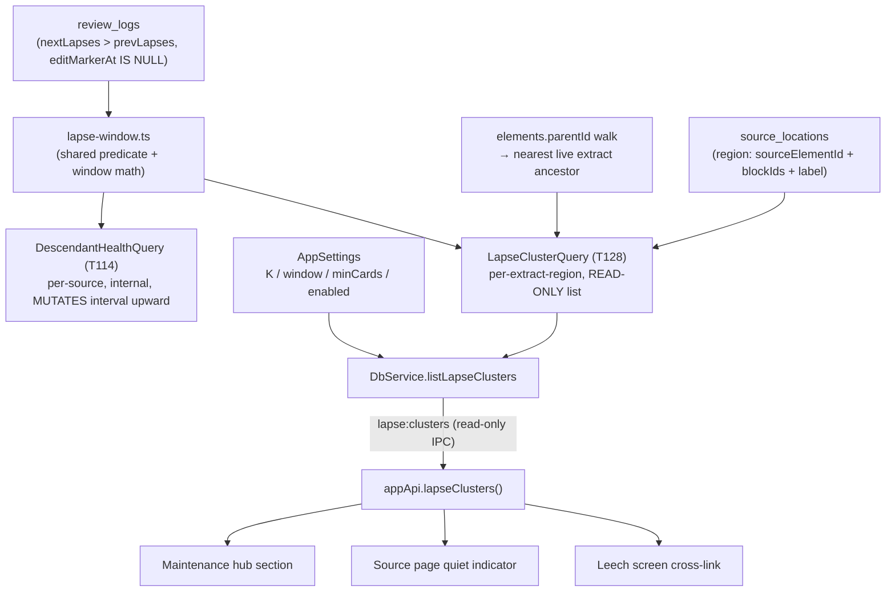
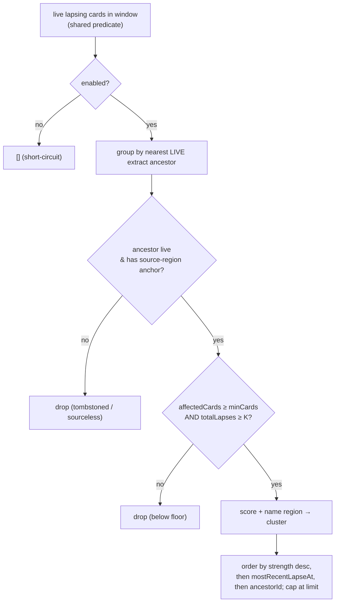

# feat: T128 — Lapse-cluster detection

## Summary

Build a **read-model-only** `LapseClusterQuery` in `packages/local-db` that finds the
correlation no per-card view can see: several live cards descended from one extract / source
region all lapsing inside a recent window is **one comprehension problem, not N formulation
bugs**. The query groups live cards by their shared source-region ancestor (the extract),
counts true FSRS lapse increments per card over a rolling window, and surfaces clusters that
cross conservative, settings-tunable thresholds — naming the exact source region the cards
share. It is surfaced in three places: a maintenance-hub section, a quiet indicator on the
source page, and a cross-link on the existing leech screen.

T128 **only detects and surfaces**. It creates no work, enqueues nothing, mutates nothing,
and touches no FSRS card schedule. Turning a cluster into a scheduled re-read is T129 and is
explicitly out of scope here.

---

## Problem Frame

The pipeline (`Source → Extract → … → Card → Review`) flows one direction. When a memory
trace is weak, FSRS can only shorten the interval — it cannot repair the *encoding*. The
remedy for thin encoding is re-reading the source context, and nothing generates that signal
today. T085's leech screen offers "open source" as a manual per-card button; T114 already
feeds aggregate descendant-lapse pressure *upward* into the parent source's interval. Neither
names the **sibling correlation**: five cards under one paragraph failing together.

T128 produces that read model. The hard correctness constraint, named in the spec, is
**definition reuse**: "lapse" must mean exactly what T040's leech logic and T114's
descendant-health logic already say it means (`review_logs` rows where
`nextLapses > prevLapses` and `editMarkerAt IS NULL`, over live non-retired cards). A
divergent definition would make the cluster list contradict the leech screen — the named
failure mode.

---

## Requirements

Traceable to `docs/tasks/M28-lapse-rereading.md` (T128 section) and the milestone preamble.

- **R1** — A `LapseClusterQuery` read model detects clusters: **K+ lapse increments** within a
  rolling window across **2+ live cards** sharing an extract / source-region ancestor.
  Defaults conservative (K=5 / 30d / ≥2 cards — within the spec's "~4–6" guidance band),
  **settings-tunable and documented**.
- **R2** — Each cluster returns: the **shared region** (source element + block range, named
  from the ancestor extract's `source_locations` anchor), the **member cards** (with per-card
  in-window lapse count), and a **cluster strength score** for ordering.
- **R3** — **Single lapse definition.** The lapse predicate, window math, and live-card filter
  are shared with T114's `DescendantHealthQuery` so exactly one aggregation definition exists
  (spec: "coordinate so ONE lapse-aggregation query exists"). Reuse, do not re-derive.
- **R4** — **Read model only.** No mutation, no `operation_log` append, no FSRS / attention
  scheduler state change. (Invariant: attention-side work never touches card schedules.)
- **R5** — **Conservative thresholds.** Rare-and-high-confidence beats sensitive-and-noisy;
  the queue-spam / alarm failure mode is the named risk. Defaults err toward silence.
- **R6** — **Surfacing** (the three sub-clauses cited by units as R6(a)/(b)/(c)):
  - **R6(a)** — a maintenance section listing active clusters (→ U6).
  - **R6(b)** — a quiet indicator on the source page ("N struggling card clusters") linking to
    them (→ U7).
  - **R6(c)** — a leech screen (T085) cross-link — "part of a cluster" — when the leech card is
    a cluster member (→ U8).
- **R7** — **Tests:** seeded sibling-failure fixture → exactly one cluster naming the right
  region and cards; near-miss fixtures (below-K, single-card, dead/tombstoned lineage,
  outside-window, marker-only, sourceless, retired member, source-shared-but-not-extract-shared)
  → none; a read-only contract test (op-log count unchanged); restart-safe E2E.
- **R8** — **No schema migration.** Thresholds live in existing settings; storing them there
  sidesteps the FK-rebuild lineage-wipe class entirely (see Risks).
- **R9** — **Hard T128/T129 boundary.** No accept/propose/enqueue/dismissal/cap/daily-summary
  surfaces. The only affordance on every T128 surface is **navigation** (count + link).

---

## Key Technical Decisions

### KTD-1 — Cluster key = the card's nearest **live** source-region ancestor (the extract), never `source_id`

Cards carry `parentId = extractId` in the common path (verified:
`packages/local-db/src/card-service.ts:11`, `:200`), but cards can also be minted from an
`owningElementId` (`card-service.ts:379`) — an atomic statement or other intermediary — so the
direct parent is **not always** the extract. The cluster key is therefore the card's nearest
**live** (`elements.deletedAt IS NULL`) **source-region ancestor**: the nearest ancestor that
owns a `source_locations` anchor into a source — in the standard pipeline this is the
**extract**. **Canonical rule: resolve to the nearest extract/source-region ancestor by walking
`parentId` up *through* any atomic-statement intermediaries**, bounded by the existing
`MAX_WALK = 64` cycle guard in `lineage-query.ts`. The direct-parent join is only a fast path
*when* the direct parent already is that ancestor.

**Why the walk (anti-under-clustering):** if the key were the *direct parent*, three cards
authored straight off an extract and two cards authored off an atomic statement under the same
extract would split into a 3-group and a 2-group — each possibly below K — and the one real
comprehension problem would surface **zero** clusters. Resolving every card up to the shared
**extract** makes all five members of one paragraph land in one cluster. (Counting unit = that
extract; see KTD-2.)

**Why not `source_id`:** grouping on the denormalized lineage root would collapse every card
in a 300-page book into one useless "cluster" and duplicate T114's source-level signal.
`source_id` is provenance, not the cluster key — the explicit T108 trap
(`docs/solutions/architecture-patterns/topic-knowledge-state-read-model.md`). Each card
contributes to **exactly one** cluster (its `parentId` spine is a single total order → no
double-counting; pinned by a test asserting summed cluster lapses ≤ total in-window lapses).

### KTD-2 — Counting unit vs naming unit

The **counting unit** and the **cluster key** are the nearest extract ancestor. The **naming
unit** is that same extract's `source_locations` row → `sourceElementId` + `blockIds` +
stored `label`, with `deriveSourceLocationLabel` (`source-location-label.ts`) as the fallback
and "Selected text" as the final degrade when a block id no longer resolves (re-import). Two
distinct extracts under one source are **two clusters** (no block-range overlap merging — that
fuzziness risks the KTD-1 over-clustering and is deferred).

### KTD-3 — Tombstoned ancestor → suppress (live ancestors only)

If a card's nearest source-region ancestor is soft-deleted (in trash), the card does not
cluster on it (the spec's "dead lineage → none" near-miss). Walk live ancestors only
(`includeTombstones = false`, the `lineage-query.ts` default). Cards with no live
source-region ancestor (Anki-imported / `parentId = null` / `sourceId = null` /
`sourceLocationId = null`) cannot cluster and are excluded cleanly (no crash on null). This
also covers **lineage-wiped cards** from the migration-0030 incident (FK cascade nulled
`parent_id`/`source_id` in the real vault): such cards degrade to "no cluster" gracefully —
which is correct (you cannot cluster what has no lineage), so on a partially-wiped vault
clusters will be sparse until lineage is repaired, by design rather than a bug. Cards anchored
*directly* to a source region with **no extract ancestor** are out of the primary grain
(named near-miss → none) — block-region grouping for the extract-less case is a follow-up.

### KTD-4 — Reuse T114's lapse predicate by **extracting it into one shared helper** (R3)

Refactor the lapse aggregation in `packages/local-db/src/descendant-health-query.ts` so the
window math (`windowStart`), the `LIVE_CARD_STATUSES` filter, and the WHERE fragment
(`type='card'`, status live, `deletedAt IS NULL`, `cards.isRetired = false`, window bounds
`gte(since)`+`lte(asOf)`, `isNull(editMarkerAt)`, `nextLapses > prevLapses`) live in one
module both `DescendantHealthQuery` and `LapseClusterQuery` import. **Only the shared
*predicate* is extracted, not the thresholds** — T114 keeps `MIN_DESCENDANT_LAPSE_COUNT = 3`
and its own scope (`eq(elements.sourceId, …)`); T128 keeps its own K and per-region grouping.
The helper is parameterized by `windowDays`, and both features already use a 30-day window
(`DESCENDANT_HEALTH_WINDOW_DAYS = 30`), so the refactor introduces **no value change** for
T114. This makes "one definition" true **by construction**, not by convention.
`DescendantHealthQuery`'s observable behavior is unchanged (characterization posture): the U1
guard asserts T114's *windowed output counts* are byte-for-byte identical before/after — not
merely that the exported constants are unchanged (a constant-only assertion would miss a
query-plan/window regression that alters the number feeding the scheduler). The lapse count per
card is `SUM(nextLapses - prevLapses)`, NULL-safe (legacy NULL columns contribute 0).

### KTD-5 — Strength score is a pure function co-located in `packages/local-db`, for ordering only

Add a pure `scoreLapseCluster` function (no DB, no FSRS) in `packages/local-db` (co-located
with the query). It is **not** placed in `packages/core`: unlike `scoreSourceYield` (a
cross-package domain rule with bands consumed by both analytics and triage), cluster strength
is an internal ordering heuristic with exactly one consumer (the query) and no bands at plan
time. Keeping it in local-db avoids an unearned cross-package export; if T129 needs to rank
proposals by strength, promote it to core then (trivial). Inputs: total in-window lapse count,
affected-card count, and lapse rate. Properties pinned by tests: monotonic in lapse count and
affected-card count; **more affected cards outranks the same lapse count concentrated in fewer
cards** (the spec's "5 cards × 1 lapse > 1 card × 5" comprehension framing); finite for small
denominators (divide-by-zero guarded). The score does **not** gate inclusion — the K /
≥2-cards / window floors do; the score only orders, and is **not** rendered as a raw number to
users (see U6).

### KTD-6 — One read-only IPC channel, thresholds resolved backend-side

Expose a single channel `lapse:clusters` taking `{ sourceId?: ElementId; limit?: number }`:
omit `sourceId` for the vault-wide maintenance list; pass it for the source-page scoped count.
`DbService` resolves K / window / min-cards / enabled from `settings.getAppSettings()` and
`asOf = nowIso()`, then delegates to the otherwise-pure query (thresholds injected as options,
mirroring `descendant-health-query`'s `windowDays?` — keeps the query unit-testable with
explicit thresholds). The leech cross-link reuses the same vault-wide `lapse:clusters` read
(clusters are rare and capped, so a client-side member lookup is cheap — no second channel).
Read-only handler: no op-log, zod-validated request, `limit` bounded.

### KTD-7 — Settings, no migration (R8)

Add `lapseClusterDetectionEnabled` (default **on** — read-only, no queue impact, "quiet
help"), `lapseClusterMinLapses` (K, default **5**), `lapseClusterWindowDays` (default **30**),
`lapseClusterMinCards` (default **2**) to `AppSettings` in `packages/core/src/settings.ts`,
with `DEFAULT_APP_SETTINGS` values and clamped coercion (a corrupt/legacy row can never reach
the query). When disabled, the query short-circuits to `[]` and all three surfaces render
nothing. Storing thresholds in settings means **zero schema change**.

---

## High-Level Technical Design

### Data flow



### Cluster shape (DTO, directional)

```
LapseCluster {
  ancestorId: ElementId          // the extract / source-region ancestor (cluster key)
  sourceId: ElementId            // owning source (for source-page scoping; provenance only)
  region: { sourceElementId, blockIds, label }   // named from source_locations + fallback
  members: { cardId, prompt, windowLapseCount }[] // window-scoped, labeled "in {window}d"
  totalWindowLapses: number
  affectedCardCount: number
  strength: number               // scoreLapseCluster — ordering only
  mostRecentLapseAt: IsoTimestamp // deterministic tiebreak
}
```

### Detection gate



---

## Implementation Units

### U1. Extract the shared lapse-aggregation predicate

**Goal:** Create one canonical lapse-window definition (R3, KTD-4) that both
`DescendantHealthQuery` and the new `LapseClusterQuery` import, with T114's behavior unchanged.

**Requirements:** R3.
**Dependencies:** none.
**Files:**
- `packages/local-db/src/lapse-window.ts` (new) — exports `windowStart(asOf, windowDays)`,
  `LIVE_CARD_STATUSES`, and a `liveCardLapseWhere(...)` builder returning the shared Drizzle
  `and(...)` fragment (the marker-exclusion + increment + live-card + window predicate).
- `packages/local-db/src/descendant-health-query.ts` (modify) — import the helper, delete the
  inlined duplicates; keep `DESCENDANT_HEALTH_*` constants and public API identical.
- `packages/local-db/src/index.ts` (modify) — export the helper if needed by U4.
- `packages/local-db/src/descendant-health-query.test.ts` (existing — must stay green).
- `packages/local-db/src/lapse-window.test.ts` (new).

**Approach:** Pure mechanical extraction. The WHERE fragment is parameterized by scope
(`eq(elements.sourceId, …)` for T114 vs grouping for T128), so the helper exposes the
**common** predicates (type/status/deletedAt/isRetired/window/marker/increment) and each caller
adds its scope clause. Preserve the inclusive-inclusive window bounds (`gte(since)`, `lte(asOf)`)
exactly so both queries count a boundary lapse stamped at exactly `since` or exactly `asOf`
identically.

**Execution note:** Characterization-first — run `descendant-health-query.test.ts` before and
after; it must pass unchanged, and the U1 test additionally pins T114's windowed *output
counts* (not just its exported constants) across a fixture that includes a boundary-dated lapse,
so a query-plan/window regression cannot slip through green constant assertions.

**Patterns to follow:** `descendant-health-query.ts:27-33,62-89` (the exact predicate).

**Test scenarios:**
- `windowStart` returns `asOf − windowDays` in ISO; throws on an invalid `asOf` (mirrors
  existing behavior).
- `liveCardLapseWhere` composes into a query that counts a lapse stamped exactly at `since`
  and exactly at `asOf` (inclusive bounds).
- Marker rows (`editMarkerAt` set) and non-incrementing rows are excluded by the fragment.
- Legacy NULL `prevLapses`/`nextLapses` rows contribute 0 (NULL-safe), no NaN.
- `Covers R3.` `descendant-health-query.test.ts` passes unchanged after the refactor.

### U2. Pure cluster-strength scoring rule (co-located in local-db)

**Goal:** A deterministic, monotonic strength score for ordering clusters (R2, KTD-5).

**Requirements:** R2.
**Dependencies:** none.
**Files:**
- `packages/local-db/src/lapse-cluster-score.ts` (new) — pure `scoreLapseCluster(input)` + the
  `LapseClusterScoreInput` type; no DB, no FSRS. Co-located with the query (single consumer);
  not exported from `packages/core` (KTD-5 — promote later if T129 needs it).
- `packages/local-db/src/lapse-cluster-score.test.ts` (new).

**Approach:** Combine `totalWindowLapses`, `affectedCardCount`, and lapse rate into a single
finite number. Weight affected-card breadth so breadth outranks depth at equal total lapses.
Keep it simple and explainable (this is ordering, not a threshold). Guard divide-by-zero.

**Patterns to follow:** the pure-function shape of `packages/core` `scoreSourceYield`
(`source-yield.ts`) — same purity/testability discipline, but kept in local-db per KTD-5.

**Test scenarios:**
- Monotonic: increasing `totalWindowLapses` (others fixed) strictly increases score; same for
  `affectedCardCount`.
- Breadth beats depth: `{lapses:5, cards:5}` scores higher than `{lapses:5, cards:1}`.
- `affectedCardCount = 0` or `0` denominators → finite score, no NaN/Infinity.
- `Covers R2.` Deterministic: same input → same output.

### U3. Settings keys, defaults, and clamped coercion

**Goal:** Make thresholds + a feature toggle settings-tunable with safe bounds (R1, R8, KTD-7).

**Requirements:** R1, R8.
**Dependencies:** none.
**Files:**
- `packages/core/src/settings.ts` (modify) — add `lapseClusterDetectionEnabled`,
  `lapseClusterMinLapses`, `lapseClusterWindowDays`, `lapseClusterMinCards` to `AppSettings`,
  to `DEFAULT_APP_SETTINGS` (on / 5 / 30 / 2), and to the coercion/clamping path
  (`coerceSettingsPatch` / `appSettingsFromStored`) with min/max bounds (mirror
  `CHRONIC_POSTPONE_THRESHOLD_MIN/MAX`).
- `packages/core/src/settings.test.ts` (modify/existing) — coercion + clamp coverage.

**Approach:** Follow the existing typed-settings convention exactly. Bounds: K e.g. `[2, 20]`,
window `[7, 365]` days, minCards `[2, 10]`. Enabled is a boolean default true.

**Patterns to follow:** `settings.ts` `chronicPostponeThreshold`, `extractAgingAgeDays`,
`distillationQuotaPercent` field + default + clamp.

**Test scenarios:**
- Defaults present and correct in `DEFAULT_APP_SETTINGS`.
- Out-of-range values clamp to bounds; non-numeric / missing → default; corrupt row never
  yields `NaN`.
- `Covers R1.` Toggling `lapseClusterDetectionEnabled` round-trips through stored → typed.

### U4. `LapseClusterQuery` read model

**Goal:** The core read model (R1, R2, R3, R4, R5; KTD-1/2/3/4/5).

**Requirements:** R1, R2, R3, R4, R5.
**Dependencies:** U1, U2, U3.
**Files:**
- `packages/local-db/src/lapse-cluster-query.ts` (new) — `LapseClusterQuery`,
  `LapseCluster`/`LapseClusterMember` types, `LapseClusterQueryInput`
  (`{ sourceId?; asOf; minLapses?; windowDays?; minCards?; enabled?; limit? }`),
  `DEFAULT_LAPSE_CLUSTER_LIMIT`.
- `packages/local-db/src/index.ts` (modify) — grouped export (class + types + consts),
  register on `Repositories`/queries surface like `descendant-health-query`.
- `packages/local-db/src/lapse-cluster-query.test.ts` (new).

**Approach:** (1) If `enabled === false` → return `[]` (short-circuit, no scan). (2) Set-based
SQL using the U1 shared predicate to gather candidate live cards with in-window lapse counts
grouped by `elementId` (bounded — only lapsing cards). (3) Resolve each candidate to its nearest
**live** extract / source-region ancestor by walking `parentId` up **through any
atomic-statement intermediaries** to the first extract-with-anchor (KTD-1; bounded by
`MAX_WALK`); the direct-parent join is a fast path only when the direct parent already is that
ancestor. Use a read-only lineage path — **no lazy materialization** (do not touch the
synthesized extract-fate cache or any other write-on-read path; see KTD/Risks). Drop cards
whose nearest ancestor is tombstoned or absent (KTD-3). (4) Group by ancestor; keep groups with
`affectedCardCount ≥ minCards` AND `totalWindowLapses ≥ minLapses`. (5) Name the region from the
ancestor's `source_locations` row with `deriveSourceLocationLabel` fallback. (6) Score via the
co-located `scoreLapseCluster` (U2), order by strength desc → `mostRecentLapseAt` desc →
`ancestorId` (deterministic), cap at `limit`. (7) When `sourceId` is provided, restrict to
ancestors whose `sourceId` matches (source-page scope). **Read-only**: constructor
`(db: DbClient)`, no `tx`, no op-log, **no writes to any table**.

**Patterns to follow:** `descendant-health-query.ts` (predicate + read-only header
discipline), `source-yield-query.ts` (ranked/capped/scored list shape + `DEFAULT_*_LIMIT`),
`lineage-query.ts` (`resolveRoot`/`MAX_WALK` parent walk), `source-location-label.ts` (region
naming).

**Test scenarios:**
- `Covers R1, R2.` Seeded 3 sibling cards under one extract, each 2 in-window lapses (total 6 ≥
  K=5) → **exactly one** cluster naming that extract's region, listing all 3 members with
  per-card window counts and a strength score.
- **Atomic-statement intermediary (anti-under-clustering, KTD-1):** under one extract, 3 cards
  authored directly off the extract + 2 cards authored off an atomic statement (one level
  deeper) all lapse → **one** cluster of 5, not a 3-cluster and a 2-cluster (each of which
  would fall below K and surface nothing).
- Below-K (total 4, K=5) → none. Single-card (6 lapses, 1 card) → none. All lapses older than
  window → none.
- **Marker-only:** cluster reaches K only via `editMarkerAt` rows → none.
- **Retired/suspended/soft-deleted member:** a member that only clears the floor because of a
  now-retired card → none (current-status filter).
- **Tombstoned ancestor:** extract soft-deleted, cards live → none (KTD-3).
- **Source-shared-not-extract-shared:** 6 cards under one source but 6 distinct extracts → none
  (KTD-1) — even though `DescendantHealthQuery` would flag the source.
- **Sourceless / lineage-wiped:** lapsing cards with `parentId = null` / `source_id = null`
  (Anki imports and migration-0030-wiped cards) → none, no crash on null (KTD-3).
- **No double-count:** summed cluster lapses ≤ total in-window lapses.
- **Ordering/cap:** many clusters → strength-desc, deterministic tiebreak, `limit` respected.
- **`sourceId` scope:** filters to that source's clusters only.
- `Covers R4.` Read-only: assert **no writes to any table** — snapshot full per-table row
  counts (not just `operation_log`) before/after the query, across both the `sourceId` and
  vault-wide paths, so a lazy cache/materialization write cannot pass undetected.
- Region label degrades to stored `label` then "Selected text" when a block id no longer
  resolves.

### U5. Read-only IPC surface (`lapse:clusters`)

**Goal:** Expose the query to the renderer over the typed bridge (R6; KTD-6).

**Requirements:** R6, R4.
**Dependencies:** U4.
**Files:**
- `apps/desktop/src/shared/channels.ts` (modify) — add `lapseClusters: "lapse:clusters"` in
  the read-only/no-op-log channel block; keep `contract.test.ts` channel list in sync.
- `apps/desktop/src/shared/contract.ts` (modify) — `LapseClustersRequestSchema` (zod;
  `sourceId` optional, `limit` bounded), result interfaces, `AppApi.lapseClusters(req)`.
- `apps/desktop/src/main/ipc.ts` (modify) — `ipcMain.handle(IPC_CHANNELS.lapseClusters, …)`
  with `.parse` at the boundary; no op-log.
- `apps/desktop/src/main/db-service.ts` (modify) — lazy-instantiate `LapseClusterQuery` in
  `open()`, throwing getter, `listLapseClusters(req)` resolving thresholds from
  `repos.settings.getAppSettings()` + `asOf = nowIso()`.
- `apps/desktop/src/preload/index.ts` (modify) — `lapseClusters: (req) => ipcRenderer.invoke(…)`.
- `apps/web/src/lib/appApi.ts` (modify) — renderer-local mirror types + typed wrapper.
- `apps/desktop/src/shared/contract.test.ts` (modify) — channel-list + schema coverage.

**Approach:** Mirror the T127 `triage:suggest` read chain exactly. Settings resolution and
`asOf` live in `DbService`, not the query. Disabled toggle → `DbService` passes `enabled:false`
(or the query reads it) → `[]`.

**Patterns to follow:** T127 `triage:suggest` chain; `review:leeches` read channel.

**Test scenarios:**
- `Covers R6.` Contract test: `lapse:clusters` present in `IPC_CHANNELS`; request schema
  rejects an out-of-range `limit` and a malformed `sourceId`.
- `db-service` resolves thresholds from settings (disabled → `[]`).
- Integration (Electron, in U10): `window.appApi.lapseClusters` exists; no generic `db.query`
  exposed.

### U6. Maintenance-hub cluster section

**Goal:** A read-only maintenance section listing active clusters (R6(a), R9).

**Requirements:** R6(a), R9, R5.
**Dependencies:** U5.
**Files:**
- `apps/web/src/maintenance/MaintenanceScreen.tsx` (modify) — add a `MetricCard` with a
  lazy-expanded drill-down; re-read on `UNDO_EVENT` + settings change.
- `apps/web/src/maintenance/maintenance.css` (modify, as needed).

**Approach:**
- **Card chrome:** a non-alarm icon (consult `design/icon-map.md`; prefer a grouping/lineage
  glyph such as `layers` — **not** `warning`, which is already used for "Broken sources" and
  would contradict the "quiet help" tone). Plain-language `unit` copy that avoids bare jargon
  (e.g. "card groups struggling", not "clusters"); count "—" until resolved.
- **Loading/empty/error:** count comes from the same `maintenance.report()`-style call if cheap,
  else lazy-on-expand (mirror the existing duplicates/sourceless lazy pattern); detail rows
  lazy-load on expand. Empty state via `EmptyRow` with an explanatory, calm message — e.g.
  "No struggling card groups. Cards that fail together under the same source region will appear
  here." — **never** a celebratory "Great job!". A failed cluster fetch surfaces via the
  screen's shared error path (or inline), not silently mislabeled as zero.
- **Row content:** region label + source title (primary); a secondary metadata line
  "N cards · K lapses in {window}d"; **the raw strength score is NOT shown** — it only orders
  the list (strongest first; KTD-5). An expandable member sub-list (card prompt + per-card
  "lapses in {window}d") is optional.
- **Affordance:** **no mutation buttons** — unlike every other MetricCard, the only affordance
  is navigation (R9). Each row's primary link opens the source **at the region** (reuse the
  leech screen's `navigateToLocation`/jump) — this is the **interim remedy verb** (re-read the
  context) so the surface is not a dead-end before T129 lands. A short read-only note clarifies
  the section diagnoses; it does not act.

**Patterns to follow:** `MaintenanceScreen.tsx` `MetricCard` + `EmptyRow` + lazy-on-expand;
`LeechRemediation.tsx` row + source-jump (`navigateToLocation`).

**Test scenarios:** (component-level + E2E in U10)
- Renders cluster rows with region + "N cards · K lapses in {window}d" and a working
  source-region link (the interim verb).
- The raw strength score is **not** rendered; ordering is strongest-first.
- Empty state shows the calm explanatory `EmptyRow` (no celebration).
- No mutation control is rendered in the section.

### U7. Source-page quiet indicator

**Goal:** A quiet "N struggling card clusters" indicator on the source page (R6(b), R5).

**Requirements:** R6(b), R5.
**Dependencies:** U5.
**Files:**
- `apps/web/src/pages/source/SourceReader.tsx` (modify) — fetch `lapseClusters({ sourceId })`,
  render a single quiet line; stale-async guard keyed on the mounted `sourceId`.

**Approach:**
- **Placement:** a single muted line **below the source title/metadata block and above the
  action bar** (the calm, below-the-fold-of-affordances slot — not mixed into the tool/action
  buttons, not in the metadata header). Plain copy, e.g. "N card groups struggling with this
  source" (singular/plural handled).
- **Click target:** navigates to `/maintenance` with the cluster section expanded, scoped to
  this source (the same scoped `lapseClusters({ sourceId })` data) — one defined target, not an
  implementer choice.
- **States:** fetch async with **no loading placeholder** — render nothing until resolved, then
  mount the line only if `count > 0`. **0 clusters → render nothing**; on fetch error,
  **silently suppress** (quiet tone; never surface an infra error in a reading surface). Because
  it mounts/unmounts (no reserved slot) the absent case adds no layout; document that the line
  sits where a late mount does not shift already-read content.
- **Stale guard:** discard responses whose `sourceId` ≠ the mounted source (the
  `useInboxSuggestions` id-signature pattern; cf. `8fd90f2f` interruptible application).
- Distinct from the T114 / source-yield source-level signals (don't duplicate).

**Patterns to follow:** `useInboxSuggestions` stale-guard; `SourceReader.tsx` header/action-bar
layout; the muted `lc-sub` subtitle treatment.

**Test scenarios:** (E2E in U10)
- Source with a cluster shows the quiet line below the title block, linking to the scoped
  maintenance section.
- Source with 0 clusters shows nothing (no reserved slot, no layout shift).
- A fetch error suppresses the line silently.
- Rapid A→B navigation never shows A's count on B (stale guard).

### U8. Leech-screen cross-link

**Goal:** A "part of a cluster" cross-link on leech rows that are cluster members (R6(c), KTD-1).

**Requirements:** R6(c).
**Dependencies:** U5.
**Files:**
- `apps/web/src/maintenance/LeechRemediation.tsx` (modify) — for each leech card, look up
  cluster membership from the vault-wide `lapseClusters()` read (members carry `cardId`); show
  the cross-link when present.

**Approach:**
- **Render as a contextual info line inside the leech card body** (matching the existing
  `lc-card__lineage` "From an extract" treatment), **not** as another action button in the
  already-dense `lc-card__actions` row — this is navigation/context, not a repair verb.
- **Show membership, not a contradicting number.** Copy is membership-shaped: "Part of a
  struggling group (N cards)" linking to that cluster in maintenance. **Do not** put a
  per-card lapse count next to the leech row's existing **cumulative** `lapses` badge — two
  different numbers (cumulative vs window) for one card read as a bug. Anywhere a window-scoped
  count *is* shown (the maintenance drill-down, U6), it carries an explicit "in {window}d"
  qualifier (the named leech↔cluster contradiction risk).
- Solo leech (not a member) → render nothing.

**Patterns to follow:** `LeechRemediation.tsx` `lc-card__lineage`/`lc-card__context` info-line
rendering; `LeechSummary` (`sourceLocationId`/`parentExtractId` already present).

**Test scenarios:** (E2E in U10)
- A leech that is one of 3 siblings failing under one extract shows the info-line cross-link
  with the group size, linking to the cluster.
- A solo leech shows no cross-link.
- The cross-link carries no per-card lapse number; the leech row's cumulative `lapses` badge is
  unchanged (no contradiction).

### U9. Settings UI controls

**Goal:** Expose the toggle + thresholds in Settings (R1).

**Requirements:** R1.
**Dependencies:** U3.
**Files:**
- `apps/web/src/pages/Settings.tsx` (modify) — a toggle + numeric inputs for K / window /
  min-cards, wired through the existing settings write path; a settings change refreshes the
  cluster surfaces.

**Approach:** Minimal controls mirroring T119/T117/T112 precedents. Inputs respect the U3
clamps. No new IPC — reuse the settings update path.

**Patterns to follow:** `Settings.tsx` `distillationQuotaPercent` / auto-postpone controls.

**Test scenarios:** Test expectation: covered by U3 (coercion) + U10 (E2E threshold honored);
the control itself is presentational. Add a focused interaction test only if the existing
Settings test file establishes that convention.

### U10. Electron E2E + restart persistence

**Goal:** Prove the three surfaces and read-only / restart guarantees end to end (R4, R6, R7).

**Requirements:** R4, R6, R7.
**Dependencies:** U6, U7, U8, U9.
**Files:**
- `tests/electron/lapse-clusters.spec.ts` (new).

**Approach:** Seed a vault with one genuine sibling-failure cluster + a healthy/noisy source.
Assert: maintenance section lists the cluster with the right region/members; the struggling
source shows the quiet indicator and the healthy one shows nothing; the leech screen shows the
cross-link for a member and not for a solo leech; the cluster count survives an app restart
(read recomputed from durable rows); `window.appApi.lapseClusters` exists and no generic
`db.query` is exposed; **no mutation** occurs (no writes to any table across the reads).
Threshold-tunability: lowering/raising K via settings changes whether the cluster surfaces.

**Patterns to follow:** existing `tests/electron/*.spec.ts` (e.g. inbox-suggestions,
leech-remediation, auto-postpone) for seeding, restart, and `appApi` assertions.

**Test scenarios:**
- `Covers R6, R7.` Cluster renders on all three surfaces with correct region/members.
- `Covers R7.` Healthy + noisy sources → no cluster anywhere.
- `Covers R4.` Read-only: no writes to any table across the reads; restart-safe count.
- `Covers R1.` Settings K change flips cluster visibility.

---

## Scope Boundaries

### In scope
- The `LapseClusterQuery` read model, its shared predicate refactor, pure score, settings,
  one read-only IPC channel, and the three navigation-only surfaces.

### Deferred to Follow-Up Work
- Block-range **overlap merging** of distinct extracts under one source (KTD-2) — key by
  extract id for now.
- A dedicated `/maintenance/clusters` routed sub-page (the MetricCard drill-down suffices for
  MVP; promote later if the list grows).

### Out of scope — T129 (Re-read proposals)
Hard boundary (R9): **no** accept/"Re-read" button, **no** enqueuing an attention item, **no**
proposal lifecycle / dismissal-memory / state-hash, **no** weekly proposal cap, **no**
daily-summary line, **no** first-run damping (the 30-day window already provides natural
recency damping; explicit damping/dismissal is T129). T128 surfaces are read-only navigation,
and each cluster row's source-region link is the interim remedy verb (re-read the context) so
the surface is not a dead-end. A contract test asserts the IPC surface exposes only reads (no
`cluster:accept` / `cluster:propose` channel).

---

## Risks & Mitigations

- **Divergent lapse definition contradicts the leech screen** (the named #1 risk) → KTD-4
  extracts one shared predicate; U1 keeps T114's tests green; U8 labels window-scoped counts
  "in {window}d" so they never read as the cumulative leech number.
- **Over-clustering by `source_id`** (T108 trap) → KTD-1 keys on the extract ancestor, never
  the source; tested by the "source-shared-not-extract-shared → none" fixture.
- **Queue-spam / alarm tone** (named risk) → conservative defaults (K=5 / 30d / ≥2), passive
  count+link surfaces, nothing enqueued; a "busy but healthy" fixture must yield zero clusters.
- **Migration FK-rebuild lineage wipe** (critical;
  `docs/solutions/database-issues/sqlite-table-rebuild-with-foreign-keys-on-fires-on-delete-actions.md`,
  the migration-0030 incident) → **no migration**; thresholds in existing settings (R8).
- **Refactoring working T114 code** → only the shared *predicate* is extracted (not thresholds
  or scope); both features already use a 30-day window; characterization posture pins T114's
  windowed *output counts* (not just constants) before/after, behavior identical.
- **Hidden write-on-read** (lazy materialization / synthesized extract-fate cache) faking the
  read-only claim → KTD/U4 mandate pure read paths, and the U4 test snapshots **all** per-table
  row counts (not just `operation_log`) so a cache write cannot pass undetected.
- **Async navigation race on the source indicator** → stale-guard keyed on `sourceId`.
- **Sparse clusters on a partially lineage-wiped vault** (migration-0030 aftermath) → expected,
  not a bug: lineage-less cards degrade to "no cluster" gracefully (KTD-3 fixture).

---

## Verification

Standard gates (spec preamble): `pnpm lint` · `pnpm typecheck` · `pnpm test` ·
`pnpm e2e tests/electron/lapse-clusters.spec.ts` (+ `descendant-health` / `leech-remediation`
specs to prove no regression). For this read-model feature, also prove: the cluster count is
**recomputed identically after an app restart** (no cached state), the query writes **zero**
rows to **any** table (full per-table row-count snapshot before/after, not just `operation_log`)
and changes no FSRS/attention state, and source lineage is honored (clusters trace card →
extract region).

---

## Sources & Research

- Origin: `docs/tasks/M28-lapse-rereading.md` (T128).
- `docs/solutions/architecture-patterns/review-analytics-data-capture-in-review-logs.md`
  (lapse source-of-truth; read models recomputed from `review_logs`).
- `docs/solutions/architecture-patterns/card-edit-write-barrier-restabilization.md` (T125
  marker-row exclusion — carry `isNull(editMarkerAt)` explicitly).
- `docs/solutions/architecture-patterns/review-triggered-descendant-health-source-rescheduling.md`
  (T114 — the predicate to share; T128 must not borrow its write path).
- `docs/solutions/logic-errors/rich-extractions-preserve-paragraphs-and-images.md` (anchors:
  region key = source-side `blockIds`, not the extract's internal block ids).
- `docs/solutions/architecture-patterns/topic-knowledge-state-read-model.md` (the `source_id`
  provenance-not-cluster-key trap; half-open window discipline).
- `docs/solutions/architecture-patterns/priority-integrity-read-model.md` /
  `review-activity-heatmap-read-model.md` (read-only advisory + full IPC chain + op-log-unchanged
  test).
- `docs/solutions/database-issues/sqlite-table-rebuild-with-foreign-keys-on-fires-on-delete-actions.md`
  (no-migration rationale).
- Code: `packages/local-db/src/{descendant-health-query,source-yield-query,lineage-query,
  source-location-label,card-service,review-repository}.ts`; `packages/core/src/settings.ts`;
  `apps/desktop/src/{shared/channels,shared/contract,main/ipc,main/db-service,preload/index}.ts`;
  `apps/web/src/{maintenance/MaintenanceScreen,maintenance/LeechRemediation,
  pages/source/SourceReader,pages/Settings,lib/appApi}.tsx?`.
