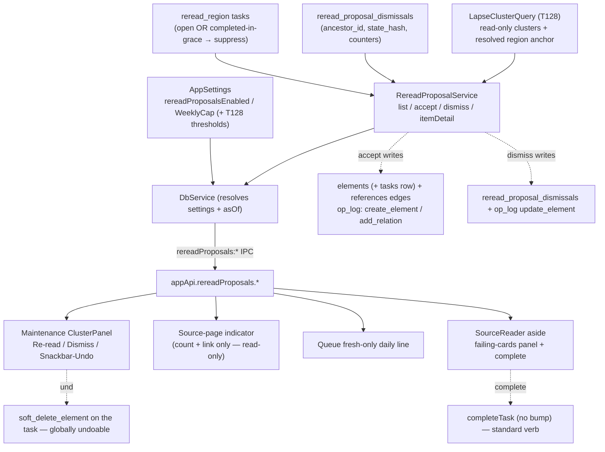

# feat: T129 — Re-read proposals

## Summary

Turn a detected lapse cluster (T128's read-only `LapseClusterQuery`) into **scheduled re-read
work**. The system surfaces a quiet, capped **proposal** — "this section keeps tripping several
cards; re-read it" — that the user can **accept** (creates an attention-scheduled re-read item
that opens the source AT the failing region with the failing cards attached for context) or
**dismiss** (remembered against the cluster's state-hash, reappearing only if the cluster
**materially** worsens). Proposals are advisory until accepted (nothing auto-enqueues), capped to
a small number of **active** proposals at once (default ≤2), and the failing cards' FSRS state is
never touched by any of it.

This closes the milestone's back-edge: T128 *detects* the comprehension-debt signal; T129
*produces the work* that repairs it, routed entirely through the attention scheduler (never
FSRS). The one explicit design constraint, from the spec, is **tone**: one quiet offer of help,
not an alarm assigning blame.

---

## Problem Frame

T128 names the correlation — N cards under one source region failing together is one
comprehension problem — and surfaces it read-only, where the only affordance is "open source at
the region." That is a manual, forgettable nudge. The milestone's promise is that the system
*schedules* the remedy: a re-read item that arrives due like any other attention item, opens at
the exact region via immutable lineage anchors, and carries the failing cards so the user can
re-expose with the failure context in hand — then optionally re-extract or rewrite a card.

**The payoff must be honest.** A subtle trap (surfaced in review): re-reading writes **no**
`review_log` and touches **no** card, and a cluster is defined purely as lapses over `review_logs`.
So completing a re-read cannot, by itself, make the cards recover — that happens later, when the
user next reviews those cards in the FSRS queue and grades them up. If the plan promised
"complete → cluster quiets" with no mechanism, the user would do the work and watch the indicator
stay lit — reading as "the system ignored my effort." T129 closes this honestly: completing a
re-read **suppresses the proposal** (the actionable nudge) for a grace window — because the
completed re-read *task itself* is the memory — and the confirmation copy sets the true
expectation ("these cards will be retested when they next come up for review"). The underlying
lapse diagnostic reflects reality until the cards actually recover.

---

## Requirements

Traceable to `docs/tasks/M28-lapse-rereading.md` (T129 section) and the milestone preamble.

- **R1 — Proposal lifecycle.** A live cluster becomes a **proposal**, visible in the maintenance
  section and (as a quiet count + link) on the source page, plus a quiet **fresh-only** daily
  touchpoint line. A proposal can be **accepted** (creates the scheduled re-read item, op-logged)
  or **dismissed** (remembered against the cluster's state-hash; reappears only if the cluster
  materially worsens).
- **R2 — Re-read item.** Accepting creates an attention-scheduled item that is **due like any
  attention item** (queue-eligible; standard postpone/done verbs work). Opening it lands in the
  reader **at the region** (anchor jump) with a side panel listing the **failing cards** (prompt
  + in-window lapse count, click-through to card detail). Completing it suppresses the proposal
  for a grace window and offers the standard processing verbs (extract via the reader's existing
  affordance, rewrite-card via card detail → T125 write barrier, done).
- **R3 — Targeting via anchors.** The re-read item targets the **exact source region** the
  cluster names — T128's already-resolved nearest-live-source-region ancestor (`ancestorId`) and
  its deterministic `source_locations` anchor. T129 **consumes** that resolution; it does not
  re-resolve loosely.
- **R4 — Caps (surfacing throttle, not an accept budget).** At most `rereadProposalWeeklyCap`
  (default 2) **active** proposals are surfaced at once, strongest-first — a visibility throttle
  **independent of accept history** (accepting does not reduce future proposals for *other*
  regions). Duplicate scheduling for the *same* region is prevented by the one-open-per-region
  index plus the open-or-recently-completed suppression (KTD-1/KTD-5), not by consuming a budget.
  Enforced **domain-side** in the listing read.
- **R5 — Dismissal memory (state-hash, material-worsening, not timer).** A dismissal is keyed on
  the cluster's state-hash (evaluator version + threshold signature + `ancestorId` + **banded**
  integer counters), upserted with an `operation_log` append in **one transaction**; the dismiss
  command **recomputes** the current signal and **rejects a stale hash**. A dismissed proposal
  reappears only when the evidence crosses a **material** worsening band (a counter band step or a
  new member card) — not on every single new lapse. Suppression **survives app restart**.
- **R6 — Advisory until accepted.** Nothing auto-enqueues. The listing read and the item-detail
  read are **read-only** (no mutation, no op-log, no FSRS/attention state change), proven by an
  all-tables row-count snapshot. Mutation lives only in **accept**, **dismiss**, and **complete**.
- **R7 — FSRS untouched.** No path in T129 touches `cards` / `review_states` / `review_logs` of
  the failing cards (the completion verb passes **no** `bumpReviewByDays`). Asserted byte-identical
  across accept / dismiss / open / complete / undo.
- **R8 — Settings + feature toggle.** A feature toggle (`rereadProposalsEnabled`, default on) and
  the active-proposal cap (`rereadProposalWeeklyCap`, default 2) are settings-tunable with safe
  bounds; cluster thresholds pass through from T128's existing settings. New keys wired into
  `SettingsPatchSchema` (`.strict()` — the named T128 footgun).
- **R9 — Recoverable + transactional.** Accept is one **atomic** transactional, op-logged command
  (create task element + attach failing cards + op-log; a mid-command failure rolls the whole
  thing back). It is **reversible by soft-deleting the created task element** — the codebase's
  "creates are undone by deleting" model (`soft_delete_element`, itself globally undoable/redoable)
  — surfaced as a Snackbar "Undo". Dismiss is transactional + op-logged. Everything is restart-safe.
- **R10 — Reuse, don't invent.** The re-read item is a `task`-type `Element` (T092/T110 shape),
  not a new element type; a new **system-owned** `reread_region` task type. No new `operation_log`
  op type (reuse `create_element` / `add_relation` / `update_element` / `reschedule_element` /
  `soft_delete_element`). No `elements`-table rebuild (additive migration only).
- **R11 — Tests.** Unit (lifecycle, cap as surfacing throttle, dismissal material-worsening
  memory, item-creation ops, soft-delete reversal + atomic-rollback fault injection, read-only
  proof, FSRS-untouched); Electron E2E — seeded cluster → accept → item appears in queue → opening
  lands at the region with cards attached → complete → proposal quiets → reappears only on material
  worsening; dismiss → suppressed → survives restart; restart-safe.

---

## Key Technical Decisions

### KTD-1 — Proposals are **computed, not stored** (mirror T103 retirement suggestions)

A proposal is not a persisted row. `listProposals` computes the visible proposal set live from
durable inputs:

1. T128's `LapseClusterQuery.list(...)` — the cluster source of truth (already read-only,
   already resolves the region anchor deterministically).
2. `reread_proposal_dismissals` — drop any cluster whose **current** state-hash equals a stored
   dismissal hash (R5).
3. **Open-or-recently-completed re-read tasks** — drop any cluster that has a `reread_region`
   task for its `ancestorId` that is **open** (status not terminal) **or was completed within the
   grace window** (default 14 days). You don't re-propose what you've scheduled, and you give a
   completed re-read time to take effect before suggesting it again (the completed task *is* the
   suppression memory — no separate table needed for the completion path).

Then apply the surfacing cap (KTD-5) and order strongest-first by the cluster's existing
`strength`. **Only dismissals are persisted; the re-read task carries its own suppression** — no
parallel proposal/analytics table that could drift from `review_logs`
(`review-analytics-data-capture-in-review-logs.md`). Mirrors `RetirementSuggestionRepository`:
compute the signal, subtract dismissals + open/recent work, expose only the visible set.

### KTD-2 — Re-read item = a **system-owned `reread_region` `task` element**, not a new element type (R10)

The element vocabulary is closed (`packages/core/src/enums.ts` `ElementType`); `task` already
exists. Add a new **task type** `reread_region` to `TASK_TYPES` **and** `SYSTEM_TASK_TYPES`
(`packages/core/src/task.ts`) — the discipline from `system-owned-recurring-tasks.md`: add a task
type, not an element type; a system-owned type so generic `createTask` refuses to mint it and a
dedicated service owns creation.

- Created by `RereadProposalService.accept(...)` (mirror `weekly-review-service.ts`'s
  `createSessionWithin`): `elements.createWithin(tx, { type:"task", status:"scheduled",
  stage:TASK_STAGE, priority, title, dueAt })` + `tasks` row (`task_type:"reread_region"`,
  `linked_element_id:ancestorId`, `note:region label`) + op-log — all in one transaction.
- `linked_element_id = ancestorId`. The existing **partial unique index
  `tasks_open_link_type_uq`** on `(linked_element_id, task_type)` with predicate `status NOT IN
  ('done','parked','dismissed','deleted')` (verified `organize.ts:140-142`) gives **"one open
  re-read per region" for free** — `scheduled` (what accept creates) is "open"; a completed/
  soft-deleted one frees the region. No new index.
- **Queue-eligible with zero extra wiring** for surfacing, but the open-path routing needs a small
  addition (KTD-7) — `queue-query` does not currently expose the linked *extract's owning source
  id* that routing needs.
- **Lifecycle verbs are standard.** `SYSTEM_TASK_TYPES` rejection lives only in `createTask`
  (minting). `completeTask` / `postponeTask` are generic and already operate on any `task` element
  — so the spec's "standard verbs (queue eligibility, postpone, done) all work" holds. Completion
  is the generic `completeTask(id)` with **no `bumpReviewByDays`** (KTD-9, R7).

### KTD-3 — Attach failing cards via `references` edges; display set is re-filtered to **live** cards

At accept time, add one `references` edge (`elements.addRelationWithin`, logs `add_relation`) from
the task element to **each** `LapseClusterMember.cardId` — a **durable snapshot of membership at
accept time**, surviving restart and independent of whether the cluster still exists when the item
is opened. Because `softDelete` is a status flip (not a row delete), these edges do **not** cascade
away when a member card is later trashed/retired — so `itemDetail` (the *display* read) must
**re-filter to live cards** (`elements.deletedAt IS NULL` and a non-terminal, non-retired status)
and **`DISTINCT` by `cardId`** (the `element_relations` table has no `(from,to,type)` uniqueness),
then re-derive each surviving card's **current** in-window lapse count from `review_logs` via the
shared `lapse-window` predicate (honest live count; a recovered card shows a lower count). The
`linked_element_id` edge (→ ancestor) is the re-read *target*; the card edges are the *context*.

### KTD-4 — Dismissal state-hash with **material-worsening hysteresis** (mirror `sourceRetirementSignalHash`, R5)

Add a pure `rereadClusterStateHash(cluster)` builder (co-located in `packages/local-db`, mirroring
`attention-scheduler.ts` `sourceRetirementSignalHash`) joining `[HASH_VERSION, ancestorId,
THRESHOLD_SIGNATURE(minLapses|windowDays|minCards), lapseBand(totalWindowLapses),
affectedCardCount]`. Two refinements over a naive hash:

- **Banded lapse count.** Hash `lapseBand(totalWindowLapses)` (e.g. floor to the next threshold
  multiple, or coarse buckets), **not** the raw count — so a dismissed proposal reappears only on
  a *material* step (the spec says "materially worsens"), not on every single new lapse. A
  dismissed cluster typically keeps accruing lapses (the user declined to repair it); without
  banding, the dismissal un-sticks within days for exactly the clusters the user most deliberately
  declined. `affectedCardCount` stays exact — a **new member card** joining is legitimately more
  re-surfaceable than the same cards failing once more.
- **Stored counters for honest deltas.** `reread_proposal_dismissals` stores the dismissed-at
  `total_window_lapses` and `affected_card_count` alongside the hash, so the dismiss command (and
  any future audit) can compute "materially worse" as a real delta rather than an opaque compare.

`dismiss({ ancestorId, stateHash })`: **recompute** the current cluster, reject if it no longer
exists or `currentHash !== stateHash` (`{ dismissed:false, stale:true }` — never persist a
dismissal for outdated evidence), else in **one transaction** upsert `reread_proposal_dismissals`
+ `operationLog.append(tx, { opType:"update_element", elementId:ancestorId, payload:{
rereadProposalDismissed:{ stateHash } } })`. No new op type.

**Hash-version drift policy.** On a `HASH_VERSION` bump (app update), stored `v1` hashes will never
match recomputed `v2` hashes, so every previously-dismissed cluster would re-propose at once — a
burst the surfacing cap (KTD-5) bounds to ≤2 at a time, but still undesirable. U2's migration
**deletes `reread_proposal_dismissals` rows whose stored hash version ≠ current** as part of any
version bump (clean "never dismissed" rather than "stale forever"); documented as the deliberate
policy.

### KTD-5 — Cap is a **surfacing throttle**, decoupled from accept history (R4; resolves Open Question 2)

Default `rereadProposalWeeklyCap = 2`. `listProposals` surfaces **at most `cap` active proposals at
once**, strongest-first — full stop. There is **no** "accept budget": accepting a re-read does not
reduce the proposals shown for *other* regions. Re-proposing the *same* region is already prevented
by KTD-1 (open-or-recently-completed suppression) + the one-open index.

**Why not an accept budget** (the original draft, rejected in review): counting accepts in a
rolling window perversely punishes the engaged user — accept two re-reads Monday and a genuinely
*stronger* cluster detected Wednesday stays silent until the window rolls; worse, *completing* a
re-read would leave it consuming the budget while the cluster persists, silently suppressing real
comprehension debt. A pure surfacing throttle ("≤2 active proposals at once") is the faithful,
non-perverse reading of the spec's "≤2 active proposals/week": you never have more than 2 re-read
suggestions to act on, and they drip in over weeks as you act on (and thereby suppress) regions.

### KTD-6 — Four IPC operations; reads read-only, mutations op-logged; thresholds resolved main-side

Mirror T128's `lapse:clusters` composition (`DbService` resolves settings + `asOf`, delegates to
an otherwise-pure service):

- `rereadProposals:list` (read) — `{ sourceId?, limit? }` → `RereadProposalDto[]` (cluster fields
  + `stateHash` + `dismissable`). **Read-only.**
- `rereadProposals:accept` (mutation) — `{ ancestorId }`. Server **recomputes** the cluster from
  `ancestorId` (don't trust a renderer snapshot — mirror T103 dismiss recompute), validates it
  still crosses thresholds, then creates the item. → `{ created, taskElementId?, alreadyOpen?,
  stale? }`.
- `rereadProposals:dismiss` (mutation) — `{ ancestorId, stateHash }` → `{ dismissed, stale? }`.
- `rereadProposals:item` (read) — `{ taskElementId }` → `{ region, members: [{ cardId, prompt,
  windowLapseCount }] }` for the reader side panel (live-card filtered, deduped). **Read-only.**

Completion reuses the **existing task-complete IPC** (`completeTask`, standard verb) — no new
channel. The accept reversal reuses the **existing soft-delete path** on the task element (KTD-10).
Settings (`rereadProposalsEnabled`, `rereadProposalWeeklyCap`) + thresholds passthrough resolved in
`DbService`; disabled toggle → empty list and accept refuses.

### KTD-7 — Opening the item: queue-query must **add** source-id resolution; reader owns the jump

The `reread_region` task's `linked_element_id` is the ancestor **extract**, not the source. The
generic queue open path (`openQueueItem.ts`) routes a linked extract to `/extract/$id` — the wrong
surface. So:

- `queue-query.ts` must **add** resolution for `reread_region` rows: resolve the linked extract's
  owning `sourceId` and surface it on the queue item as a new field (the existing `sourceId` field
  is the *task's own* source, which is `null` for tasks — it cannot be reused). This is new wiring,
  **not** "reuse existing."
- `openQueueItem.ts` branches on `taskType === "reread_region"` **before** the generic linked-task
  branch → navigate to `/source/$sourceElementId?reread=$taskId` (the `/source/$id` route has no
  `validateSearch`, so adding `reread?: string` is free).
- The **maintenance accept** path already has the full cluster `region` (`sourceElementId` +
  `blockIds`) and navigates the same way directly.
- `SourceReader`, on seeing `reread`, fetches `rereadProposals:item`, performs the **block jump**
  using `region.blockIds[0]` (reuse the `?block=&label=&n=` machinery / `jumpToSource`), and
  renders an **aside side panel** in a flex wrapper around `.reader-page` (the reader has no
  existing aside). The card-detail click-throughs preserve return: navigating to card detail and
  back restores `?reread=$taskId` so the panel reappears (no lost reading session).

### KTD-8 — Daily touchpoint = a **fresh-only, help-framed** single line on the queue screen

No daily-summary / "today" surface exists; the closest daily touchpoint is `/queue`. The spec asks
for "a quiet daily-summary line **when one is fresh**" — so the line is **not** a persistent count
of all clusters. It shows **only when there is a genuinely fresh proposal** — defined as an active
proposal whose cluster has **recent lapse activity** (`mostRecentLapseAt` within the last 48h) —
and is **help-framed, not a tally**: a single line offering the **strongest fresh** proposal
("A section keeps tripping a few cards — re-reading it may help"), linking to maintenance, **not**
"N sections worth re-reading" (a chore count next to the due-cards count). 0 fresh → render
nothing; fetch error → suppress silently; no loading placeholder. (Recorded as the chosen
interpretation; see Open Questions — defers cleanly to a real daily surface later.)

### KTD-9 — Card-rewrite routes through the T125 write barrier; the panel surfaces existing flows; completion passes no FSRS bump

The completion verbs are existing flows surfaced from the side panel, **not** rebuilt editors:
"Mark re-read done" calls the existing `completeTask(id)` path with **no `bumpReviewByDays`** (the
opt-in bump writes `cards.review_by` — a no-op for a non-card linked element, but the guarantee is
"never passed," asserted by a focused test, so a future edit can't silently regress R7). "Extract"
uses the reader's existing extract affordance. Each failing-card row links to **card detail**,
where rewriting already routes through `CardEditService.updateBody` (the T125 barrier, with
re-stabilization + the `editMarkerAt` marker row the lapse-window predicate excludes — so a rewrite
never feeds back as a fake lapse into the very cluster that triggered the re-read). T129 **never**
mutates `cards` / `review_states` directly.

### KTD-10 — Accept reversal = **soft-delete the task element** ("creates are undone by deleting")

The global `undoLast` inverts only `soft_delete_element` / `restore_element` / `update_element` /
`reschedule_element` (`undo-service.ts:52`); `create_element` and `add_relation` are **not
invertible** ("creates are undone by deleting, out of this MVP's scope", `undo-service.ts:26-30`),
and `undoLast` gates on the *last* op's type — so relying on global undo to reverse the accept
batch is impossible. Instead, accept's reversal is a **soft-delete of the created task element**
(op `soft_delete_element`, which *is* globally undoable/redoable). The maintenance accept surfaces
this as a `Snackbar` "Undo" (the existing `runUndoable` shape) wired to soft-delete the returned
`taskElementId` — not `undoLast`. The `references` edges survive the soft-delete (status flip), but
`listProposals`/`itemDetail`/queue all filter `deletedAt IS NULL`, and the one-open index excludes
`deleted` status, so the soft-deleted item vanishes from every surface and the region is freed for
a future proposal. The **atomicity** guarantee (R9) is about the accept *transaction* (a mid-command
failure rolls back the create + all edges) — proven by a fault-injection test — not about
batch-undo of a create.

---

## High-Level Technical Design

### Proposal lifecycle

```mermaid
stateDiagram-v2
  [*] --> Detected: T128 LapseClusterQuery finds a live cluster
  Detected --> Proposed: not dismissed (hash) AND no open/recent re-read AND within surfacing cap
  Detected --> Suppressed: dismissed (hash matches) OR open/recently-completed re-read OR over cap
  Proposed --> Scheduled: accept → create reread_region task (atomic, op-logged)
  Proposed --> Dismissed: dismiss → upsert dismissal(state-hash + counters) + op-log
  Dismissed --> Proposed: cluster materially worsens → banded hash changes / new member card
  Scheduled --> Opened: due in queue → /source/$id?reread=task → jump to region + cards panel
  Opened --> Completed: complete task (no FSRS bump); proposal suppressed for grace window
  Completed --> Detected: after grace window, if cards still lapse → eligible again
  Scheduled --> Proposed: undo accept = soft-delete the task element → item removed, region freed
```



### Component / data flow



### Accept command (directional — one atomic transaction)

```
accept({ ancestorId }):
  cluster = LapseClusterQuery.list({ ...thresholds, asOf }).find(c => c.ancestorId == ancestorId)
  if !cluster:                          return { created:false, stale:true }
  if openRereadExists(ancestorId):      return { created:false, alreadyOpen:true }   # pre-check
  try tx:
    task = elements.createWithin(tx, { type:"task", status:"scheduled", stage:TASK_STAGE,
                                       priority, title:`Re-read: ${cluster.region.label}`, dueAt })
    insert tasks { elementId:task.id, taskType:"reread_region",
                   linkedElementId:ancestorId, dueAt, status:"scheduled", note:region.label }
    for m in cluster.members: elements.addRelationWithin(tx,
                   { fromElementId:task.id, toElementId:m.cardId, relationType:"references" })
  catch UNIQUE(tasks_open_link_type_uq):  return { created:false, alreadyOpen:true }  # race belt
  return { created:true, taskElementId:task.id }
# Reversal (Snackbar "Undo"): softDelete(task.id) — globally undoable; NOT undoLast on the batch.
```

---

## Output Structure

New files (additive; everything else modifies existing seams):

```text
packages/local-db/src/
  reread-proposal-service.ts          # list / accept / dismiss / itemDetail + rereadClusterStateHash
  reread-proposal-service.test.ts
packages/db/src/schema/
  system.ts                           # +reread_proposal_dismissals (modify)
  organize.ts                         # tasks CHECK auto-widens from TASK_TYPES (modify)
packages/db/drizzle/
  00NN_<name>.sql                     # additive: tasks CHECK widen (mirror 0035) + new table
packages/db/src/
  migration-00NN-reread-proposals.test.ts   # migration test (new)
apps/web/src/pages/source/
  RereadPanel.tsx                     # reader aside: failing-cards panel + complete
tests/electron/
  reread-proposals.spec.ts
```

---

## Implementation Units

### U1. Settings: feature toggle + active-proposal cap

**Goal:** `rereadProposalsEnabled` (default on) and `rereadProposalWeeklyCap` (default 2)
settings-tunable with safe bounds (R8).

**Requirements:** R8.
**Dependencies:** none.
**Files:**
- `packages/core/src/settings.ts` (modify) — add both keys to `AppSettings`, `SETTINGS_KEYS`,
  `DEFAULT_APP_SETTINGS` (`true` / `2`), bounds consts (cap `[1, 10]`), `coerceSettingValue`
  switch, and `getAppSettings` assembly. Mirror the four T128 `lapseCluster*` keys exactly.
- `packages/core/src/settings.test.ts` (modify) — coercion + clamp + round-trip coverage.

**Approach:** Follow the typed-settings convention verbatim (boolean toggle; `clampInt(raw, MIN,
MAX)` for the cap). A corrupt/legacy row must never reach the service as `NaN`.

**Patterns to follow:** `settings.ts` `lapseClusterDetectionEnabled` / `lapseClusterMinCards` (T128).

**Test scenarios:**
- Defaults present and correct in `DEFAULT_APP_SETTINGS` (`true`, `2`).
- Cap out-of-range clamps to `[1, 10]`; non-numeric / missing → default `2`; corrupt → no `NaN`.
- `Covers R8.` Toggling `rereadProposalsEnabled` round-trips stored → typed.

### U2. Schema & migration: `reread_region` task type + `reread_proposal_dismissals` table

**Goal:** Additive schema for the system-owned task type and dismissal memory, with **no
`elements`-table rebuild**, mirroring the correct prior precedent (R10, R5, KTD-4).

**Requirements:** R5, R10.
**Dependencies:** none.
**Files:**
- `packages/core/src/task.ts` (modify) — add `"reread_region"` to `TASK_TYPES`,
  `SYSTEM_TASK_TYPES`, and `TASK_TYPE_LABEL`.
- `packages/db/src/schema/organize.ts` (modify) — the `tasks_task_type_check` CHECK auto-includes
  the new value via `inList(table.taskType, TASK_TYPES)`; confirm `tasks_open_link_type_uq` (4-status
  predicate `status NOT IN ('done','parked','dismissed','deleted')`) covers `reread_region`.
- `packages/db/src/schema/system.ts` (modify) — add `rereadProposalDismissals` table:
  `ancestor_id` (PK, FK → `elements.id` `onDelete: cascade`), `state_hash` (text, not null),
  `total_window_lapses` (int, not null), `affected_card_count` (int, not null), `dismissed_at`
  (text, not null); index `reread_proposal_dismissals_hash_idx`. Mirror
  `retirementSuggestionDismissals` (`system.ts:106`).
- `packages/db/drizzle/00NN_*.sql` (new, generated) — one migration covering the `tasks` CHECK
  widening **and** the new table.
- `packages/db/src/migration-00NN-reread-proposals.test.ts` (new) — mirror
  `migration-0031-retirement-suggestion-dismissals.test.ts` + `migration-0035-weekly-review-task.test.ts`.

**Approach:** Edit both schema files, then `pnpm db:generate` once to emit a single migration;
`pnpm db:migrate` to apply. **Hand-verify** the generated SQL against
**`packages/db/drizzle/0035_quiet_network.sql`** (the migration that last widened `TASK_TYPES`, by
adding `weekly_review`) — **not** `0025_noisy_korath.sql`, whose `tasks_open_link_type_uq` predicate
omits `'parked'` (only 3 statuses) and would silently change the one-open invariant. Drizzle's
SQLite generator **drops `.where()` predicates** on rebuild, so the migration must **re-emit both
partial indexes** (`tasks_open_link_type_uq` *and* `tasks_open_weekly_review_uq`) with their exact
4-status / weekly predicates. Confirm the runner forces `PRAGMA foreign_keys=OFF` outside the
transaction with a `foreign_key_check` after (`migrator.ts:83-104`, the post-0030 fix). The
`reread_proposal_dismissals` add is a pure `CREATE TABLE` + index (no rebuild). **Hash-version
cleanup (KTD-4):** the migration (or service init) deletes any `reread_proposal_dismissals` rows
whose stored hash version ≠ the current `HASH_VERSION`.

**Execution note:** Characterization-first on the migration — seed an `elements` lineage graph + a
`tasks` row with lineage, run the `tasks` rebuild, and assert `parent_id`/`source_id` survive (the
migration-0030 regression class) and `foreign_key_check` is empty after. (Defense-in-depth: the
0030 FK-cascade vector is structurally **absent** for `tasks` — nothing references `tasks(element_id)`
— so the implicit `DELETE FROM tasks` fires no referential actions; the test guards the precedent
the 0035 test under-asserts, not an equivalent danger.)

**Patterns to follow:** `0035_quiet_network.sql`; `retirementSuggestionDismissals` +
`migration-0031-*.test.ts`.

**Test scenarios:**
- `reread_region` is accepted by `tasks_task_type_check`; an unknown type is rejected.
- Both partial unique indexes exist post-migration with their exact predicates (a second open
  `reread_region` for one `linked_element_id` is rejected; a `done` one is allowed).
- `reread_proposal_dismissals` upsert by `ancestor_id` PK works; counters round-trip; FK cascade
  deletes the dismissal when the ancestor element is hard-deleted.
- `Covers R10.` After migration, a seeded lineage graph keeps `parent_id`/`source_id`;
  `foreign_key_check` empty; `OPERATION_TYPES` unchanged.
- Stale-hash-version dismissal rows are cleared; fresh-DB and upgrade paths land the same schema;
  idempotent on an already-migrated DB.

### U3. `RereadProposalService` — reads + state-hash (`listProposals`, `itemDetail`)

**Goal:** Compute the visible proposal set and the re-read item's failing-cards detail, **read-
only** (R1, R3, R4, R6).

**Requirements:** R1, R3, R4, R6.
**Dependencies:** U1, U2.
**Files:**
- `packages/local-db/src/reread-proposal-service.ts` (new) — `class RereadProposalService(db,
  deps)`; `rereadClusterStateHash(cluster)` (pure, banded + version-prefixed); `listProposals(input)`
  and `itemDetail(input)` (read-only); `RereadProposal` / `RereadProposalItemDetail` types. Reuse
  the injected `LapseClusterQuery` (do **not** re-resolve the region anchor) and the shared
  `lapse-window` predicate for `itemDetail`'s live member counts.
- `packages/local-db/src/index.ts` (modify) — grouped export + register (mirror `lapse-cluster-query`).
- `packages/local-db/src/reread-proposal-service.test.ts` (new).

**Approach:** `listProposals`: short-circuit `[]` when `enabled === false`; else call
`LapseClusterQuery.list({ sourceId?, asOf, ...thresholds })`, drop clusters whose current
`rereadClusterStateHash` equals a stored dismissal hash, drop clusters with a `reread_region` task
on `ancestorId` that is open **or** completed within the grace window (default 14d), then surface
**at most `cap`** strongest-first (KTD-5 surfacing throttle — **no** accept-budget math), attaching
`stateHash` + `dismissable:true`. `itemDetail`: load the task's `references` card edges, **filter to
live cards** (`deletedAt IS NULL`, non-terminal/non-retired status) and **`DISTINCT` by `cardId`**,
join prompts, re-derive each survivor's in-window lapse count via `liveCardLapseWhere`, and return
the region from the linked ancestor's `source_locations` anchor (reuse T128's resolution; degrade
label to "Selected text"). **No writes to any table.**

**Patterns to follow:** `retirement-suggestion-repository.ts` (`visibleForSource` compute-minus-
dismissals); `lapse-cluster-query.ts` (read-only header; region naming); `attention-scheduler.ts`
`sourceRetirementSignalHash` (hash builder); `lapse-window.ts` `liveCardLapseWhere`.

**Test scenarios:**
- `Covers R1.` Seeded cluster, no dismissal, no open/recent task → exactly one proposal with the
  right region, members, and a stable `stateHash`.
- Dismissed cluster (stored hash == current) → suppressed; same cluster after **one** more lapse
  (within the band) → **still suppressed** (hysteresis); after a **band step** or a **new member
  card** → reappears.
- Cluster with an **open** `reread_region` task → suppressed; with a task **completed 3 days ago**
  → suppressed; with one **completed 20 days ago** (cards still lapsing) → eligible again.
- `Covers R4.` With `cap=2` and 5 eligible clusters → top 2 by strength; accepting one (its region
  now suppressed) does **not** reduce the count for the others (no accept-budget).
- `enabled=false` → `[]` (no scan).
- `itemDetail` lists attached cards with live in-window counts; a member **soft-deleted/retired
  after accept** is **excluded**; a duplicate `references` edge yields the card **once** (DISTINCT);
  a lineage-wiped member degrades gracefully (no crash on null).
- `rereadClusterStateHash` is deterministic, version-prefixed, banded; changes on a lapse **band
  step**, a new member card, or a threshold-signature change; unchanged on a single sub-band lapse.
- `Covers R6.` All-tables row-count snapshot unchanged before/after `listProposals` and `itemDetail`
  (both `sourceId` and vault-wide paths).

### U4. `RereadProposalService` — mutations (`accept`, `dismiss`) + reversal

**Goal:** Schedule a re-read item (R2, R3, R9, R10), remember a dismissal (R5), both transactional,
op-logged, FSRS-untouched (R7), with a working reversal (KTD-10).

**Requirements:** R2, R3, R5, R7, R9, R10.
**Dependencies:** U3.
**Files:**
- `packages/local-db/src/reread-proposal-service.ts` (modify) — add `accept(input)` and
  `dismiss(input)`.
- `packages/local-db/src/reread-proposal-service.test.ts` (modify).

**Approach:** `accept({ ancestorId, asOf, thresholds, priority })`: recompute the cluster (reject
`{ created:false, stale:true }` if gone); a **pre-insert existence check** for an open `reread_region`
on `ancestorId` (`{ created:false, alreadyOpen:true }`); then in one `db.transaction`:
`elements.createWithin` the `task`, insert the `tasks` row, and `addRelationWithin` a `references`
edge per member card — **catching** a `tasks_open_link_type_uq` violation as the race belt
(→ `alreadyOpen`). Reuse the dedicated-service creation pattern (`weekly-review-service.ts`); do
**not** call `createTask`. **No batchId-undo framing** — the reversal is a soft-delete of the task
(KTD-10), surfaced by U6. `dismiss({ ancestorId, stateHash, asOf, thresholds })`: recompute, reject
stale hash, else upsert `reread_proposal_dismissals` (with the dismissed-at counters) +
`operationLog.append(tx, { opType:"update_element", elementId:ancestorId, payload:{
rereadProposalDismissed:{ stateHash } } })` in one transaction. Neither command reads or writes
`cards` / `review_states` / `review_logs`.

**Execution note:** Test the accept transaction's **atomicity** with fault injection — force the
edge insert (or tasks insert) to throw mid-command and assert the whole create rolls back (no
orphan task, no partial edges). Separately test the **reversal**: soft-deleting the created task
removes it from `listProposals`/`itemDetail`/queue and frees the region, and is itself undoable via
`undoLast` (`soft_delete_element` is invertible).

**Patterns to follow:** `weekly-review-service.ts` `createSessionWithin`; `task-service.ts`
`createTask` (multi-table create + relation edge); `retirement-suggestion-repository.ts` `dismiss`;
`element-repository.ts` `softDeleteWithin` (the reversal target).

**Test scenarios:**
- `Covers R2, R10.` Accept creates a `task` element + `tasks` row (`reread_region`,
  `linked_element_id == ancestorId`) + one `references` edge per member; ops are `create_element`
  + `add_relation` only (no new op type); the task is queue-eligible.
- One-open-per-region: a second accept while one is open → `{ created:false, alreadyOpen:true }`
  (pre-check); a simulated race that reaches the INSERT → caught as `alreadyOpen`, exactly one task.
- Accept of a now-stale cluster (cards recovered) → `{ created:false, stale:true }`, nothing written.
- `Covers R9.` Accept transaction is atomic (fault-injected mid-command → full rollback). Reversal:
  soft-delete the task → gone from all reads + region freed; the soft-delete is itself undoable.
- `Covers R5.` Dismiss with the current hash persists a row + counters + `update_element` op (one
  transaction); dismiss with a stale hash → `{ dismissed:false, stale:true }`, no row written.
- `Covers R7.` `cards` / `review_states` / `review_logs` of the failing cards are byte-identical
  before/after accept, dismiss, complete (no bump), and reversal.

### U5. IPC surface (`rereadProposals:list / accept / dismiss / item`)

**Goal:** Expose the service over the typed bridge; reads read-only, mutations op-logged; thresholds
+ settings resolved main-side (R1, R4, R6, R8, KTD-6).

**Requirements:** R1, R4, R6, R8.
**Dependencies:** U4.
**Files:**
- `apps/desktop/src/shared/channels.ts` (modify) — add the four `rereadProposals:*` channels
  (`list`/`item` in the read block; `accept`/`dismiss` in the mutation block).
- `apps/desktop/src/shared/contract.ts` (modify) — request zod schemas (`ancestorId` /
  `taskElementId` validated; `limit` bounded), DTOs (`RereadProposalDto`,
  `RereadProposalItemDetailDto`, result types incl. `alreadyOpen`/`stale`/`cap…`), `AppApi` method
  signatures. **Add `rereadProposalsEnabled` + `rereadProposalWeeklyCap` to `SettingsPatchSchema`
  (`.strict()`).**
- `apps/desktop/src/main/ipc.ts` (modify) — handlers: reads no op-log; mutations call the service
  inside its own transaction; `.parse` at the boundary.
- `apps/desktop/src/main/db-service.ts` (modify) — instantiate `RereadProposalService` (inject
  `LapseClusterQuery` + repos) in `open()`; `listRereadProposals` / `acceptRereadProposal` /
  `dismissRereadProposal` / `rereadProposalItem` resolving settings + `asOf` main-side (mirror
  `listLapseClusters`).
- `apps/desktop/src/preload/index.ts` (modify) — `rereadProposals: { list, accept, dismiss, item }`.
- `apps/web/src/lib/appApi.ts` (modify) — renderer-local DTO mirrors + typed facade methods.
- `apps/desktop/src/shared/contract.test.ts` (modify) — channel-list coverage; settings-patch
  bounds for the two new keys (mirror the T128 lapse block at `contract.test.ts:510`); assert the
  read channels carry no mutation.

**Approach:** Mirror T128's `lapse:clusters` chain (reads) + T127's `triage:*` mutation chain
(accept/dismiss). Split `z.input`/`z.output` for defaulted request fields. Completion + reversal
reuse the **existing** task-complete + soft-delete IPC — no new channels for them.

**Patterns to follow:** `lapse:clusters`, `triage:suggest` + a triage mutation, `review:leeches`.

**Test scenarios:**
- `Covers R8.` Contract test: the four channels present; `SettingsPatchSchema.parse` accepts the
  two new keys and still rejects an unknown key (`.strict()` intact).
- Request schemas reject a malformed `ancestorId` / out-of-range `limit`.
- `db-service` resolves `enabled`/`weeklyCap`/thresholds from settings; disabled → `list` `[]`,
  `accept` refuses.
- No generic `db.query` exposed (asserted in U10 E2E).

### U6. Maintenance ClusterPanel — accept / dismiss + interaction states

**Goal:** Extend T128's "Struggling card groups" `ClusterPanel` with Re-read (accept) + Dismiss per
proposal, with explicit interaction states (R1, R6).

**Requirements:** R1, R6.
**Dependencies:** U5.
**Files:**
- `apps/web/src/maintenance/MaintenanceScreen.tsx` (modify) — `ClusterPanel` fetches **proposals**
  via `rereadProposals.list()` (so dismissed/accepted/recent clusters are pre-filtered); add
  "Re-read" + "Dismiss" to the row's `.mt-bulkbar` (alongside "Open source"). Re-fetch on
  `UNDO_EVENT` + settings change.
- `apps/web/src/maintenance/maintenance.css` (modify) — button row + inline-note styling.

**Approach & interaction states (resolve now, not at implement-time):**
- **Tone & icons:** text-only buttons (no alarm glyph). Do **not** use `RefreshCw` (the FSRS review
  glyph — would conflate attention with FSRS, violating the scheduler distinction) or `warning`.
  "Open source" keeps its existing `link` icon; Re-read/Dismiss are text buttons.
- **In-flight:** both buttons for a row go `disabled` while any request for that `ancestorId` is in
  flight (no spinner — quiet tone); prevents double-submit. The row hides only **after** the IPC
  resolves (dismiss = optimistic hide on success).
- **Accept feedback = Snackbar with Undo** (the existing `runUndoable` shape, `MaintenanceScreen`
  ~`:211`/`:241`), copy "Re-read scheduled", Undo → **soft-delete the returned `taskElementId`**
  (KTD-10), not `undoLast`.
- **`alreadyOpen` / `stale`** results → a quiet inline `role="status"` note ("Already scheduled" /
  "This group has already recovered"), not an error dialog; clears on next list refresh.
- **Feature-disabled:** when `rereadProposalsEnabled=false`, `ClusterPanel` reverts to the T128
  read-only behavior (only "Open source"); no "feature disabled" empty state.
- **StrictMode guard:** `useRef(false)` + set `true` in the effect body (the bug fixed in commits
  `bcb5..6f1e`); `<StrictMode>`-wrapped test asserts accept/dismiss still fire after `await`.

**Patterns to follow:** existing `ClusterPanel` (`MaintenanceScreen.tsx:1326`); `runUndoable` +
`Snackbar`; `strictmode-mountedref-cleared-only-on-cleanup.md`; `design/icon-map.md`.

**Test scenarios:** (component-level + E2E in U10)
- A proposal row renders Re-read + Dismiss; Re-read routes to the reader at the region and shows the
  undo Snackbar; Dismiss hides the row.
- Buttons disable during the in-flight request (no double-submit); `alreadyOpen`/`stale` render a
  quiet note, not an error.
- Feature off → only "Open source" renders.
- `<StrictMode>`-wrapped: accept/dismiss still fire after `await`.

### U7. Re-read item routing + reader failing-cards panel

**Goal:** Open a `reread_region` item at the region with the failing-cards side panel and standard
completion verbs (R2, KTD-7, KTD-9).

**Requirements:** R2, R3.
**Dependencies:** U5.
**Files:**
- `packages/local-db/src/queue-query.ts` (modify) — for a `reread_region` task row, **resolve and
  surface the linked extract's owning `sourceId`** on the queue item as a **new** field (the
  existing `sourceId` is the task's own, `null`). This is new wiring (feasibility-confirmed gap).
- `apps/web/src/pages/queue/openQueueItem.ts` (modify) — branch on `taskType === "reread_region"`
  **before** the generic linked-task branch → `/source/$sourceElementId?reread=$itemId`.
- `apps/web/src/pages/queue/queueRow.tsx` (modify) — `metaFor`/`actionFor` for a `reread_region`
  row: an attention-scheduler-consistent icon (e.g. `eye` or `gauge` — **not** `RefreshCw`) + a
  "Re-read <region>" label + open affordance.
- `apps/web/src/pages/source/SourceReader.tsx` (modify) — read `reread` from search; when present,
  fetch `rereadProposals.item(taskElementId)`, perform the region jump (`region.blockIds[0]`), and
  render `<RereadPanel>` in a flex wrapper beside `.reader-page`. Stale-async guard keyed on
  `taskElementId`; StrictMode `mountedRef` guard.
- `apps/web/src/pages/source/RereadPanel.tsx` (new) — `<aside role="complementary"
  aria-label="Failing cards for this re-read" aria-live="polite">` listing failing cards (prompt +
  "N lapses in {window}d" + click-through to card detail), a **close** control (removes `?reread`
  via history `replace` — hides the panel without completing the task), a "Mark re-read done" button
  (existing `completeTask`, **no bump**), and a note that Extract uses the reader's affordance and
  card rewrite happens from card detail (T125). Focus moves to the panel heading on first render
  (`tabIndex={-1}`). Card-detail links restore `?reread` on back-nav so the panel reappears.
- `apps/web/src/pages/source/source-reader.css` (or equivalent, modify) — aside layout; below a
  minimum reading-column width the aside becomes an overlay/drawer rather than compressing the
  measure (desktop-first; the Electron window is resizable).

**Approach:** The panel is renderer state from `itemDetail`. "Mark re-read done" completes the task
(standard verb) — completion suppresses the proposal for the grace window via KTD-1 (the completed
task is the memory). Do **not** rebuild a card editor. Adding `reread?: string` to the loosely-typed
`/source/$id` search needs no route migration.

**Patterns to follow:** `openQueueItem.ts` weekly_review / linked-task branches; `SourceReader.tsx`
jump application (`:557`); `openClusterRegion`; the universal-inspector aside chrome;
`strictmode-mountedref-cleared-only-on-cleanup.md`.

**Test scenarios:** (component-level + E2E in U10)
- A `reread_region` queue item routes to the **source reader** at the region (not `/extract/$id`).
- `RereadPanel` lists attached failing cards with live counts + card-detail links; close hides the
  panel without completing; "Mark re-read done" completes the task (no FSRS bump) and the item
  leaves the queue.
- Rapid open of item A then B never shows A's cards on B (stale guard); panel is a `complementary`
  landmark; focus lands on it on first render.
- `<StrictMode>`-wrapped: the done action still fires after `await`.

### U8. Quiet fresh-only daily touchpoint on the queue screen

**Goal:** A single quiet, **fresh-only**, **help-framed** line offering the strongest fresh
proposal, linking to maintenance (R1, KTD-8).

**Requirements:** R1.
**Dependencies:** U5.
**Files:**
- `apps/web/src/pages/queue/QueueScreen.tsx` (modify) — fetch `rereadProposals.list()`; render
  **one muted line** above the queue list **only when** there is a proposal with recent lapse
  activity (`mostRecentLapseAt` within 48h), offering the strongest such proposal
  ("A section keeps tripping a few cards — re-reading it may help"), linking to `/maintenance`. No
  loading placeholder; no fresh proposal → render nothing; fetch error → suppress silently.

**Approach:** Quiet tone — muted text, no icon-alarm, no action buttons (action lives in
maintenance), **not** a running "N sections" tally (the chore-count framing the spec warns
against). Mount-only-when-positive so the absent case adds no layout.

**Patterns to follow:** the T128 source-page quiet indicator; existing `QueueScreen` callouts; muted
subtitle treatment.

**Test scenarios:** (E2E in U10)
- A proposal with fresh activity → the queue shows the single help-framed line linking to
  maintenance; a stale-but-present proposal → no line; none → no line (no layout shift); fetch error
  → suppressed.

### U9. Settings UI controls

**Goal:** Expose the toggle + active-proposal cap in Settings (R8).

**Requirements:** R8.
**Dependencies:** U1.
**Files:**
- `apps/web/src/pages/Settings.tsx` (modify) — a new `SettingRow` after the T128 lapse-cluster
  block (~`:1804`): a `rereadProposalsEnabled` toggle + a `rereadProposalWeeklyCap` numeric input
  ("active at once"), wired through the existing settings write path; add the two fields to the
  settings-state default shape (~`:88`). A change refreshes the proposal surfaces.

**Approach:** Minimal controls mirroring the adjacent lapse block; input respects the U1 clamp; no
new IPC (reuse the settings update path, which accepts the keys via U5's `SettingsPatchSchema`
change). Label the cap "active at once" (not "per week") to match KTD-5 semantics.

**Patterns to follow:** the T128 lapse `SettingRow` (`Settings.tsx:1754-1804`).

**Test scenarios:** Test expectation: presentational — covered by U1 (coercion) + U10 (E2E cap
honored). Add a focused interaction test only if the Settings test file establishes that convention.

### U10. Electron E2E + restart persistence

**Goal:** Prove the full lifecycle end-to-end, restart-safe, FSRS-untouched (R2, R4, R5, R6, R7, R9,
R11).

**Requirements:** R2, R4, R5, R6, R7, R9, R11.
**Dependencies:** U6, U7, U8, U9.
**Files:**
- `tests/electron/reread-proposals.spec.ts` (new).

**Approach:** Seed a vault with one genuine sibling-failure cluster (+ a healthy source). Run under
`INTERLEAVE_E2E_QUIET=1`. Assert: the maintenance panel + source-page count + a fresh queue line
show the proposal; **accept** → a `reread_region` item appears in the queue; **opening** it lands at
the region (source reader, not extract view) with the failing-cards panel; **complete** → the item
leaves the queue and the **proposal is suppressed** (does not re-appear within the grace window);
**dismiss** a fresh proposal → suppressed, surviving an app **restart**, and **still suppressed**
after one sub-band lapse, **reappearing** only after a band-step worsening; the **surfacing cap**
shows at most 2 at once; the **list/item reads write nothing** (all-tables snapshot) and FSRS
`review_states` are byte-identical across accept/dismiss/open/complete; an **accepted item's
soft-delete reversal** removes it and frees the region; `window.appApi.rereadProposals` exists and
no generic `db.query` is exposed.

**Patterns to follow:** `tests/electron/lapse-clusters.spec.ts`; `tests/electron/done-intent.spec.ts`
(T103 dismissal-survives-restart); `quiet-macos-electron-e2e-launches.md`.

**Test scenarios:**
- `Covers R1, R2.` Proposal on the surfaces → accept → queue item → open at region with cards →
  complete → proposal quiets (grace window).
- `Covers R5.` Dismiss → suppressed → survives restart → stays suppressed on sub-band lapse →
  reappears on band-step worsening.
- `Covers R4.` Surfacing cap shows ≤2 at once; accepting one doesn't suppress unrelated proposals.
- `Covers R6, R7.` List/item reads write nothing; FSRS states byte-identical; no generic db access.
- `Covers R9.` Soft-delete reversal of an accepted item removes it and frees the region.

---

## Scope Boundaries

### In scope
- The proposal lifecycle (compute → accept → dismiss → complete-suppress), the system-owned
  `reread_region` re-read item, the reader failing-cards panel, the maintenance/source/queue
  surfaces, dismissal material-worsening memory, the surfacing cap, settings, and the four-channel
  IPC surface.

### Deferred to Follow-Up Work
- In-panel card rewriting (the panel links out to card detail, which already routes through the
  T125 barrier — no embedded editor in this PR).
- A **"Review these cards now"** filtered review session from the panel (the strongest payoff
  per the product review). T129 ships the honest suppression payoff + card-detail click-throughs;
  a card-id-filtered review session is its own feature — defer until a filtered-review entrypoint
  exists.
- A dedicated `/daily` summary surface (none exists; the queue line is the daily touchpoint —
  KTD-8). Promote to a real daily surface when one is built.
- Per-proposal timer-based "snooze N days" — the spec mandates state-hash memory, not timers.
- Block-range overlap merging of distinct extracts (inherited T128 deferral).

### Out of scope
- **Read-point integration.** Re-reading performs a cursor *jump* to the region but deliberately
  does **not** advance/refresh the reader's read-point or write a `reread_at` on the region. The
  read-point is the user's *forward* reading progress; a re-read is a backward re-exposure and
  conflating them would corrupt progress semantics. Recorded as a deliberate decision (raised in
  review), not an oversight; revisit if a distinct "re-read marker" is ever wanted.
- Re-deriving or re-resolving the cluster region anchor — T129 consumes T128's resolution (R3).
- Any change to FSRS card scheduling (R7) or to T128's read-only detection.
- A new `operation_log` op type or a new `Element` type (R10).

---

## Risks & Mitigations

- **Undo of accept relies on inverting a create (impossible)** — the global undo cannot invert
  `create_element`/`add_relation` (`undo-service.ts:26-30,52`) → KTD-10: reversal is a **soft-delete
  of the task element** (a globally-undoable op), surfaced as the maintenance Snackbar "Undo"; the
  accept *transaction* is atomic (fault-injection tested). R9 reframed accordingly.
- **`tasks` CHECK-widen table rebuild re-triggering the migration-0030 FK-cascade wipe** (critical
  class) → structurally absent for `tasks` (no inbound FK references `tasks(element_id)`), plus the
  runner forces `foreign_keys=OFF` + `foreign_key_check`; U2 mirrors **0035** (not 0025) and re-emits
  **both** partial indexes with the **4-status** predicate, with a lineage-survival migration test.
- **"Cluster quiets" promised but completion can't recover cards** → KTD-1/KTD-9: completion
  **suppresses the proposal** for a grace window (the completed task is the memory) and the copy
  sets the true expectation; final card recovery is downstream FSRS. The success condition is "the
  proposal quiets," not "the cards instantly recover."
- **Cap perversely punishing engagement** → KTD-5: a pure **surfacing throttle** (≤N active at
  once), decoupled from accept history; accepting suppresses only the *accepted* region.
- **Dismissal un-sticking on every lapse** → KTD-4: **banded** lapse hashing + stored counters → a
  dismissal reappears only on a material band step or a new member card.
- **Soft-deleted/retired member still shown in the panel** (soft-delete is a status flip; edges
  don't cascade) → KTD-3/U3: `itemDetail` re-filters to **live** cards and `DISTINCT`s by `cardId`.
- **One-open-per-region race → raw constraint error** → U4: pre-insert existence check + catch the
  unique violation → clean `{ alreadyOpen:true }`.
- **`completeTask` bump touching `cards`** → KTD-9/U4: completion passes **no `bumpReviewByDays`**;
  a focused test guards it; U10 byte-identical FSRS assertion is the backstop.
- **Hash-version bump stranding dismissals → mass re-propose burst** → KTD-4/U2: clear stale-version
  dismissal rows on bump; the surfacing cap bounds any residual burst to ≤2.
- **`SettingsPatchSchema.strict()` rejecting the new keys** (named T128 footgun) → U5 adds both keys
  + the parse-bounds contract test.
- **Dead accept/dismiss/done buttons under StrictMode** (`mountedRef` cleared-only-on-cleanup) →
  U6/U7 set the ref `true` in the effect body + `<StrictMode>`-wrapped tests.
- **Nagging / alarm tone** (the named tone risk) → conservative T128 thresholds inherited; surfacing
  cap; advisory-until-accepted; quiet single-line/help-framed surfaces; cheap one-click dismiss;
  source page is count+link only (not a third mutation surface); the queue line is fresh-only.
- **Stale region on a re-imported source** → label degrades to "Selected text"; the block jump
  no-ops gracefully (T128 fallback + the jump's null-block guard).
- **Async navigation races** (source indicator / reader panel) → stale guards keyed on
  `sourceId` / `taskElementId`.

---

## Open Questions

- **Daily touchpoint placement (KTD-8).** No daily surface exists; the plan uses a fresh-only,
  help-framed queue line. If a `/daily` or home "today" surface is preferred, it's a one-unit move
  (U8). Default proceeds with the queue line.
- **Weekly-cap semantics — RESOLVED (KTD-5).** Chosen: "≤N **active** proposals shown at once"
  (surfacing throttle), over "≤N accepts/week" (which perversely punishes engagement and suppresses
  worsening clusters). Documented; no longer open.

---

## Sources & Research

- Origin: `docs/tasks/M28-lapse-rereading.md` (T129); predecessor plan
  `docs/plans/2026-06-15-003-feat-t128-lapse-cluster-detection-plan.md`.
- `docs/solutions/architecture-patterns/sibling-clustering-over-the-lineage-dag.md` (T128 cluster
  contract — consume the resolved anchor; read-only proof discipline).
- `docs/solutions/design-patterns/signal-hash-advisory-nudges.md` (T103 — dismissal-memory /
  state-hash; recompute-reject-stale; restart-persistence).
- `docs/solutions/architecture-patterns/system-owned-recurring-tasks.md` (task type not element
  type; dedicated-service creation; partial-unique one-open invariant).
- `docs/solutions/architecture-patterns/command-level-undo-atomic-batch-inversion.md` +
  `packages/local-db/src/undo-service.ts:26-30,52` (the create-not-invertible reality → soft-delete
  reversal; fault-injection for atomic rollback).
- `docs/solutions/architecture-patterns/review-triggered-descendant-health-source-rescheduling.md`
  (T114 — one lapse definition; backend-owned, FSRS-untouched write edge).
- `docs/solutions/architecture-patterns/review-analytics-data-capture-in-review-logs.md` (recompute
  from `review_logs`; `z.input`/`z.output` split for defaulted IPC payloads).
- `docs/solutions/architecture-patterns/card-edit-write-barrier-restabilization.md` (T125 — route
  card rewrite through it; the `editMarkerAt` marker-row exclusion).
- `docs/solutions/database-issues/sqlite-table-rebuild-with-foreign-keys-on-fires-on-delete-actions.md`
  (the `tasks` CHECK-widen rebuild risk; mirror 0035; no `elements` rebuild).
- `docs/solutions/ui-bugs/strictmode-mountedref-cleared-only-on-cleanup.md` (accept/dismiss/done
  async-handler guard + `<StrictMode>` test).
- `docs/solutions/developer-experience/quiet-macos-electron-e2e-launches.md` (`INTERLEAVE_E2E_QUIET=1`).
- Code: `packages/local-db/src/{lapse-cluster-query,lapse-window,retirement-suggestion-repository,
  task-service,weekly-review-service,element-repository,operation-log-repository,undo-service,
  card-edit-service,queue-query}.ts`; `packages/core/src/{task,settings,operation-log}.ts`;
  `packages/db/src/schema/{organize,system}.ts`; `packages/db/drizzle/0035_quiet_network.sql`;
  `apps/desktop/src/{shared/channels,shared/contract,main/ipc,main/db-service,preload/index}.ts`;
  `apps/web/src/{maintenance/MaintenanceScreen,pages/source/SourceReader,pages/queue/openQueueItem,
  pages/queue/queueRow,pages/queue/QueueScreen,pages/Settings,lib/appApi}.tsx?`.
</content>
