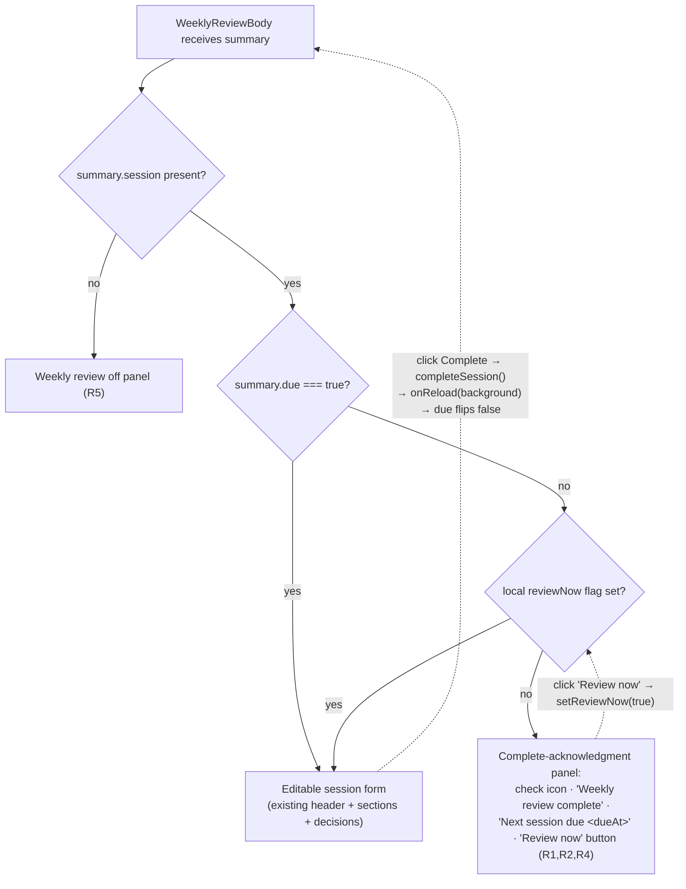

# feat: Weekly Review complete-acknowledgment state

## Summary

When a user clicks **Complete** on the Weekly Review screen, the screen silently re-renders
what looks like the *same* session with every Done/Skipped pill reset to Pending and the same
"Jun 9 – Jun 15" window. It reads as "Complete erased all my work." The real cause is that the
screen never distinguishes an **active, due** session from a **scheduled, not-yet-due** one:
`summary.due` is computed in the query layer and plumbed all the way to the renderer, but the
component only gates on `summary.session` (presence), never on `summary.due` (actionability).

This plan adds a proper **complete-acknowledgment / "you're all caught up" state**: when a
weekly session exists but is not yet due (`summary.session && !summary.due`), render a calm
acknowledgment panel — a check icon, "Weekly review complete", and "Next session due `<date>`" —
instead of the full editable form. A lightweight **"Review now"** affordance lets the user open
the not-yet-due session early so no capability is lost. The change is renderer-focused (consume
an already-existing field), preserves the recently-shipped stale-while-revalidate scroll
behavior, and is backed by service-layer tests asserting the `due` contract the renderer relies
on.

---

## Problem Frame

**Observed:** Clicking **Complete** appears to undo every Done/Skipped section mark.

**Root cause (verified in code):**

1. `completeSession()` (`packages/local-db/src/weekly-review-service.ts:120-137`) marks the
   current task `done`, **deletes** the per-session progress record, and **creates the next
   session** in the same transaction with `dueAt = now + cadenceDays`.
2. `getWeeklyReviewSummary` → `summary()` (`packages/local-db/src/weekly-review-query.ts:73-110`)
   then returns that brand-new session. `findSession` does not filter on `dueAt`, so the future
   session is surfaced as the live session; `progressFor` rebuilds a fresh all-`pending`
   `defaultProgress`; and `weeklyWindow()` derives the window from `now`, so the new session
   wears the *same* week label.
3. `WeeklyReviewScreen.tsx` computes `locked = !summary.session`
   (`apps/web/src/weekly/WeeklyReviewScreen.tsx:187`) and **never reads `summary.due`**, so it
   renders the full editable form for a session that is not actually due.

Net effect: the post-Complete re-render is pixel-for-pixel identical to the pre-Complete screen
except everything is reset — indistinguishable from data loss. The deletion of progress is
*correct* (a new session legitimately starts fresh); what is missing is a UI state that
communicates "this session is finished; the next one isn't due yet."

**Goal:** A clear, calm "Weekly review complete — next session due `<date>`" acknowledgment that
honors the already-computed `summary.due`, with an escape hatch to start the next session early.

---

## Requirements

- **R1** — When a weekly session exists but is not due (`summary.session && summary.due === false`),
  the screen renders a completion-acknowledgment panel instead of the editable session form.
- **R2** — The acknowledgment panel shows the next session's due date, sourced from
  `summary.session.dueAt` (not a `now`-recomputed window).
- **R3** — Clicking **Complete** on a due session transitions, via the existing background
  (stale-while-revalidate) reload, into the acknowledgment panel — never a reset-looking editable
  form, and never a full-page loading flash.
- **R4** — A **"Review now"** action in the acknowledgment panel opens the not-yet-due session in
  its full editable form (renderer-local; no capability is lost relative to today). Progress marked
  early persists for that session.
- **R5** — When the weekly review is disabled / no session exists (`!summary.session`), the screen
  renders a short "Weekly review is off" message rather than a fully-disabled (locked) editable form.
- **R6** — All existing due-session behavior (sections, ledger funnel, decisions, Snooze, Complete,
  banner precedence, inline error surfacing) is preserved unchanged when `summary.due === true`.
- **R7** — The service/query layer guarantees that immediately after `completeSession`, the
  surfaced summary has `due === false` and `session.dueAt` in the future — the contract the
  renderer gate depends on — and this is covered by a test.

---

## Key Technical Decisions

- **KTD1 — Gate on the existing `summary.due` field; no contract/IPC change.** `due` is already
  computed by `isDue(session, asOf)` (`weekly-review-query.ts:209-212`) and carried through the
  full type/IPC chain into `WeeklyReviewSummaryResult` (`apps/web/src/lib/appApi.ts`). The renderer
  simply isn't reading it. Consuming it keeps the change renderer-focused and avoids the
  parallel-mirror-contract pitfall (a field added to one of `contract.ts` / `appApi.ts` but not the
  other silently arrives `undefined`). *Rejected:* adding a new `phase`/`status` field to the
  summary — unnecessary; `due` already encodes exactly the active-vs-scheduled distinction.

- **KTD2 — "Active vs. not-yet-due" stays a backend fact, read as a boolean.** Per the queue-
  eligibility learning (`docs/solutions/logic-errors/queue-eligibility-inventory-scheduler-state.md`),
  the renderer must not infer actionability by comparing a raw `dueAt` to `Date.now()` in React.
  The gate reads `summary.due` verbatim; the date *shown* uses `summary.session.dueAt` via the
  existing `formatDate` helper.

- **KTD3 — Render the new state through the already-mounted body, never a loading flip.** Per the
  scroll-reset learning (`docs/solutions/ui-bugs/weekly-review-scroll-reset-on-action-reload.md`),
  `complete()` must continue to call `onReload({ background: true })`; the acknowledgment is a
  render branch keyed off the refetched summary, not a `setState({ status: "loading" })`. This
  preserves scroll position and avoids the placeholder flash fixed earlier today.

- **KTD4 — No new mount-guard ref.** The transition needs no post-`await` `mountedRef` check —
  `complete()` awaits then reloads, and the new branch falls out of the re-render. Avoiding a
  mount-guard sidesteps the StrictMode `mountedRef`-cleared-only-on-cleanup defect family
  (`docs/solutions/ui-bugs/strictmode-mountedref-cleared-only-on-cleanup.md`). A StrictMode-wrapped
  regression test still guards the transition.

- **KTD5 — "Review now" is renderer-local state, not a new scheduling command.** A `useState`
  `reviewNow` flag flips the not-yet-due session into the editable form without rescheduling its
  `dueAt`. This preserves the pre-change ability to process the session at any time while keeping
  the change renderer-only (no new transactional/`operation_log` lifecycle act). *Rejected:* a
  `startSessionNow` service method that reschedules `dueAt = now` — more surface, more risk, and the
  scheduled due date is harmless to leave intact (progress persists regardless of due).

- **KTD6 — Mirror the Review "Session complete" idiom, not a reintroduced green band.** Reuse the
  existing `.wk-complete` wrapper and the `--ok` / `--ok-soft` + `checkCircle` convention used by
  `ReviewScreen` "Session complete" (`apps/web/src/review/ReviewScreen.tsx:721-775`) and Queue's
  "Queue clear" panel. Respect the test-pinned removal of `.wk-sec--done::before` — no green
  left-rail.

---

## High-Level Technical Design

The whole change is a render-branch decision inside `WeeklyReviewBody`, driven by two already-
available summary booleans plus one local flag:

Directional guidance, not implementation specification. The dotted edges show how the existing
Complete handler and the new "Review now" toggle re-drive the same decision: after Complete, the
refetched summary has `due === false`, so the body naturally lands on `ACK`.

---

## Implementation Units

### U1. Renderer: due-gated acknowledgment branch + "Review now" + off-state

**Goal:** Branch `WeeklyReviewBody` on `summary.session` / `summary.due` / local `reviewNow` to
render the acknowledgment panel (not-yet-due), the off-state panel (no session), or the existing
editable form (due, or review-now). Add a new `WeeklyReviewComplete` presentational sub-component.

**Requirements:** R1, R2, R3, R4, R5, R6.

**Dependencies:** none (U2 styles land alongside).

**Files:**
- `apps/web/src/weekly/WeeklyReviewScreen.tsx` (modify)

**Approach:**
- In `WeeklyReviewBody`, add `const [reviewNow, setReviewNow] = useState(false)`.
- Compute the branch: if `!summary.session` → off-state panel (R5); else if `!summary.due &&
  !reviewNow` → `<WeeklyReviewComplete>` (R1); else the existing form (R6).
- `WeeklyReviewComplete` renders inside the `wk` container: the existing kicker + title header
  (keep "Weekly session" / "Ledger and integrity" for continuity) and a panel built from the
  `.wk-complete` wrapper — `checkCircle` icon in an `--ok-soft`/`--ok` circle, a title
  ("Weekly review complete" / "You're all caught up"), a body line, and a **"Next session due
  `<formatDate(summary.session.dueAt)>`"** line (R2). Include a **"Review now"** ghost/secondary
  button calling `onReviewNow` → `setReviewNow(true)` (R4). Add `data-testid="weekly-complete"`
  on the panel root and `data-testid="weekly-review-now"` on the button.
- Keep `complete()` exactly as-is (still `onReload({ background: true })`) — KTD3/KTD4. The
  acknowledgment appears purely because `summary.due` is now read (R3). Do **not** introduce a
  `mountedRef`.
- Off-state panel (R5): short message ("Weekly review is turned off — enable it in Settings.")
  reusing the same `.wk-complete` wrapper with a neutral (non-`--ok`) icon; `data-testid="weekly-off"`.
- Guard `summary.session.dueAt` being `null`: if null, omit the date line / fall back to a generic
  "soon" phrasing rather than rendering `Invalid Date`.

**Patterns to follow:**
- `apps/web/src/review/ReviewScreen.tsx:721-775` (`.rv-empty` "Session complete" structure) and
  `apps/web/src/pages/queue/QueueScreen.tsx:1197-1206` (`.q-empty` "Queue clear").
- Existing header markup in `WeeklyReviewScreen.tsx:290-343`; `formatDate` at
  `WeeklyReviewScreen.tsx:934-936`; `Icon` usage and `cadenceLabel`.

**Test scenarios:** (covered in U3 — this unit is UI structure)
- See U3 for the full enumerated cases. This unit must expose stable testids
  (`weekly-complete`, `weekly-review-now`, `weekly-off`) for those tests.

**Verification:** With a not-due summary the screen shows the acknowledgment panel and the next
due date; "Review now" reveals the full form; a due summary is unchanged; no full-page loading
flash on Complete.

---

### U2. Styles: acknowledgment panel CSS + CSS-contract guard

**Goal:** Token-only styles for the acknowledgment / off-state panel, and pin them in the CSS
contract test.

**Requirements:** R1, R5, R6 (visual), KTD6.

**Dependencies:** U1 (class names).

**Files:**
- `apps/web/src/weekly/weekly-review.css` (modify)
- `apps/web/src/weekly/weekly-review-css.test.ts` (modify)

**Approach:**
- Add `.wk-complete__panel` (or similar) under the `.wk` page root (global-CSS scoping rule —
  prefix generic names under `.wk`), reusing `--surface`/`--border`/`--r-lg`/`--shadow-md` for the
  card and an `--ok-soft`/`--ok` icon circle mirroring `.wk-empty__ico`
  (`weekly-review.css:604-617`). A neutral icon-circle variant (e.g. `--surface-2`/`--text-3`) for
  the off-state. Title/body use `--text` / `--text-2`; the due-date line uses `.mono` /
  `--font-mono`. No box-shadow hover, no reintroduced `::before` band (convention learning).
- Extend `weekly-review-css.test.ts` to assert the new classes exist and are token-only (no
  hard-coded colors), following the file's existing `cssBlock(selector)` / structural-assertion
  pattern.

**Patterns to follow:** `apps/web/src/review/review.css:763-842` (`.rv-summary`/`.rv-empty`),
`apps/web/src/pages/queue/queue.css:509-542` (`.q-empty`).

**Test scenarios:**
- New panel selectors are present in the stylesheet.
- New rules contain no hard-coded hex/rgb colors — only `var(--…)` tokens.
- The pinned removal of `.wk-sec--done::before` still holds (do not regress the sibling guard).

**Verification:** `pnpm test` passes the CSS-contract file; panel renders correctly in light and
dark themes.

---

### U3. Renderer tests: due/not-due/review-now/complete-transition/off/banner

**Goal:** Cover every branch and the Complete→acknowledgment transition, including a StrictMode-
wrapped regression and banner-precedence preservation.

**Requirements:** R1–R6.

**Dependencies:** U1.

**Files:**
- `apps/web/src/weekly/WeeklyReviewScreen.test.tsx` (modify)

**Approach:** Extend the existing `vi.mock("../lib/appApi")` + `makeSummary(overrides)` harness
(the file already builds typed summary fixtures and default mock resolutions). Add a `due` override
to the fixture builder if not already settable.

**Test scenarios:**
- **Happy — not due:** `makeSummary({ due: false, session: {...dueAt: future} })` →
  `findByTestId("weekly-complete")` renders, shows the formatted next-due date, and the editable
  sections (`weekly-review` body sections) are **not** present.
- **Happy — due:** `makeSummary({ due: true })` → existing editable form renders (sections,
  funnel, Snooze/Complete). Regression guard for R6.
- **Review now:** from the not-due acknowledgment, `fireEvent.click(getByTestId("weekly-review-now"))`
  → the full editable form appears (sections visible). Covers R4.
- **Complete transition:** start due; `completeWeeklyReview` mock resolves; the follow-up
  `getWeeklyReviewSummary` mock returns a `{ due: false, session.dueAt: future }` summary; click
  Complete (header action) → assert `weekly-complete` panel appears (not a reset editable form).
  Covers R3 and is the direct regression for the reported "undo" bug.
- **StrictMode transition:** render the Complete→acknowledgment flow wrapped in `<StrictMode>` and
  assert the acknowledgment still appears (guards the mount-guard defect family even though none is
  introduced).
- **No loading flash:** extend the existing hand-resolved-promise technique to assert
  "Loading weekly review…" never reappears during the Complete background reload.
- **Banner precedence / inline error:** a failed background reload after Complete surfaces the
  inline `weekly-action-error` banner (re-throw path) and does not blow away the body; the
  `{message && !actionError}` precedence holds.
- **Off-state:** `makeSummary({ session: null })` → `weekly-off` panel renders; no editable form.

**Verification:** `pnpm test apps/web/.../WeeklyReviewScreen.test.tsx` green, including the
StrictMode case.

---

### U4. Service/query test hardening: post-complete `due` contract

**Goal:** Lock the backend contract the renderer gate depends on (R7): after `completeSession`,
the surfaced summary has `due === false` and `session.dueAt` strictly in the future.

**Requirements:** R7.

**Dependencies:** none (no production code change in this unit — pure test hardening).

**Files:**
- `packages/local-db/src/weekly-review-query.test.ts` (modify)

**Approach:** The file already covers the complete→new-session reset (asserts new task id,
null progress, old task `done`, sections back to `pending`) and `summary.due`. Add an explicit
assertion in/after the complete test: re-read `repos.weeklyReview.summary(NOW)` and assert
`summary.due === false` and `Date.parse(summary.session.dueAt) > Date.parse(NOW)`. This is the
belt-and-suspenders that the renderer's `!summary.due` branch is backed by a real backend
guarantee, not a fixture coincidence.

**Test scenarios:**
- After `completeWeeklyReview`, `summary(NOW).due` is `false`.
- After `completeWeeklyReview`, `summary(NOW).session.dueAt` parses to a timestamp `> NOW`
  (i.e. `now + cadenceDays`).
- (Sanity) a freshly-created session that is immediately due (material present, `dueAt = asOf`)
  yields `due === true` — the editable-form path still has backend backing.

**Verification:** `pnpm test packages/local-db/.../weekly-review-query.test.ts` green.

---

### U5. E2E: drive Complete → assert acknowledgment

**Goal:** Real renderer↔main coverage of the Complete flow producing the acknowledgment state
(the weekly session flow has no E2E today; DoD requires E2E for user-facing review behavior).

**Requirements:** R1, R3.

**Dependencies:** U1 (testids).

**Files:**
- `tests/electron/weekly-complete.spec.ts` (create)

**Approach:** Mirror `tests/electron/weekly-open-routing.spec.ts`: use `ensureBuilt` / `launchApp` /
`makeDataDir` from `tests/electron/launch`, enable weekly review via the typed settings bridge
(`api.settings.updateMany({ patch: { weeklyReviewEnabled: true } })`) and seed enough material that
the first session is immediately due, navigate to `/weekly`, assert the editable `weekly-review`
body, click the **Complete** header action, then assert the `weekly-complete` acknowledgment panel
appears and shows a next-due date. Keep it deterministic (isolated data dir, explicit seed) per
`tests/CLAUDE.md`.

**Test scenarios:**
- Covers R3. With a due session, clicking Complete shows the `weekly-complete` panel and a next-due
  date; the editable sections are gone.
- (If cheap) the `weekly-review-now` button returns to the editable form.

**Verification:** `pnpm e2e` runs the new spec green against the built Electron app.

**Execution note:** Highest-effort unit (Electron build + Playwright). If the build/seed harness
proves heavy, land U1–U4 first; U5 is independently committable.

---

## Scope Boundaries

**In scope:** the renderer due-gated acknowledgment + off-state + "Review now"; its CSS; renderer,
service-contract, and E2E tests.

**Deferred to Follow-Up Work:**
- **Window-from-session derivation.** `weeklyWindow()` derives from `now`; gating the form on `due`
  makes the stale-window-on-a-future-session symptom unreachable (the form only renders when the
  window *is* "now"), so this is moot for the bug. A future refactor could derive the displayed
  window from durable session fields for full determinism — not needed here.
- **Explicit `startSessionNow` scheduling command** (vs. the renderer-local `reviewNow` toggle).
  Only worth it if product wants the early-start to actually move the schedule.
- **A distinct `operation_log` "weeklyReview:complete" marker** beyond the existing `rescheduleWithin`
  action + next-session create log. The current logging satisfies the invariant; a dedicated marker
  is a separate audit-granularity decision.
- **Richer per-session recap** ("you marked N of 5 sections, you read X sources") — after Complete
  the progress is deleted, so a faithful recap needs the lifecycle result threaded into the UI;
  out of scope for this fix.

**Out of scope / non-goals:** changing the completion *semantics* (progress deletion + next-session
creation are correct), FSRS/attention-scheduler behavior, or the maintenance decision commands.

---

## Risks & Dependencies

- **Risk: blocking early review.** Gating on `due` could prevent a user from doing their review
  before it's due. **Mitigation:** the "Review now" affordance (R4) keeps the not-yet-due session
  one click away; no capability lost.
- **Risk: reintroducing the scroll-reset/loading-flash bug.** **Mitigation:** KTD3 — render through
  the existing background reload; U3 asserts no loading flash and scroll-preserving behavior.
- **Risk: StrictMode silent no-op.** **Mitigation:** KTD4 — no mount-guard introduced; U3 adds a
  StrictMode-wrapped transition test.
- **Risk: `summary.session.dueAt` null.** **Mitigation:** U1 guards the null case (omit/soften the
  date line).
- **Dependency:** none external. All on already-shipped fields (`summary.due`,
  `summary.session.dueAt`) and existing test/E2E harnesses.

---

## Definition of Done

- `pnpm lint`, `pnpm typecheck`, `pnpm test` all green.
- `pnpm e2e` green for `tests/electron/weekly-complete.spec.ts`.
- Manually (or via E2E) verified: Complete on a due session yields the acknowledgment panel with a
  next-due date; "Review now" reopens the form; a due session is unchanged; no loading flash; no
  scroll jump. Renderer-only change ⇒ no new persistence/transaction/`operation_log` work required
  (completion semantics unchanged).
