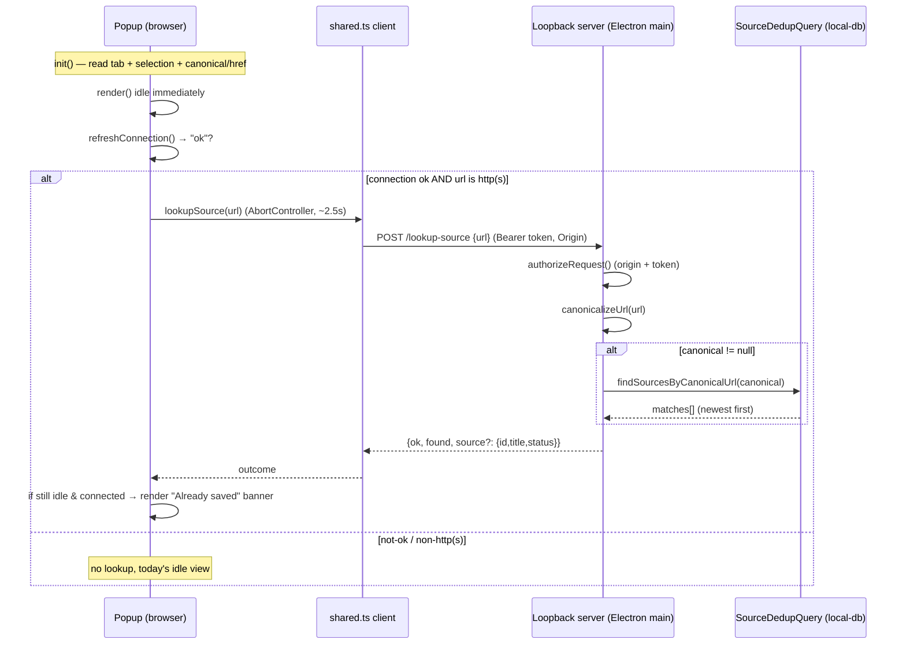

# feat: Show "already saved" state in the Chrome extension capture popup

**Type:** feat
**Depth:** Standard
**Created:** 2026-06-17
**Target repo:** interleave

---

## Summary

Today the Chrome capture popup only learns that a page is *already saved* **after** the user clicks
Save — the loopback `POST /capture` route returns `deduped: true` (the T061 page-dedup), and the
popup then renders an "Already saved" confirmation. This plan surfaces that fact **up front**: when
the popup opens and the desktop app is reachable, it asks a new read-only loopback question — "is
this URL already a source?" — and renders an "Already saved → Open in Interleave" banner before the
user acts.

The lookup reuses the **exact** canonical-URL query that T061 save-time dedup uses
(`SourceDedupQuery.findSourcesByCanonicalUrl`), so the up-front answer is correct-by-construction
for the URL signal. It is a deliberate **positive-only hint**: a "not saved" answer is never a
guarantee that saving won't dedup, because the content-hash backstop and post-redirect canonical
drift can only be resolved after the page is fetched at save time.

Scope is whole-page captures. Selections never dedup (each selection is intentionally a distinct
source), so when a selection is present the banner only notes that the *page* is already saved and
never qualifies the always-valid "Save selection" action.

---

## Problem Frame

- **Who:** A user with the extension paired to a running desktop app, opening the popup on a page
  they may have captured before.
- **Pain today:** The only way to discover "I already saved this" is to click Save and read the
  post-save result. Users re-capture pages needlessly, or click Save just to check.
- **Desired:** On popup open, show whether the current page is already in Interleave, with a direct
  affordance to open the existing source — without mutating anything.
- **Boundary that shapes the design:** The extension is an untrusted browser surface. It must not
  import `@interleave/core`, `@interleave/local-db`, `apps/web`, or Electron. Everything it knows
  about the desktop is the `@interleave/capture-contract` wire contract plus the loopback URL. URL
  canonicalization therefore happens **desktop-side**; the extension only sends a raw URL string.

---

## Requirements

- **R1.** When the popup opens, the desktop is reachable (`connection === "ok"`), and the active
  tab has an http(s) URL, the popup performs a read-only lookup of whether that page is already a
  saved source — without writing anything.
- **R2.** When the lookup finds a match, the popup renders an "Already saved" indicator in the idle
  view, consistent in wording and icon with the existing post-save "Already saved" state, and
  offers "Open in Interleave" pointing at the matched source.
- **R3.** The pre-save answer must agree with the save-time `deduped` outcome for the **URL signal**:
  the lookup resolves the same first match (newest by `accessedAt`, id tiebreak) that a subsequent
  page capture would echo. The content-hash backstop and redirect drift are documented, accepted
  false-negatives surfaced only at save time.
- **R4.** Selections never dedup. When a selection is present, the banner is scoped to "this *page*
  is already saved" and "Save selection" stays primary, enabled, and unqualified.
- **R5.** The lookup degrades gracefully: not-paired / offline / non-http(s) / restricted pages /
  desktop errors / slow desktop all resolve to "no banner" (today's idle view), never a false
  positive and never a thrown error.
- **R6.** The new loopback route enforces the **identical** threat model as `/open-source`:
  loopback-only socket, paired-origin CORS, bearer-token (constant-time), body cap, zod validation,
  typed non-leaking error codes.
- **R7.** Opening a matched source from the **pre-save** banner must not mutate desktop state
  (no silent inbox-accept): it uses `activate: false`.
- **R8.** The async lookup is guarded against stale renders — if the popup is dismissed or the user
  starts saving before the lookup resolves, its callback makes no DOM mutation.

---

## Key Technical Decisions

- **KTD1 — A dedicated narrow loopback route, cloned from `/open-source`.** Add
  `POST /lookup-source` rather than overloading `/capture` or adding a generic query channel. This
  mirrors the precedent set when `/open-source` was added (see
  `docs/solutions/ui-bugs/url-imported-articles-inbox-processing.md`) and keeps the loopback attack
  surface narrow. It reuses `authorizeRequest()` verbatim for identical auth/origin guards.

- **KTD2 — Reuse `SourceDedupQuery.findSourcesByCanonicalUrl`, the exact T061 URL-match query.**
  Canonicalize the incoming URL desktop-side with `canonicalizeUrl` (`packages/core/src/url.ts`),
  then call the same query the save-time pipeline calls. This guarantees URL-signal agreement (R3)
  by construction. The content-hash backstop (`findSourceBySnapshotHash`) is intentionally **not**
  used — there is no fetched/cleaned HTML at popup-open time.

- **KTD3 — Permissive request schema; canonicalization decides.** The request is
  `{ url: string (1..2048) }` (not the strict `CaptureUrlSchema`, which rejects non-http(s)). The
  route canonicalizes; a `null` canonical (non-http(s), garbage) returns `{ found: false }` rather
  than a 400. This makes the route robust even if the client fails to short-circuit, and supports a
  defense-in-depth test. The client *also* short-circuits non-http(s) URLs to avoid a useless
  round-trip.

- **KTD4 — `activate: false` for the pre-save "Open".** `openCapturedSource(id, { activate: true })`
  triages-accepts an inbox source (a real DB mutation + operation-log entry). On the pre-save
  indicator the user is browsing, not capturing, so a silent accept is surprising. The pre-save
  banner opens with `activate: false`; the post-save screen keeps `activate: true` (capture intent
  is explicit there).

- **KTD5 — Send the scrape-equivalent URL.** A page capture keys dedup off the scraped URL
  (`link[rel="canonical"]` href, else `location.href`). To maximize agreement, the popup sends the
  same: it folds a one-shot canonical/href read into the existing init `executeScript`, falling back
  to `tab.url` when injection fails (restricted pages). The desktop still canonicalizes — the
  extension never imports core.

- **KTD6 — Positive-only contract, documented.** The route doc comment and a `CONCEPTS.md` note
  state explicitly: the pre-save indicator reproduces canonical-URL dedup only; content-hash and
  redirect-drift dedups are intentional false-negatives surfaced at save time. This keeps the gap
  from being filed later as a bug.

- **KTD7 — Lookup is a sub-state of `renderIdle()`, not a new `Phase`.** It threads directly from
  popup `init()` (matching how `openCapturedSource` is called directly, not via the background
  worker). A new module variable `alreadySaved: { id; title; status } | null` plus a `lookupState`
  flag drive an informational banner inside `renderIdle()`. A short client-side timeout +
  `AbortController` bounds a slow desktop; timeout → treated as no-banner.

---

## High-Level Technical Design

### Pre-save lookup data flow



### Popup idle-view state (the new sub-state)

```mermaid
stateDiagram-v2
    [*] --> Idle
    Idle --> LookupInFlight: connection ok & http(s) url
    Idle --> Idle: connection not-ok / non-http(s) (no banner)
    LookupInFlight --> Found: match (page already saved)
    LookupInFlight --> NotFound: no match (no banner)
    LookupInFlight --> Errored: timeout / network / bad response (no banner)
    Found --> Saving: user clicks Save (banner discarded; save-time is authoritative)
    note right of Found
      whole page: "Already saved" + Open, Save demoted to "Save anyway"
      selection present: "This page is already saved" note; Save selection stays primary
    end note
```

---

## Implementation Units

### U1. Lookup wire contract in `@interleave/capture-contract`

**Goal:** Add the request/response/error schemas + types for the new lookup, framework-free (zod
only), so both the extension bundle and the Electron main can import them.

**Requirements:** R3, R5, R6 (typed errors), KTD3.

**Dependencies:** none.

**Files:**
- `packages/capture-contract/src/index.ts` (add schemas + types)
- `packages/capture-contract/src/index.test.ts` and/or
  `packages/capture-contract/src/capture-contract.test.ts` (schema tests)

**Approach:**
- `LookupSourceRequestSchema = z.object({ url: z.string().trim().min(1).max(2048) })` — permissive
  per KTD3 (NOT `CaptureUrlSchema`). Export `LookupSourceRequest`.
- `LookupSourceResponseSchema = z.object({ ok: z.literal(true), found: z.boolean(),
  source: z.object({ id: z.string(), title: z.string(), status: z.string() }).optional() })` —
  `source` present iff `found`. `status` is a bounded plain string (the contract cannot import
  core's status enum); the popup uses it only for display copy.
- `LookupSourceErrorCodeSchema = z.enum(["unpaired","bad_token","bad_origin","too_large","invalid","lookup_failed"])`
  and `LookupSourceErrorResponseSchema = z.object({ ok: z.literal(false), error: ... })` — mirror
  the `OpenSource*` error shapes.
- Document the positive-only contract (KTD6) in the schema doc comments.

**Patterns to follow:** the existing `OpenSourceRequestSchema` / `OpenSourceResponseSchema` /
`OpenSourceErrorResponseSchema` block in the same file.

**Test scenarios:**
- Happy path: a valid `{ url }` parses; a response with `found: true` + `source` parses; a response
  with `found: false` and no `source` parses.
- Edge: empty url rejected; url > 2048 rejected; non-http(s) url **accepted** by the request schema
  (canonicalization, not the schema, gates it — guards KTD3).
- Edge: response with `found: true` but missing `source` — decide and assert the chosen contract
  (recommended: `source` optional at schema level, with the route guaranteeing it when found; assert
  the route-level guarantee in U2/U3 tests rather than the schema).
- Error: each error code parses; an unknown error code is rejected.

---

### U2. Desktop-side lookup capability (reuse dedup query + canonicalize)

**Goal:** A read-only `lookupSourceByUrl(url)` capability in the Electron main that canonicalizes
the URL and returns the newest live matching source (id/title/status) or "not found", reusing the
exact T061 query. Wire it through the capture controller/bootstrap so the route (U3) can call it.

**Requirements:** R1, R3, R5, R7-adjacent (read-only — no mutation), KTD2.

**Dependencies:** U1.

**Files:**
- `apps/desktop/src/main/capture-controller.ts` (add the lookup function / dependency)
- `apps/desktop/src/main/index.ts` (inject the real lookup, reusing `repositories.sourceDedup`)
- `apps/desktop/src/main/capture-handler.ts` *(if the pure mapping lives here, mirror `mapResult`)*
- `apps/desktop/src/main/capture-handler.test.ts` and/or a focused unit test for the lookup mapping

**Approach:**
- Canonicalize with `canonicalizeUrl` (`packages/core/src/url.ts`). `null` → `{ found: false }`
  (never throws).
- Call `SourceDedupQuery.findSourcesByCanonicalUrl(canonical)` — the same method
  `UrlImportService.findDuplicates` calls — and map `matches[0]` (newest first; mirrors
  `capture-handler.ts mapResult` which echoes `matches[0]`) to
  `{ found: true, source: { id: m.elementId, title: m.title, status: m.status } }`. Empty → not
  found.
- This is **read-only**: no vault write, no DB mutation, no operation-log entry. Make that explicit
  in the doc comment.
- The query already filters `deleted_at IS NULL` and `type = "source"` — soft-deleted sources never
  report saved (R5). Note (do not "fix"): lifecycle statuses like `dismissed`/`done` are still
  "live" and match — this is identical to save-time dedup, so it stays consistent; the response
  carries `status` so the popup can phrase copy accordingly.

**Patterns to follow:** how `openCapturedSource`/`openSourceReader` is injected through
`capture-controller.ts` → `index.ts`; `mapResult` in `capture-handler.ts` for the matches[0] mapping.

**Test scenarios:**
- Happy: a saved canonical URL → `found: true` with the matching id/title/status.
- Parity: lookup resolves the **same first match** that `UrlImportService.findDuplicates` returns
  for the same canonical URL (newest by accessedAt, id tiebreak). `Covers R3.`
- Edge: tracking-param-only difference (`?utm_source=x`) → still `found: true` (canonicalize strips
  it on both sides — a consistency feature).
- Edge: non-http(s) / unparseable URL → `found: false`, no throw.
- Edge: soft-deleted source (deletedAt set) → `found: false`.
- Edge: multiple live sources under one canonical URL → returns the newest id (same as save-time).
- Read-only: calling the lookup writes no rows and appends no operation-log entry (assert via a spy
  / row count before-after).

---

### U3. Loopback `POST /lookup-source` route

**Goal:** Expose U2 over the loopback server with the full threat model, cloned from `/open-source`.

**Requirements:** R1, R5, R6, KTD1, KTD3.

**Dependencies:** U1, U2.

**Files:**
- `apps/desktop/src/main/capture-server.ts` (route block + handler + error branch)
- `apps/desktop/src/main/capture-server.test.ts` (route unit tests)

**Approach:**
- Add `if (path === "/lookup-source")` in `handleRequest` after the `/open-source` block: handle
  `OPTIONS` (CORS preflight 204), gate to POST (else 405), call a new `handleLookupSourceRoute`.
- `handleLookupSourceRoute`: `applyCors(...)`, `authorizeRequest(req, res, requestOrigin,
  allowedOrigin)` (reuse verbatim), `readBody` (hard body cap → 413), content-type check,
  `LookupSourceRequestSchema.parse(JSON.parse(body))` (invalid → 400 `invalid`), call the injected
  `lookupSourceByUrl`, `sendJson` the `LookupSourceResponse`.
- Inject `lookupSourceByUrl` via `StartCaptureServerOptions` and thread from `CaptureController` /
  `index.ts` (U2 wiring).
- Add a route-specific branch to the top-level `.catch` 500 fallback so an unexpected failure maps
  to `lookup_failed` (mirroring how `/open-source` maps its fallback).

**Patterns to follow:** the `/open-source` route block, `handleOpenSourceRoute`, and the
`authorizeRequest` call in `capture-server.ts`.

**Test scenarios:**
- Happy: paired + valid token + valid origin + `{ url }` of a saved page → `200 { ok, found: true,
  source }`.
- Negative parity: never-saved URL → `200 { ok, found: false }`.
- Threat model (mirror the `/open-source` test table): unpaired → 403 `unpaired`; bad origin → 403
  `bad_origin`; bad token → 401 `bad_token`; oversized body → 413 `too_large`; non-JSON / invalid
  body → 400 `invalid`; wrong method (GET) → 405. `Covers R6.`
- Edge: non-http(s) URL in the body → `200 { found: false }` (not 400) — guards KTD3.
- Loopback-only: a non-loopback remote address → 403 (inherited from `handleRequest`).

---

### U4. Extension loopback client `lookupSource(url)`

**Goal:** A browser-side client that POSTs to `/lookup-source` with the bearer token, bounded by an
`AbortController` timeout, returning a normalized outcome — cloned from `openCapturedSource`.

**Requirements:** R1, R5, R8 (timeout), KTD7.

**Dependencies:** U1.

**Files:**
- `apps/extension/src/shared.ts` (new `LookupOutcome` type + `lookupSource`)
- `apps/extension/src/shared.test.ts` (client tests with mocked `fetch`)

**Approach:**
- Short-circuit: if the URL is missing or not http(s), return `{ kind: "not-applicable" }` without
  fetching (KTD3 client side, avoids a useless round-trip).
- Read `{ token, port }`; no token → `{ kind: "not-paired" }`.
- POST to `/lookup-source` with `Authorization: Bearer <token>` + JSON body `{ url }`, bounded by an
  `AbortController` timeout (~2.5s). Network refusal → `{ kind: "not-running" }`; abort/timeout →
  `{ kind: "errored" }`.
- Map status exactly like `openCapturedSource`: 401 → `bad-token`, 403 → `not-paired`. Safe-parse
  the body against `LookupSourceResponseSchema`; `found` → `{ kind: "ok", source }`, not found →
  `{ kind: "ok", source: null }`; parse failure → `{ kind: "errored" }`.
- `LookupOutcome = { kind: "ok"; source: {id,title,status} | null } | { kind: "not-applicable" } |
  { kind: "not-paired" } | { kind: "not-running" } | { kind: "bad-token" } | { kind: "errored" }`.

**Patterns to follow:** `openCapturedSource` (`apps/extension/src/shared.ts`) — same header set,
status mapping, and `safeParse` discipline. Note: no existing client uses `AbortController`; add
one here.

**Test scenarios:**
- Happy: server returns `found: true` → outcome `{ kind: "ok", source }`; `found: false` →
  `{ kind: "ok", source: null }`.
- Short-circuit: `chrome://`/`file://`/empty URL → `{ kind: "not-applicable" }`, **no fetch made**
  (assert `fetch` not called).
- No token → `{ kind: "not-paired" }`, no fetch.
- Mapping: 401 → `bad-token`; 403 → `not-paired`; connection refused (fetch throws) →
  `not-running`.
- Timeout: a `fetch` that never resolves is aborted at the timeout → `{ kind: "errored" }`.
- Bad body: non-JSON / schema-mismatch response → `{ kind: "errored" }`.

---

### U5. Popup integration — "Already saved" idle sub-state

**Goal:** Run the lookup on open after the connection probe reports "ok", and render the indicator
inside `renderIdle()` with the correct selection-aware scoping, stale-render guard, and an
`activate: false` "Open in Interleave" affordance.

**Requirements:** R1, R2, R4, R5, R7, R8, KTD4, KTD5, KTD7.

**Dependencies:** U4.

**Files:**
- `apps/extension/src/popup.ts` (state, lookup call, render, guards)
- `apps/extension/src/tokens.css` (an informational banner variant if one is needed — prefer reuse)
- `apps/extension/src/popup.test.ts` (jsdom render tests)

**Approach:**
- New module state: `alreadySaved: { id: string; title: string; status: string } | null = null` and
  a `lookupState: "idle" | "pending" | "done" = "idle"`.
- In `init()`: extend the existing one-shot `executeScript` to also return the page's
  `link[rel="canonical"]` href (fallback `location.href`) alongside the selection (KTD5). Use that
  URL for `page.url` and the lookup; fall back to `tab.url` when injection fails.
- After `refreshConnection()` resolves `connection === "ok"` and the URL is http(s), call
  `lookupSource(url)`. On resolve: **bail if `phase !== "idle"` or the popup body is disconnected**
  (R8). On `{ kind: "ok", source }` with a source, set `alreadySaved` and re-render; all other
  outcomes leave `alreadySaved` null (no banner) (R5).
- `renderIdle()` gains an informational banner when `alreadySaved` is set:
  - **No selection (page is primary):** "Already saved" banner (reuse the `bookmark` icon + the
    `done-source`/`badge` styling, matching `renderSaved`), an "Open in Interleave" button, and
    demote the page-save button to a secondary "Save anyway" affordance. Optionally reflect
    `status` in the copy (e.g., a subtle "in your inbox" when status is `inbox`).
  - **Selection present (selection is primary):** a smaller note "This page is already saved" with
    "Open page in Interleave"; "Save selection" stays the **primary, enabled, unqualified** action
    (R4).
- "Open in Interleave" calls `openCapturedSource(alreadySaved.id, { activate: false })` (KTD4),
  reusing the existing `openSourceFromButton`/`renderOpenOutcome` pattern (guard `button.isConnected`).
- Keep wording/icon consistent with the post-save "Already saved" state so the two read as the same
  fact (the flow analysis flagged this consistency requirement).

**Patterns to follow:** `renderSaved()` (icon/banner/Open affordance), `openSourceFromButton` /
`renderOpenOutcome` (async + `isConnected` guard), `refreshConnection` (async-then-render),
`escapeHtml` + the `icon()` registry. `scrapePage` in `background.ts` for the canonical-link read.

**Test scenarios:**
- Happy (page, found): connection "ok", lookup resolves a source → idle view shows the "Already
  saved" banner with the title and an "Open in Interleave" button. `Covers R2.`
- Selection present + found: "Save selection" remains primary/enabled; the page-level note shows;
  no qualifier on the selection action. `Covers R4.`
- Not found / errored / not-applicable → today's idle view, **no banner**. `Covers R5.`
- Gate: `not-paired` and `offline` connection → `lookupSource` is **never called** (assert no call);
  `renderBlocked()` shows.
- Stale-render guard: resolve the lookup after the body is cleared / after `phase` moved to
  `saving` → no DOM mutation, no throw. `Covers R8.`
- Open affordance: clicking "Open in Interleave" calls `openCapturedSource(id, { activate: false })`.
  `Covers R7.`
- Restricted page (no/`chrome://` URL): no lookup, no banner.

---

### U6. End-to-end loopback parity coverage

**Goal:** Prove, end-to-end over the real Electron loopback server, that the pre-save lookup agrees
with save-time dedup and enforces the threat model. (A real Chrome extension cannot be
Playwright-driven, so the popup itself is covered by U5's jsdom tests; the e2e covers the route.)

**Requirements:** R3, R5, R6.

**Dependencies:** U2, U3.

**Files:**
- `tests/electron/capture-server.spec.ts` (extend the existing loopback e2e harness)

**Approach:** Use the existing harness (`launchApp(dataDir, { captureEnabled: true })`, pairing via
`appApi.capture.getPairing()`, the `post()` header helper). Add a serial block that captures a page,
then exercises `/lookup-source`.

**Test scenarios:**
- Capture a page (lands an inbox source) → `POST /lookup-source { url }` → `found: true` with the
  **same id** the capture returned. Then re-`POST /capture` the same URL → `deduped: true` with the
  **same id**. `Covers R3.` (pre-save == save-time, end to end).
- Never-saved URL → `/lookup-source` `found: false`; subsequent `/capture` → `deduped: false`
  (negative parity).
- Threat model over the real server: unpaired/bad-origin/bad-token/oversized/non-JSON/GET behave as
  in U3. `Covers R6.`
- Restart persistence: capture a page, restart the app, `/lookup-source` still reports `found: true`
  (extend the existing restart test).
- Soft-delete: capture, then trash/soft-delete the source via the app API, then `/lookup-source`
  reports `found: false` (matches re-import behavior). *(Include only if the harness already exposes
  a soft-delete path; otherwise defer and note.)*

---

## Scope Boundaries

**In scope:** the pre-save "already saved" indicator for whole-page captures; the new contract
schema, loopback route, desktop lookup, extension client, and popup rendering; tests at every layer.

**Out of scope / non-goals:**
- Reproducing the **content-hash** dedup backstop pre-save (no fetched HTML available at popup open)
  — accepted false-negative (KTD6, R3).
- Reproducing post-redirect canonical resolution pre-save — accepted false-negative (KTD6, R3).
- Any "already saved" indicator for **selection** captures (selections never dedup, by design).
- The side-panel (`sidepanel.ts`) "already saved" state — this plan scopes the popup; the side panel
  can follow the same client in a later change.
- Showing a count of "saved N times" — mirror save-time and show the newest match only.

### Deferred to Follow-Up Work
- Surfacing the lookup in the side panel (`apps/extension/src/sidepanel.ts`) using the same
  `lookupSource` client.
- A live re-check when the user changes selection (selection is read once at popup open today;
  out of scope here).

---

## Open Questions

- **OQ1 (copy, low-risk, defer to implementation):** exact banner wording for non-inbox statuses
  (`dismissed`/`done`). Default: include a light status hint rather than a bare "Already saved".
- **OQ2 (defer to implementation):** whether the in-flight state shows a "Checking library…"
  micro-affordance or renders nothing until resolved. Default: render nothing but reserve banner
  space to avoid layout shift.

---

## Risks & Mitigations

- **False reassurance ("not saved" but save dedups).** Mitigation: positive-only framing (R3/KTD6),
  documented in the route comment + CONCEPTS; save-time remains authoritative and the post-save
  screen overrides the banner.
- **Surprising mutation from "Open".** Mitigation: `activate: false` pre-save (KTD4).
- **Stale render after popup dismissed / save started.** Mitigation: phase + `isConnected` guard in
  the lookup callback (R8), mirroring `renderOpenOutcome`.
- **Slow desktop delays the banner / layout shift.** Mitigation: `AbortController` timeout (~2.5s) →
  no banner; reserve banner space (OQ2).
- **Contract drift between extension and desktop.** Mitigation: the shared `capture-contract`
  schemas are the single source of truth; both sides import them; contract tests in U1.

---

## System-Wide Impact

- **New public wire surface:** `POST /lookup-source` on the loopback server and new contract
  schemas. Both sides of the seam consume the same `@interleave/capture-contract` types — no
  divergence. No change to existing `/capture`, `/open-source`, `/ping`, `/pair` behavior.
- **No schema/migration changes** — the lookup is read-only over existing tables/indexes
  (`sources_canonical_url_idx`).
- **Security review surface:** the new route must match the existing threat-model tests exactly
  (U3, U6). It is read-only and leaks only `{ found, id, title, status }` for an exact canonical-URL
  match, behind the same token + paired-origin gate as `/open-source`.

---

## Verification Strategy

Definition of Done (run from the repo root in the isolated worktree):
1. `pnpm lint`
2. `pnpm typecheck`
3. `pnpm test` (capture-contract, local-db, extension, desktop main units)
4. Relevant `pnpm e2e` — the extended `tests/electron/capture-server.spec.ts`.

Plus: prove the lookup is read-only (no operation-log entry, no row writes) and that the pre-save
answer equals the save-time `deduped` outcome for the URL signal (U2 parity test + U6 e2e).

---

## Sources & Research

- Existing precedent for adding a narrow loopback command:
  `docs/solutions/ui-bugs/url-imported-articles-inbox-processing.md`.
- Popup/options browser-boundary and stale-render guidance:
  `docs/solutions/architecture-patterns/chrome-extension-popup-options-design-boundary.md`.
- Save-time dedup: `apps/desktop/src/main/url-import-service.ts` (`findDuplicates`, canonical from
  `finalUrl`), `apps/desktop/src/main/capture-handler.ts` (`mapResult`, `matches[0]`).
- Canonicalization: `packages/core/src/url.ts` (`canonicalizeUrl`).
- Query to reuse: `packages/local-db/src/source-dedup-query.ts` (`findSourcesByCanonicalUrl`).
- Loopback server + auth: `apps/desktop/src/main/capture-server.ts` (`authorizeRequest`,
  `/open-source` route).
- Wire contract: `packages/capture-contract/src/index.ts` (`OpenSource*` schemas to clone).
- Extension client + popup: `apps/extension/src/shared.ts` (`openCapturedSource`),
  `apps/extension/src/popup.ts` (`init`, `refreshConnection`, `renderIdle`, `renderSaved`),
  `apps/extension/src/background.ts` (`scrapePage` canonical-link read).
