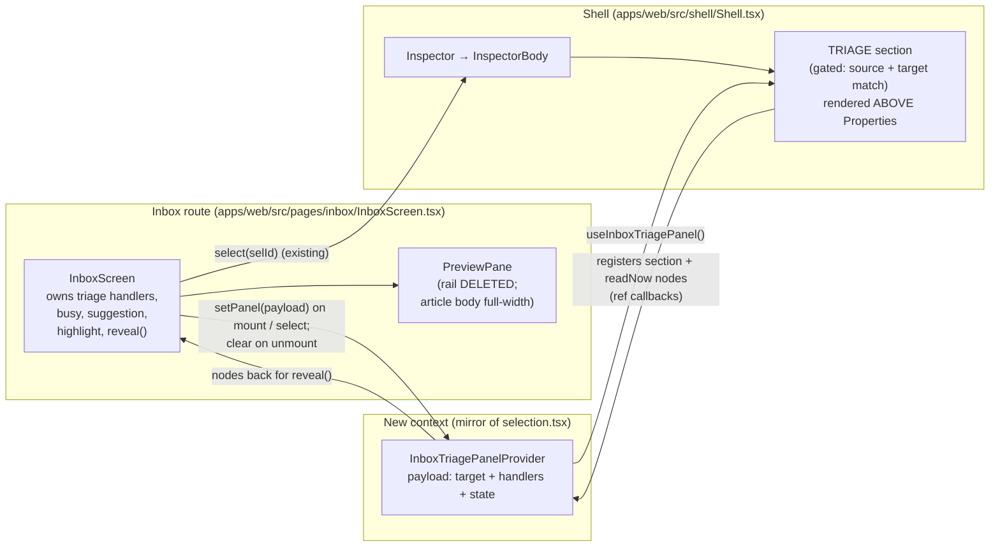

# feat: Move inbox triage into the shell Inspector and delete the metadata rail

## Summary

In the Import & Inbox view, the triage actions (**Read now / Queue soon / Save for later / Delete**, keyed `1 · 2 · 3 · 6`) live in a 288px metadata/triage rail wedged between the article preview and the shared shell Inspector. Only the rail's **Metadata block** (Author / Published / Accessed / Canonical / Status / Reason) is genuinely redundant with the Inspector's `SOURCE` + `PROPERTIES` sections. The rest — triage, the A/B/C/D priority picker, and the T127 suggested-priority / suggested-placement accept affordances — is **not** redundant and must relocate, not be dropped. (Crucially, the rail's priority picker is wired to `onPickPriority`, which records T127 accepted-vs-overridden provenance; the Inspector's generic `Set priority` control routes through the universal `setElementPriority` and carries **no** such provenance — so it is not a substitute. See KTD-7.)

This plan relocates the full non-redundant cluster (triage + provenance-aware priority picker + suggestion affordances) into a new **gated `TRIAGE` section in the shell Inspector, rendered above `PROPERTIES`**, deletes the redundant Metadata block, and removes the rail entirely. The article body (`flex-1`) reclaims the ~288px, with an optional generous reading-measure cap (only if it stays verifiably wider than today). Triage business logic (navigation on Read now, optimistic row removal, list refresh, undo, priority provenance, stale-async guards) stays in `InboxScreen`; only the rendering moves, threaded into the Inspector through a small new context that mirrors the existing `selection.tsx` pattern.

---

## Problem Frame

The user wants more horizontal space to read the article in the inbox. The screenshot annotation is explicit: *"Move triage above properties"* (arrow to the Inspector, above `PROPERTIES`) and *"This way we can remove entirely this column and give more space to the article"* (pointing at the metadata/triage rail).

Two structural facts make this both desirable and safe:

1. **The "middle column" is the `w-72` rail inside `PreviewPane`** (`apps/web/src/pages/inbox/InboxScreen.tsx:340`), not a route-level column. It sits to the right of the article body (`flex-1`) and to the left of the far-right shell Inspector.
2. **Only the Metadata block is redundant.** The rail's Metadata block (Author / Published / Accessed / Canonical / Status / Reason) is shown by the Inspector's `SOURCE` + `PROPERTIES` sections (Reason is the Inspector's "Reason" MetaRow, `Inspector.tsx:2474`). One small delta: the Inspector de-duplicates the canonical URL via `sameProvenanceUrl` (`Inspector.tsx:2458-2463`), so a canonical that normalizes equal to the main URL — which the rail still printed — won't appear; this is acceptable. The A/B/C/D **priority picker is NOT redundant**: it records T127 provenance via `onPickPriority`, which the Inspector's generic `Set priority` (`setElementPriority`) does not — so it relocates with provenance intact (KTD-7).

The complication: the **Inspector is a single shared shell component** (`apps/web/src/components/inspector/Inspector.tsx`, mounted once in `apps/web/src/shell/Shell.tsx:688`, always present as a fixed-width `aside` with no collapse mechanism — verified) used by every route (queue, reader, review, card…). It fetches its own payload from `useSelection().selectedId` via a *separate* `getInspectorData` call, independent of `InboxScreen`'s `getInboxItem` fetch, and has no access to `InboxScreen`'s triage handlers or state. So the work is not "move some JSX" — it is "establish a one-way channel from the inbox route to the shared Inspector, render a triage section only when an inbox source is selected (and the two independent fetches agree on the element), and delete the rail without regressing the priority provenance, the suggestion features, the keyboard shortcuts, the reveal/highlight affordance, or the test contracts."

---

## Requirements

- **R1.** The Inspector renders a `TRIAGE` section **above** `PROPERTIES` with the four actions Read now / Queue soon / Save for later / Delete, matching the existing labels, icons (`play` / `queue` / `bookmark` / `trash`), `aria-label`s, and `1 · 2 · 3 · 6` hint pills.
- **R2.** The triage section renders **only** when the selected element is an inbox source with a registered triage payload. It must not appear on other routes/elements (queue, reader, extracts, topics, cards) that share the Inspector.
- **R3.** The `w-72` metadata/triage rail in `PreviewPane` is deleted; the article body expands to fill the freed width.
- **R4.** The provenance-aware A/B/C/D priority picker, the T127 suggested-priority accept (chip + justification + "Press Enter to accept"), and the suggested-placement accept all move with triage — no feature regression. Setting priority on an inbox source must continue to record T127 accepted-vs-overridden provenance via `onPickPriority` (not the generic `setElementPriority`).
- **R5.** The `1 / 2 / 3 / 6` keyboard shortcuts continue to fire the identical typed verbs (`accept` / `queueSoon` / `keepForLater` / `delete`), with the `typing` guard intact.
- **R6.** The "Show triage actions" reveal affordance (BalanceBanner → scroll-to + focus Read now + brief highlight) continues to work against the relocated section.
- **R7.** Read now still activates the source and navigates to `/source/$id`; Queue soon / Save for later / Delete still optimistically remove the row and refresh; Delete stays soft + reversible (Undo / ⌘Z), per the project invariant.
- **R8.** The article body gets a capped reading measure so full-width does not produce uncomfortably long line lengths; the scroll owner stays full-width (no dead gutters).
- **R9.** All Definition-of-Done gates pass: `pnpm lint`, `pnpm typecheck`, `pnpm test`, relevant `pnpm e2e` (inbox specs). Existing `data-testid` contracts (`inbox-read-now`, `inbox-queue-soon`, `inbox-keep`, `inbox-delete`, `inbox-triage-actions`, and the `1 · 2 · 3 · 6` header text) are preserved so E2E specs keep resolving them.

---

## Key Technical Decisions

### KTD-1 — Bridge triage state into the Inspector via a new React context, not props

The Inspector is a sibling of the route `<Outlet/>` in `Shell.tsx`; `InboxScreen`'s handlers cannot reach it through the router tree. Mirror the proven `apps/web/src/shell/selection.tsx` pattern: a tiny **UI-only** context (`InboxTriagePanelProvider` / `useInboxTriagePanel`) that holds the active triage *payload* (target id + status, busy, suggestion, placementAssigned, the handler callbacks, the highlight flag, and ref-registration callbacks). `InboxScreen` publishes the payload while mounted and clears it on unmount; `InspectorBody` consumes it via the hook and renders the section when the payload's target matches the inspected element.

**Why not** have the Inspector call `appApi.triageInboxItem` directly (research option c)? Because the inbox list must remove the row + refresh, Read now must navigate, and Delete must offer Undo — all of which already live in `InboxScreen`. Duplicating that into the shared Inspector spreads inbox logic into a universal component and invites drift. The context keeps a single source of truth and relocates only the rendering. (See `docs/solutions/ui-bugs/extract-inspector-single-responsibility-lineage-scheduler.md` — keep inspector sections single-responsibility and bind mutations to the rendered element id.)

**Why not** thread props through `Inspector` → `InspectorBody`? `Inspector` is mounted by the shell with a fixed prop set and owns its own fetch; widening that prop surface for one route is worse than a scoped context consumed only where needed.

### KTD-2 — Gate on `element.type === "source"` **and** payload-target match; accept the selection-change transient

The section renders only when `useInboxTriagePanel().panel` is non-null **and** `panel.targetId === element.id` **and** `element.type === "source"`. Matching on target id (not just "a payload exists") prevents the Inspector from showing triage against a stale element. `InboxScreen` only ever publishes a payload for a single selected **inbox-status** source, so the type gate plus the target match is sufficient; when `InboxScreen` unmounts (navigation away) the payload clears and the section disappears — no leakage into other routes (R2).

**Dual-fetch transient (acknowledged, not a bug).** `InboxScreen`'s payload (bound to `getInboxItem` → `detail.summary.id`) and the Inspector's `element` (from a separate `getInspectorData` fetch) resolve independently. On a *selection change*, there is a brief window where one fetch has landed for the new row and the other has not, plus the Inspector's own `loading && !data` state (`Inspector.tsx:3020`) where `InspectorBody` isn't rendered at all. During that window the Inspector shows its normal "Loading…" state and triage is not yet visible — this matches app-wide Inspector behavior on every route and is acceptable; no special placeholder is added. The correctness requirement is narrower: for a **stable** single selection, triage must not flicker off when the payload re-publishes due to `busy`/`triageHighlighted` changes. Both fetches are keyed on `selId` and only re-run on selection change, so a stable selection keeps `element` and `targetId` equal — covered by a no-flicker test (U3).

### KTD-3 — Triage logic stays in `InboxScreen`; only rendering moves

`onReadNow`, `onTriage`, `onSetPriority`/`onPickPriority`, `onAcceptSuggestion`, `onAcceptPlacement`, the `busy` flag, the stale-async selection guard, and the soft-delete/Undo path are unchanged and remain in `InboxScreen`. They are passed into the context payload by reference. This keeps the blast radius off the domain logic and means the keyboard path (`useInboxTriageShortcuts`) — which already calls these same callbacks, not the DOM buttons — needs **no change** (R5).

### KTD-4 — Reveal/highlight via **stable** context-registered nodes, re-keyed on registration

`InboxScreen` currently owns `triageActionsRef` / `readNowButtonRef` and `revealInboxTriageActions()` (`InboxScreen.tsx:675-705`). Since the buttons now live in the Inspector's tree, the new section registers its root node and the Read-now button node back through the context. Two correctness constraints the reviews surfaced:

1. **Stable ref machinery, separate from the volatile payload.** The register setters (`registerSection` / `registerReadNowButton`) and the underlying `useRef` slots live on the **context value created once in the provider** (via `useCallback([], [])`), *not* inside the `panel` object that `InboxScreen` rebuilds on every `busy`/`suggestion`/`triageHighlighted` change. If the setters were rebuilt with the payload, the Inspector's `ref={registerReadNowButton}` callback would detach/reattach on every re-publish, risking a focus/scroll loop. `InboxScreen` reads `readNowRef.current` / `sectionRef.current` from the context for the reveal.
2. **Re-key the pending-reveal retry on registration, not on `InboxScreen.detail`.** Today `pendingTriageFocusRef` retries when `InboxScreen`'s `detail` for the pending id loads. But the Read-now node is now registered by the Inspector *after its own `getInspectorData` fetch* — which may land later than `InboxScreen.detail`. So the retry must also fire from the registration callback: when the section registers its Read-now node for the matching target and a reveal is pending, run it then. Otherwise reveal can fire while the node is still `null` and silently no-op.

`triageHighlighted` stays owned by `InboxScreen` and flows out through the `panel` so the Inspector section applies the highlight class (KTD-6). (R6.)

### KTD-5 — Delete the rail structurally; cap the reader measure; keep the scroll owner full-width

Per `docs/solutions/ui-bugs/source-reader-taller-middle-area.md`, remove the structural element rather than collapsing it with CSS. Delete the `w-72` rail `<div>` (`InboxScreen.tsx:340-518`) outright. Per `docs/solutions/ui-bugs/process-source-reader-scroll-owner-full-width-measure-on-content.md`, the article scroll owner (`<div className="min-w-0 flex-1 overflow-y-auto …">`) stays full-width; apply a max reading measure to the **content** (title/url/body wrapper) and center it, scoped to the inbox preview only, so other reader surfaces are untouched.

### KTD-6 — Match Inspector conventions; token-based highlight class

The relocated section uses the Inspector's own `.insp-sec` / `.insp-sec__title` classes (`inspector.css`) so the `TRIAGE` header reads identically to `PROPERTIES` / `ATTENTION` (uppercase, `--t-2xs`, weight 600, `0.06em`, `--text-3`), with the `1 · 2 · 3 · 6` hint as a normal-case suffix. **No structural chrome** (background tint, separator border, divider) is added — the section inherits the same `.insp-sec` gap and visual weight as Properties, in both light and dark mode.

**Highlight:** the rail used a Tailwind utility string (`ring-2 ring-accent ring-offset-2 ring-offset-surface motion-safe:animate-pulse`), which is inconsistent with the Inspector's fully token-based stylesheet. Add a named `.insp-triage--highlighted` class to `inspector.css` using the existing focus-ring token (`box-shadow: 0 0 0 2px var(--surface), 0 0 0 4px var(--accent)`) plus a `@media (prefers-reduced-motion: no-preference)` pulse, and apply it on `panel.triageHighlighted` (instead of importing Tailwind ring utilities into the Inspector).

The `TriageButton` component (and its `Kbd` pills) and `SuggestionChip` are moved to a shared location so the Inspector can reference them without a `pages/inbox` → `components/inspector` cross-layer import (see KTD-8).

### KTD-7 — Preserve T127 priority provenance; suppress the duplicate generic picker

The rail's A/B/C/D picker is wired to `onPickPriority` (`InboxScreen.tsx:1612`), which records T127 provenance — `decision: "accepted" | "overridden"`, `suggestedBand`, `signalKinds`, `signalHash` (`InboxScreen.tsx:938-954`). The Inspector's generic `Set priority` control routes through `appApi.setElementPriority({kind:"set", priority})` (`Inspector.tsx:2839`), which carries **none** of that. Routing inbox priority through the generic control would silently drop the accepted-vs-overridden signal (R4 regression).

Resolution: the new gated `TRIAGE` section renders the provenance-aware A/B/C/D picker (wired to `panel.onPickPriority`) plus the suggested-priority accept (wired to `panel.onAcceptSuggestion`). To avoid two priority controls on screen, the Inspector **suppresses its generic Properties "Set priority" row when the inbox-triage panel is active for the inspected element** (`showTriage` true); the Properties "Priority" *value* row still shows, and the generic control remains for all non-inbox elements. The relocated picker keeps the existing `inbox-priority-*` `data-testid`s, so no E2E priority-flow migration is needed.

### KTD-8 — Shared component homes for `TriageButton` and `SuggestionChip`

Make this a firm decision (not a conditional left to implementation): create the section as `apps/web/src/components/inspector/InboxTriageSection.tsx`, and move the shared leaf components `TriageButton` and `SuggestionChip` to `apps/web/src/components/` so both the Inspector and any remaining inbox usage import from one place. Update import sites and the `SuggestionChip.test.tsx` path. This keeps layering clean (`components/inspector` does not import from `pages/inbox`).

---

## High-Level Technical Design



**Render order inside `InspectorBody`** (the new section slots between the header and Properties):

```
insp-head (identity + state line)
└─ [NEW] insp-sec "Triage"   ← gated; only inbox source + matching target
   ├─ Read now (1)  Queue soon (2)  Save for later (3)  Delete (6)
   ├─ A/B/C/D priority picker (provenance via onPickPriority) + hint
   └─ suggested-priority accept (when banded) · suggested-placement accept (when present)
insp-sec "Properties"   ← generic "Set priority" row SUPPRESSED while triage panel active
insp-sec "Attention/Recall"
insp-sec "Source" … (unchanged)
```

*Directional guidance for review — not implementation specification.*

**Resolved interaction / IA decisions** (from design-lens review):
- **No-selection state:** when no inbox row is selected, the Inspector falls back to its existing generic no-selection placeholder + element picker (`Inspector.tsx:3052`). No inbox-specific placeholder is added — this is acceptable and out of scope.
- **Scroll behavior:** the TRIAGE section is **not** `position: sticky`. `InspectorBody` already remounts on element change (keyed on `element.id`), resetting the scroll to the top, so the triage section is at the top of the body on each new selection. No auto-scroll or sticky positioning is added.
- **Tab order:** because TRIAGE renders before PROPERTIES in the DOM, it naturally precedes Properties in tab order. No `tabindex` manipulation beyond the existing reveal-path focus.
- **Suggestion grouping:** the suggested-priority and suggested-placement affordances render **inside** the single TRIAGE `.insp-sec` (below the buttons/picker), not as a second untitled section — preserving the one-title-per-`.insp-sec` convention.
- **Busy affordance:** `disabled={panel.busy}` on each control is the busy treatment; no section-level spinner is added (matches the rail's current behavior).

---

## Implementation Units

### U1. New `InboxTriagePanel` context

**Goal:** Provide a UI-only one-way channel from the inbox route to the shared Inspector carrying the active triage payload.

**Requirements:** R1, R2, R4, R6.

**Dependencies:** none.

**Files:**
- Create `apps/web/src/shell/inboxTriagePanel.tsx` (provider + `useInboxTriagePanel` hook + `InboxTriagePanel` type).
- Create `apps/web/src/shell/inboxTriagePanel.test.tsx` (context unit test).
- Modify `apps/web/src/shell/Shell.tsx` — wrap the subtree (alongside `SelectionProvider`) in `InboxTriagePanelProvider` so both the route `<Outlet/>` and the `<Inspector/>` sibling can see it.

**Approach:** Mirror `selection.tsx` in shape — `createContext`, a `useInboxTriagePanel()` that throws outside the provider — but separate the **volatile data payload** (`panel`, rebuilt by `InboxScreen` on every `busy`/`suggestion`/`triageHighlighted` change) from the **stable ref machinery** (created once, never rebuilt), per KTD-4. The context value:

```
// Volatile data — rebuilt on each publish; the section reads but never depends
// on identity stability of this object.
type InboxTriagePanel = {
  targetId: string;            // inbox source id this payload applies to
  busy: boolean;
  suggestion: InboxRowSuggestion;
  placement: { conceptId: string; conceptName: string } | null;  // derived from the banded suggestion
  placementAssigned: boolean;
  triageHighlighted: boolean;
  onReadNow: () => void;
  onTriage: (kind: "queueSoon" | "keepForLater" | "delete") => void;
  onPickPriority: (label: PriorityLabelInput) => void;   // provenance-aware (KTD-7), NOT generic setPriority
  onAcceptSuggestion: () => void;
  onAcceptPlacement: (conceptId: string) => void;
};

// Context value — register setters and ref slots are stable (useCallback([],[]) /
// useRef in the provider), so the Inspector's ref={registerReadNowButton} callback
// never detaches/reattaches when `panel` is republished.
type InboxTriageContext = {
  panel: InboxTriagePanel | null;
  setPanel(panel: InboxTriagePanel | null): void;
  registerSection: (node: HTMLElement | null) => void;        // stable
  registerReadNowButton: (node: HTMLButtonElement | null) => void;  // stable
  sectionRef: MutableRefObject<HTMLElement | null>;           // read by InboxScreen reveal
  readNowRef: MutableRefObject<HTMLButtonElement | null>;     // read by InboxScreen reveal
};
```
**No domain logic, no fetching** — it carries references only, like `selection.tsx`. `onPickPriority` (not a generic `onSetPriority`) carries T127 provenance per KTD-7; `placement` is included explicitly so U4's `panel.placement` reference resolves.

**Patterns to follow:** `apps/web/src/shell/selection.tsx` (provider/hook idiom, throw-outside-provider guard, the UI-only doc comment).

**Test scenarios:**
- `useInboxTriagePanel` throws when used outside the provider.
- `panel === null` initially; `setPanel(payload)` reads back the same object; `setPanel(null)` clears it.
- `registerReadNowButton` / `registerSection` identities are **stable across re-renders** (capture the function reference, re-render the provider, assert `===`) — this is the regression guard for the detach/reattach loop (KTD-4).
- A node passed to `registerReadNowButton(node)` is readable at `readNowRef.current`; passing `null` clears it.

**Verification:** New context unit test passes; `pnpm typecheck` clean.

---

### U2. Publish the triage payload from `InboxScreen`; remove the rail

**Goal:** `InboxScreen` populates the context with the live payload for the selected single inbox item, and the `w-72` rail is deleted so the article body expands.

**Requirements:** R3, R4, R5, R6, R7, R8.

**Dependencies:** U1.

**Files:**
- Modify `apps/web/src/pages/inbox/InboxScreen.tsx`:
  - Call `useInboxTriagePanel()`; in an effect keyed on `selId` / `detail` / `busy` / suggestion / `placementAssigned` / `triageHighlighted`, `setPanel({...})` when a single inbox source is selected and detail is loaded, else `setPanel(null)`. Populate `onPickPriority` (the existing provenance-aware handler), `suggestion`, `placement` (derived as `banded?.placement ?? null`, exactly as `PreviewPane` does at `InboxScreen.tsx:280`), `placementAssigned`, and the triage callbacks. Clear on unmount (effect cleanup).
  - Rework `revealInboxTriageActions` (lines 675-705) to read the section/read-now nodes from the context refs (`sectionRef.current` / `readNowRef.current`) instead of local `triageActionsRef` / `readNowButtonRef`. Keep the highlight timer and `focusInboxTriageTarget`. **Re-key the pending retry on registration (KTD-4):** in addition to the existing `pendingTriageFocusRef` deferral keyed on `detail`, run the pending reveal when the Inspector registers the read-now node for the matching target (e.g. via an effect on `readNowRef.current` becoming non-null, or by attempting the reveal inside the register callback). This closes the gap where `InboxScreen.detail` loads before the Inspector's own fetch mounts the section.
  - In `PreviewPane`: delete the entire `{/* metadata + triage rail */}` `<div className="flex w-72 …">` block (lines 340-518) — Metadata, Priority picker, suggestions, and Triage all leave `PreviewPane` (Metadata is redundant; the rest is re-created in the Inspector by U3/U4). Remove the now-unused props (`onReadNow`, `onTriage`, `onSetPriority`, `onAcceptSuggestion`, `onAcceptPlacement`, `triageActionsRef`, `readNowButtonRef`, `triageHighlighted`, `suggestion`, `placementAssigned`). The article body `<div className="min-w-0 flex-1 overflow-y-auto px-7 py-5">` stays; remove the now-superfluous outer `flex` wrapper if it no longer wraps two children. Apply the optional reading-measure cap to the title/url/body content (KTD-5, U6).
  - Multi-select path (`BulkActionPanel`) is unchanged; in multi-select the payload is cleared (no single-item triage target).

**Approach:** The payload effect must guard the same way the existing detail effect does (`isDesktop()`, `selId`, `!multiSelect`). Bind the payload's `targetId` to `detail.summary.id` so the Inspector's target-match gate (KTD-2) is exact and stale renders can't trigger triage on a mismatched element. All callbacks (`onReadNow`, `onTriage`, `onPickPriority`, `onAcceptSuggestion`, `onAcceptPlacement`) are the existing `InboxScreen` handlers, passed by reference — so priority provenance (KTD-7) is preserved unchanged.

**Patterns to follow:** the existing selection-mirroring effect (`InboxScreen.tsx:646-673`); the `useInboxTriageShortcuts` binding (no change needed); `docs/solutions/ui-bugs/inbox-row-cursor-selection-single-border.md` (preserve `focus:outline-none` + controlled focus cue when re-homing focus affordances).

**Execution note:** `InboxGroupedList.tsx` is a binary file (intentional `\x00other` NUL sentinel) — this unit does **not** edit it, but if grepping nearby use `grep -a` and never "fix" the NUL.

**Test scenarios:**
- Selecting a single inbox source publishes a payload whose `targetId` equals the row's id and whose `onPickPriority` / `suggestion` / `placement` fields are populated; selecting a second row updates `targetId`; clearing selection / entering multi-select sets `panel` to `null`.
- The reveal retry fires when the read-now node registers (simulate registration after detail has loaded) — the reveal does not silently no-op when `InboxScreen.detail` precedes the Inspector mount (KTD-4 regression guard).
- The article preview tree (`PreviewPane`) no longer renders the rail at all — assert the old in-`PreviewPane` Metadata, `inbox-priority`, and `inbox-triage-actions` markup are absent from `PreviewPane`'s output (these testids now resolve only inside the Inspector).
- Stale-async guard preserved: a newer selected row is not clobbered by an older in-flight mutation/detail resolve (mirror the existing test in `InboxScreen.test.tsx`).
- `inbox-preview-title`, `inbox-preview-body`, `inbox-preview-url`, `inbox-preview-canonical` still render in the (now wider) article body.

**Verification:** Inbox screen renders article-only preview (no rail); payload is published/cleared correctly; existing non-triage inbox tests pass.

---

### U3. Render the gated `TRIAGE` section in the Inspector, above `PROPERTIES`

**Goal:** `InspectorBody` renders the triage section (buttons + provenance-aware priority picker) above Properties when an inbox-source payload matches the inspected element, and suppresses the generic "Set priority" row for that element.

**Requirements:** R1, R2, R4, R6.

**Dependencies:** U1, U2.

**Files:**
- Create `apps/web/src/components/inspector/InboxTriageSection.tsx` — the gated section component (consumes `useInboxTriagePanel()` indirectly via props from `InspectorBody`, or reads the context directly).
- Modify `apps/web/src/components/inspector/Inspector.tsx`:
  - In `InspectorBody`, call `useInboxTriagePanel()`; compute `showTriage = panel && panel.targetId === element.id && element.type === "source"`.
  - Render `<InboxTriageSection/>` immediately after the `insp-head` block (after line 2362) and **before** the Properties block (line 2365), only when `showTriage`. Its root is `<div className="insp-sec" data-testid="inbox-triage-actions" data-highlighted={panel.triageHighlighted ? "true" : undefined}>`, applying `.insp-triage--highlighted` (KTD-6) when highlighted, and registering its root + read-now node via the **stable** `registerSection` / `registerReadNowButton` from the context.
  - Section contents: header `<div className="insp-sec__title">Triage <span>1 · 2 · 3 · 6</span></div>`; the four `TriageButton`s wired to `panel.onReadNow` / `panel.onTriage(...)`, each `disabled={panel.busy}`, with the read-now `aria-label` and `Kbd` hints; the A/B/C/D priority picker wired to `panel.onPickPriority` (keep the existing `inbox-priority-*` testids and the priority hint); the suggestion affordances (U4).
  - **Suppress the duplicate generic picker (KTD-7):** in the Properties block, render the "Set priority" `meta-row--stack` only when **not** `showTriage` (the "Priority" value row still renders). Leave the generic control intact for all non-inbox elements.

**Approach:** Keep markup native to the Inspector (`.insp-sec` per KTD-6). Do **not** add triage to the `Inspector()` fetch — it reacts purely to the context + the already-fetched `element`. The buttons/picker call payload callbacks; no `appApi` calls live in the section.

**Patterns to follow:** existing `.insp-sec` sections (Properties at 2365, Scheduler at 2413); the rail's priority picker markup (`InboxScreen.tsx:384-414`) for the relocated picker; `Inspector.test.tsx` Properties-position assertions.

**Test scenarios** (in `Inspector.test.tsx`, rendering the Inspector inside both providers with a stubbed payload):
- With an inbox-source element and a matching payload, the `TRIAGE` section renders **above** Properties (assert DOM order: triage `.insp-sec` precedes the Properties `.insp-sec`).
- The four buttons (`inbox-read-now` / `inbox-queue-soon` / `inbox-keep` / `inbox-delete`) render with correct labels, `aria-label`s, and `1 · 2 · 3 · 6` header text; clicking each invokes the corresponding payload callback once.
- The A/B/C/D picker renders (`inbox-priority-A`…`-D`); clicking a band calls `panel.onPickPriority` with that band; the generic Properties "Set priority" control is **absent** when `showTriage` (KTD-7), present otherwise.
- Buttons/picker are disabled when `panel.busy`.
- `panel.triageHighlighted` sets `data-highlighted="true"` and applies `.insp-triage--highlighted`.
- **No-flicker (KTD-2):** for a stable element id, re-publishing the payload with only `busy`/`triageHighlighted` changed keeps the triage section mounted (it does not unmount/remount).
- **Gating:** no triage section when `panel === null`; none when `panel.targetId !== element.id`; none when `element.type !== "source"` (topic/card) even if a payload exists. *Covers R2.*
- Existing Properties assertions still pass (regression guard).

**Verification:** Inspector renders triage above Properties for matching inbox sources only; the generic Set-priority is suppressed there; clicking routes to the right provenance-aware callbacks; no leakage to non-source elements.

---

### U4. Relocate the T127 suggestion affordances (suggested priority + placement)

**Goal:** Preserve the suggested-priority accept (chip + justification + Enter-to-accept) and suggested-placement accept when the rail is removed.

**Requirements:** R4.

**Dependencies:** U2, U3.

**Files:**
- Modify `apps/web/src/components/inspector/InboxTriageSection.tsx` — **inside** the triage `.insp-sec` div, below the four buttons and the priority picker (a single section, no second `.insp-sec` wrapper — per the IA decision), render the suggestion affordances: the suggested-priority chip + justification + "Press Enter to accept" when `panel.suggestion` is a banded suggestion, and the suggested-placement accept when `panel.placement` is present (showing the "Assigned to …" confirmed state when `panel.placementAssigned`). Wire to `panel.onAcceptSuggestion` / `panel.onAcceptPlacement`, `disabled={panel.busy}`.
- Move `SuggestionChip` to `apps/web/src/components/SuggestionChip.tsx` (per KTD-8); update the inbox import site(s) and `SuggestionChip.test.tsx` path.
- Modify `apps/web/src/pages/inbox/InboxScreen.tsx` — the payload (from U2) carries `suggestion`, `placement` (derived `banded?.placement ?? null`), and `placementAssigned`; the existing "Press Enter to accept" Enter-key path continues to call `onAcceptSuggestion`.

**Approach:** Keep the suggestion DTO parsing (`banded` / `justification` / `placement`) in `InboxScreen` and pass already-resolved bits in the payload, so the Inspector section stays a thin renderer. Preserve `data-testid`s: `inbox-suggestion`, `inbox-suggestion-justification`, `inbox-suggestion-placement`, `inbox-suggestion-placement-accept`, `inbox-suggestion-placement-assigned`.

**Patterns to follow:** the existing suggestion JSX (`InboxScreen.tsx:416-463`); `SuggestionChip.test.tsx`.

**Test scenarios:**
- A banded suggestion renders the chip + justification + "Press Enter to accept"; clicking the chip calls `onAcceptSuggestion`; Enter (existing shortcut) calls it too.
- A suggestion with placement renders the placement accept; clicking calls `onAcceptPlacement(conceptId)`; when `placementAssigned`, the confirmed "Assigned to …" state renders instead.
- `insufficient_signal` / `pending` / `null` render no suggestion affordance.

**Verification:** Suggestion flows reachable from the Inspector; `inbox-suggestion*` testids resolve; no T127 regression.

---

### U5. Update test contracts and keyboard-shortcut coverage

**Goal:** Move triage assertions to where the buttons now live, keep keyboard wiring proven, keep `data-testid` contracts green for E2E.

**Requirements:** R5, R9.

**Dependencies:** U2, U3, U4.

**Files:**
- Modify `apps/web/src/pages/inbox/InboxScreen.test.tsx` — **first make the suite provider-aware**: the suite renders bare `<InboxScreen/>` and mocks `useSelection`, with no provider wrapper. Once `InboxScreen` calls `useInboxTriagePanel()` (U2) the hook throws "must be used within a provider" and the entire ~40-test suite goes red on first render. Add `vi.mock("../../shell/inboxTriagePanel", …)` (or wrap renders in `InboxTriagePanelProvider`) so existing tests keep rendering. Then remove/relocate the in-rail triage/priority assertions (`inbox-read-now` focus, `inbox-triage-actions` highlight, `1 · 2 · 3 · 6` header text, role-button clicks, `inbox-priority-*` clicks) that now live in the Inspector. Keep assertions valid for `InboxScreen` itself (preview, payload publication, selection behavior). **Fix kept keyboard-path tests' readiness gates:** several keyboard tests `await findByTestId("inbox-read-now")` before firing key `1` — that gate moves to the Inspector, so swap it for a still-present gate (`inbox-list` or `inbox-preview-title`); the key-dispatch assertions themselves stay (they call `InboxScreen` callbacks, not DOM buttons).
- Modify `apps/web/src/components/inspector/Inspector.test.tsx` — likewise make it provider-aware (it mocks `useSelection` and renders bare `<Inspector/>`); host the relocated button/picker/section assertions (U3/U4) with a stubbed payload.
- **Add a combined-tree integration test** (`apps/web/src/pages/inbox/inboxTriageIntegration.test.tsx` or similar) mounting `InboxTriagePanelProvider` + `InboxScreen` + `Inspector` together to cover the behaviors that span both trees and that a stubbed-payload test cannot prove: (a) reveal → Read-now focus + `data-highlighted`; (b) click Read now → `triageInboxItem({kind:"accept"})` → navigate; (c) click Delete → optimistic row removal + refresh. These are the end-to-end paths the stubbed Inspector test only proves at the stub boundary.
- Verify `apps/web/src/shell/shortcuts.test.ts` — the drift guard reads `useInboxTriageShortcuts.ts?raw`; the hook is unchanged so it stays green. Keep/confirm a **behavioral** test firing `1/2/3/6` and asserting the typed verb dispatches, and that the `typing` guard suppresses keys in inputs.
- E2E: `tests/electron/inbox.spec.ts` (`inbox-read-now`, `inbox-delete`, `inbox-priority-A`), `tests/electron/parked-save-for-later.spec.ts` (`inbox-keep`), `tests/electron/mvp-flow.spec.ts` — all testids are **preserved** on the relocated controls (including `inbox-priority-*`), and the Inspector is always mounted in the real app, so these specs resolve their selectors **without modification**. Confirm the row is selected first so `selectedId` is set before the Inspector controls are queried (the specs already select a row).

**Approach:** Preserve the public `data-testid` contract verbatim for the four triage buttons, `inbox-triage-actions`, the `1 · 2 · 3 · 6` header text, **and** the `inbox-priority-*` picker (relocated, not removed — KTD-7) — so no E2E migration is required. The provider-awareness fixes are the load-bearing test change; without them the existing suites fail on render, not on assertions.

**Test scenarios:** (these ARE the tests)
- Provider-awareness: existing `InboxScreen.test.tsx` / `Inspector.test.tsx` suites render without throwing after the hook is consumed.
- Component: triage buttons + priority picker + suggestions assert in `Inspector.test.tsx`; inbox preview + payload + selection assert in `InboxScreen.test.tsx`.
- Integration (combined tree): reveal→focus/highlight; Read now→IPC→navigate; Delete→optimistic removal+refresh.
- Shortcut behavioral test: `1` activates (+navigates in app); `2`/`3`/`6` dispatch queueSoon/keepForLater/delete; keys ignored while typing.
- E2E: inbox triage happy paths (read-now opens reader; delete removes row; save-for-later parks; priority A via the relocated picker) pass unmodified.

**Verification:** `pnpm test` green (including the new integration test); `pnpm e2e` inbox specs green.

---

### U6. Reading-measure polish for the widened article body (conservative)

**Goal:** The widened article reads comfortably at large widths without ever being *narrower* than before the rail was removed.

**Requirements:** R8.

**Dependencies:** U2.

**Note on scope:** Deleting the rail (U2) already delivers the user's request — the article body `flex-1` reclaims the ~288px immediately. U6 is bounded polish, not a precondition. The hard constraint: **the post-cap content width must be verifiably ≥ the pre-change article width** (article column today is roughly `viewport − list − 288px rail − 296px inspector`). A cap that would make the line shorter than today is a regression and must not ship — in that case, leave the article full-width (no cap).

**Files:**
- Modify `apps/web/src/pages/inbox/InboxScreen.tsx` (the article body wrapper) and/or the `.inbox-preview-reader` CSS — apply a **generous** max measure (reuse `--reader-text-measure`, currently 720px) on the inner content node, centered, only when the freed width makes the line uncomfortably long. Scope strictly to the inbox preview so other reader surfaces are untouched.

**Approach:** Per `docs/solutions/ui-bugs/process-source-reader-scroll-owner-full-width-measure-on-content.md`: the scroll owner (`overflow-y-auto flex-1`) stays full-width; the measure cap lives on the inner content node, not an ancestor of the scroll owner, so wheeling over the side gutters still scrolls. Do not add `wheel` listeners. Verify visually that the net text width is wider than today before keeping the cap.

**Patterns to follow:** the existing reader-measure handling for `SourceEditor` / `.ProseMirror`; the cited solution doc.

**Test scenarios:**
- CSS-contract / component test: the scroll owner is full-width (no fixed narrow ancestor); if a measure cap is applied it sits on the content node and is centered.
- (If feasible) an Electron geometry check at a wide window: wheeling over a side gutter scrolls the article (`scrollTop` increases) — jsdom can't prove this.

**Verification:** Article is at least as wide as before and comfortable at large widths; gutters scroll; no regression to other reader surfaces.

---

## System-Wide Impact

- **Shared Inspector:** The main structural risk. The new section is strictly gated (KTD-2) and the generic "Set priority" suppression (KTD-7) is also gated on `showTriage`, so queue/reader/review/card/topic/extract contexts that share the Inspector are unaffected. Negative tests (U3) prove non-source / non-matching elements render no triage section and keep the generic priority control.
- **Priority provenance:** preserved — inbox priority continues through `onPickPriority` (T127 accepted/overridden), never the generic `setElementPriority` (KTD-7). This is the subtlest regression the plan guards against.
- **Two independent fetches:** the inbox payload and the Inspector element come from different IPC reads; the gate tolerates the selection-change transient (KTD-2) and a no-flicker test covers stable selections.
- **Selection mirroring:** unchanged — `InboxScreen` already calls `select(selId)` so the Inspector shows the inbox source. The Inspector is always mounted (no collapse), so triage is always reachable.
- **Keyboard layer:** unchanged — shortcuts dispatch `InboxScreen` callbacks, not DOM clicks (transparent to `useInboxTriageShortcuts` and the drift guard).
- **Layering:** the new context is UI-only (no domain logic, no fetch), per `apps/web/AGENTS.md` and the `selection.tsx` precedent. `TriageButton` + `SuggestionChip` move to shared `components/` (KTD-8) so `components/inspector` doesn't import from `pages/inbox`; update import sites + test paths.
- **Test infrastructure:** consuming `useInboxTriagePanel()` in `InboxScreen` forces both `InboxScreen.test.tsx` and `Inspector.test.tsx` to become provider-aware (mock or wrap), or they throw on render (U5).

---

## Scope Boundaries

**In scope:** relocating the non-redundant rail cluster (triage + provenance-aware priority picker + the two suggestion affordances) into the Inspector; suppressing the duplicate generic priority control there; deleting the rail; the context bridge; reveal/highlight continuity; conservative reading-measure polish; test-contract + provider-awareness updates.

**Out of scope (non-goals):**
- Redesigning the Inspector's information architecture or reordering its other sections.
- Changing triage semantics, the FSRS/attention scheduling, or the suggestion model.
- Changing the left grouped list (`InboxGroupedList`) — no edits to that binary file.
- Adding triage to non-inbox surfaces.

### Deferred to Follow-Up Work
- If product later wants triage in the Inspector for **non-inbox** sources (e.g. library sources), generalize the gate beyond inbox status — explicitly deferred.
- Surfacing the `1 · 2 · 3 · 6` hint in the shell status bar (per `docs/solutions/design-patterns/shell-status-hint-page-publishes-chrome-context.md`) instead of inline — a possible later polish, not required here.

---

## Risks & Mitigations

- **R: Priority provenance silently dropped (T127).** → Highest-subtlety risk. The generic Inspector picker carries no provenance; KTD-7 keeps inbox priority on `onPickPriority` and suppresses the generic control. Tests assert `onPickPriority` is the wired handler and the generic control is absent when triage is active.
- **R: Triage leaks into other routes via the shared Inspector.** → Strict target-id + type gate (KTD-2), payload only published for inbox-status sources, cleared on `InboxScreen` unmount; negative tests (U3).
- **R: Existing test suites throw on render once `useInboxTriagePanel` is consumed.** → U5 makes `InboxScreen.test.tsx` and `Inspector.test.tsx` provider-aware *first*; this is the load-bearing test change.
- **R: Triage flickers off / blank flash on selection change (dual fetch).** → Accepted transient = the Inspector's normal loading state (KTD-2); a no-flicker test covers the stable-selection case.
- **R: Reveal/highlight breaks (refs cross trees; payload rebuilds detach refs).** → KTD-4 keeps register setters stable (provider-owned, not in the rebuilt payload) and re-keys the pending retry on registration; covered by U1/U2 tests.
- **R: Reveal no-ops because the node isn't mounted yet.** → KTD-4 retry fires on Inspector registration, not just `InboxScreen.detail`.
- **R: Widened article scroll dead-zones (measure on wrong node) / measure narrower than before.** → KTD-5 / U6 keep the measure on content + full-width scroll owner, and require the capped width to be ≥ today's (else no cap).
- **R: Suggestion-feature regression (T127).** → U4 moves the affordances into the triage section; testids preserved.
- **R: Landing the change safely** — per project memory, the merge-train can wipe uncommitted work in `claude/*` worktrees. Land via an unmanaged worktree + rebase/ff (handled by the orchestration flow, not this plan's code).

---

## Sources & Research

- Repo research: `InboxScreen.tsx` (layout, `PreviewPane`, `TriageButton`, rail at 340-518, handlers, reveal plumbing 675-705, `onPickPriority` provenance at 938-954 wired at 1612, placement derivation at 280), `Inspector.tsx` (`InspectorBody` 2264+, Properties + `Set priority` at 2365-2396, generic `setElementPriority` at 2839, `sameProvenanceUrl` canonical de-dup 2458-2463, `reasonAdded` MetaRow 2474, loading/empty states 3020/3052), `Shell.tsx:688` (Inspector mount), `selection.tsx` (context pattern), `useInboxTriageShortcuts.ts` (1/2/3/6 verb map), `shortcuts.test.ts` (drift guard).
- Document review (2026-06-18, round 1): 5 personas (coherence, feasibility, design-lens, scope-guardian, adversarial). Findings folded in: priority-provenance regression (KTD-7), provider-awareness test break (U5), cross-tree coverage hole (U5 integration test), reveal re-key on registration (KTD-4), stable ref machinery (U1/KTD-4), dual-fetch transient + no-flicker (KTD-2), highlight token class (KTD-6), placement field + `onPickPriority` payload fixes (U1), canonical de-dup delta (Problem Frame), shared component homes (KTD-8), conservative measure (U6).
- Learnings (`docs/solutions/`):
  - `ui-bugs/extract-inspector-single-responsibility-lineage-scheduler.md` — inspector ownership map; bind mutations to element id.
  - `ui-bugs/source-reader-taller-middle-area.md` — remove structure, then tune spacing; scope route CSS.
  - `ui-bugs/process-source-reader-scroll-owner-full-width-measure-on-content.md` — scroll owner full-width, measure on content.
  - `workflow-issues/inbox-triage-queue-soon-attention-scheduling.md` — triage verb semantics; click + shortcut share the verb.
  - `architecture-patterns/shell-shortcut-drift-guard-first-keycap-and-overlay-guarded-history-nav.md` — prove keyboard behavior; `keepForLater` internal name.
  - `design-patterns/non-modal-intent-menu-replacing-confirm-gate.md` — keep Delete reversible (soft + Undo).
  - `logic-errors/extraction-is-engagement-not-triage-preserve-inbox-status.md` — triage is user-owned; don't let inspector side-effects triage implicitly.
  - `ui-bugs/inbox-row-cursor-selection-single-border.md` — `InboxGroupedList.tsx` binary NUL; focus-outline pattern.
- External research: **not run** — strong local patterns (selection context, inspector sections, triage handlers all exist); no external grounding needed for an internal renderer refactor.

---

## Definition of Done

1. `pnpm lint`
2. `pnpm typecheck`
3. `pnpm test`
4. `pnpm e2e` for inbox specs (`tests/electron/inbox.spec.ts`, `parked-save-for-later.spec.ts`, `mvp-flow.spec.ts`)
5. Visual verification (light + dark): triage sits above Properties in the Inspector for an inbox source; the rail is gone; the article body is at least as wide as before and reads comfortably; the relocated A/B/C/D picker works and the generic "Set priority" row is suppressed there (still present for non-inbox elements); triage does **not** appear when a non-inbox element is selected; Read now / Queue soon / Save for later / Delete and the `1/2/3/6` shortcuts all work; setting priority records accepted/overridden provenance (T127 unchanged); "Show triage actions" reveal scrolls/focuses/highlights the relocated section.
