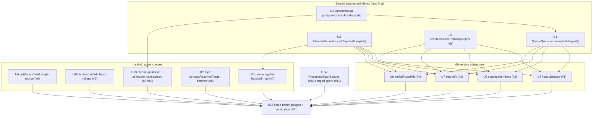

# perf: Batch + trim the 11 HIGH N+1 / over-enrichment hotspots

## Summary

A cross-agent audit (Sonnet hunters + Opus verifiers) found 11 HIGH-severity
instances of the **same anti-pattern class** that commit `93e8dbc8` fixed for
`/search`: per-row heavy DB enrichment (full `inspectorQuery.get`,
`queueQuery.summaryFor`, `refMetaForElement`, `conceptForElement`, per-element
`operation_log` scans, per-source yield rollups) executed inside loops over
potentially-large sets on interactive / high-frequency paths — plus one
renderer twin (unthrottled O(N) layout per editor transaction).

The fix is the established `batch + trim` pattern: resolve element rows in ONE
`elements.findManyLive(ids)`, build display fields from pre-fetched rows +
**batched** lookup maps, and use the lightweight
`InspectorQuery.buildSchedulerSignals(element, asOf, {includeYield:false})` slice
instead of the full inspector. Counts resolve only `{id,type,priority}` batched.
No behavior changes — only the number and shape of SQL round-trips.

This is a **pure performance refactor**. The hard constraint is **zero behavior
drift**: every list row must still carry the exact same fields (especially the
queue-eligibility projection and scheduler signals) it carries today, proven by
"batched output equals per-row output" guard tests.

---

## Problem Frame

`better-sqlite3` is synchronous and runs on the Electron **main** process. Each
drizzle `.get()`/`.all()` in a row loop recompiles the query AST and blocks the
event loop. When a list/search/count/feed surface enriches every row with a
selection-detail payload meant for ONE element, cost is `O(N × per-row-reads)`
on a thread that also services every other IPC call — the exact freeze
`93e8dbc8` removed for `/search`. The audit found 11 more of these, several on
per-keystroke or view-load paths, several over **uncapped** sets.

**Scope:** the 11 HIGH findings only. MEDIUM/LOW findings are deferred (some
batched primitives built here will make those trivial follow-ups).

---

## Requirements

- **R1** — Eliminate the per-row N+1 / full-enrichment in each of the 11 HIGH
  hotspots, replacing it with batched reads + the lightweight scheduler slice.
- **R2** — **Zero behavior drift.** Each refactored producer returns byte-identical
  result rows (same fields, same values, same ordering, same eligibility/labels)
  as before. Proven by guard tests comparing batched vs per-row output.
- **R3** — Preserve the source-yield dual-signal semantics (`extract_fate` ∪ live
  synthesis `references`) anywhere yield is computed (origin:
  `docs/solutions/architecture-patterns/extract-fates-value-model-v2-source-yield-stagnation.md`).
- **R4** — Preserve the queue-eligibility contract: every display row keeps
  `queueEligible` / `notInQueueReason` / due labels (origin:
  `docs/solutions/logic-errors/queue-eligibility-inventory-scheduler-state.md`).
- **R5** — Keep the renderer/SQLite boundary intact: all batching stays main-side
  inside `packages/local-db` / `DbService`; the renderer receives the same flat
  JSON rows.
- **R6** — Add scale-bench coverage for the previously-unguarded hot paths so the
  regressions cannot silently return.
- **R7** — Definition of Done: `pnpm lint`, `pnpm typecheck`, `pnpm test`, the
  relevant `pnpm e2e` (search/library/queue/review), and `pnpm bench` all green.

---

## Key Technical Decisions

- **KTD-1 — A batched `QueueQuery.summaryForMany(ids, asOf)` is the keystone.**
  Four of the five db-service hotspots (libraryBrowse, conceptMembers, search,
  enrichFusedHit) call `summaryFor` per row. Rather than open-code eligibility in
  each, add ONE batched path that returns the identical `QueueItemSummary` per id,
  fed by batched inputs (`findReviewStatesForMany`, `firstConceptNameMapForMembers`,
  sibling-group map, `postponeCountsForMany`, batched fallow + retirement-suggestion
  maps). **It must compute eligibility per element via `queueEligibilityFor` (NOT
  the `list()` `BatchContext` `eligible:true` shortcut, which is valid only for the
  due-only `list()` path — see U1's CRITICAL note).** This satisfies R4 by sharing
  one producer with `summaryFor` and is reusable by the deferred MEDIUM
  `conversion-session-query.previewByIds`. Guard with a drift test:
  `summaryForMany([id]).get(id)` deepEquals `summaryFor(id)` over a fixture that
  includes non-due, retired, fallow, and retirement-suggestion-bearing elements.

- **KTD-2 — Reuse `buildSchedulerSignals(el, asOf, {includeYield:false})` for list
  rows; never `inspectorQuery.get` in a loop.** `get()` stays the single-element
  inspector path. libraryBrowse/conceptMembers currently call `get()` per row
  (triggering the full per-source yield/`listBlockViews` rollup) — replace with
  the slice. The existing drift guard (`buildSchedulerSignals(...,{includeYield:true})
  === get().scheduler`) already protects this.

- **KTD-3 — New batched lookup primitives, mirroring the existing concept maps.**
  The concept matcher (`firstConceptNameMapForMembers`, `liveMembershipMapForMembers`)
  is the template. Add the missing siblings: `listTagsForMany`, `resolveSourceRefMany`,
  and a batched `operation_log` postpone-count map. Each is read-only, main-side,
  returns a `Map<ElementId, …>`.

- **KTD-4 — Scope batched reads to the working set (`…ForMembers(ids)`), not the
  whole library,** wherever the consumer has a bounded id list (search ≤50,
  library ≤200, concept members). Use whole-library maps only where the consumer
  already iterates the whole library (queue `list`).

- **KTD-5 — `getSourceYield(sourceId)` gets a single-source query path** scoped with
  `eq(sources.elementId, sourceId)`, instead of running the full-library
  `listSourceYield` and `.find()`-ing one row. `listSourceYield` keeps its
  whole-library shape but batches its per-source `computeReadPct` +
  block-processing sub-rollups into grouped passes (the only remaining N+1 inside
  it).

- **KTD-6 — Batch the `operation_log` postpone counts** with one
  `WHERE element_id IN (…) AND op_type IN ('reschedule_element','update_element')`
  scan folded per-element in JS, replacing per-element `countPostpones` /
  `rawPostponeCount`. The `element_id` index already exists.

- **KTD-7 — Renderer: gate `remeasure` on `transaction.docChanged`** (mirroring
  `packages/editor/src/SourceEditor.tsx`), optionally coalesced with rAF. No new
  dependency — the repo has no throttle util and the `docChanged` guard alone
  removes the decoration/selection-only fires that dominate.

- **KTD-8 — Verify against a realistic element count, not toy fixtures.** Per the
  search-stutter learning, synthetic repros hid the original N+1. Add bench gauges
  over the existing large seed and confirm with timing.

---

## High-Level Technical Design

Dependency flow — shared primitives land first, consumers depend on them:



Per-row vs batched shape (the transformation applied to every consumer):

```text
BEFORE  for (row of hits) { findById; inspectorQuery.get; summaryFor; refMeta; concept }   // N × ~15 reads
AFTER   els = findManyLive(ids); tags = listTagsForMany(ids); refs = resolveSourceRefMany(ids);
        names = firstConceptNameMapForMembers(ids); sums = summaryForMany(ids)              // ~5 batched reads
        for (row of hits) { build from pre-fetched maps + buildSchedulerSignals(el,{includeYield:false}) }
```

---

## Implementation Units

### U1. `QueueQuery.summaryForMany(ids, asOf)` — batched queue summary (keystone)

- **Goal:** A batched path producing the **identical** `QueueItemSummary` per id
  that `summaryFor` produces single-row, over an **arbitrary** id set (not just due
  elements — library/concept consumers pass non-due, parked, suspended, retired,
  and fallow elements).
- **Requirements:** R1, R2, R4
- **Dependencies:** U4 (for batched postpone counts)
- **Files:** `packages/local-db/src/queue-query.ts`,
  `packages/local-db/src/queue-query.test.ts`,
  `packages/local-db/src/review-repository.ts` (new `findReviewStatesForMany`)
- **CRITICAL — do NOT reuse the `list()` `BatchContext` eligibility shortcut.**
  The existing `toCardSummary`/`toAttentionSummary` `batch` branch hardcodes
  `queueEligibility = { eligible: true, reason: null }`, `cardRetired = false`,
  `fallow = null`, and `retirementSuggestion = null` **because `list()` only ever
  passes due, queue-eligible elements**. `summaryForMany` serves the inventory
  (all elements regardless of due/eligibility), so reusing that branch verbatim
  would emit `queueEligible:true` / `retirementSuggestion:null` for retired cards,
  parked sources, future-due elements, and fallow items — a silent R4 violation
  (feasibility + adversarial review, anchor 100). The batched path must compute
  eligibility per element via `queueEligibilityFor(element, dueAt, asOfMs,
  cardRetired)` exactly as the single-row path does, fed by **batched** inputs.
- **Approach:** Resolve ids via `findManyLive`; build the batched inputs ONCE:
  - `findReviewStatesForMany(ids)` (new `inArray` read on `review_states`) for
    FSRS state + the retired-card flag (`dueCardsWithState` is due-filtered, so a
    new batched read is required — it is always needed, not optional).
  - `firstConceptNameMapForMembers(ids)` for the concept name.
  - `liveSiblingGroupMap()` for sibling groups.
  - `postponeCountsForMany(ids)` (U4) for the postpone count / schedule projection.
  - a batched fallow-context map (resolve the parent chain via one or few batched
    parent reads, not a per-element `fallowContextFor` walk).
  - a batched source-retirement-suggestion map for source ids
    (`retirementSuggestions.visibleForSource` equivalent over `WHERE source_id IN
    (...) AND visible`).
  Then per element call the SAME `queueEligibilityFor` + due-label + scheduler
  logic the single-row path uses, reading from the maps. Return
  `Map<ElementId, QueueItemSummary>`. Consider threading these maps as an extended
  `BatchContext` so `toCardSummary`/`toAttentionSummary` compute eligibility from
  the maps instead of taking the `batch===true` shortcut (preferred over a parallel
  builder, to avoid drift between the two code paths).
- **Patterns to follow:** the single-row `summaryFor` field resolution (the
  authoritative shape); the scoped concept maps in `concept-repository.ts`;
  `findManyLive` for the `inArray` read.
- **Test scenarios:**
  - Drift (keystone): seed a fixture that includes **a due card, a retired card, a
    parked/suspended source, an element with a future `dueAt`, a fallow-paused
    element, and a source WITH a visible retirement suggestion**; assert
    `summaryForMany(ids).get(id)` deepEquals `summaryFor(id)` for every id and asOf
    — field-by-field including `queueEligible`, `notInQueueReason`, `dueLabel`,
    `retirementSuggestion`, `postponed`, and the concept name.
  - Eligibility: the retired card / parked source returns `queueEligible:false`
    with the correct `notInQueueReason` (NOT the `eligible:true` shortcut).
  - Retirement suggestion: the source with a visible suggestion returns it
    non-null batched (regression guard for the hardcoded-null trap).
  - Empty ids → empty map; unknown/soft-deleted id → absent from map (matches
    `summaryFor` returning null).
  - Postpone count: an element with N postpone markers reports the same
    `postponed` count batched as single-row.
- **Verification:** drift test green over the mixed (non-due/retired/fallow)
  fixture; no `summaryFor` call remains inside any loop after consumers land.

### U2. `ElementRepository.listTagsForMany(ids)` — batched tag map

- **Goal:** One query returning `Map<ElementId, string[]>` for many elements.
- **Requirements:** R1, R2
- **Dependencies:** none
- **Files:** `packages/local-db/src/element-repository.ts`,
  `packages/local-db/src/repositories.test.ts` (or `element-repository.test.ts`)
- **Approach:** Single `element_tags` ⋈ `tags` `inArray(elementTags.elementId, ids)`
  query; group by elementId in JS, preserving the same tag ordering `listTags`
  returns. Empty ids → empty map.
- **Patterns to follow:** `findManyLive` (`inArray`), `firstConceptNameMapForMembers`.
- **Test scenarios:**
  - Parity: for each seeded element, `listTagsForMany(ids).get(id)` deepEquals
    `listTags(id)` (same tags, same order).
  - Element with no tags → empty array (or absent — match whatever `listTags`
    returns for none; assert the consumer handles it identically).
  - Empty ids → empty map.
- **Verification:** parity test green; used by U5–U8, U11.

### U3. `resolveSourceRefMany(repos, ids)` — batched source-ref map

- **Goal:** Batched `Map<ElementId, {sourceTitle, sourceLocationLabel}>` replacing
  per-row `resolveSourceRef`.
- **Requirements:** R1, R2
- **Dependencies:** none
- **Files:** `packages/local-db/src/source-ref-query.ts`, its test file
- **Approach:** Batch the element read (`findManyLive`), collect unique sourceIds
  and locationIds, batch those side-table reads (`inArray`), then assemble each
  ref from the maps. Mirror `resolveSourceRef`'s branching for source vs
  extract/card exactly.
- **Patterns to follow:** existing `resolveSourceRef`; `findManyLive`.
- **Test scenarios:**
  - Parity: `resolveSourceRefMany(ids).get(id)` deepEquals `resolveSourceRef(id)`
    for source, extract, and card fixtures.
  - Missing/soft-deleted source → same degraded label as single-row path.
  - Empty ids → empty map.
- **Verification:** parity test green; used by U5–U8.

### U4. `OperationLogRepository.postponeCountsForMany(ids)` — batched op-log counts

- **Goal:** One `operation_log` scan yielding `Map<ElementId, number>` of effective
  postpone counts, replacing per-element `countPostpones` / `rawPostponeCount`.
- **Requirements:** R1, R2
- **Dependencies:** none
- **Files:** `packages/local-db/src/operation-log-repository.ts`, its test file
- **Approach:** `WHERE element_id IN (ids) AND op_type IN ('reschedule_element',
  'update_element')`. **Ordering matters:** `countPostpones` consumes
  `listForElement(id).reverse()` — i.e. oldest-first — so the batched fold must
  order `created_at ASC, rowid ASC` (the `rowid` tiebreak is required; same-ms ops
  otherwise fold in the wrong order and produce a wrong count). Expose TWO maps
  with DISTINCT semantics (do not share fold logic):
  - **effective** counts use the FULL `countPostpones` marker logic (including
    `update_element` reset/restore markers that zero the count) — consumed by U1.
  - **raw** counts replicate `rawPostponeCount` (in `scheduler-consistency-query.ts`):
    count ONLY `reschedule_element` rows with `payload.postpone === true`, with NO
    reset-marker folding — consumed by U13's reset scan. Applying the reset fold to
    the raw map would break the `raw > effective` detection.
  - An element absent from the scan returns 0 in BOTH maps.
- **Patterns to follow:** `listForElement` fold logic; `inArray`.
- **Test scenarios:**
  - Parity: for each seeded element, `postponeCountsForMany(ids).get(id)` equals
    `countPostpones(id)` (including reset markers zeroing the count).
  - Raw-count parity (if a raw map is added) vs `rawPostponeCount`.
  - Element absent from log → 0. Empty ids → empty map.
- **Verification:** parity test green; consumed by U1 and U13.

### U5. `libraryBrowse` / `libraryItemFor` — batch + trim (finding #1)

- **Goal:** Enrich the library browse list (≤200 rows) with batched maps instead
  of per-row `inspectorQuery.get` + `summaryFor` + `refMeta` + `concept`.
- **Requirements:** R1, R2, R4
- **Dependencies:** U1, U2, U3
- **Files:** `apps/desktop/src/main/db-service.ts`,
  `apps/desktop/src/main/db-service.test.ts`
- **Approach:** Pre-fetch ids via `findManyLive`; build `summaryForMany`,
  `listTagsForMany`, `resolveSourceRefMany`, `firstConceptNameMapForMembers`
  once; in the row loop build each `LibraryItem` from the maps +
  `buildSchedulerSignals(el, now, {includeYield:false})`. Remove the per-row
  `get()`/`summaryFor`/`refMeta`/`conceptForElement` calls. Keep the task-element
  `findTask` branch (bounded).
- **Patterns to follow:** the `search()` conversion in the same file (post-93e8dbc8).
- **Test scenarios:**
  - Drift: `libraryBrowse` result for a mixed seed deepEquals the pre-refactor
    output (snapshot or field-by-field) — same rows, order, eligibility, scheduler
    chip, source ref, concept, tags.
  - Source row carries scheduler signals WITHOUT the yield rollup (chip present,
    `yield` null on list rows) — confirm `includeYield:false` path.
  - Empty library → empty list; soft-deleted excluded.
- **Verification:** drift test green; bench gauge (U15) under budget.

### U6. `conceptMembers` — batch + trim, scoped to member ids (finding #2)

- **Goal:** Same transformation as U5 for the concept drill-in, over the
  (unbounded) member set.
- **Requirements:** R1, R2, R4
- **Dependencies:** U1, U2, U3
- **Files:** `apps/desktop/src/main/db-service.ts`, `db-service.test.ts`
- **Approach:** Replace the `for (id of memberIds)` per-row
  `findById`+`refMeta`+`get`+`summaryFor` with the batched maps over `memberIds`.
  Identical builder to U5 (extract a shared `enrichElementRow(el, maps)` helper if
  it reduces duplication without obscuring either call site).
- **Unbounded-set guard:** `memberIds` is uncapped, so the `inArray` reads in
  U1–U4 can exceed SQLite's `SQLITE_MAX_VARIABLE_NUMBER` (~32k) on a large concept.
  Either chunk the id list inside the batched primitives (preferred — make U1–U4
  chunk internally so every consumer is safe) or impose an explicit ceiling. Check
  for an existing chunking helper before adding one. Whatever is chosen must not
  change output (R2).
- **Patterns to follow:** U5.
- **Test scenarios:**
  - Drift: `conceptMembers(conceptId)` deepEquals pre-refactor output for a concept
    with mixed-type members.
  - Large member set (e.g. 150) returns identical rows to the per-row path.
  - Concept with zero live members → empty list.
- **Verification:** drift test green; bench gauge (U15) under budget.

### U7. `search()` residual — batched refMeta + concept, drop duplicate (finding #3)

- **Goal:** Remove the residual per-hit `refMetaForElement` + `summaryFor` +
  `conceptForElement`, and the **duplicate** concept resolution.
- **Requirements:** R1, R2
- **Dependencies:** U1, U3
- **Files:** `apps/desktop/src/main/db-service.ts`, `db-service.test.ts`
- **Approach:** Element fetch already batched (93e8dbc8). Add `resolveSourceRefMany`
  + `summaryForMany` + `firstConceptNameMapForMembers(hitIds)` before the loop;
  delete the second `conceptForElement` call (the concept is already in the
  summary/its map). Keep `buildSchedulerSignals(...,{includeYield:false})`.
- **Patterns to follow:** the already-batched element fetch in `search()`.
- **Test scenarios:**
  - Drift: `search(query)` result deepEquals pre-refactor output incl. concept,
    source ref, scheduler, due label.
  - Concept appears exactly once and matches the single-row `conceptForElement`
    value (no drift from removing the duplicate).
  - Faceted counts unchanged (count path already `{id,type,priority}` batched —
    assert untouched).
- **Verification:** drift test + existing search e2e green.

### U8. `enrichFusedHit` (semantic search twin) — same as U7 (finding #4)

- **Goal:** Apply the U7 transformation to the semantic `/search` path.
- **Requirements:** R1, R2
- **Dependencies:** U1, U3
- **Files:** `apps/desktop/src/main/db-service.ts`, `db-service.test.ts`
- **Approach:** Same batched maps + drop duplicate concept; ensure the fused
  (FTS+vector) hit shape is preserved (the `source: "fts"|"semantic"|"both"`
  label and scores untouched).
- **Patterns to follow:** U7.
- **Test scenarios:**
  - Drift: semantic search result deepEquals pre-refactor output incl. vector
    distance / source label.
  - Mixed fused result (a hit present in both FTS and vector) labeled identically.
- **Verification:** drift test + semantic search e2e green.

### U9. `getSourceYield(sourceId)` — single-source query path (finding #6)

- **Goal:** Resolve one source's yield without the full-library `listSourceYield`
  scan.
- **Requirements:** R1, R2, R3
- **Dependencies:** none
- **Files:** `packages/local-db/src/source-yield-query.ts`,
  `packages/local-db/src/source-yield-query.test.ts`
- **Approach:** **Replace the body of the EXISTING `getSourceYield(sourceId)`
  method** — which today delegates to `listSourceYield(asOf, { limit:
  MAX_SAFE_INTEGER })` then `.find()`s one row (the comment flags this as a
  deferred "T099 scale refinement") — with a genuinely single-source query path
  scoped to `eq(sources.elementId, sourceId)` across the same passes, preserving
  the dual-signal productive-extract semantics (R3). This is a rewrite of an
  existing method, not a new function. `buildSchedulerSignals` keeps calling it on
  inspector-open (single element — correct).
- **Patterns to follow:** the per-source grouped passes inside `listSourceYield`;
  `getSourceVisitCounters` single-source scoping.
- **Test scenarios:**
  - Drift: `getSourceYield(id)` deepEquals the row `listSourceYield` produces for
    that id, across sources with/without extracts, cards, and synthesis refs.
  - Dual-signal: a source whose only productive extract is via a live synthesis
    `references` edge (no `extract_fate`) reports the same `productiveExtracts`.
  - Unknown source → null/zero matching the old behavior.
- **Verification:** drift test green; bench gauge (U15).

### U10. `listSourceYield` — batch the per-source read-pct + block-processing (finding #5)

- **Goal:** Remove the per-source `computeReadPct` + `getSourceProcessingSummary`
  (→ `listBlockViews`) N+1 inside the assembly loop.
- **Requirements:** R1, R2, R3
- **Dependencies:** none (independent of U9; both touch the same file — sequence
  after U9 to avoid churn)
- **Files:** `packages/local-db/src/source-yield-query.ts`,
  `packages/local-db/src/block-processing-service.ts` (add a batched
  `listBlockViewsForMany` / processing-summary-map if needed), their tests
- **Approach:** Build read-point and block-count maps in grouped passes
  (`inArray` over all source ids), and a batched block-processing summary map,
  before the assembly loop; look up per source. Preserve R3 semantics.
  - **Stale-source safety:** the batched block-processing path must NOT route
    through `BlockProcessingService.requireSourceElement` (it `throw`s on a
    soft-deleted/missing source — a single stale id would crash the whole
    `listSourceYield`). Build the batched summary map directly from the underlying
    repo reads filtered by `IN (liveSourceIds)`, or filter ids against the
    already-fetched live-source set first. Keep the domain service strict for
    mutation paths; tolerate stale ids only on this read path (origin:
    `docs/solutions/runtime-errors/block-processing-stale-source-ids-zero-summary.md`).
  - **Empty-set guard:** every new `inArray` must be guarded for an empty id list
    (drizzle emits `IN ()` → SQLite syntax error). Mirror the existing
    `if (liveSynthesisNoteIds.length > 0 && liveTargets.size > 0)` guard already in
    `listSourceYield`. Covers the zero-sources / no-synthesis-notes vault.
- **Patterns to follow:** the existing grouped passes already in `listSourceYield`.
- **Test scenarios:**
  - Drift: `listSourceYield()` whole-library output deepEquals pre-refactor output.
  - Read-% and processed-block counts identical per source vs the per-source calls.
  - Source with zero blocks → zero summary (no throw).
  - Zero-sources vault and a vault with sources but no synthesis notes → empty/valid
    result, NO `IN ()` SQL error (empty-set guard).
  - A source soft-deleted from the live set is tolerated (zero summary, no throw)
    rather than crashing the whole call (stale-source safety).
- **Verification:** drift test green; analytics/yield bench gauge (U15).

### U11. Queue tag filter — batched tag membership (finding #7)

- **Goal:** Replace per-element `listTags` in the count pass (over the uncapped due
  set) and the filter pass with one batched tag map, mirroring the concept matcher.
- **Requirements:** R1, R2
- **Dependencies:** U2
- **Files:** `packages/local-db/src/queue-query.ts`, `queue-query.test.ts`
- **Approach:** When `filters.tag` is set, build a `buildTagMatcher` from
  `listTagsForMany(dueIds)` (or a dedicated `tagMembershipMapForMembers`) ONCE
  before the count/filter loops; `matchesElementFilters`/`matchesFilters` read the
  map instead of calling `listTags(id)`. Mirror `buildConceptMatcher` /
  `liveMembershipMap` exactly.
- **Patterns to follow:** the concept-filter matcher already in `queue-query.ts`.
- **Test scenarios:**
  - Drift: queue `list` + counts with an active tag filter deepEquals pre-refactor
    output (same members, same counts) over a tagged seed.
  - Count pass over a large due set issues one tag query (assert via a query
    counter/spy if the harness supports it, else via the bench).
  - Element with multiple tags, filter matching one of them → included.
  - No tag filter active → tag map not built (no extra query).
- **Verification:** drift test green; queue bench gauge (U15) with tag filter active.

### U12. `strictestResolvedTarget` — batched retention resolution (finding #8)

- **Goal:** Stop calling `retention.resolveForCard` per card (each: `findCardById`
  + `conceptsForElement`); resolve from the already-batched `cardInfo` +
  `liveMembershipMap`.
- **Requirements:** R1, R2
- **Files:** `packages/local-db/src/topic-knowledge-state-query.ts`,
  `packages/local-db/src/topic-knowledge-state-query.test.ts`
- **Approach:** The only per-card DB read inside `resolveForCard` is
  `concepts.conceptsForElement(cardId)` (for concept names) + `findCardById` (for
  the per-card override). Both are already available batched in this query class:
  `liveMembershipMap()` (elementId → concept ids) + the concept-name map, and the
  `cardInfo()` map (priority + override). **Prefer inlining** the pure
  `resolveDesiredRetentionDetailed({priority, conceptNames, cardOverride, targets})`
  call — the terminal call `resolveForCard` already delegates to — directly in
  `strictestResolvedTarget`, reading concept names + override from the pre-built
  maps. This removes every per-card DB read with **no new public method on
  `RetentionService`** (scope review: don't widen a shared service's API for one
  consumer). If importing the pure resolver creates awkward coupling, add a
  package-private helper accepting pre-fetched names. Preserve the "strictest
  target wins" math exactly. Note: under `order:"needs_attention"` all subjects are
  built before slicing — this removes the per-card reads that made it
  O(subjects×cards).
- **Patterns to follow:** `cardInfo()` / `liveMembershipMap()` batched maps in the
  same file.
- **Test scenarios:**
  - Drift: `strictestResolvedTarget` returns the same target for a subject whose
    cards have mixed per-concept / per-band / global retention overrides as the
    per-card path.
  - A card with a per-concept override still resolves to the strictest target.
  - Subject with zero active cards → same default as before.
- **Verification:** drift test green; analytics bench gauge (U15).

### U13. Chronic-postpone + scheduler-consistency — batched op-log counts (findings #9, #10)

- **Goal:** Replace per-element `countPostpones` (`listCandidates`/`countDue`) and
  the double per-element `rawPostponeCount`+`countPostpones`
  (`chronicPostponeReset`) with U4's batched maps.
- **Requirements:** R1, R2, R6
- **Dependencies:** U4
- **Files:** `packages/local-db/src/chronic-postpone-query.ts`,
  `packages/local-db/src/scheduler-consistency-query.ts`, their tests
- **Approach:** Fetch the candidate id set FIRST (the SAME full live-element scan
  the current paths use — all live elements of the supported/CHRONIC_POSTPONE
  types), then build `postponeCountsForMany(ids)` (effective map) and the raw-count
  map ONCE, and filter/count from the maps. **The batched op-log scan must NOT be
  scoped to "elements that have a postpone op"** — an element absent from the
  op-log must still be evaluated and return 0 (scoping to op-log-present ids would
  drop elements the current full-scan path evaluates, a correctness regression on
  the consistency report — adversarial review). Mirror the already-batched
  `attentionDueBeforeLastSeen` single-scan style.
- **Patterns to follow:** `attentionDueBeforeLastSeen` (single batched scan) — it
  lives in `scheduler-consistency-query.ts`.
- **Note on the reset detector:** the `raw > effective` filter in
  `scheduler-consistency-query.ts` is currently an inline `.filter`, not a public
  `chronicPostponeReset()` method. Reuse/refactor whatever the public surface is
  (`list()` / `count()`); the test scenario below asserts through that public API,
  not a method that may not exist.
- **Test scenarios:**
  - Drift: `chronicPostpone.listCandidates()` / `countDue()` deepEquals
    pre-refactor over a seed with varied postpone histories.
  - Drift: the scheduler-consistency reset detection (via its public `list()`/
    `count()`) flags the same elements (raw > effective) as the per-element version.
  - Element with a reset marker → excluded identically.
  - Element with NO op-log rows is still evaluated and contributes 0 (regression
    guard against scoping the scan to op-log-present ids).
- **Verification:** drift tests green; new bench gauges for
  `schedulerConsistency.count` + `chronicPostpone.countDue` (U15) under budget.

### U14. `ProcessedSpanButtons` — gate remeasure on `docChanged` (finding #11)

- **Goal:** Stop running O(N-paragraph) `getBoundingClientRect` layout on every
  Tiptap transaction (incl. cursor-move / decoration-only).
- **Requirements:** R1, R5
- **Files:** `apps/web/src/pages/source/ProcessedSpanButtons.tsx`,
  `apps/web/src/pages/source/ProcessedSpanButtons.test.tsx` (or the nearest
  existing test for this component)
- **Approach:** In the `editor.on("transaction", onTx)` handler, early-return when
  `!transaction.docChanged` (the `transaction` is passed to the `"transaction"`
  event callback; mirror the `if (!transaction.docChanged) return;` guard in
  `packages/editor/src/SourceEditor.tsx`). Optionally coalesce the remaining
  doc-change remeasures with `requestAnimationFrame` + a `rafPending` ref. Keep the
  `ResizeObserver` / `window.resize` remeasure triggers (legitimately structural).
- **Also audit the second remeasure trigger.** There is a separate `useEffect`
  keyed on the `revision` prop that calls `remeasure()` unconditionally. If the
  host bumps `revision` on decoration-only changes (e.g. read-point divider /
  processed-state toggles), that path still fires the O(N) remeasure on every
  keystroke and the `docChanged` guard alone does NOT fix finding #11. Determine
  what increments `revision`; if it bumps on non-structural changes, gate that
  effect too (e.g. only remeasure when the doc content actually changed). If
  `revision` only changes on genuine structural/processed-span changes, leave it.
- **Patterns to follow:** `SourceEditor.tsx` `docChanged` guard; the inline rAF in
  `ClipMiniPlayer.tsx`.
- **Test scenarios:**
  - A decoration/selection-only transaction (e.g. cursor move, read-point divider
    update where `docChanged===false`) does NOT trigger `remeasure`.
  - A content-changing transaction DOES trigger exactly one remeasure (per frame
    if rAF-coalesced).
  - Block-id stability preserved after a decoration-only transaction (origin:
    `packages/editor/AGENTS.md`).
  - Resize still triggers remeasure (regression guard for the kept triggers).
- **Verification:** component test green; manual/e2e: typing in a long source no
  longer blocks (DevTools main-thread sanity).

### U15. Scale-bench gauges + cross-cutting verification (R6)

- **Goal:** Lock in the wins and prevent silent regression of the previously
  unguarded paths.
- **Requirements:** R6, R7
- **Dependencies:** U5–U13
- **Files:** `packages/local-db/bench/scale-budget.test.ts`,
  `packages/local-db/bench/bench-harness.ts`
- **Package-boundary constraint:** the bench runs **behind the `local-db`
  boundary** — it cannot import `DbService` (`apps/desktop`), so gauges for
  `libraryBrowse` / `conceptMembers` / `DbService.search` cannot live here without
  inverting the dependency graph. **Scope U15 to the local-db-reachable hot paths**
  and rely on the U5–U8 **drift tests** (which already run in `pnpm test`) to
  protect the db-service consumers — they share the same batched primitives, so a
  primitive regression shows up in both.
- **Approach:** Add `gauge(...)` entries (p95 ≤ budget) over the existing large
  seed for the local-db-layer paths: `QueueQuery.summaryForMany`,
  `getSourceYield` (single-source), `listSourceYield` (whole-library, U10),
  `schedulerConsistency.count`, `chronicPostpone.countDue`, and `QueueQuery.list`
  with a tag filter active (U11). Budgets set from the measured post-fix p95 with
  headroom. (Adding an `apps/desktop` bench harness for the db-service consumers is
  deferred follow-up — not required for R6 given the shared-primitive drift tests.)
- **Patterns to follow:** existing `gauge`/`measure` entries in the bench.
- **Test scenarios:** `Test expectation: bench gauges` — each new gauge passes at
  the chosen budget on the seed; deliberately reverting one consumer makes its
  gauge fail (sanity-checked locally, not committed).
- **Verification:** `pnpm bench` green; full DoD (R7) green.

---

## Scope Boundaries

**In scope:** the 11 HIGH findings (U5–U14) and the shared primitives + bench they
require (U1–U4, U15).

### Deferred to Follow-Up Work
- MEDIUM findings from the same audit (e.g. `element-repository.listAllTags`
  per-join liveness N+1, `reviewModeDeck` per-card reads, `previewByIds`
  un-batched `summaryFor`, `collectResolutionOps` full `listAll`,
  `cleanedSnapshotHashes` per-source, anki export/import batching, renderer
  `BrowseScreen`/`InboxGroupedList`/`AddToNote`). Several become one-liners once
  U1–U4 exist (`previewByIds` → `summaryForMany`).
- `operation_log.count()` `.all().length` → SQL `COUNT(*)` (noted by a verifier).

### Out of Scope
- Any behavior change, schema/migration change, or new IPC surface. This is a
  read-path performance refactor only.

---

## Risks & Mitigations

- **Behavior drift (highest risk).** Mitigation: every consumer unit ships a
  "batched deepEquals per-row / pre-refactor" guard test (R2); the existing
  `buildSchedulerSignals` drift guard covers the scheduler slice.
- **Eligibility / retirement-suggestion divergence in the batched path (highest
  correctness risk, P0 from review).** The `list()` `BatchContext` hardcodes
  `queueEligible:true` / `retirementSuggestion:null` because it only sees due
  elements; `summaryForMany` serves the full inventory. Mitigation: U1 computes
  eligibility per element via `queueEligibilityFor` and batch-resolves retirement
  suggestions; the drift fixture MUST include non-due / retired / fallow /
  suggestion-bearing elements (a fixture of only-due elements would pass while
  hiding the bug); typed `QueueItemSummary` / `LibraryItem` contracts force all
  fields.
- **`listBlockViews` batching changing yield numbers.** Mitigation: U10 drift test
  over sources with both `extract_fate` and synthesis-reference productivity.
- **rAF coalescing dropping a needed remeasure.** Mitigation: keep non-transaction
  triggers (resize, revision) un-coalesced; test the decoration-only and
  content-change cases.

---

## Sources & Research

- Origin audit: the 11 HIGH findings (Sonnet hunt + Opus verification) earlier in
  this session.
- `docs/solutions/performance-issues/search-typing-stutter-is-renderer-rerender-not-async-work.md`
  — the canonical batch+trim pattern, `buildSchedulerSignals`, count-path rule,
  "profile the real workload".
- `docs/solutions/logic-errors/queue-eligibility-inventory-scheduler-state.md` (R4).
- `docs/solutions/architecture-patterns/extract-fates-value-model-v2-source-yield-stagnation.md` (R3).
- `docs/solutions/runtime-errors/block-processing-stale-source-ids-zero-summary.md` (U10).
- Reference commit `93e8dbc8` (`search`/`enrichFusedHit` conversion).
- Repo research: `findManyLive` (`element-repository.ts:719`),
  `buildSchedulerSignals` (`inspector-query.ts:288`),
  `firstConceptNameMapForMembers` (`concept-repository.ts:596`),
  scale bench (`packages/local-db/bench/scale-budget.test.ts`),
  `SourceEditor` `docChanged` guard (`packages/editor/src/SourceEditor.tsx`).
