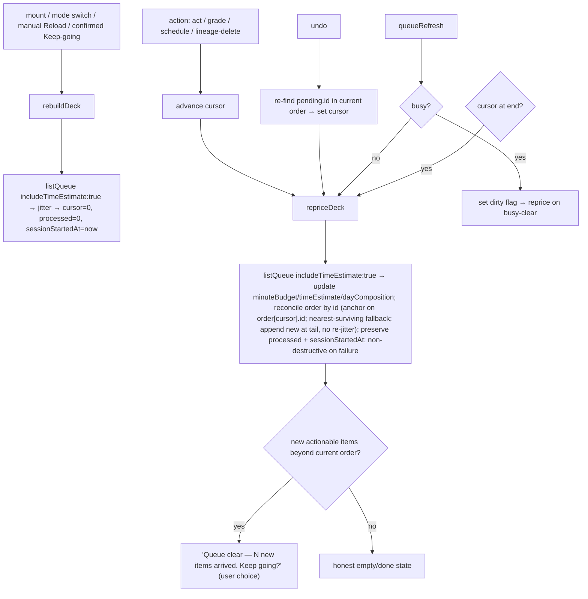
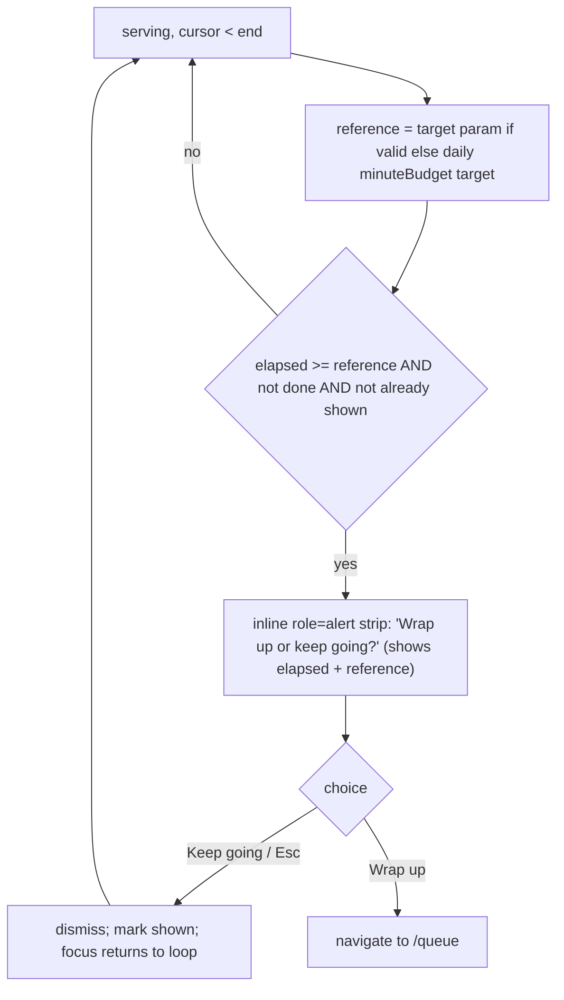

# refactor: Queue-as-session — continuous live-serve loop

## Summary

Replace the frozen "planned deck" model in the `/process` route with a continuous **live-serve**
loop over the existing scored, jittered due queue, and demote the session-plan preview from a
binding commitment to a **non-binding read-only forecast** backed by an **ambient, adaptive minute
gauge**. Remove the `assembled=1` search param, the in-memory accepted-deck handoff, and the
"Session plan expired" dead-end entirely, so the expiry state becomes *impossible to express*. When
the time budget is reached, show a **soft "wrap up or keep going?" prompt** instead of a hard "done"
wall; the natural end is the live queue draining into the existing honest empty states.

The backend stays untouched: `listQueue`, `previewSessionPlan`, `SessionPlanQuery.preview()`,
`planSession`, and the time-cost read model are reused as-is.

**This carries user-observable behavior changes** (see the dedicated section) — it is filed as a
`refactor` because the bulk is structural, but it deliberately amends two recently shipped features
(T118 session assembly, T119 distillation quota) and removes the "commitment to a planned set"
affordance. Those changes are called out explicitly rather than absorbed silently.

This refactor also fixes a **pre-existing latent bug**: the `queueRefresh` signal currently
*restarts* the process session (resets cursor, processed count, re-jitters). Under a live-serve
model that keeps users in `/process` longer, that collision becomes frequent and disruptive, so the
reload path is split into an explicit rebuild vs. an ambient reprice that preserves the user's
place.

---

## User-Observable Behavior Changes

This section exists because the change is filed as a refactor but is not behavior-preserving. Each
item is a deliberate decision, not collateral.

1. **No more "Session plan expired."** Reopening/reloading/deep-linking `/process` resumes serving
   the live queue. (Pure win; the motivating defect.)
2. **No commitment to a bounded, accepted deck.** The session is no longer "execute exactly this
   set"; it is "serve the live queue until you stop." Completion signals are preserved differently
   (the wrap-up prompt, the end-of-order "new work arrived — keep going?" stop, and the honest
   "Queue clear" state) so the loop never feels like an endless treadmill (KTD-7).
3. **No hard "done" wall / planned-vs-completed summary.** Replaced by honest empty states.
4. **Distillation composition is no longer front-loaded into a sized session (amends T119).** The
   live order is pure `queueItemScore`, which has no distillation weighting; the deck-fill
   reservation that guaranteed distillation *surfaced within a sized sitting* is gone. See KTD-5 for
   the precise, corrected scope of this regression and how it is surfaced loudly and elevated for
   sign-off rather than shipped silently.

---

## Problem Frame

`/process` today braids two paths: an **assembled** path (frozen deck via an in-memory
`acceptSessionAssembly()` handoff → `/process?assembled=1` → walk a frozen `plannedItems` array →
hard "done" wall, or a "Session plan expired" dead-end when the in-memory plan is gone) and a
**live** path (`listQueue({ mode })` → walk the scored+jittered queue, but with no minute data
because it never requests `includeTimeEstimate`).

The frozen deck is the only ephemeral, non-durable, non-op-logged artifact in an otherwise durable
system, and "Session plan expired" is the visible symptom of losing it. Incremental reading is a
continuous stream ("interrupted reading is normal, not an exception" — `docs/concept.md`), so the
goal is to make `/process` always serve the next best item from the live queue, demote the plan to
a forecast, and make the time budget ambient — so reopening mid-stream resumes with zero data loss
and "expired" cannot happen.

---

## Scope Boundaries

### In scope

- `/process` always loads the live queue; remove `assembled`/`assembledMode`/`assembledSession`/
  `missingAssembly`, the assembled `load()` branch, the "Session plan expired" render, the frozen
  session-summary block, and the assembled variant of `ProcessSessionControls`.
- Delete `sessionAssemblyState.ts` (accept/consume/clear + `AcceptedSessionAssembly`); relocate the
  `sessionMinuteLabel` helper to `apps/web/src/lib/queueTimeEstimate.ts`. **Co-dependency:** the
  file cannot be deleted until all four consumers (2 source + 2 test) are repointed (see U1/U5).
- Split `load()` into an explicit **rebuild** (mount / mode switch / manual reload) and an ambient
  **reprice + reconcile** (after each action / on `queueRefresh` / at end-of-order) that preserves
  cursor-by-id, `processed`, and `sessionStartedAtRef`, is non-destructive on failure, and catches
  up a refresh dropped while `busy`.
- Add `includeTimeEstimate: true` to the `/process` read; add a slim `SessionGauge` (sibling of
  `BudgetMeter`, not a stretch of it) — an inline, confidence-aware minute readout in the session
  band (not a second full-width bar).
- Demote `SessionAssemblyPreview` to a non-binding forecast: "Start" navigates to
  `/process?target=<minutes>` (no `assembled`, no module write).
- Soft "wrap up or keep going?" prompt gated on a reference target (`?target=` if valid, else the
  daily `minuteBudget.targetMinutes`) so every entry path behaves consistently.
- End-of-order "new work arrived — keep going?" stop for true continuity without a silent treadmill.
- Undo restores the cursor **by id**, not by stale index.
- Migrate unit + e2e tests off assembled/expired/summary; add live-serve coverage.
- Docs: new solution doc, dated supersede note on the session-assembly doc, a roadmap follow-up
  entry (explicitly flagging the T119 interaction for maintainer sign-off), CONCEPTS.md updates.

### Out of scope / non-goals

- No changes to `queueItemScore` ordering, FSRS, the attention scheduler, or any `packages/`
  scheduler/db code (task-scoped as untouched).
- No backend/IPC/schema changes.
- No new persistence of session state (durable sessions deferred).
- No serving-time distillation floor **in this change** — doing it correctly needs a small backend
  addition (a floor-aware order out of `listQueue`); the renderer must not recompute eligibility/
  pricing locally. Recommended as the concrete follow-up (see KTD-5).

### Deferred to follow-up work

- **Serving-time distillation floor (recommended next).** Re-establish T119's guarantee on the
  live-serve path via a backend floor-aware order, so distillation is reserved before the score-
  ordered tail without the renderer recomputing scheduling. Flagged for maintainer prioritization.
- Durable, resumable session records (an op-logged "session" element).
- Resolving remaining count-denominated seams in `docs/scheduling-and-priority.md`.

---

## Key Technical Decisions

**KTD-1 — The live queue is the source of truth; no frozen snapshot survives a reload.** `load()`
always reads `listQueue`. Reopening `/process` re-reads and serves the current best item — which is
what makes "expired" impossible. Aligns with the renderer-never-owns-queue-membership invariant.

**KTD-2 — Split `load()` into `rebuildDeck()` and `repriceDeck()`.** The architectural spine.
- `rebuildDeck(modeOverride?)`: mount, mode switch, manual "Reload", and the user-confirmed
  end-of-order continuation. Reads `listQueue({ mode, asOf?, includeTimeEstimate: true })`,
  re-jitters, resets `cursor=0`/`processed=0`/`sessionStartedAtRef`/`gradedRef`.
- `repriceDeck()`: after each action, on `queueRefresh`, and once at end-of-order. Re-reads
  `listQueue` to refresh `minuteBudget`/`timeEstimate`/`dayComposition` and **reconciles order by
  id** with these explicit rules (resolving the reviewer-flagged ambiguities):
  - **Anchor:** re-anchor on the id of `order[cursor]` (the *next item to serve*, not the
    just-acted one). If that id is still present, keep the cursor on it. If it is absent (acted-on,
    postponed, deleted elsewhere), advance to the **nearest surviving item at or after the old
    cursor index** in the new score order; if none survive at/after, fall to the last surviving
    item before it; if the deck is now empty, go to the empty state.
  - **Jitter:** do **not** re-jitter the already-seen prefix; append genuinely-new due items at the
    tail in backend score order (no client re-score). Order after reprice is therefore
    prefix-stable; the appended tail is in score order. (Documented trade-off: not byte-identical to
    a fresh `rebuildDeck`, which is acceptable and tested.)
  - **Failure is non-destructive:** if the `listQueue` read rejects, keep the current `order`/
    `cursor`/gauge (do **not** blank the session as the old `load()` did on error).
  - **Busy catch-up:** `repriceDeck` no-ops while `busy`; a `queueRefresh` arriving during `busy`
    sets a dirty flag that triggers one reprice when `busy` clears (refreshes are not silently lost).
  Rationale: re-reading is the only authoritative source of remaining minutes
  (renderer-never-prices), but the current monolithic `load()` restarts the session on every refresh
  (the C3 latent bug) — fatal under live-serve.

**KTD-3 — The gauge consumes backend-priced minutes only.** "Remaining" = `timeEstimate.totalMinutes`
(the full filtered due universe, server-priced — verified), not client subtraction. "Elapsed" =
wall-clock from `sessionStartedAtRef`. The renderer formats an already-validated projection.

**KTD-4 — Read-only with respect to session/plan state; materialization framed precisely.** The
forecast and gauge write no `operation_log`, never grade, never reschedule. Note that
`listQueue`/`previewSessionPlan` trigger `materializeDailyPoliciesToday()` (standing auto-postpone +
extract aging) — a **day-gated, idempotent, once-per-local-day** convergence that *any* non-`asOf`
due read triggers, not a session/plan write (verified: `standing-auto-postpone-service.ts` returns
early if the day's receipt exists). Two edges are documented rather than hidden:
- **Midnight crossing:** a `repriceDeck` that crosses local midnight in a long session computes a
  new `localDay` and may run that day's auto-postpone once, which can move items out of the live
  deck mid-session. Accepted and documented behavior (idempotent, correct, undoable via receipt);
  the reconcile rules above handle the resulting deck change gracefully.
- **Receipt visibility:** if `/process` is the day's first due read, the auto-postpone receipt is
  still surfaced through the normal daily-work channel; ensure the existing receipt affordance is
  reachable (no new UI required).

**KTD-5 — Distillation quota: corrected scope, surfaced loudly, elevated for sign-off (amends
T119).** *Correction to the original premise:* the floor is enforced in **two** places, not one —
(a) `planSession` (the deck-fill reservation being removed) and (b) `auto-postpone.ts` (skips
postponing extract victims below the floor). Enforcement (b) only runs when
`overloadPolicy === "automatic"`; the **default is `suggest`**, and `queueItemScore` has **zero**
distillation-stage weighting (in `full` mode — the `/process` default — `typeBias` is neutral for
cards and extracts). So removing (a) means: under the default policy on a card-heavy day, nothing
guarantees due distillation *surfaces within a sized sitting* — a user could process cards until
they quit and reach none of their extracts. The accurate regression scope is **intra-sitting
composition under the default policy / a short target**, not "daily distillation throughput"
(auto-postpone still protects throughput when the policy is `automatic`). This change:
- keeps the live order pure `queueItemScore` (honoring the task's "don't touch the ordering" scope);
- makes the loss **loud, not silent** — the forecast and the in-session gauge surface the distillation
  share from `dayComposition` so the user can see when distillation is being out-competed;
- **elevates the decision for maintainer sign-off** in the U8 roadmap note (this reverses a feature
  that shipped ~10 days ago), and names the serving-time floor (KTD-5 follow-up) as the recommended
  way to restore the guarantee properly (backend floor-aware order).

**KTD-6 — Soft wrap-up prompt fires against a reference target that is always present.** Reference =
`?target=` when valid (finite integer ≥ 1; note this is stricter than `SessionAssemblyPreview`'s
existing `≥ 0` check — a 0 target must not fire on mount), else the daily
`minuteBudget.targetMinutes`. Trigger when `elapsed >= reference` and not `done`; show **once** per
crossing; "Keep going"/Esc dismisses without re-nagging; "Wrap up" → `/queue`. `done` is defined as
*the cursor has reached the end of the order and the end-of-order reprice surfaced no continuation*
(KTD-7); the prompt is suppressed whenever `done`. Every entry path (preview Start, deep-link,
reload) thus gets the same ambient gauge + one gentle off-ramp.

**KTD-7 — End-of-order is a stopping point with a user-driven continuation (no silent treadmill).**
When the cursor reaches the end of the order, run one `repriceDeck`. If genuinely new actionable
items exist (the new `total` exceeds what remains of the current order), show an honest **"Queue
clear — N new items arrived while you worked. Keep going?"** affordance; "Keep going" runs
`rebuildDeck` (a clean new pass). Otherwise show the honest empty state. This (a) gives the user a
real completion signal, (b) avoids an endless loop for a productive user whose work generates work,
and (c) **sidesteps the undo↔seen-set contradiction** (no monotonic seen-set is required because
continuation is an explicit user action that rebuilds). Rationale: directly addresses the reviewer
finding that auto-continuation both risks infinite loops with undo and removes every "you're done"
signal from the core loop.

**KTD-8 — Undo restores by id, not by stale index.** Because `repriceDeck` runs after each action
and can shift indices, the undo path must re-find `pending.id` in the *current* reconciled order and
set the cursor there (selection and cursor must agree); if the id is absent, re-anchor per the KTD-2
nearest-surviving rule. Then trigger a `repriceDeck` so the gauge grows back. The frozen
`completedEstimatedMinutes`/`record`/`subtract` machinery is removed.

**KTD-9 — `SessionAssemblyPreview` is demoted, not deleted.** It stays as the forecast surface; its
"Start" navigates to `/process?target=<chosen>` and writes nothing to module state. `/process`
serves the **full** live due queue regardless of any browsing filters active on the Queue screen
(filters are a browse facet, not a session scope) — documented so the forecast/served-set
relationship is explicit (resolves the filtered-forecast-vs-unfiltered-serve gap).

---

## High-Level Technical Design

### Reload paths after the split (KTD-2, KTD-7, KTD-8)

### Gauge + prompt state

### Done-state matrix (replaces expired + frozen summary)

| Condition | Panel | CTA |
| --- | --- | --- |
| `total===0 && processed===0` (zeroLoad) | "No due items today" | `recommendedAction` CTA |
| end-of-order, new items arrived | "Queue clear — N new items arrived" | "Keep going" (rebuild) / "Back to queue" |
| drained, no new items, `processed>0` | "Queue clear" | "Reload queue" + processed count |
| (removed) `missingAssembly` / assembled summary | — | — |

---

## Implementation Units

### U1. Remove the frozen-deck handoff and the "Session plan expired" path

**Goal:** `/process` no longer carries or can lose a pre-frozen deck; the expiry state stops
existing.

**Dependencies:** coordinate deletion with U5 (the file has test consumers there).

**Files:**
- `apps/web/src/pages/queue/ProcessQueue.tsx` (modify)
- `apps/web/src/pages/queue/sessionAssemblyState.ts` (delete — only after U5 repoints its test
  consumer)
- `apps/web/src/lib/queueTimeEstimate.ts` (modify — receive `sessionMinuteLabel`)
- `apps/web/src/pages/queue/SessionAssemblyPreview.tsx` (modify — import `sessionMinuteLabel` from
  new home)
- `apps/web/src/pages/queue/ProcessQueue.test.tsx` (modify — remove the 6 T118 tests, the
  `acceptTestAssembly` helper, the `sessionAssemblyState` import, and the `beforeEach`
  `clearAcceptedSessionAssembly()`)

**Approach:** Delete `AcceptedSessionAssembly`/`acceptSessionAssembly`/`consumeAcceptedSessionAssembly`/
`clearAcceptedSessionAssembly`; move `sessionMinuteLabel` to `queueTimeEstimate.ts`. In
`ProcessQueue.tsx` remove the `assembled` search field + `assembledMode`; `assembledSession`/
`assembledSessionRef`/`missingAssembly`/`completedEstimatedMinutes`; `recordCompletedEstimate`/
`subtractCompletedEstimate` and call sites; the assembled `load()` branch; the `missingAssembly`
render; the `process-session-summary` block; the assembled ternary in `ProcessSessionControls`; the
`assembledMode` mode-switch guard. **Keep `sessionStartedAtRef` and the `elapsedMinutes`
derivation** (the gauge needs both — to avoid an unused-binding lint failure on a standalone U1
commit, fold `elapsedMinutes` into the gauge use in U3, or keep it referenced).

**Test scenarios:**
- `/process` with no params loads the live queue (`listQueue` called) and serves the first item.
- `/process?assembled=1` with no in-memory plan serves the live queue (no expired panel). Core
  "expiry impossible" guarantee.
- `process-session-expired` / `process-assembled-mode` / `process-session-summary` testids are
  absent.
- Mode switch works on first load (no assembled guard).

**Verification:** `/process?assembled=1` serves the live queue; the 6 removed tests are gone; suite
green.

### U2. Split `load()` into `rebuildDeck` + `repriceDeck`; fix `queueRefresh` to reconcile, not restart

**Goal:** the live-serve engine — re-derive next from the live queue and refresh minutes without
losing the user's place.

**Dependencies:** U1.

**Files:**
- `apps/web/src/pages/queue/ProcessQueue.tsx` (modify)
- `apps/web/src/pages/queue/ProcessQueue.test.tsx` (modify)

**Approach:** Implement `rebuildDeck`/`repriceDeck` per KTD-2 (anchor-by-id, nearest-surviving
fallback, no prefix re-jitter, append-new-at-tail, non-destructive failure, busy dirty-flag
catch-up). Point `queueRefresh` and the post-action flow at `repriceDeck`; point mount/mode/Reload
at `rebuildDeck`. Add `includeTimeEstimate: true` to both reads. Maintain a per-session set of
ids-already-seen-in-an-order purely for the KTD-7 end-of-order "new items" comparison (NOT reused as
a double-grade guard — keep `gradedRef` separate).

**Execution note:** Write the "queueRefresh preserves place" failing test first (encodes the C3 fix).

**Test scenarios:**
- Process 3 of 6 items, none deleted → cursor/position and `processed` preserved; gauge reads from
  refreshed `timeEstimate.totalMinutes` (no client subtraction).
- Process then delete an item → `repriceDeck` re-reads; the item is gone from the order; place
  preserved.
- `queueRefresh` while on item 4 of 10 → still on the same item by id; `processed` + session start
  intact (C3 regression test).
- `queueRefresh` while `busy` → deferred; runs once on busy-clear; current item unchanged.
- `queueRefresh` after the current item was removed elsewhere → lands on the nearest surviving item,
  not item 0.
- `listQueue` rejects during reprice → order/cursor/gauge unchanged (non-destructive).
- `rebuildDeck` (mode switch / Reload) calls `listQueue` with `includeTimeEstimate: true`.

**Verification:** mid-session refreshes never restart the loop; the gauge updates after actions
while the served item stays put.

### U3. `SessionGauge`: ambient, adaptive, confidence-aware minute readout

**Goal:** present elapsed-vs-estimated minutes inline in the session band, adapting as work is
processed.

**Dependencies:** U2.

**Files:**
- `apps/web/src/components/queue/SessionGauge.tsx` (create — slim sibling of `BudgetMeter`; no
  legend/`<section>` chrome)
- `apps/web/src/components/queue/SessionGauge.test.tsx` (create)
- `apps/web/src/pages/queue/ProcessQueue.tsx` (modify — render in `ProcessSessionControls`)
- `apps/web/src/lib/queueTimeEstimate.ts` (reuse `formatQueueTimeEstimate` `~`/sr-only conventions)
- `apps/web/src/pages/queue/process-queue.css` (modify — gauge styling via tokens)

**Approach:** A compact **inline text readout** in `.pq-session__row` (NOT a second full-width bar —
the existing item-progress bar remains the divider per the process-toolbar doc). Reference line =
`?target=` (valid) else daily `minuteBudget.targetMinutes` else none. `~` prefix + "some estimates
use defaults" sr-only clause when `confidence === "default"`. Overrun renders "N min over" (no
negatives). `totalMinutes === 0` with items remaining → degraded readout ("elapsed only", or item
count) — never a false "done". **Stale-during-rebuild:** hide the gauge during `deckLoading` (mirror
the `itemTitle` stale-flash fix) rather than showing prior-deck values. sr-only line is its own
`aria-live="polite"` node updated on each reprice (distinct from the item-count sr-only line, with
minute phrasing — never "N of total"). Use `--border`/`--accent` tokens, never `--sunken`.

**Test scenarios:**
- Gauge renders remaining minutes from `timeEstimate.totalMinutes` on load.
- `confidence: "default"` → `~` prefix + sr-only defaults clause; `"learned"` → plain.
- Elapsed beyond reference → "N min over", no negatives.
- `totalMinutes === 0` while items remain → degraded readout, not "done".
- During `deckLoading` → gauge hidden (no stale flash).
- sr-only readout uses minute phrasing + `aria-live="polite"`, visual bar `aria-hidden`.

**Verification:** gauge tracks live, labels confidence honestly, degrades gracefully, screen-reader
sound, visually distinct from the item bar.

### U4. Soft "wrap up or keep going?" prompt

**Goal:** a dismissible nudge at the reference target instead of a hard stop.

**Dependencies:** U2, U3.

**Files:**
- `apps/web/src/pages/queue/ProcessQueue.tsx` (modify)
- `apps/web/src/pages/queue/process-queue.css` (modify)
- `apps/web/src/pages/queue/ProcessQueue.test.tsx` (modify)

**Approach:** Parse `?target=` defensively (finite integer ≥ 1 — stricter than the existing
`SessionAssemblyPreview` `≥ 0` check; 0/invalid/absent → fall back to daily budget reference). Show
**once** when `elapsed >= reference` and not `done`. The prompt is an **inline strip** inside
`.pq-session` (a tentative `pq-wrapup` class), `role="alert"` so it announces on insert; **not a
modal** (no focus trap). Body copy shows the elapsed time and the reference (e.g., "You've spent ~26
min (target 25). Wrap up or keep going?"). "Keep going"/Esc dismisses and marks shown; "Wrap up" →
`/queue`. **Focus return by item state:** card-unrevealed → reveal button; card-revealed → first
grade button; attention item → first action-bar button. Must not break `Space`/`1-4` shortcuts.
Suppressed whenever `done`.

**Test scenarios:**
- `?target=1`, wait past it → prompt once; "Keep going" → no reappearance next tick.
- "Wrap up" → routes to `/queue`.
- No `target`, daily budget set → prompt fires against the daily budget reference.
- `?target=0` → treated invalid → no immediate-on-mount fire; falls back to daily budget.
- Deck drains (or end-of-order with no new items) before reference → prompt never shown.
- `totalMinutes === 0` (degraded gauge) at elapsed ≥ reference → prompt still fires (it keys on
  elapsed, not estimate).
- Prompt open → Esc ("keep going") → subsequent `Space` reveals the current card; focus returned.

**Verification:** the budget nudges, never gates; consistent across entry paths; keyboard flow
intact.

### U5. Demote `SessionAssemblyPreview` to a non-binding forecast

**Goal:** "Start" begins the live-serve loop; nothing is frozen; no dangling imports.

**Dependencies:** U1 (shares the `sessionAssemblyState` deletion — this unit removes the last test
consumer so U1 can delete the file).

**Files:**
- `apps/web/src/pages/queue/SessionAssemblyPreview.tsx` (modify)
- `apps/web/src/pages/queue/SessionAssemblyPreview.test.tsx` (modify — remove the
  `clearAcceptedSessionAssembly` import + its `beforeEach` usage)
- `apps/web/src/pages/queue/QueueScreen.tsx` (modify — copy if needed)
- `apps/web/src/pages/queue/QueueScreen.test.tsx` (modify — update the start-flow assertion)
- `apps/web/src/pages/home/HomeScreen.tsx` (modify — copy if needed)
- `apps/web/src/pages/home/HomeScreen.test.tsx` (modify — update BOTH `assembled: 1` assertions at
  the two start-flow tests)

**Approach:** Replace `acceptSessionAssembly()` + `assembled: 1` navigation with
`navigate({ to: "/process", search: { ...(asOf ? { asOf } : {}), target: chosen } })`. Reframe the
primary button to a non-binding "Start" and the panel header to a forecast framing (e.g., "Session
forecast"); keep the forecast content (planned minutes / composition / cut) as informational. Both
mount sites keep their `startSession` inbox/resume/clear short-circuits unchanged.

**Test scenarios:**
- Start navigates to `/process?target=<chosen>` with no `assembled` param (assert in
  `SessionAssemblyPreview`, `QueueScreen`, and **both** `HomeScreen` start tests).
- The module state is never written (no `acceptSessionAssembly`).
- The primary button reads "Start" (non-binding), not "Start planned deck".
- The preview still renders forecast figures.
- No file imports `./sessionAssemblyState` after this unit (enables U1's delete).

**Verification:** start flow lands on the live loop with a target; preview is informational; no
dangling imports; `typecheck` clean.

### U6. End-of-order continuity + honest empty/done states

**Goal:** newly-created work is offered (user-driven), and the done wall becomes honest empty
states.

**Dependencies:** U2, U3, U4.

**Files:**
- `apps/web/src/pages/queue/ProcessQueue.tsx` (modify)
- `apps/web/src/pages/queue/ProcessQueue.test.tsx` (modify)

**Approach:** At end-of-order run one `repriceDeck`; if new actionable items exist, render the
"Queue clear — N new items arrived. Keep going?" affordance (Keep going → `rebuildDeck`); else the
empty state. Preserve `zeroLoad` ("No due items today" + `recommendedAction` CTA) vs drained-with-
work ("Queue clear" + processed count). Make the restart button unconditional ("Reload queue" →
`rebuildDeck`). Refresh the "Queue clear" body copy so it no longer implies a planned deck
("You processed N items, one at a time."). Ensure the wrap-up prompt is suppressed in all done
states.

**Test scenarios:**
- Create an atomic extract mid-session → at end-of-order the "N new items arrived — keep going?"
  affordance appears; "Keep going" rebuilds and serves it.
- Arrive empty → "No due items today" + correct `recommendedAction` CTA.
- Drain, no new items → "Queue clear" + processed count; "Reload queue" rebuilds.
- Arrive empty with inbox backlog → "Triage inbox" CTA.
- Cross-unit: short reference + drain before reference → done state, wrap-up prompt never shown.

**Verification:** the loop is continuous but has honest stopping points; no frozen summary.

### U7. Migrate the Electron e2e suite off assembled/expired/summary

**Goal:** end-to-end coverage reflects the live-serve model.

**Dependencies:** U1–U6.

**Files:**
- `tests/electron/process-queue.spec.ts` (modify)

**Approach:** Remove assertions for `assembled=1`, `process-assembled-mode`,
`process-session-summary`, `process-session-expired`. Add: start from `/queue` lands on
`/process?target=…` serving the live queue; the gauge renders; processing adapts the gauge while
keeping place across a mid-session refresh (fire it via
`page.evaluate(() => window.dispatchEvent(new Event("interleave:queue-refresh")))`); a short target
shows the wrap-up prompt and "Keep going" continues. Keep the existing "Queue clear" coverage.

**Test scenarios:** (e2e — outcomes)
- Start session → `/process` with live items, no `assembled` param.
- Reload `/process` mid-session → resumes serving (no expired screen).
- Dispatch `queueRefresh` mid-session → same item, place kept.
- Short target → wrap-up prompt → "Keep going" continues; "Wrap up" → `/queue`.

**Verification:** `pnpm e2e` for the process-queue spec is green.

### U8. Documentation: solution docs, roadmap follow-up (with T119 sign-off flag), CONCEPTS.md

**Goal:** capture the reversal honestly and keep the docs control plane truthful.

**Dependencies:** U1–U7.

**Files:**
- `docs/solutions/architecture-patterns/session-assembly-read-model-accepted-deck-handoff.md`
  (modify — dated supersede note)
- `docs/solutions/architecture-patterns/live-serve-queue-loop-over-frozen-deck.md` (create)
- `docs/roadmap.md` (modify — follow-up entry amending T118; **explicit T119 interaction flag for
  maintainer sign-off**; serving-floor follow-up named)
- `CONCEPTS.md` (modify — update "Session assembly"; add forecast/gauge/live-served vocabulary)

**Approach:** Dated "Update (2026-06-23)" block on the session-assembly doc explaining the live-serve
replacement, what the expired guard protected and how the live model preserves it differently, and
that the read-only-preview invariant survives. New solution doc capturing: live-serve over frozen
deck, the `rebuildDeck`/`repriceDeck` split + reconcile rules + C3 fix, the gauge (full-due-universe
pricing, confidence, overrun, degraded state), undo-by-id, end-of-order continuation, the precise
read-only/materialization framing (KTD-4), and the **corrected** distillation story (KTD-5: floor in
two places, default `suggest` leaves the live path unprotected intra-sitting, surfaced loudly,
serving-floor recommended follow-up). Roadmap follow-up entry that does **not** rewrite T118 but
adds a downstream note flagging the T118 reversal *and* the T119 intra-sitting interaction for
explicit sign-off. Update CONCEPTS.md "Session assembly" to the non-binding forecast and add entries
for the live-served session / ambient time-budget gauge.

**Test scenarios:** Test expectation: none — documentation only.

**Verification:** docs read truthfully; the superseded doc no longer reads as current; the roadmap
note surfaces the T119 decision for sign-off; CONCEPTS.md reflects the new vocabulary.

---

## Risks & Mitigations

- **R1 — `repriceDeck` reshuffles the served item.** Mitigation: anchor-by-id, no prefix re-jitter,
  busy dirty-flag, non-destructive failure (U2 tests).
- **R2 — Distillation under-served on the live path (amends T119, KTD-5).** Mitigation: surfaced
  loudly via the forecast/gauge `dayComposition`; elevated for maintainer sign-off; serving-time
  floor named as the recommended follow-up. Not silent.
- **R3 — Midnight-crossing reprice mutates the deck mid-session.** Mitigation: documented as
  accepted, idempotent, undoable; reconcile rules handle the deck change gracefully (KTD-4).
- **R4 — Undo/reprice disagree on position.** Mitigation: undo restores by id, not index (KTD-8),
  with a test for "act → reprice shifts indices → undo lands on the restored item".
- **R5 — Extra `listQueue` pricing on the hot loop.** Mitigation: local SQLite read; runs after
  actions/refresh/end-of-order, not on a timer; `busy`-guarded.
- **R6 — Lost test coverage during migration.** Mitigation: replace, don't just delete.

## Verification (Definition of Done)

1. `pnpm lint` clean. 2. `pnpm typecheck` clean. 3. `pnpm test` green (new + migrated).
4. `pnpm e2e` green for `tests/electron/process-queue.spec.ts`.
5. Behavioral: `/process?assembled=1` no longer shows expired; reload mid-session resumes; gauge
   adapts + labels confidence; wrap-up nudges without gating; end-of-order offers continuation;
   draining lands on honest empty states.
6. No `operation_log` writes from the forecast/gauge; mutations still flow through existing
   command-shaped actions.

## Alternatives Considered

- **Durable, resumable session record.** Larger scope; introduces a new durable concept; the task
  wants the live queue as source of truth. Deferred.
- **`sessionStorage` for the accepted deck.** Cheapest fix to the "expired" *symptom* but keeps the
  frozen-deck model and the batch/stream seam; does not deliver the live-serve goal the user chose.
- **Keep `load()` monolithic and guard restarts.** Rejected — the reprice/rebuild split is the clean
  way to both adapt the gauge and fix the C3 restart bug.
- **Serving-time distillation floor in this change.** Rejected for *this* change because a correct
  implementation needs a backend floor-aware order (out of the task's scope and the
  renderer-never-prices invariant); named as the recommended follow-up instead.

## Sources & Research

- `docs/solutions/architecture-patterns/session-assembly-read-model-accepted-deck-handoff.md`
  (decision being reversed; read-only invariant).
- `docs/solutions/architecture-patterns/queue-time-cost-read-model.md` (full-due-universe pricing,
  confidence).
- `docs/solutions/architecture-patterns/minute-denominated-overload-budget.md` (`minuteBudget`,
  `BudgetMeter`).
- `docs/solutions/architecture-patterns/protected-distillation-quota-daily-workload-share.md` +
  `packages/scheduler/src/auto-postpone.ts` + `packages/scheduler/src/queue-score.ts` (the floor's
  two enforcement points and the score-order gap — KTD-5).
- `docs/solutions/architecture-patterns/standing-auto-postpone-trusted-current-day-materialization.md`
  (read-only vs materialization, day-gate — KTD-4).
- `docs/solutions/ui-bugs/daily-work-read-model-inbox-only-routing.md` (honest empty states).
- `docs/solutions/ui-bugs/process-queue-inline-session-controls.md` +
  `docs/solutions/design-patterns/process-toolbar-progress-divider-and-lifted-source-title.md`
  (session-band chrome, testids, token discipline, stale-flash precedent).
- `CONCEPTS.md` (Session assembly, Daily budget, Distillation quota, Queue time estimate).
